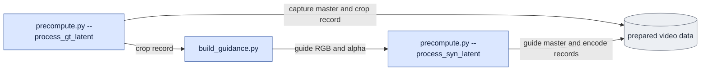
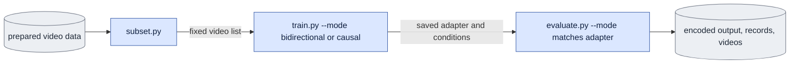
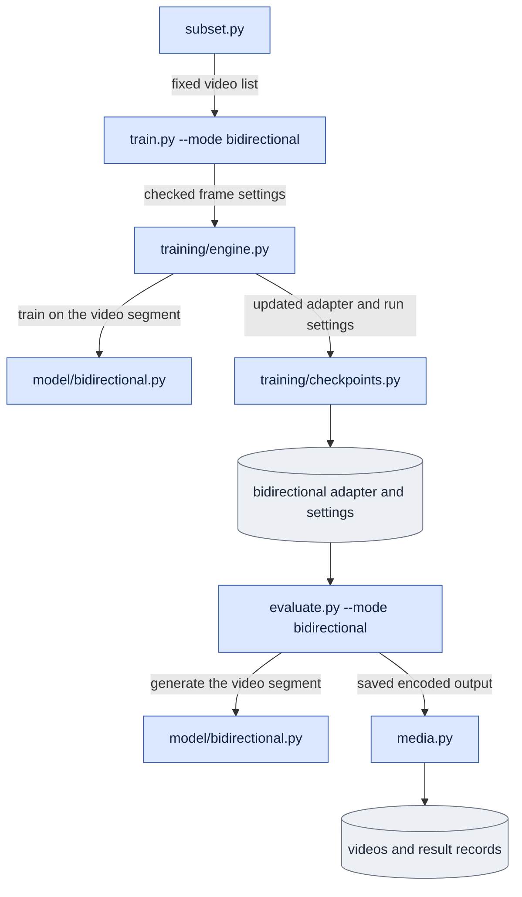
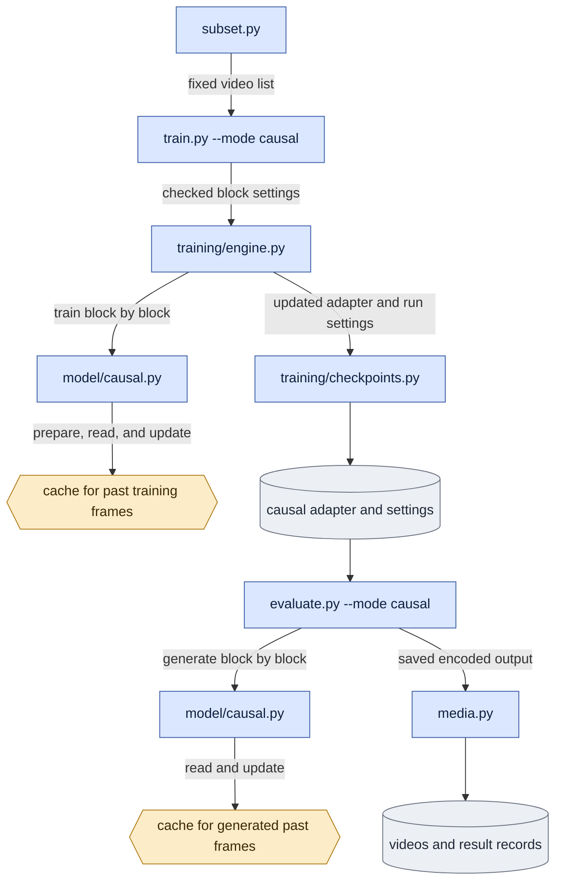
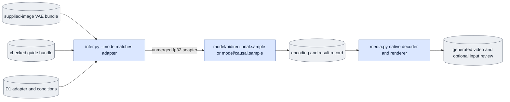

# `onestep_avatar` — prepare video data and train an avatar model

**Current GPU dispatch policy — user amendment, 2026-10-07:** query
`nvidia-smi` directly and use one shared JSON file to record only processes this
pipeline starts (PID, start ticks, command, GPU IDs and owned descendants).
New launches do not consult reservation files or unrelated process environments.
No privileged access is required. Preserve original claim,
launch, result and acceptance files unchanged. Scientific inputs, budgets,
tolerances and native E1–E5 gates remain unchanged.

The model receives a real first image and an ARGAvatar guide video.
It uses an LTX-2.5 LoRA adapter to generate video.
A LoRA adapter is a small set of trainable weights added to the base model.

**Implementation is authorized and in progress. Final integration and acceptance checks remain.**
See [doc/README.md](doc/README.md) for implemented owners and pending integration.
Read [the architecture contract](doc/architecture.md) for common versus experiment
code, allowed dependencies and the source-separation validation. The proposed
`experiments/` subpackage is a documented target; its migration is not complete.
Shared mode functions, typed training, strict adapter checks, fixed-input
preparation, preview rendering and product review are implemented.
[Known gaps](doc/known_gaps.md#current-acceptance-and-next-step) gives current
acceptance scope and the next unmet gate. Numerical distributed-update acceptance
is separate from complete workflows, learned quality and final source migration.
The current task is to prepare a self-contained handoff for the next agent.
That agent finishes the code refactor first, then runs CPU/import/boundary
checks, fresh affected native checks and GPU experiments on the final source.
No source move or GPU launch is part of this handoff update. See the
[active work order](../../../plans/2026-10-07-onestep-avatar-development-experiment-handoff.md#next-actions).

## Terms used here

- **Capture video:** the recorded real video. Training uses it as the correct output.
- **Guide video:** the ARGAvatar render. It provides motion input for D1.
- **Encoded frame:** a frame in the VAE's compressed video data. It is not an RGB video frame.
- **Video segment:** consecutive encoded frames taken from one video. It can be the complete video or a shorter part.
- **First-image input (`c0`):** encoded first-image data with no added noise.
  Training uses the first capture frame in its segment. Product generation uses the supplied image.
- **Block:** the group of encoded frames processed together in causal mode.
- **Token:** the model's input vector for one encoded image position.
- **Cache:** memory that keeps model data for past frames.
- **Training sample:** one bidirectional video segment or one sequence of causal blocks.
- **Master:** the saved VAE encoding of a continuous video. Both modes read the same master.
- **Fixed video list:** a JSON record of video files, train/evaluation groups, and file hashes.
  The design calls this record `membership`.

D0 adds noise to capture frames. It tests model capacity.
D1 adds noise to guide frames. It is the product training task.
Both train against capture frames and keep the first-image input unchanged.
Dev/distilled weights and `bg`/`white` backgrounds are separate settings.

## Current workflow

Blue boxes name code files. Grey cylinders name saved data.
Arrows show the data passed between files.
See the [shared legend](doc/core_algorithm.md#7-end-to-end-data-flow).

Prepare capture data, render guide frames, then encode the guide:



Train an adapter, then evaluate it:



Training and evaluation also read the fixed list's checked masters.
The shared checker binds mode, geometry, noising, first image, history, and adapter
application before weights load. `visualize_d0.py`, `visualize_d1.py`, `windows.py`
and mode-less training remain historical migration callers, not new-run entrypoints.
`decode_saved.py` reads saved encoded outputs through a jobs JSON and creates videos.
It does not run the transformer again.
Evaluation can also use the base model without an adapter.

Current runnable commands are in [configs/README.md](configs/README.md).
Check each selected guide's encode records before D1 training.
D0 does not require guide files.

## Explicit training and generation workflows

Prepare the video data once. Use `subset.py` to write one fixed video list.
Then select `--mode bidirectional` or `--mode causal` in `train.py`.
Use the same mode in `evaluate.py` or `infer.py`.

These owners and mode flags are implemented. CPU checks establish routing and
contracts; scoped native numerical checks are recorded separately. Complete
workflows, learned quality, longer-cache checks and final migration remain open.
See [known gaps](doc/known_gaps.md) for the limits of saved acceptance.

Start a separate run when you change modes.
Reuse the masters and fixed video list.
Use a new frame selection plan and output directory.
Changing the mode does not convert an existing adapter.

### Bidirectional workflow

Process all encoded frames in one video segment together.
Each token can attend to every token in that segment.
There is no cache for past frames.



### Causal workflow

Process blocks in time order.
Each block reads its own frames and cached data for past frames.
It cannot read a future block.

Before training, prepare the cache with one priming call.
Calculate gradients after each block.
Update the cache between training blocks.
Generation starts with an empty cache and uses generated past frames.



Each diagram shows the same model file twice because training and generation call different functions.
The engine calls `train_sample`. Evaluation calls `sample`.
The engine updates weights and exports adapters.
The model files assemble inputs and run the model.

Evaluation saves encoded outputs and result records before optional video rendering.
`decode_saved.py` calls `media.py` to render those outputs later.

### Selecting a mode

These are command templates; replace paths and launch through the documented
environment and Accelerate configuration. The first acceptance pilot uses seven
encoded frames (49 RGB frames), with clip-start inputs in both modes.
Both examples use the same video list, D1 input, white background, and dev base.
They select different frame groups.

```text
python -m scripts.onestep_avatar.train --mode bidirectional \
  --subset <video-list.json> --guide-mode d1 --objective white --variant dev \
  --span-latent-frames 7 --start-policy clip_start --output <bidirectional-run>

python -m scripts.onestep_avatar.train --mode causal \
  --subset <video-list.json> --guide-mode d1 --objective white --variant dev \
  --span-latent-frames 7 --block-latent-frames 2 --blocks-per-sample 3 --context-latent-frames 8 \
  --start-policy clip_start --output <causal-run>
```

| Setting | Meaning |
|---|---|
| `--span-latent-frames 7` | Train on a segment of seven encoded frames. |
| `--start-policy clip_start` | Start that segment at encoded frame zero. |
| `--block-latent-frames 2` | Use two new encoded frames per causal block; block zero also includes the first-image frame. |
| `--blocks-per-sample 3` | Train on three consecutive causal blocks per sample. |
| `--context-latent-frames 8` | Keep up to eight past encoded frames, plus the first-image frame. |

Bidirectional mode rejects block, cache, and history-policy options.
Causal mode checks its block and cache settings.
One block does not automatically select bidirectional mode.
Accelerate settings specify GPU processes separately.

The saved adapter records its training mode.
The shared checker rejects an evaluation or product request with a different mode.
A research override can permit the difference and record it.
Product generation rejects that difference.
`infer.py` accepts only D1, a supplied first image, and generated past frames.
Both modes use the saved unmerged fp32 PEFT adapter by default. Evaluation's fused
bf16 method is an explicit research condition. Causal matching conditions use
cached past frames with clean global-sigma-zero refresh; quality and cost across
cache eviction still require native comparison. Product accepts neither override.

### Product workflow



The image bundle must come from one actual RGB image encoded by the declared VAE.
Taking the first frame of a video master and changing its metadata cannot establish
supplied-image provenance. Use the checked standalone
[`prepare_inputs.py supplied-image`](doc/prepare_inputs.md) producer: supply an
RGB image in the guide crop's original canvas and, for white, a matching matte.
It saves `image.pt`, prepared RGB and optional native decoded RGB. This prepares
an input; it does not run product generation.
The product pilot starts at clip zero; seven-frame training does not certify
17-frame output or longer causal coverage. Random-start product support is outside
this acceptance scope. Product has no capture target or GT history.

`software.py` records actual source bytes and installed runtime versions for each
producer. Launch, publication and current completion check the saved manifest;
historical validation preserves recorded evidence without restamping it.

**New commands require an explicit `--mode` switch.**
Bidirectional training uses its own segment function with no cache or discarded
priming call. Causal training uses immediate per-block backward and its existing
cache calculations. The mode-less training path and old visualizers remain
transitional callers until required behavior and callers move to the typed owners.
Fresh affected native checks follow validation of the final source.
See [current commands](configs/README.md) and the
[configuration](doc/training/config.md), [bidirectional](doc/model/bidirectional.md),
and [causal](doc/model/causal.md) designs.

## Visualization during training and inference

Training plots show loss, gradient size, and elapsed time by update.
The engine writes the logs; `plot_training.py` draws the curves.
Optional video previews use fixed inputs and a completed checkpoint.
`prepare_inputs.py preview` assembles those fixed inputs from a checked video
list, one source and prepared reference pixels. It pins native image/text/noise
tensors, including negative text for guided previews, before training consumes
the resulting `preview.json`. Preparation does not run the transformer.
Run `evaluate.py` outside the training loop, then render its outputs with `media.py`.
Show capture, guide, base-model, and adapter panels with clear labels and matching frame times.
See [training visualization](doc/training/engine.md#visualization-during-training)
and [preview rendering](doc/media.md#training-previews).

For inference, save the generated encoding and run record before rendering.
`media.py` creates the generated video and poster.
The implemented `infer.py --decode --review` view compares guide and generated
video and shows the supplied image separately. Complete product/media and learned
quality acceptance remain pending; input preparation has its own scoped evidence.
No capture target is available in product inference.
See [inference output design](doc/media.md#inference-output).

## Remove old code and docs

The target layout, the complete migration map and the retirement conditions are
in [the architecture contract](doc/architecture.md#migration-map). The
[active handoff](../../../plans/2026-10-07-onestep-avatar-development-experiment-handoff.md#refactor-work-order--owner-groups)
orders the work in owner groups G0–G14, one LTX-2 commit per verified group.
This section keeps only the removals that are already complete.

| Removed source and doc | Replacement |
|---|---|
| `causal_core.py`, `doc/causal_core.md` | `model/common.py`, `model/causal.py`, `model/sampling.py`, and their matching docs |
| root `sampling.py`, `doc/sampling.md` | `model/sampling.py`, `training/checkpoints.py`, and their matching docs |
| `onestep_core.py`, `doc/onestep_core.md` | `infer.py`, `doc/infer.md`, model docs, and `doc/media.md` |
| `bench_forward.py`, `doc/bench_forward.md` | `bench.py` and `doc/bench.md` |
| `report_d0.py`, `doc/report_d0.md` | current evaluation/media outputs; useful historical evidence keeps its original records |
| large-trainer `doc/train.md` | `doc/training/` and model docs; `train.py` stays a small CLI with a header |
| root `backbone.py` | `model/backbone.py`, with its logic in the header |
| `doc/backbone.md`, `doc/hashing.md`, `doc/qa.md` | headers of the matching source files (each at most 100 lines) |

The active training anchor path and its CLI flag, data fields, loading,
metadata, loss placeholders and logs are removed. Historical saved records keep
their original fields. Do not keep forwarding files or a second old
implementation in a `legacy/` folder.

## Environment and ownership

### Code ownership

The [architecture contract](doc/architecture.md) separates core runtime, reusable
support, experiment comparison/conversion code and report code. Experiments must
call public shared owners; ordinary runtime must not depend on experiments.
The next agent completes Stage D source moves and duplicate-runtime removal
first. Validate CPU behavior, imports, commands and the source boundary, then
publish fresh affected native checks and run the seven-frame E5 pilots on
the final source. Preserve all scientific gates and original evidence; do not
restamp earlier outputs as evidence for moved owners.

All avatar training code stays in this LTX-2 package.
That includes training launchers, required queues, evaluation, model probes, and adapter saves.
Generation and reusable visualization also stay here.
`training/engine.py` runs updates. `evaluate.py` runs evaluation and training previews.
`media.py` and `decode_saved.py` own decoding and reusable video outputs.
Every code-file box in the workflows above is inside LTX-2.

Code under `expr/onestep_avatar/` is only for report generation.
It owns report sections, captions, report-specific plots, saved-result summaries, and report validation.
It reads saved metrics, videos, posters, and run records.
It does not start training, generation, evaluation, or VAE decoding.
Missing results cause an error; generate them with the package commands first.

Study settings, narratives, saved runs, media, and logs can remain under `expr/`.
Package commands accept their paths as inputs or outputs.
Package code does not import executable study code from `expr/`.

The implementation plan includes moving required model/launcher logic out of current `expr/` scripts.
Mixed files must separate report assembly from model execution.
Remove obsolete executors, forwarding wrappers, and their old docs after required behavior moves.
This documentation task has not moved execution code between repositories.

### Runtime environment

Run `python -m scripts.onestep_avatar.<module>` from the LTX-2 root.
Use `argavatar` for `build_guidance.py`. Use `ltx` for all other files and tests.
Keep `scripts/` a namespace package so ARGAvatar imports can resolve.

Each saved data type has one producer.
Readers fail if its output is missing; they do not recreate it.
Keep datasets, weights, videos, and logs outside version control.
Do not change the workspace's recorded LTX-2 submodule commit during this review.

## Documentation and verification

Aim for 80% ASD-STE100 style: short sentences, direct verbs, and defined technical terms.
Use one term for each concept. Keep code names and equations exact.

Files over 100 lines require design docs at matching paths.
Smaller files use a header description.
Write the design before changing source. See [CLAUDE.md](CLAUDE.md).
[verification.md](doc/verification.md) gives worked checks and lists tests needed after implementation.

[Known gaps](doc/known_gaps.md) remain visible:
cache refresh can differ from recalculation; fused LoRA can differ from training LoRA;
a random-start segment can have a different first-image encoding.
Diagrams do not prove output quality, speed, or distributed execution correctness.
