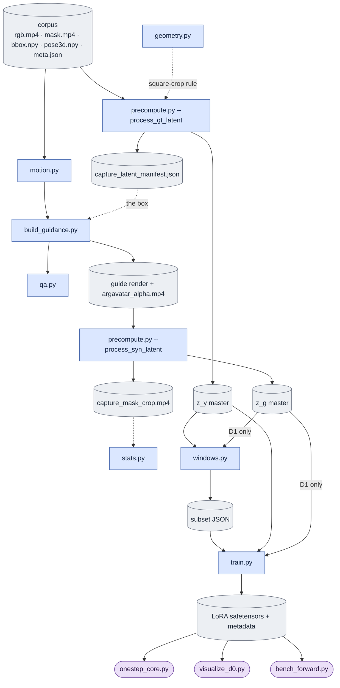

# `LTX-2/scripts/onestep_avatar/` — design docs

Per-file design docs for the one-step LTX-2.5 avatar renderer. Corpus tooling and model
training live in this one package; see [`../CLAUDE.md`](../CLAUDE.md) for the env split
(only `build_guidance.py` needs `argavatar`) and the documentation contract.

**These docs are self-contained.** The product, the D0/D1 configurations and the whole
conditioning/training/inference data flow are explained here; workspace `plans/` are historical
and progress records, not required reading and never the explanation of record. Section markers
of the form `SS1.6` in older prose and docstrings refer to those plans; treat them as citations,
not as definitions.

## Start here — the three cross-module contracts

| Doc | Owns |
|---|---|
| [core_algorithm.md](core_algorithm.md) | symbols, tensor/data flow, the **conditioning contract**, the block-by-block algorithm, teacher/self forcing, and the train/probe/deploy comparison |
| [experiments.md](experiments.md) | the canonical D0/D1 definitions, the objective and forcing axes, and what is implemented, deferred or historical |
| [known_gaps.md](known_gaps.md) | where the code does not meet the contract, with evidence, impact and acceptance criteria |
| [../configs/README.md](../configs/README.md) | the runnable D0/D1 command recipes and the Accelerate topology YAMLs |

Each fact has **one** canonical home. A module doc explains its own file and links to the
contract above rather than restating it; the package [README](../README.md) is the run order.

## The two rules that shape everything

**`causal_core.py` is the single implementation of "roll a causal block forward."** Training,
deployment, the probe, the benchmark and the subset freezer all call it. A train/deploy
mismatch would have to be an edit to that one file, not a divergence between two.

**One producer per artifact.** Every past bug here has been the same shape: two producers of
something that must have one. Before adding code, ask which artifact it produces or consumes.

| Artifact | Producer | Consumers |
|---|---|---|
| `capture_latent_manifest.json` — the crop box of record | `precompute.py --process_gt_latent` | `build_guidance.py`, `windows.py` |
| `argavatar_render[_white].mp4` + `argavatar_alpha.mp4` | `build_guidance.py` | `precompute.py --process_syn_latent` |
| `ltx_vae_latent[_white].pt` — `z_y` | `precompute.py --process_gt_latent` | `train.py`, `stats.py` |
| `argavatar_ltx_vae_latent[_white].pt` — `z_g` | `precompute.py --process_syn_latent` | `train.py`, `stats.py` |
| `capture_mask_crop.mp4` | `precompute.py --process_syn_latent` | `stats.py` (QA/measurement only — `train.py` does not read it, per its full-frame loss rule); sampled QA copy for first five subjects/part, view 0 |
| the frozen subset JSON | `windows.py` | `train.py`, `visualize_d0.py` |

## Data flow

`train.py` reads only the `z_y`/`z_g` masters — no mask, no alpha; `stats.py` pools the mask
pair on read for QA and measurement only. Per block, `train.py` runs denoise → backward →
refresh → evict, all four in `causal_core`, with `c0` taken from the `z_y` master.

## Files

### Cross-module contracts (not tied to one module)

| Doc | Owns |
|---|---|
| [core_algorithm.md](core_algorithm.md) | conditioning contract, block algorithm, data flow, train/probe/deploy parity |
| [experiments.md](experiments.md) | D0/D1 · bg/white · teacher/self, and implementation status |
| [known_gaps.md](known_gaps.md) | contract violations and their acceptance criteria |

### Corpus side

| Doc | Module | One line |
|---|---|---|
| [dataset.md](dataset.md) | `dataset.py` | corpus layout, and the **objective → filename** map every module obeys |
| [geometry.md](geometry.md) | `geometry.py` | the one square-crop rule (SS1.7), pure and GPU-free |
| [hashing.md](hashing.md) | `hashing.py` | the one `sha256(path)`, pure and GPU-free |
| [motion.md](motion.md) | `motion.py` | `pose3d.npy` → ARGAvatar `sam3db`, with the three conversions |
| [qa.md](qa.md) | `qa.py` | mask IoU at the dataset's own threshold |
| [mask_video.md](mask_video.md) | `mask_video.py` | mask storage — lossless gray MP4, 42× smaller than raw, bit-exact |
| [build_guidance.md](build_guidance.md) | `build_guidance.py` | **`argavatar` env.** Render the guide, harvest alpha, composite |
| [windows.md](windows.md) | `windows.py` | freeze the training subset: chains, split, content pin |

### Model side

| Doc | Module | One line |
|---|---|---|
| [causal_core.md](causal_core.md) | `causal_core.py` | **the** rollout: block plan, clip grid, causal mask, K/V cache, the three calls |
| [precompute.md](precompute.md) | `precompute.py` | one continuous VAE encode per view, per objective, resumable |
| [train.md](train.md) | `train.py` | the AR LoRA loop, the loss rule, the checkpoint contract |
| [onestep_core.md](onestep_core.md) | `onestep_core.py` | deployment rollout — the same three calls, one schedule |
| [stats.md](stats.md) | `stats.py` | measurement only: the excursion `a`, the gap `r`, latent moments |
| [bench_forward.md](bench_forward.md) | `bench_forward.py` | wall clock per finalized chunk, causal vs `k2` |
| [plot_training.md](plot_training.md) | `plot_training.py` | per-rank JSONL → training figures + summary |
| [visualize_d0.md](visualize_d0.md) | `visualize_d0.py` | decoded `capture │ base │ LoRA` probe: one whole-clip rollout per sigma, frames captioned with latent/rollout-step |
| [report_d0.md](report_d0.md) | `report_d0.py` | artifact-checked handoff record for the D0 arm |

`__init__.py` carries no design. `configs/` holds the Accelerate topology YAMLs **and** the
D0/D1 run recipes — [`../configs/README.md`](../configs/README.md); `run_a1.sh` / `run_b2b.sh`
are launchers documented in [`../README.md`](../README.md).

## Keeping these docs true

A doc here is part of the change, not a write-up after it. When a module's **objective, data
flow, invariants, or contract with another module** changes, update its doc in the same commit.
Inline docstrings answer "why this line"; these docs answer "how this file fits the others" —
which is what a reader cannot reconstruct from one file, and what has actually gone wrong here.

**Code establishes current behavior; the approved contract establishes required behavior.** When
they disagree, that is a defect: record it in [known_gaps.md](known_gaps.md) with its evidence and
keep both descriptions clear. Do not rewrite the intended contract to legitimize a bug, and do not
describe a planned fix as shipped. See [`../CLAUDE.md`](../CLAUDE.md) for the full rule.
