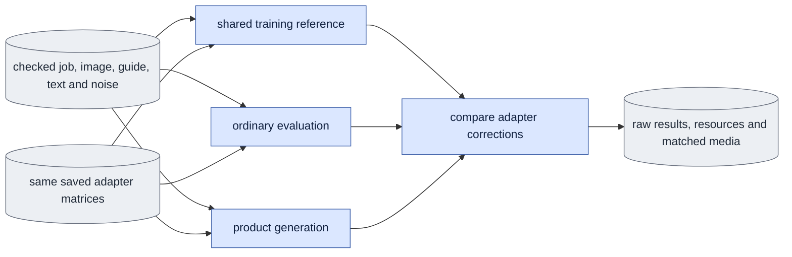

# `adapter_effect_check.py` — preserve the saved adapter correction

Status: Bounded E2 comparison owner; full E2 acceptance remains incomplete.
Read [current acceptance](known_gaps.md#current-acceptance-and-next-step) for
first-update versus two-view/trained-step scope. Keep this root
path until Stage D permits migration to `experiments/`. Ordinary runtime imports
none of this module. The owner adds no trainer, forward or cache algorithm.

## Objective

Compare the trainer's unmerged velocity function, ordinary evaluation and product
generation using exactly the same saved adapter matrices, supplied-image c0,
guide, saved text and saved noise. Check base, zero and step-one adapters, or
the pilot's base, zero, step-20 and step-60 adapters. Keep
bf16 fusion a separate diagnostic whose failure cannot fail the selected path.
Require a passed original E4 update comparison for the selected mode before
using its trained checkpoint as accepted calibration.

## Data flow



## Organization logic

Preflight reconstructs the selected job through `queue.prepare_job`, verifies
training completion through the shared engine, and checks the passed E4 result,
native budget, original launch and every referenced input hash. It checks all
selected checkpoint contracts and exact zero B matrices. Read the selected run's saved training
context; never rebuild text in a new prompt session. Require a fresh output path
and complete input checks before transformer loading or output creation.

Without `--update-job`, retain the original one-update protocol: `--job` is its
fresh D1 training job and `--checkpoints` contains exactly steps 0 and 1.
With `--update-job`, `--job` is the completed fresh 60-update pilot and
`--update-job` is the original one-update E4 calibration job for that mode.
Select exactly pilot steps 0, 20 and 60 from the same run. Check actual matrix
inventories and require all contracts to match except for their step.
Reject duplicate steps, foreign output paths, changed contracts or missing
markers before model work. Verify the final step through
`engine.verify_training_conditions`; each selected marker must bind the exact
pilot job, applied runtime, launch, config and frame-plan identities. Do not
invent a step-20 completion claim from the step-60 marker.

The original E4 result still verifies its exact original zero/one files, budget,
world size and input inventory. The pilot keeps a separate lineage and uses its
own saved text, resources and contracts. Require the same mode, base identity,
first-image, loss, adapter method and native numerical policy as the calibration.
The pilot membership and accumulation can differ as prescribed by E5. Pin both
jobs and both runs' evidence through the existing software/input inventory.
Pilot selection permits no missing E4 gate or transfer of calibration between
modes. Both paths use the existing strict product condition checker.

The causal E4 job uses continuous masters with `span_latent_frames=null`. Its
original frame plan includes clip-start seven-frame samples and later-start
six-frame samples, so its contract records `frame_counts=[6,7]`. The tiny pilot
uses the prescribed `span_latent_frames=7` restriction. Its contract records
`frame_counts=[7]` and only clip-start ranges `[[0,3],[3,5],[5,7]]`.
Permit precisely this restriction between the original E4 kernel check and
the pilot's own calibration. Preserve identical channels/image grid, B2/K3/D8,
generated history, clip-start policy, noise/sigma/precision, base, adapter and
loss rules. Accept no other mode or shape change. Record both contracts' shape,
mode settings and data selection, plus the restriction decision, in the existing
protocol. This decision does not alter the strict product checker: a pilot
request must match its own span-seven contract; an original one-update request
keeps that contract's span-null mode setting with seven frames of physical input.

`--inputs` is version-one JSON with kind `onestep_avatar.adapter_effect_inputs`,
an exact direct schedule, a seed and a nonempty `cases` list. Each case gives
`source`, `guide`, `first_image`, `image_preparation`, `noise` and `frames`.
Paths resolve relative to that JSON. By default each source belongs to the
selected run's checked membership. Optional `--subset` selects a separately checked
evaluation membership through the same `dataset.ClipStore` reader, including
held-out test views. Bind its file and membership hash separately; never change
the original E4 job, training membership, frame plan or checkpoint contract.
Require the same objective and strict product scientific conditions. Every
selected capture, guide, render and sidecar passes the shared producer checks
before model work and joins the exact input inventory. Guide bytes must equal
that selected source's full continuous master.
`image_preparation` is the actual `prepare_inputs supplied-image` result. Verify
its output bundle/hash, original source/matte/VAE inputs and prepared pixels;
the image bundle must identify exactly one supplied-image encode. Preview c0
from a sliced capture video cannot replace it. Saved noise is finite native bf16,
with the exact selected token shape. Frames select the original continuous
prefix `[0,frames)`; retain the full guide hash and actual coverage separately.

Product preflight uses the shared `infer.prepare_product` helper with the
original typed mode settings and the explicitly recorded prefix length. Every
adapter uses the strict product condition checker. Product generation calls
`infer.generate` with the same saved noise. Evaluation uses `evaluate.sample_case`.
Its capture-reference tokens receive the independent supplied c0 through the
shared clean-prefix helper; this does not alter generated-history input or
invent a product capture target. The training reference loads the bf16 backbone,
uses shared `adapters.attach/load_weights`, and calls that same selected mode
sampler with `common.denoised_from_velocity_model`. Ordinary paths use shared
`inference_transformer` and its one native x0 conversion. Each arm opens and
releases its own model so loader differences are observable.

For each path and each trained step, compute correction `trained - base` in
float64. Compare step 20 only to reference step 20, and step 60 only to reference
step 60. Divide RMS of the
correction difference by RMS of the reference correction. The fixed criterion
is strictly less than 0.05. When reference correction RMS is less than `1e-8`,
use absolute difference RMS at most `1e-8`; report a null relative ratio. A
near-zero reference does not demonstrate a learned effect, so its comparison
may match numerically while learned-effect acceptance stays open. Report raw
output difference, correction norms/RMS and maximum absolute differences too.
The zero output must be bit-identical to its own path's base output. Fused
metrics use this same reporting rule as a separate diagnostic and never use
the historical 20% flag.

Worked check: reference base is `[100,100]`. Step 20 adds `[0.001,0.001]`;
step 60 adds `[0.01,0.01]`. Matching ordinary paths pass both steps. Swapping
their step-20 and step-60 outputs fails, although each raw output remains close
to 100. If every step-20 output equals its own base, that step reports
`function_matches=true`, `learned_effect_demonstrated=false` and `passed=false`.
Step 60 can still pass separately; it cannot establish step-20 acceptance.
One-update records retain their original `paths` summary. Pilot records give
one such summary per trained state under `steps`; aggregate acceptance requires
both step comparisons. A matched near-zero one-update control can satisfy the
October 8 short-pilot prerequisite without becoming full E2 acceptance.

Measure synchronized per-process load/sample phases and optional decoding with
the original allocated-byte and wall-time budget. Save actual forward counts,
parameter storage/dtypes, CUDA identity, kernel controls, input tensor identities,
complete source/runtime manifests and every raw output. Decoder work occurs
after transformers are released. Matched media show capture VAE, guide VAE,
training reference, evaluation and product, with synchronized source frames;
base/zero results remain saved numerical controls. Recheck every input, source
and budget before result publication. Preserve failures and resource journals.
Before each arm, recheck current source/runtime owners, budget and the exact
selected checkpoint bytes; recheck checkpoint bytes after that arm. Full base,
producer and input inventories are hashed before model work and at final
publication. Avoid repeating the 42 GB base read at each small sampling boundary.
Apply the original native run's declared shared numerical-kernel policy before
loading any model, and record the actual applied policy for every path. The
reference must not silently inherit an unstable default or a new policy.

For pilot decoding, open the decoder once per case. Decode capture and guide
once and each trained output once. Build separate five-panel comparisons for
steps 20 and 60, with the same panel order and frame mapping. Each generated
panel title names its step. Save full and compact media under
`media/step20/` and `media/step60/`; keep the original one-update paths under
`media/`. Fused media remain separate and also name their step. The shared media
owner selects readable layouts and preserves aspect ratios and equal heights.

A first-view specification can look like this, with paths to actual producers:

```json
{"schema_version":1,"kind":"onestep_avatar.adapter_effect_inputs","schedule":[0.725,0],"seed":42,"cases":[{"source":"Part_2/0007_01/views/view01_cam57","guide":"guide.pt","first_image":"image/image.pt","image_preparation":"image/preparation.json","noise":"noise.pt","frames":7}]}
```

Run only after the selected native update comparison passes, under the shared
own-process ledger and bounded supervisor. Inherit the exact original numerical
environment before module imports; the current supported workspace is shown
explicitly below:

```bash
CUBLAS_WORKSPACE_CONFIG=:4096:8 \
conda run --no-capture-output -n ltx python -m scripts.onestep_avatar.adapter_effect_check \
  --job <ORIGINAL_JOB.json> --update-check <PASSED_E4_RESULT.json> \
  --inputs <E2_INPUTS.json> --checkpoints <STEP_ZERO.safetensors> <STEP_ONE.safetensors> \
  --output <FRESH_OUTPUT> --gpu-id <LOCAL_GPU> --decode --fused-diagnostic
```

The trained-step extension uses the same command, with a separate actual pilot
job and its three exports:

```bash
CUBLAS_WORKSPACE_CONFIG=:4096:8 \
conda run --no-capture-output -n ltx python -m scripts.onestep_avatar.adapter_effect_check \
  --job <PILOT_JOB.json> --update-job <ORIGINAL_E4_JOB.json> \
  --update-check <PASSED_E4_RESULT.json> --inputs <TWO_CAMERA_E2_INPUTS.json> \
  --subset <CHECKED_EVALUATION_MEMBERSHIP.json> \
  --checkpoints <PILOT_STEP_ZERO.safetensors> <PILOT_STEP_20.safetensors> <PILOT_STEP_60.safetensors> \
  --output <FRESH_OUTPUT> --gpu-id <LOCAL_GPU> --decode --fused-diagnostic
```

`--dry-run` performs preflight without creating output or model sessions. A
failed numerical comparison exits 2 and preserves all completed evidence.
`--verify <SAVED_OUTPUT>` checks current source/input identities, complete local
artifact inventory, actual arm records, consumed-input/call/policy agreement,
actual checkpoint contracts and native output shape/dtype, recomputed correction
comparisons and resource journals. It starts no model or
decoder, writes nothing and does not restamp acceptance. Changed/missing arrays,
redirected paths, stale summaries and unsupported completeness claims fail.

The result states its scope: shared API correction comparison. A first view is
partial coverage; full E2 needs at least two views and pilot steps 20/60 after
the original zero/step-one controls. Native
coverage counts unique recorded camera labels separately from source clips.
Two clips from `view01_cam57` provide two sources and one camera view. The checked
pilot membership's `Part_1/0097_04/views/view00_cam51` and `view01_cam52` can supply
two matched test views through `--subset`, without changing E4 calibration.
External supervision must independently establish bounded exit and owned-worker
absence. This module does not launch jobs or close the product CLI/preview gate.

## Invariants

Close each model context before starting the next arm. Drop caller references,
collect Python cycles, then release unused CUDA allocations. Model modules can
form reference cycles. `empty_cache()` alone cannot free live parameter tensors.
Keep only saved CPU outputs between arms. The loading and sampling measurements
retain their declared boundaries; final warmed latency is a separate benchmark.

The actual training context record binds raw contiguous bf16 bytes, shape and
dtype separately. Verify its `tensor_sha256` with that producer's raw-byte rule.
`evaluate.tensor_sha256` also includes shape and dtype in its digest and therefore
cannot verify this training field. Do not rewrite the original context record or
rebuild text to satisfy a different digest convention.

- One saved image c0, guide prefix, text, noise and scientific contract per case.
- Complete zero/trained matrix inventories and unchanged E4 calibration evidence.
- Shared mode algorithms, adapter loader and velocity/x0 conversions only.
- Original resource budget; fixed under-5% and near-zero rules before execution.
- Failed fused diagnostics remain separate from ordinary unmerged acceptance.
- No overwriting outputs, old receipt restamping or model work during dry-run.

## Gotchas

The current supplied-image producer is independent of video encoding. Existing
preview preparation stores guide-prefix token hashes but keeps the full guide
master path; it does not publish a separate short product guide bundle. For a
causal contract whose training `span_latent_frames` is null and frame count is
seven, product CLI `--span-latent-frames 7` now selects physical guide coverage
without changing that training-selection setting. A recorded explicit training
span remains compatible only when it equals the selected complete frames. The
helper/API comparison records the explicit prefix under unchanged settings.
CPU controls cover both contracts and reject mismatched conditions. The
ordinary causal evaluator uses its separate `--output-latent-frames` flag;
the preparation producer preserves the training setting. Current CLI/preview
acceptance is separate from this API correction comparison; see the gap summary.

Matching raw output can hide loss of a small correction. Compare corrections
against each method's own base. Full resident parameter counts are not allocator
peaks. CPU controls cannot satisfy native allocated-memory or quality evidence.

## Tests

Use tiny real LTX models and PEFT matrices in both modes, including an independent
supplied c0 and fixed guide/text/noise. Verify training velocity, evaluation x0
and product generation agree with nonzero and zero saved matrices. Controlled
comparisons must reject a 5% boundary, large effect error hidden by small raw
error, changed zero controls and malformed/nonfinite arrays; near-zero metrics
must never invent a ratio. Check the independent preparation and E4 failure gates
before model work, plus input/source mutation and fresh-output refusal. Native
two-view correction, resources, decoded inspection and external supervision
remain required after these CPU controls.
Saved-reader controls use real serialized tensors and process journals to reject
changed/missing/redirected outputs, altered numerical summaries, input identities,
call records, resource summaries and false completeness. Pilot controls cover
both real saved trained-array inventories. They isolate the native producer gate;
they do not claim a full-weight pilot. Separate controls check actual checkpoint
contracts, matrices, markers and snapshot bytes, including a foreign step-20 run
and changed launch/runtime/config binding. Real small LTX/PEFT controls compare
both trained steps independently through all three shared API paths. Applied original policy
controls reject schema-one history, missing policies and rank disagreement.
