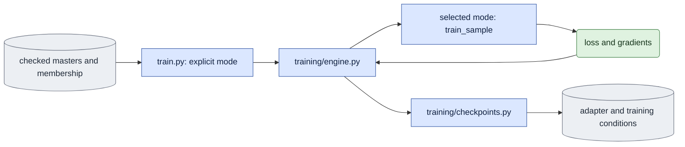
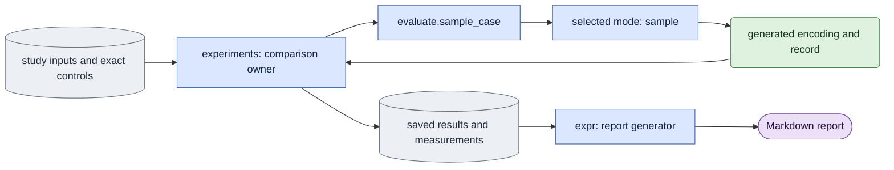

# Architecture — shared runtime and experiment code

**Current GPU dispatch policy — user amendment, 2026-10-07:** query
`nvidia-smi` directly and use one shared JSON file to record only processes this
pipeline starts (PID, start ticks, command, GPU IDs and owned descendants).
New launches do not consult reservation files or unrelated process environments.
No privileged access is required. Preserve original claim,
launch, result and acceptance files unchanged. Scientific inputs, budgets and
tolerances remain unchanged. The October 8 handoff revises pilot ordering;
missing native acceptance and architecture work remain required.

Status: **Required design; source separation and full acceptance remain incomplete.**
The user directed this amendment after reviewing the current implementation.
It permits one `experiments/` subpackage inside `scripts/onestep_avatar/`.
That replaces the October 5 restriction to adding only `model/` and `training/`.
This documentation amendment does not move source or certify a model result.

## Objective and authority

Keep one shared trainer and the two selected model modes. Separate their runtime
from the code that defines a scientific comparison or recovers a historical study.
An experiment must use the shared runtime rather than carry another trainer,
sampler, adapter loader, condition checker or decoder.

This document owns the internal code boundary and migration destinations.
[Core algorithm](core_algorithm.md) owns numerical and conditioning rules.
[Training choices](experiments.md) defines D0/D1, background and history settings;
it is not the architecture document for the proposed `experiments/` directory.
Per-module docs explain current calculations and must be updated before source moves.
The [October 7 handoff](../../../../plans/2026-10-07-onestep-avatar-development-experiment-handoff.md)
is the only active planning file. Its [current progress](../../../../plans/2026-10-07-onestep-avatar-development-experiment-handoff.md#current-progress-and-revised-work-order--2026-10-08),
[acceptance requirements](../../../../plans/2026-10-07-onestep-avatar-development-experiment-handoff.md#acceptance-requirements)
and [next actions](../../../../plans/2026-10-07-onestep-avatar-development-experiment-handoff.md#next-actions)
own mutable progress and work order. Do not copy changing test counts or a run
timeline into this design. Native replay must bind the original canonical launch
and actual applied runtime settings; a saved result's own hash cannot establish
those facts. Superseded reviews remain historical evidence under `plans/history/`.

Required means the agreed target. Current means inspected source behavior.
Verified means a check with saved evidence and an explicit scope.
These meanings must remain distinct throughout the migration.

## Terms and classification

- **Core runtime:** code needed to train or generate in ordinary supported conditions.
- **Mode algorithm:** bidirectional segment processing or causal block/cache processing.
  Both are core runtime. A mode is not a study.
- **Reusable support:** preparation, ordinary evaluation, media, execution and provenance
  functions usable by several runs without knowing their scientific question.
- **Experiment code:** code that chooses interventions, comparison controls, a study's
  exact inventory, historical conversions or interpretation of study measurements.
- **Study data:** membership, frame plans, exact schedules, noise, job lists and narrative
  settings. These can live under `expr/onestep_avatar/` as data.
- **Report code:** code under `expr/` that reads saved evidence and produces a report.

D0/D1, dev/distilled, background, supported noise policies and causal history
settings use the same runtime. Selecting one of these settings does not create a
new trainer. First-image conditioning, full-frame loss, adapter precision and the
selected cache calculation keep their existing contracts.

Classify a function by its responsibility, not by the number of present callers.
A general decoder can have one current caller and still be reusable support.
A converter with two fixed source views is study-specific even when several jobs use it.
Exact mathematics and supported default settings belong to their common owner;
a study's actor list, sigma grid and comparison roles do not belong in that owner.

## Current code and target owners

Paths in this section are relative to `scripts/onestep_avatar/`.
The `experiments/` destinations are **Proposed source**, not current commands.
Do not quote them as runnable until source, callers and command recipes have moved.

| Category | Current owners | Required responsibility |
|---|---|---|
| Core data access | `dataset.py`, `subset.py` | Checked masters, filenames, fixed membership, splits and frame-plan facts. Historical format conversion is identified separately. |
| Shared model calculations | `model/common.py`, `model/backbone.py`, `model/adapters.py`, `model/sampling.py` | Token layout, noise, first image, loss, base identity, adapter function and denoising steps. |
| Mode algorithms | `model/bidirectional.py`, `model/causal.py` | The selected mode's input construction, forwards, backward and generation. Causal owns cache state and reusable diagnostic numerical paths. |
| Shared training | `train.py`, `training/config.py`, `training/engine.py`, `training/checkpoints.py`, `training/startup.py`, `training/runtime.py`, `training/resources.py`, `training/update_state.py` | Explicit mode, typed settings, distributed updates, logs, adapter export/checks, applied-policy and process-resource evidence, optional reusable Adam/text evidence and preview scheduling. Retire the duplicate old runtime. |
| Corpus preparation | `precompute.py`, `build_guidance.py`, `geometry.py`, `motion.py`, `mask_video.py`, `qa.py` | Produce checked data with one crop/background/VAE contract. Only guide rendering uses the ARGAvatar environment. |
| Ordinary run support | `prepare_inputs.py`, ordinary functions in `evaluate.py`, `infer.py`, `media.py`, `decode_saved.py`, `bench.py`, `plot_training.py` | Prepare inputs, evaluate or generate, measure general metrics, render and review saved outputs. |
| Execution and provenance | `queue.py`, `queue_launch.py`, `queue_protocol.py`, `process_registry.py`, `supervision.py`, `hashing.py`, `software.py` | Direct device queries, one shared own-process ledger, bounded lifecycle, dispatch, completion and relevant source/runtime identity. |
| Experiments | Sweep/future-noise/progress owners, `stock_parity.py`, study orchestration in `evaluate.py`, parts of `stats.py` and historical converters | Prepare or execute a declared comparison through public shared owners; preserve its exact inputs and evidence. |
| Reports | Report-only sources under `expr/onestep_avatar/` | Sections, captions, plots, saved-result summaries and validation. Missing results fail without model work. |

The current engine contains both typed training and the old `Chain`/`ChainStore`/
`train_chain`/`main` runtime. The current config still has its old parser.
`evaluate.py` mixes ordinary evaluation with historical diagnostic commands.
Sweep and future-noise owners currently sit at the package root.
These are migration facts, not the required final organization.

Historical `expr/` owners can also mix branches. The AR study's `all` branch
selects saved-result readers and report builders, then validates. Its explicit
`generate` branch still launches `visualize_d0`. Current discovery, import and
deduplication refuse executable source/destinations, pruned paths and destinations
outside the study root. Import and deduplication check all rows before writes.
The AR report builder checks cited saved files before presentation children or
publication. Isolated controls rebuilt its four text outputs byte-identically
with model/VAE/queue calls disabled; removing one cited metric refused before
children or writes. These scoped controls are saved under
`expr/onestep_avatar/handoff_implementation_20261007/current_boundary_audit_20261008/`.
They do not certify every `all` reader, retire runnable snapshots or replace
the native migration gates. Classify remaining explicit execution and saved
report branches separately. Full caller separation and source retirement remain
Stage D work.

## Allowed dependencies

1. Experiment modules call public core and reusable-support functions. They may
   prepare data and job specifications consumed by ordinary package commands.
2. Core training, ordinary evaluation and product inference must not import or
   dynamically load `experiments/`, or require it transitively to start or complete.
   They must not dispatch a historical protocol from their ordinary CLI.
3. Shared owners use documented public interfaces. They do not import `train.py`,
   private CLI helpers or executable study code from `expr/`. Add no new import cycle.
4. Numerical reference paths can remain in `model/causal.py` when they reuse its
   block/cache primitives. Label them diagnostic. Their callers and comparison
   orchestration belong in `experiments/`; ordinary defaults do not select them.
5. A general metric remains in its shared owner. A wrapper that requires one
   study's exact boundaries, frames or score inventory belongs to that experiment.
   Promote a helper only when its inputs and meaning are independent of the study.
6. The existing queue is an explicit execution boundary: it may dispatch a
   selected experiment command and call that job's verifier. Its ordinary jobs
   must not import experiment modules or depend on experiment receipts. Keep any
   experiment-specific dispatch lazy and explicit. Add no registry or queue kind
   merely to implement this directory move.
7. Reports read saved artifacts. They may use model-free record readers, but their
   rebuild path must work with model/VAE loaders and queue execution disabled.
   Neither imports nor subprocess calls may generate missing scientific outputs.
8. Study data paths can point into `expr/`. A path argument does not permit importing
   Python from that tree or interpreting a data field as arbitrary executable code.

This diagram shows the ordinary training data flow. It has no experiment owner.
Blue rectangles are code, grey cylinders are saved artifacts, green rounded nodes
are tensors. Use the [core legend](core_algorithm.md#7-end-to-end-data-flow).

This separate diagram shows an experiment using the same generation function.
Arrows carry inputs or results; they do not permit reverse imports into the experiment.

## Migration destinations and retained behavior

Write each affected module design before moving its source. Mirror larger new
files under `doc/experiments/`; small files describe their logic in their headers.
Keep one simple subpackage. Add no strategy hierarchy, callback framework or
second study runner. Do not split files to meet a line-count threshold.

| Current source or responsibility | Proposed destination | Retained behavior |
|---|---|---|
| `sigma_sweep_jobs.py` | `experiments/sigma_sweep_jobs.py` | Exact historical schedules/noise, evaluation jobs and decode dependencies. |
| `sigma_sweep.py`, `sigma_sweep_results.py` | Matching names under `experiments/` | Exact cell verification, saved decoding, sweep scores and complete media receipts through shared evaluate/media helpers. |
| `future_noise_study.py` | `experiments/future_noise_study.py` | Exact historical noise reconstruction, preparation verification and role/job mapping. |
| `convert_progress_jobs.py` | `experiments/convert_progress_jobs.py` | Original row order, fixed views, schedule, arm and checkpoint lineage. |
| `stock_parity.py` | `experiments/stock_parity.py` | Stock/custom repeat controls, input traces, precision comparisons and current acceptance evidence. Run pending native checks at the current path first. |
| `training_update_check.py` | `experiments/training_update_check.py` | Bounded serial replay of the actual first distributed update through shared mode functions; fixed visits, actual saved text, Adam moments and export/reload controls. Run native E4 at the root path first. |
| Fusion orchestration in `evaluate.py` | `experiments/fusion_parity.py` | Original loading/sample controls and metrics; use shared adapters and the model's numerical helper. |
| Causality/future-noise orchestration in `evaluate.py` | `experiments/causality.py` | Noise intervention, repeats, boundary validation and records; use ordinary `sample_case` or the shared causal numerical reference. |
| `sigma_sweep_boundary_metrics` and its fixed-inventory rules in `evaluate.py` | `experiments/sigma_sweep.py` | Historical score definitions. General `masked_rgb_transition_steps` remains shared. |
| A1/B1c orchestration in `stats.py` | `experiments/stats.py` | Declared map/pair/noise comparisons. Keep needed general measurement primitives in one shared owner. |
| Historical adapter-conversion orchestration in `training/checkpoints.py` | `experiments/legacy_adapters.py` | Truthful original-evidence conversion. Normal contract validation, save/load and checks remain in checkpoints. |
| Study-specific old-subset conversion callers | Their experiment converter | General checked membership and format facts remain in dataset/subset; exact historical selection rules stay with their study. |
| Old engine/parser, `windows.py`, `visualize_d0.py`, `visualize_d1.py` | Retire after required caller migration | Retain useful data facts and general behavior in the owners above; preserve exact historical source bytes as non-executable provenance. |

The inventory is a starting map, not an exhaustive list of `expr/` executors.
Classify current callers and functions before deletion. Move still-needed logic;
retire obsolete logic instead of creating an experiment copy for every old script.
Keep current public helper behavior until its replacement and callers are checked.
After migration, remove old executable paths and obsolete diagnostic flags from
ordinary CLIs. Leave no forwarding wrapper at the package root or under `expr/`.

Ordinary software manifests bind their actual shared computation and relevant
runtime dependencies. They must not include a historical sweep/converter merely
because it is in the same package. An experiment binds its own producer and the
shared owners it calls, using the same software-manifest calculation. Update
profiles and receipts with the move; introduce no second provenance system.

Existing results retain original source hashes and attribution. A path/source
change can invalidate a current completion claim. Preserve the old evidence,
record the source delta and produce fresh affected receipts. Do not restamp old
results as if the new owner produced them. Preserve job dependencies, claims,
completion paths, input hashes and the rejection of unknown historical conditions.

## Work order and gates

**User-directed progress revision — 2026-10-08:** the handoff's current amendment
allows the existing bounded seven-frame tiny-set learning experiment at current
paths before full characterization and source separation. This makes the first
learning result reachable after native update and ordinary-workflow correctness.
It does not weaken the architecture boundary, certify the longer cache or remove
native replacement prerequisites for retiring an owner. The handoff owns the
exact short-pilot prerequisites and unchanged scientific settings.
A matching near-zero one-update adapter control is distinct from demonstrated
learned effect; the latter remains required on trained pilot checkpoints.

1. **Document and inventory now (Stage A).** Read current instructions, this
   document and the active handoff's current progress. Record Git status, current owners,
   live job handles and the old-to-new caller map. Reconcile stale descriptions.
   This is documentation and inventory work; do not restart already verified fixes.
2. **Establish native correctness at current paths (Stage C).** Reuse valid scoped
   E1 sampler evidence. Finish distributed updates, the first unmerged adapter
   effect check and actual fixed previews/supplied-image output in each mode.
   Check short causal repeat, c0, future-noise invariance, calls and resources.
   Repair observed defects through the existing common owners and recheck affected
   controls. Keep cached sigma-zero refresh and unmerged fp32 adapters selected.
3. **Run the existing tiny-set E5 pilot before source moves.** Keep the defined
   seven-frame, clip-start inputs, separate mode lineages and predeclared
   0/20/60 checkpoints and limits. Use current shared owners. Preserve original
   producer identities; this is a learning experiment, not architecture closure.
4. **Complete characterization.** Finish two-view/two-trained-step adapter
   coverage, original before/after-eviction K/V/capture-history continuation
   checks, held-out studies and measured cost. Their remaining scope is required
   for final scientific/product acceptance and relevant replacement gates.
5. **Separate source and retire the duplicate runtime (Stage D).** Apply the
   destinations above after the relevant native replacement gates pass. Require
   `--mode`, keep typed settings and one update loop, migrate callers/docs/jobs,
   narrow ordinary dependency/provenance profiles, and remove old copies. Recheck
   affected controls on the final source before accepting a current completion.
   Validate affected ordinary workflows on final source and deliver the bounded
   E5 report with matched base/zero/trained and held-out evidence. D0 remains a
   separate capacity question. Do not restamp earlier pilot outputs after moves.
6. **Defer broader historical campaigns.** Historical conversion proceeds only
   when it serves a current caller, a removal gate or an explicitly selected later
   study. Use the handoff's bounded recovery rule for blocked reproductions.
   A failed old guide pin or unknown calibration does not block fresh validation.

Independent native checks may run concurrently on GPUs 0–3. Query occupancy
before each launch and register exact owned handles in the shared ledger. A
prescribed four-rank training job still requires the complete 0–3 pool.

If devices prevent native checks, continue documentation, caller classification,
bounded recovery and saved-only report checks. Record the exact missing native
check. Do not replace that milestone with more queue features, bulk conversion
or a larger historical job campaign. Preserve already-running work and original ownership records.

The native acceptance meanings are unchanged: E1 covers real sampling calls and
declared endpoint/precision differences; E2 checks the learned correction against
the loaded training function; E3 measures the selected cached model before/after
eviction; E4 verifies zero/one-update exports and accumulation against a serial
reference. Test counts, dry runs and receipts alone do not prove these properties.

## Worked boundary checks and completion

**Ordinary training:** a checked D1 membership and `--mode causal` select the
shared typed engine and `model.causal.train_sample`. Removing availability of
experiment modules must not prevent settings preflight, a small-model update,
adapter export or the ordinary preview path. The run knows no sweep cells or
historical A/B/B2/B3 labels. Repeat the control for bidirectional mode without a cache.

**Future-noise experiment:** the experiment keeps the earlier saved noise bytes
fixed and changes only later bytes. It invokes the same shared sampler twice,
then records the earlier-output difference. A changed earlier noise byte fails
preflight. The experiment owns intervention/role names; it owns no second sampler.

**Saved report:** with complete saved outputs, rebuilding succeeds while model,
decoder and queue execution are disabled. Removing a required artifact makes
the rebuild fail without starting any child that repairs the experiment.

Stage D acceptance requires an import/caller audit and focused behavior checks:

- Ordinary entrypoints and their transitive imports do not require `experiments/`
  or executable `expr/` code. Explicit experiment queue jobs remain executable.
- Missing training mode fails clearly; both explicit modes share one optimizer
  loop, adapter loader, condition checker and checkpoint writer.
- Study moves preserve exact scientific inputs, schedules, noise and completion
  semantics. Old execution paths, forwarding wrappers and duplicate docs are gone.
- Discovery, import and rebuild paths refuse retired execution even when an old
  inventory names it. Preserve its source bytes as non-executable provenance;
  a successful saved-report branch alone cannot prove restoration refusal.
- Shared kernels still satisfy first-image, cache, gradient, precision and
  adapter controls. Repeat native checks when changed computation requires them;
  issue fresh source-bound evidence for moved producers.
- Ordinary provenance excludes unrelated studies; experiment provenance includes
  its own producer and used shared owners. Historical evidence is not rewritten.
- The final caller/removal ledger, recipes, mirrored module docs and report
  rebuilds agree with actual paths. Inspect any changed diagrams/media layouts.

Architecture completion is separate from scientific completion. Overall handoff
completion still requires E1–E5, the required native previews/product outputs,
the removal dispositions and the bounded pilot report. This document adds no
claim that those tasks have passed.

### R3 diagnostic owner added during native failure localization

`training_slice_check.py` is bounded experiment orchestration. It depends on the
shared typed builder, token/mode functions, resource/runtime records, trace and
optimizer-state collection. It moves to `experiments/training_slice_check.py`
after E4; ordinary modules must not import it. Its one-rank results cannot
complete the four-rank gate. Exact original input/source records remain intact.
