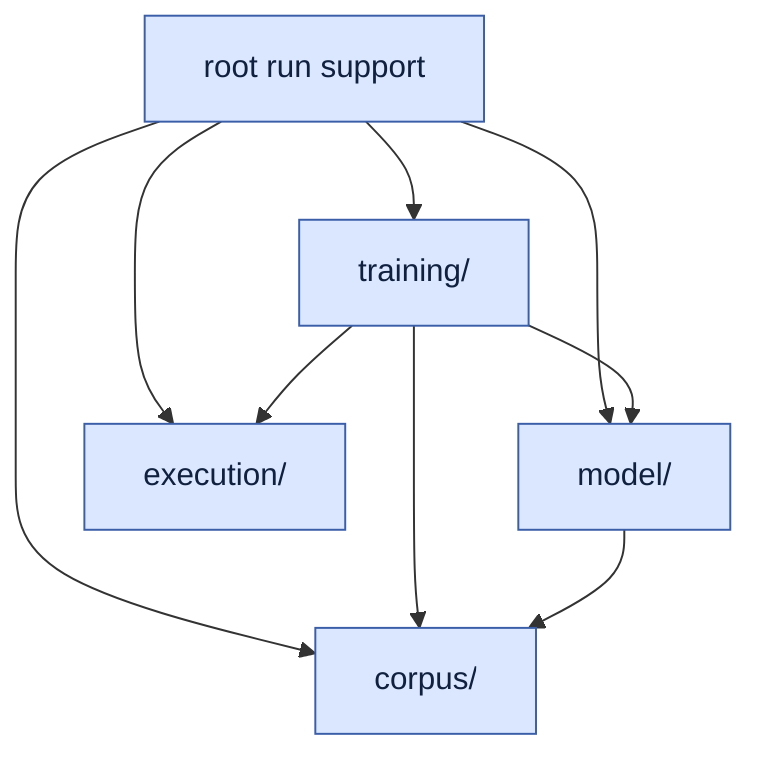
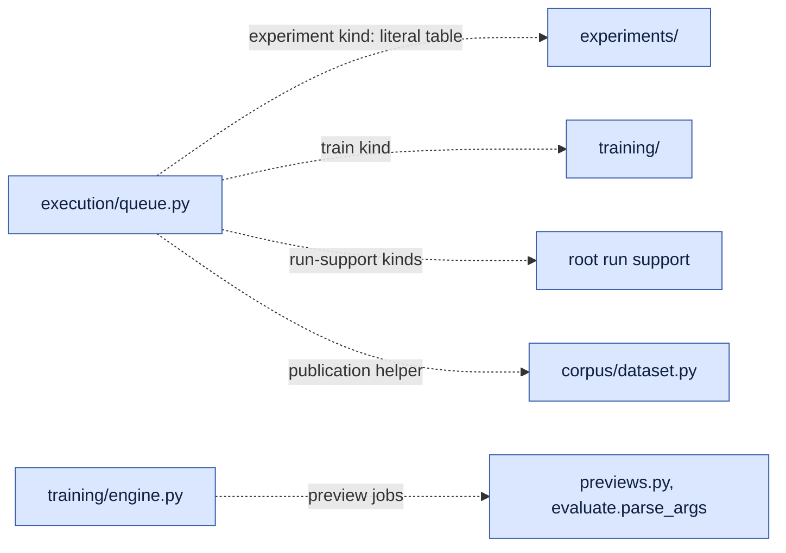
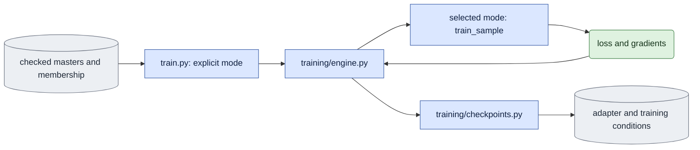

# Architecture — package layout, ownership and dependencies

Operational GPU and process rules (direct `nvidia-smi`, one shared own-process
ledger, concurrent runs on GPUs 0–3) are user amendments in the
[package guidance](../CLAUDE.md). This document does not repeat them.

Status: **Required design, approved 2026-10-08. The source does not match it yet.**
This document is the only owner of the target layout, the ownership and
dependency rules, and the migration map. The
[active handoff](../../../../plans/2026-10-07-onestep-avatar-development-experiment-handoff.md)
owns progress, work order, acceptance gates and evidence. Do not copy changing
test counts, run timelines or group status into this document.

Required means the agreed target. Current means inspected source behavior.
Verified means a check with saved evidence and an explicit scope. Keep these
meanings separate. A path in this document that does not exist yet is
**Proposed**. Do not quote it as a runnable command until the code moves.

## Objective and authority

Keep one shared trainer and the two model modes. Separate this runtime from the
code that defines a scientific comparison or recovers a historical study. An
experiment uses the shared runtime. It does not carry another trainer, sampler,
adapter loader, condition checker or decoder.

[Core algorithm](core_algorithm.md) owns the numerical and conditioning rules.
[Training choices](training_choices.md) owns the D0/D1, background and history
settings. `doc/experiments/` is reserved for experiment-module docs.
Per-module docs explain current calculations. Write or move them before the
source they describe moves.

## Decisions recorded on 2026-10-08

The user made these decisions after a review of the October 7 handoff.
They replace any earlier statement that conflicts with them.

1. **Keep every historical study as an experiment module.** All ten root study
   owners move into `experiments/`. Fusion parity, the eight-block causality
   diagnostic, future-noise interventions, sigma-sweep metrics, saved-probe
   metrics, the A1/B1c statistics and legacy adapter conversion also move there,
   with their behavior unchanged.
2. **The pruning baseline producer moves to `scripts/prune/`.** The sibling
   pruning package uses `visualize_d1 --whole-clip` to make its baselines and
   candidates. That producer becomes a prune-owned command with the same output
   format. `visualize_d1.py` then retires completely.
3. **`expr/` cleanup is limited.** Every executor, launcher and runnable source
   snapshot under `expr/onestep_avatar/` becomes non-executable provenance.
   Report-only code stays unchanged. Only maintained reports must rebuild from
   saved results. All other report folders are frozen.
4. **Commit each verified step.** The refactoring agent commits one owner group
   at a time on a branch in the LTX-2 submodule. It never updates the
   workspace's recorded LTX-2 commit and never pushes.
5. **One `experiment` queue kind.** It replaces the `sigma_sweep` kind. A fixed
   literal table in `execution/queue.py` selects the experiment module.
6. **Two more subpackages: `corpus/` and `execution/`.** Corpus producers and
   readers move into `corpus/`. Queue, process, launch and provenance modules
   move into `execution/`. Refinement in this design: `hashing.py` stays at the
   package root as a leaf utility, because `corpus/` and `model/` import it and
   must not depend on the queue package.
7. **Split ordinary `evaluate.py` by responsibility.** General measurements go to
   `metrics.py`, training-preview jobs to `previews.py` and saved-comparison
   rendering to `comparisons.py`. `evaluate.py` keeps ordinary evaluation.
8. **The queue is the only launcher for model work.** Every training,
   evaluation, preview, product, benchmark, decoding, rendering and experiment
   run is a queue job. Every kind gets bounded supervision and an optional
   overall deadline that spans startup retries. Hand-written controllers, the
   pilot caller's monkeypatches and the checkers' self-launch paths retire.
   Corpus production (`corpus/precompute.py`, `corpus/build_guidance.py`)
   keeps its documented direct commands.
9. **One GPU pool: GPUs 0–3.** Every queue kind draws from one pool constant.
   Four-rank training needs all four; single-GPU jobs wait while it runs.

## Terms and classification

- **Core runtime:** code that trains or generates in ordinary supported
  conditions. It includes both mode algorithms. A mode is not a study.
- **Corpus code:** code that names, reads, checks or produces capture, guide,
  crop, mask and VAE data, and the fixed video list.
- **Ordinary run support:** preparation, evaluation, measurement, previews,
  decoding, rendering and plotting that several runs use without knowing a
  scientific question.
- **Execution and provenance:** dispatch, own-process tracking, bounded
  supervision and the identity of source and runtime bytes.
- **Experiment code:** code that chooses interventions, comparison controls, a
  study's exact inventory, historical conversions or the interpretation of
  study measurements. Acceptance checkers (E1–E4) are experiment code.
- **Study data:** membership, frame plans, exact schedules, noise, job lists and
  narrative settings. Study data can live under `expr/onestep_avatar/`.
- **Report code:** code under `expr/` that reads saved evidence and writes a
  report. It never generates a missing result.
- **Maintained report:** a report that must rebuild from saved results.
  **Frozen report:** a historical report whose code stays unchanged and is not
  rebuild-tested.
- **Retired executor:** an `expr/` file that started model, decoder, training or
  queue work. Its bytes stay as non-executable provenance.

Classify a function by its responsibility, not by its number of callers. A
general decoder with one caller is still run support. A converter for two fixed
source views is study-specific even when several jobs use it. Exact mathematics
and supported default settings belong to their common owner. A study's actor
list, sigma grid and comparison roles do not.

## Target layout

All paths are relative to `LTX-2/scripts/onestep_avatar/` unless stated.

```text
__init__.py          package marker; PACKAGE_ROOT, LTX_ROOT, WORKSPACE_ROOT
hashing.py           leaf utility: file and tensor content identity
train.py             thin training CLI; requires --mode
infer.py             product CLI/API: supplied image + guide, no capture target
evaluate.py          ordinary evaluation: preflight, sample_case, save_case, CLI
metrics.py           general latent, RGB, subject and LPIPS measurements
previews.py          training-preview jobs: verify, state, generate, render
comparisons.py       saved-comparison rendering (queue kind "render")
media.py             decoding use, panels, videos and layout
decode_saved.py      decode saved encodings (queue kind "decode")
prepare_inputs.py    fixed preview and supplied-image preparation
bench.py             measured generation and operation cost
plot_training.py     training-log plots
corpus/              dataset, subset, precompute, build_guidance,
                     geometry, motion, mask_video, qa
model/               common, backbone, adapters, sampling, bidirectional, causal
training/            config, engine, checkpoints, startup, runtime,
                     resources, numerics, consumer_trace, update_state
execution/           queue, queue_launch, queue_protocol,
                     process_registry, supervision, software
experiments/         training_update_check, training_slice_check,
                     adapter_effect_check, continuation_check, causality,
                     stock_parity, fusion_parity, sigma_sweep,
                     sigma_sweep_jobs, sigma_sweep_results,
                     future_noise_study, convert_progress_jobs,
                     stats, saved_probe_metrics, legacy_adapters
configs/             fsdp.yaml, fsdp_forward_prefetch.yaml, README.md recipes
doc/                 mirrored module designs and cross-module contracts
tests/               ordinary tests; tests/experiments/ for experiment tests
```

`corpus/`, `execution/` and `experiments/` each get an empty `__init__.py`,
like `model/` and `training/`. Do not add `LTX-2/scripts/__init__.py`.
`scripts` must stay a namespace package, so that `corpus/build_guidance.py`
can merge ARGAvatar's `scripts.inference` at run time.

Retired without a replacement file: `windows.py`, `visualize_d0.py`,
`visualize_d1.py`, and the old training runtime and parser symbols listed in
[retired code](#retired-code). The root `stats.py` is not retired; it moves
whole to `experiments/stats.py`.

## Ownership by package

| Package | Owns | Does not own |
|---|---|---|
| `corpus/` | Artifact names and readers, checked membership and splits, crop/mask/pose/VAE producers, guide rendering (the only `argavatar` module) | Mode frame plans beyond shared facts, model calls, study selections |
| `model/` | Token layout, noise, `c0`, loss, base weights, adapter function, exact denoising steps, both mode algorithms, cache state and diagnostic numerical paths | Settings parsing, optimizer loop, comparison orchestration |
| `training/` | Typed settings and preflight, the one optimizer loop, checkpoint contract and export, runtime/resource/numerical evidence, preview enqueue | Evaluation, sampling CLIs, studies |
| Root run support | Ordinary evaluation, product, previews, saved comparisons, decoding, media, preparation, cost and plots | Interventions, historical protocols, study inventories |
| `execution/` | The only launch path for model work: queue kinds, GPU pool and claims, launch gate, own-process ledger, bounded supervision and deadlines; software manifests | Model calculations, study logic |
| Root leaf utilities | Repository roots (`__init__.py`) and file/tensor content hashes (`hashing.py`) | Any package import; heavy imports at module load |
| `experiments/` | Comparison protocols, acceptance checkers, interventions, study-only metrics and historical conversions | A second trainer, sampler, adapter loader, condition checker, decoder, registry, queue or launcher |
| `expr/` report code | Sections, captions, report plots, saved-result summaries, report validation | Any model, VAE, training or queue execution |

Shared knowledge keeps one spelling. Artifact names live in
`corpus/dataset.py`, the crop box in `corpus/geometry.py`, the block plan in
`model/causal.py`, the mask codec in `corpus/mask_video.py`, LoRA targets in
`model/adapters.py` and repository roots in `__init__.py`.

## Allowed dependencies

The table lists package-internal imports. Lazy imports inside functions count.

| Importing package | May import | Must not import |
|---|---|---|
| Root leaf utilities (`__init__.py`, `hashing.py`) | The standard library only at module import | Every package module |
| `corpus/` | `corpus/`, root leaf utilities | Everything else in the package |
| `model/` | `model/`, `corpus/`, root leaf utilities | `training/`, root run support, `execution/`, `experiments/` |
| `training/` | `training/`, `model/`, `corpus/`, `execution/`, root leaf utilities; lazily `previews.py` and `evaluate.parse_args` for preview jobs | Other root run support, `experiments/` |
| Root run support | Any package code outside `experiments/` | `experiments/`, `train.py` |
| `execution/` | `execution/`, root leaf utilities; lazily `corpus/`, `training/` and root run support for each job kind | `experiments/`, except through the literal table in `execution/queue.py` |
| `experiments/` | Public names of every package owner, other experiments | Private `_names` of other modules, `expr/` code, `train.py` |
| `expr/` report code | Model-free readers: `corpus/` readers, `hashing.py`, saved-record readers | Model, VAE or text-encoder loaders, queue execution, `experiments/` CLIs |
| `scripts/prune/` | Public `corpus/` readers and `model/` owners | `experiments/`, root run support, `training/` |

Rules that the table does not show:

1. Core training, ordinary evaluation and product must start and finish when
   `experiments/` cannot be imported. They do not dispatch a historical
   protocol from an ordinary CLI.
2. A software profile that requires a file is a dependency, even without an
   import. No ordinary profile lists an `experiments/` or `expr/` file.
3. Add no import cycle between modules. Package-level back edges exist only as
   the lazy edges named in the table.
4. An experiment that needs a private helper makes it public in its owner and
   documents it there. It does not import `_name` across modules.
5. Diagnostic numerical paths can stay in `model/causal.py` when they reuse its
   block/cache primitives. Ordinary defaults never select them.
6. A general metric stays in `metrics.py`. A wrapper that needs one study's
   boundaries, frames or score inventory belongs to that experiment.
7. Study data paths can point into `expr/`. A path argument never permits
   importing Python from `expr/` or running a data field as code.
8. Only `execution/` claims GPUs, writes own-process ledger rows or supervises
   a child process. Run support and experiments run inside a queue job and do
   none of these. A command that loads no model and uses no GPU (job builders,
   converters, saved-result metrics) may run directly.

**Current exceptions to remove during the refactor:**
`model/adapters.py` imports `training.config.LORA_TARGETS` (move the constant
to `model/adapters.py`) and lazily imports `training.checkpoints` (pass the
checked contract in from the caller, or record why the edge must stay);
`subset.py` imports `model.causal.CausalGeometry` (keep it only if a
general conversion needs it, and record the reason here).

The first diagram shows imports that run when a module loads. They form one
direction, from run support down to corpus code. Two kinds of edge are not
drawn: `experiments/` may import every package, and every package may import
the root leaf utilities.



The second diagram shows the permitted lazy imports that the first diagram
does not contain. Each runs inside one job kind or one preview path. The edge
into `experiments/` exists only through the queue's literal table.



`hashing.py` imports only the standard library at module import. Tensor
hashing imports `torch` inside the function, so `corpus/build_guidance.py`
and the import-light queue modules stay light.

## Ordinary training and experiment data flow

This diagram shows ordinary training. It has no experiment owner.
Use the [core legend](core_algorithm.md#7-end-to-end-data-flow).



This diagram shows an experiment that uses the same generation function.
Arrows carry inputs or results. They do not permit reverse imports.


## Shared mechanisms

### Repository roots

Moving a file changes every `Path(__file__).parents[N]` calculation. This
happened before: `dataset.py` used `parents[2]` until the September 15 merge.
Current sites include `dataset.WORKSPACE_ROOT`, `software.ROOT`, the queue's
child working directory and the checkers' child working directories.

**Required:** `__init__.py` defines three constants with the standard library only:

```python
PACKAGE_ROOT = Path(__file__).resolve().parent   # .../LTX-2/scripts/onestep_avatar
LTX_ROOT = PACKAGE_ROOT.parents[1]               # .../LTX-2, the cwd for python -m
WORKSPACE_ROOT = LTX_ROOT.parent                 # .../VideoDiffusionModels
```

Package code and tests use these names. No module calculates a repository root
from `__file__`. Child processes use `cwd=LTX_ROOT`. Hashing a module's own
bytes with `sha256(Path(__file__))` is file identity, not a root calculation,
and stays. Worked check: today `dataset.py` gives
`Path(dataset.py).parents[3]` = `.../VideoDiffusionModels` and
`software.py` gives `parents[2]` = `.../LTX-2`. The constants must give the same
two paths from any file location.

### Queue kinds and experiment dispatch

Every run that loads a model or uses a GPU is a queue job. Each kind starts one
module with `python -m scripts.onestep_avatar.<module>` from `LTX_ROOT` and
has a model-free completion check.

| Kind | Module | GPUs | Completion check |
|---|---|---|---|
| `train` | `train` through `accelerate launch` | four | `training.engine` scientific verification (current) |
| `evaluate` | `evaluate` | one | `evaluate.verify_evaluation_conditions` (current) |
| `preview` | `previews` | one | `previews.verify_preview_job` (current function, moved) |
| `product` | `infer` | one | **New** `infer.verify_completion`: raw encoding, records, generated-only MP4 and review match their recorded hashes |
| `bench` | `bench` | one | **New** `bench.verify_completion`: the timing record is complete for the requested repetitions and warmup |
| `decode` | `decode_saved` | one | decoder receipt check (current) |
| `render` | `comparisons` | one | `comparisons.verify_saved_comparison_completion` (current, moved) |
| `experiment` | the selected experiment module | one | that module's `verify_completion(spec, root)` |

**GPU pool.** `execution/queue.py` has one pool constant, GPUs 0–3. `train`
needs all four. Single-GPU kinds pick from the same pool. Today the code uses
`TRAIN_GPUS = (0, 1, 2, 3)` and `EVALUATION_PREFERENCE = (5, 4, 3, 2, 1, 0)`;
the second constant must become an order inside the pool.

**Experiment selection.** An `experiment` job carries `experiment` (a
selector), `spec`, `spec_sha256` and `arguments`. The canonical job hash covers
every field. `execution/queue.py` holds one literal table. Each entry is an
experiment module that loads a model or uses a GPU:

```python
EXPERIMENTS = {
    "stock_parity": "scripts.onestep_avatar.experiments.stock_parity",
    "adapter_effect_check": "scripts.onestep_avatar.experiments.adapter_effect_check",
    "continuation_check": "scripts.onestep_avatar.experiments.continuation_check",
    "training_update_check": "scripts.onestep_avatar.experiments.training_update_check",
    "training_slice_check": "scripts.onestep_avatar.experiments.training_slice_check",
    "causality": "scripts.onestep_avatar.experiments.causality",
    "fusion_parity": "scripts.onestep_avatar.experiments.fusion_parity",
    "sigma_sweep": "scripts.onestep_avatar.experiments.sigma_sweep",
    "stats": "scripts.onestep_avatar.experiments.stats",
}
```

Only the `experiment` branch reads the table. It imports the selected module
with `importlib.import_module` at the point of use. The selected module provides
`parse_args(argv)`, a `python -m` entry and `verify_completion(spec, root)`.
The queue checks `spec_sha256` before launch and again before completion. An
unknown selector fails before any claim, write or child process. Ordinary kinds
never read the table. Adding a queued study means editing this literal table
and its tests. There is no registration API, discovery or plugin loading.

**Bounded supervision for every kind.** A job may name a resource budget in the
existing `training/resources.py` format. `train` keeps its typed
`--resource-budget` option; other kinds use the job fields `resource_budget`
and `resource_budget_sha256`. A job without a budget gets the scientific
default: 1,800 seconds per phase and 48,000,000,000 allocated bytes. The queue
supervises every child with `execution/supervision.py`, records owned
descendants in the ledger and proves worker absence at the end.

**Overall deadline.** A budget may set `overall_seconds`. The clock starts at
the first attempt and is stored in the queue journal. A startup retry or a
queue restart does not reset it. When it expires, the queue stops the owned
process tree within the shutdown bound and marks the job failed with reason
`overall_deadline`. This replaces the pilot caller that monkeypatched
`queue.run_child` and `supervision.supervise`.

**Numerical environment.** A job that needs the deterministic numerical policy
declares it. The queue applies the child environment from
`training/numerics.py` before the child starts, as it does for `train` today.

**Evidence.** Each attempt keeps the files that the hand-written controllers
wrote: launch request and grant, journal, supervision result with the
worker-absence proof, and the child log.

**Checkers inside a job.** A checker never claims GPUs, writes a ledger row or
calls `supervise`. `continuation_check.supervised_run` and
`training_update_check.supervised_reference` retire. When a protocol needs a
separate process (for example the E4 serial reference), that process becomes
its own queue job, and the step that needs its output depends on it through the
existing job dependencies.

**Historical job lists.** Old lists with `kind: "sigma_sweep"`, and old
future-noise rows with `kind: "evaluate"` plus intervention options, are
historical data. They keep their receipts and attribution. A rerun uses a fresh
job list that the moved builders (`experiments/sigma_sweep_jobs.py`,
`experiments/future_noise_study.py`) write, with fresh output IDs. The
`--claims-dir` alias for old reservation files retires.

### Software profiles

The five profiles stay: `training`, `evaluation`, `inference`, `decoding` and
`preparation`. `execution/software.py` lists `COMMON` and per-profile `ENTRIES`
with final paths. `__init__.py` joins `COMMON`, because it now defines the roots.
`hashing.py` stays in `COMMON`.

- No ordinary profile lists an `experiments/` or `expr/` file. Today the
  `evaluation` profile lists `stock_parity.py` and the `decoding` profile lists
  `sigma_sweep.py` and `sigma_sweep_results.py`. Those entries leave when the
  files move.
- An experiment binds its own files with
  `software.capture(<profile>, mode, extra_sources=(<experiment files>,))`.
  There is one provenance system.
- **Coverage check:** for each profile, a CPU test runs a representative entry
  path with experiments blocked. Every loaded `scripts.onestep_avatar` module
  must be in that profile. A missing file is a profile defect.
- Every path change makes old manifests non-current. Old receipts keep their
  original attribution. Fresh affected evidence comes after the code gate.

### Split of ordinary `evaluate.py`

| Current functions in `evaluate.py` | Final owner |
|---|---|
| `tensor_sha256` | `hashing.py` (same algorithm and bytes) |
| `encoded_metrics`, `rgb_metrics`, `_check_rgb_pair`, `masked_rgb_transition_steps`, `subject_mask`, `subject_rgb_metrics`, `_lpips_batches`, `lpips_frame_scores`, `lpips_distance` | `metrics.py` |
| `check_preview_reference_bundle`, `verify_preview_job`, `_verify_preview_outputs`, `set_preview_state`, `render_preview_outputs`, `generate_preview`, `verify_preview_tensors`, the `--preview-job` CLI | `previews.py` |
| `_saved_panel_path` through `verify_saved_comparison_completion`, `parse_saved_comparison_args`, the `--render-saved-comparisons` CLI | `comparisons.py` |
| `check_adapter`, `validate_comparison`, `measure_calls`, `sample_case`, `save_case`, `parse_args`, `prepare_evaluation`, `verify_evaluation_conditions`, `evaluation_evidence_paths`, `execute_evaluation`, `main` | `evaluate.py` |
| `probe_future_noise`, `save_future_noise_probe`, the changed-noise branch of `evaluation_evidence_paths`, `causality_probe`, `evaluate_causality` | `experiments/causality.py` |
| `fusion_probe_block`, `fusion_parity_metrics`, `evaluate_fusion_parity` | `experiments/fusion_parity.py` |
| `sigma_sweep_boundary_metrics` | `experiments/sigma_sweep.py` |
| `saved_latent_metrics`, `measure_saved_probe` | `experiments/saved_probe_metrics.py` |

`metrics.py` may load the LPIPS network. It never loads the transformer, text
encoder or VAE.

**Ordinary evaluation options.** `evaluate.py` keeps `--history-mode
{cache,recompute,joint}` and `--kv-source {refresh,denoise}`. They select
shared diagnostic paths in `model/causal.py`, are recorded in every output and
default to `cache` and `refresh`. Product refuses the non-default values.
`evaluate.py` removes `--changed-noise-file`, `--future-noise-start`,
`--causality`, `--fusion-parity` and `--saved-metrics`; these become
experiment CLIs. `--preview-job` moves to `previews.py` and
`--render-saved-comparisons` moves to `comparisons.py`. A removed option is an
unknown argument and fails before any write.

## Migration map

Paths are relative to the package. "Move" changes the path and callers only.
"Extract" moves named symbols out of a mixed file. Write or move the
destination design before the source change. Update imports, `python -m`
commands, child working directories, queue strings, software profiles, tests,
docs and recipes in the same change.

### Moves into subpackages

| Current file | Final path | Notes |
|---|---|---|
| `dataset.py`, `subset.py`, `precompute.py`, `build_guidance.py`, `geometry.py`, `motion.py`, `mask_video.py`, `qa.py` | `corpus/<same name>` | `build_guidance` runs as `conda run -n argavatar python -m scripts.onestep_avatar.corpus.build_guidance`. `subset.py` gains the legacy subset hash rule from `windows.py`. |
| `queue.py`, `queue_launch.py`, `queue_protocol.py`, `process_registry.py`, `supervision.py`, `software.py` | `execution/<same name>` | `queue.py` gets the `experiment`, `preview`, `product` and `bench` kinds, one GPU pool, supervision and deadlines for every kind. |
| `hashing.py` | stays at the root | Gains `tensor_sha256` from `evaluate.py`. |
| `training_update_check.py`, `training_slice_check.py` | `experiments/<same name>` | E4 replay and one-rank localization. Update `ENTRY` and `extra_sources`. The serial reference becomes its own queue job. |
| `adapter_effect_check.py` | `experiments/adapter_effect_check.py` | E2; includes the fused diagnostic. |
| `continuation_check.py` | `experiments/continuation_check.py` | E3; its future-noise control calls `experiments/causality.py`; `supervised_run` retires. |
| `stock_parity.py` | `experiments/stock_parity.py` | E1. |
| `sigma_sweep.py`, `sigma_sweep_jobs.py`, `sigma_sweep_results.py` | `experiments/<same name>` | Queue selector `sigma_sweep`. |
| `future_noise_study.py`, `convert_progress_jobs.py` | `experiments/<same name>` | CPU job builders; future-noise jobs use selector `causality`. |
| `stats.py` | `experiments/stats.py` | A1/B1c protocols. Its helpers have no other consumer. |

### Extractions from mixed files

| Current location | Final owner | Kept in the current owner |
|---|---|---|
| `evaluate.py` | See [split of ordinary evaluate.py](#split-of-ordinary-evaluatepy) | Ordinary evaluation only |
| `training/checkpoints.py`: `convert_legacy_adapter`, `main` | `experiments/legacy_adapters.py` | Contract read/validate/check, tensor checks, save/load, `random_segment_selection`, parent initialization |
| `training/config.py`: `LORA_TARGETS` | `model/adapters.py` | Typed settings |
| `windows.py`: `subset_sha256` | `corpus/subset.py` as the legacy subset hash rule | Nothing; `windows.py` retires |

The legacy subset hash must keep the exact original rule: the original seven
keys, `json.dumps(sort_keys=True)` and unchanged spacing.

### Retired code

| Code | Required before deletion |
|---|---|
| `train.py` mode-less route; `training/config.py` old `parse_args`; `training/engine.py` `Chain`, `ChainStore`, `window_start_for`, `window_chain`, `check_random_window`, `clip_grid_for`, `assert_subset_matches_geometry`, `train_chain`, `_num_blocks`, `_inner_dim`, `causal_geometry`, `checkpoint_metadata`, old `main` and the eager `windows` import | Trace the typed closure. Keep `build_transformer`, `assert_rank_lockstep`, `timed`, logging and preview helpers that typed code uses. Missing `--mode` fails before writes. |
| `windows.py` | The legacy subset hash moved; engine and checkpoint callers removed. |
| `visualize_d0.py`, `visualize_d1.py` | The prune producer moved; needed condition, cache and K/V checks retargeted to `evaluate.py`, `model/causal.py` or experiment tests. |
| Alpha `.npy` reading and `--migrate-alpha`; unrefined pose fallback; `per_window` log readers in `plot_training.py`; remaining anchor fields and flags | The selected-data inventory proves no selected input needs them, or the existing bit-exact conversion has written checked derived records. Never rerender guides or delete source media. |

Keep both FSDP configurations: `configs/fsdp.yaml` and
`configs/fsdp_forward_prefetch.yaml` are distinct checked choices.

### Cross-package caller: `scripts/prune/`

`scripts/prune/` imports `dataset.load_training_master`, `model.common` and
`model.causal`. Its README and `doc/evaluate/whole_clip_d0.md` run
`visualize_d1 --whole-clip` for the baseline and for each pruned candidate.
`scripts/prune/data/whole_clip.py` reads that output format.

**Required:** move the whole-clip D0 producer into `scripts/prune/` as a
prune-owned CLI (proposed `scripts/prune/evaluate/whole_clip_baseline.py`;
follow `scripts/prune/CLAUDE.md` for the final name and doc). Keep the output
format and options (`--view`, `--sigmas`, `--prompt`, `--seed`, model and
guidance options, `--transformer`). Build it on public `corpus/` readers,
`model/` owners and prune's own `data/whole_clip.py`, not on the retired
`Chain` types. Update prune imports for `corpus/` and its docs in the same
change. After the code gate, one native check must reproduce a saved prune
baseline with the new producer (see the handoff).

### Tests and docs

- Experiment tests move to `tests/experiments/`. Other tests stay in `tests/`.
  Test file names stay unique across both folders.
- Keep behavior checks by moving them to the final owner. Delete a test only
  when it checks a retired interface and nothing else.
- Package tests do not import or run `expr/` code. A test that reads `expr/`
  data skips with a stated reason when the data is absent.
- Docs mirror source paths: `doc/corpus/`, `doc/execution/`,
  `doc/experiments/`, `doc/model/`, `doc/training/` and root `doc/<name>.md`.
  Files over 100 physical lines need a mirrored doc. Files with 100 or fewer
  lines use a header and have no separate doc.
- Cross-module docs stay at `doc/`: `architecture.md`, `core_algorithm.md`,
  `training_choices.md` (renamed from `experiments.md`), `known_gaps.md`,
  `verification.md` and the index `README.md`.
- Remove the docs of retired files. Move still-needed explanations first.

## `expr/` dispositions

| Class | Folders or files | Required action |
|---|---|---|
| Maintained report | `d1_diagnostic/ar_sigma_rollouts/` report code; the post-refactor pilot report | Rebuild from saved results with model, VAE and queue execution disabled. A missing cited artifact fails before any write or child. Discovery, import and rebuild refuse retired executors, even when an old inventory names them. |
| Frozen report | Report-only code in every other folder, for example `dev_training_20261001/`, `d1_selfrollout_sigma_sweep_20260926/`, `handoff_implementation_20261007/` report code, `runs/*` analysis scripts and the two slide servers | Leave bytes unchanged. Add `FROZEN.md` with the freeze date, the LTX-2 commit needed to rerun it and "not rebuild-tested". |
| Retired executor | Every executor, launcher or probe, and every runnable source snapshot (`code_snapshot_58dc9c/`, `provenance/source_snapshot/`, `code/legacy/`) | Rename `*.py` to `*.py.txt` and `*.sh` to `*.sh.txt` in place. Clear execute bits. Keep bytes unchanged. Record each file in `expr/onestep_avatar/retired_executors.json` with original path, new path, SHA-256, class and reason. |
| Mixed file in a maintained report | Files that combine report sections with model or scoring execution | Save the original as `<name>.pre_refactor.py.txt` (recorded in the JSON). Remove the execution branch from the live file. Move execution that must run again into `experiments/`. |

`.py.txt` is the existing workspace convention for non-executable source
provenance. `expr/` is not in Git, so renaming in place is the only way to
keep these bytes. One `expr/onestep_avatar/report_dispositions.json` lists every
report folder as maintained or frozen.

## Retirement rules

1. **Package code** is deleted after three conditions hold: every current
   caller has moved (package, prune, tests, recipes, maintained reports); the
   required behavior exists in its final owner with CPU tests; and the removal
   inventory records the old path, its SHA-256 and the last LTX-2 commit that
   contains it. New native evidence is not a deletion condition, because Git
   keeps the bytes. If a later native check fails, fix the final owner. Never
   restore the old runtime.
2. **Data fallbacks** follow the data condition in the retired-code table.
   They protect readers of saved data, so Git history does not replace the check.
3. No forwarding module, alias import, `legacy/` copy or compatibility flag
   remains at an old path.
4. Old commands fail clearly: `train` without `--mode` exits non-zero before it
   writes; a removed `evaluate` option is an unknown argument.
5. Historical results keep their original source hashes and attribution.
   Never restamp an old result as the output of a moved owner.

## Boundary checks

The handoff's code gate uses these checks. Each must pass on the final source.

- **B1 Layout.** The tree matches [target layout](#target-layout). No file
  remains at a retired path. `LTX-2/scripts/__init__.py` does not exist.
- **B2 Experiments blocked.** With an import blocker that refuses
  `scripts.onestep_avatar.experiments*` (for example a `sys.meta_path` finder
  installed by `tests/conftest.py` when `ONESTEP_AVATAR_BLOCK_EXPERIMENTS=1`),
  the ordinary suite (`tests/` without `tests/experiments/`) passes. Blocked
  child commands also pass: `train --mode bidirectional --dry-run`,
  `train --mode causal --dry-run`, ordinary `evaluate` and `infer` dry runs,
  and `--help` for `previews`, `comparisons`, `decode_saved`,
  `prepare_inputs` and the queue.
- **B3 Static imports.** An AST test finds no `experiments` import outside
  `experiments/`, except the literal table in `execution/queue.py`. It also
  checks the [dependency table](#allowed-dependencies) and private-name rule.
- **B4 Roots.** No package module computes a root from `__file__`.
- **B5 Profiles.** No ordinary profile lists `experiments/` or `expr/`. The
  profile coverage check passes for all five profiles.
- **B6 Queue.** Ordinary kinds never import an experiment module. An unknown
  kind or selector fails before writes. Every kind and every selector parses,
  builds its command and verifies completion on CPU fixtures. A CPU fixture
  shows bounded supervision for a non-`train` kind, and an overall deadline
  that a simulated startup retry and a queue restart do not reset. No kind can
  select a GPU outside 0–3.
- **B7 Environments.** `conda run -n argavatar python -m
  scripts.onestep_avatar.corpus.build_guidance --help` exits zero.
- **B8 Reports.** The maintained AR report rebuilds byte-identically from saved
  results with model/VAE/queue execution disabled. Removing one cited artifact
  fails before children or writes. `retired_executors.json` covers every
  executor and snapshot file; no `.py` or `.sh` executor remains outside
  maintained report code.
- **B9 One launcher.** An AST test finds uses of `ProcessRegistry` and its
  `acquire`, of `supervision.supervise`, and of the `queue_launch` request,
  guard and grant functions only inside `execution/`. Phase notifications
  from a running child (`supervision.notify_phase`) are not launches.
  Every native run type in the handoff (E1–E4 checkers, preview, product,
  bench, pilot training) has a job-list template that the queue accepts on
  CPU, so no hand-written controller is needed.

## Worked boundary checks

**Ordinary training.** A checked D1 membership and `--mode causal` select the
typed engine and `model.causal.train_sample`. With experiments blocked, the
settings preflight, a small-model CPU update, adapter export and preview
enqueue still work. The run knows no sweep cells or historical A/B/B2/B3
labels. Repeat the check for bidirectional mode, which has no cache.

**Queued future-noise experiment.** A job `{"kind": "experiment",
"experiment": "causality", "spec": ..., "spec_sha256": ...}` with future-noise
arguments reaches the literal table, imports `experiments.causality` and starts
`python -m scripts.onestep_avatar.experiments.causality` with `cwd=LTX_ROOT`
on one GPU from the pool, under bounded supervision.
The module keeps the earlier saved noise bytes, changes only later bytes and
calls the shared `evaluate.sample_case` twice. A changed earlier noise byte
fails preflight. A job with selector `"x"` fails before any claim. An ordinary
`evaluate` job that passes `--future-noise-start` fails as an unknown argument
before any claim.

**Maintained saved report.** With complete saved outputs, the AR report
rebuilds while model, decoder and queue execution are disabled. Removing a
cited artifact makes the rebuild fail before any child or write. An inventory
row that names `run_followups_20261004.py` finds only the `.py.txt` file and
refuses it.

Architecture completion is separate from scientific completion. Overall
handoff completion still needs E1–E5, the native previews and product outputs,
the removal dispositions and the bounded pilot report. This document makes no
claim that those tasks have passed.
