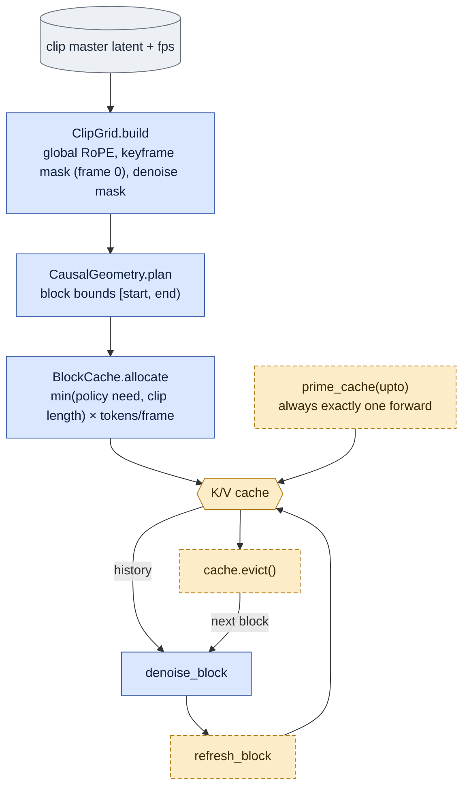

# `causal_core.py` — the one rollout implementation

> The shared contract this file implements lives in
> [core_algorithm.md](core_algorithm.md); the arms that call it in
> [experiments.md](experiments.md); the places it does not meet the contract in
> [known_gaps.md](known_gaps.md) — notably
> [G2](known_gaps.md#g2--generic-teacher-forced-rollout-refreshes-from-the-guide-not-the-target)
> (`rollout(teacher_forcing=True)` refreshes from the guide, not the target).

## Objective

The whole causal scheme, in one file: block-causal attention, a clean-latent K/V cache, and
master latents. It replaces the sliding-window-with-a-frozen-carryover construction that
`refine_core` still owns for the `k2` baseline.

Three changes that are **one** change:

1. **Attention is block-causal.** A token attends to its own block and every earlier one,
   never a later one. Within a block it stays bidirectional — the block is denoised in one
   shot, so there is nothing to order inside it.
2. **Finished blocks live in a K/V cache.** Under (1) a finished block's keys and values no
   longer depend on anything after it, so they are computed once.
3. **Everything is a slice of the clip's one continuous encode.**

**(1) is a precondition for (2), and that is the whole argument.** With bidirectional
attention a context token's K/V depend on the noisy tokens beside it, so they differ in every
window and nothing is cacheable. Turning the mask off and keeping the cache would not be a
speed/quality trade — it would silently compute a different function.

## Data flow

`denoise_block` reads the cache and writes nothing; `refresh_block` is the only writer;
`cache.evict()` keeps the pinned sink plus the last `context` frames.

## Organization logic

**Why one module rather than a training one and a deployment one.** `train.py`,
`onestep_core.py` and `visualize_d0.py` all call these same three functions in the same
order. Train/deploy parity is then a property of the code's shape, not a thing to re-verify.

**Why `denoise` writes nothing.** It is the only pass that stores activations, so gradient
checkpointing must stay valid on it — a cache write would be replayed by recomputation.

**Why `refresh` is a second forward and is not optional.** The keys a later block wants
belong to the *denoised* content, and the denoising forward only ever saw the noisy version.
It runs under `no_grad`, stores no activations, and its cost is counted in every compute
number this project quotes.

**Why `backward` runs between them** (in `train.py`): peak activation memory is one block,
not `K`.

**`rollout`'s `teacher_forcing` flag mirrors `train_chain`'s ablation of the same name.**
Refresh is fed `guide_tokens` (the clean source the block was noised from) instead of the
block's own denoised output. Off by default — the self-forced regime a real deployment has to
use, since there is no ground truth at inference. `visualize_d0.py` exposes it as
`--teacher-forcing` so a checkpoint trained with `train.py --teacher-forcing` can be probed
under the same regime it was trained on, rather than the self-forced one its cache never saw
during training.

## The knobs

| | |
|---|---|
| `BLOCK_LATENT_FRAMES = 2` | 16 pixel frames = the deployed stride, so an adapter finalizes per step exactly the span `k2` does |
| `CONTEXT_LATENT_FRAMES = 8` | clean frames retained besides the sink — a **retained history of 9 latent frames**; set by what fits on 4×49 GB, not by what would help |
| `MAX_CONTEXT_LATENT_FRAMES = 16` | the supported ceiling, in *context* frames — OOMs in `backward` at rank 32 on 4×49 GB |
| `SINK_LATENT_FRAMES = 1` | latent frame 0, pinned, never evicted |

**Cache depth is a memory knob first** — ~0.8 GB per retained latent frame per rank (48
layers × 1024 tokens × 4096 dims × k and v × 2 bytes).

**Deep context = accumulation.** Past roughly the chain's own reach, eviction never fires and
the cache simply holds the pinned sink plus every frame the rollout has finalized. At `K = 3`
and a 2-frame block that is 6 finalized frames plus whatever priming put there — inside the
default 8, so a training chain rarely evicts. Eviction is what bounds a *long* rollout, not
what a short one spends its time doing.

**Capacity is capped by the clip** (`cache_latent_frames_for`): reserving 16 frames of K/V
for an 18-frame clip a 3-block chain touches half of would be gigabytes of untouched memory.
A caller that allocates **once** for many clips must therefore pass
`BlockCache.allocate(capacity_latent_frames=…)` with the LONGEST clip it will see — sizing
from whichever clip came first makes the buffer depend on the shuffle, and a longer clip then
overflows. `BlockCache.fits(latent_frames)` is the question to ask before the forward.

## Invariants

- **The pinned frame-0 sink never leaves the cache once written.** This is a retention
  policy, not first-frame image conditioning. At clip start the cache is empty and
  `noise_block` noises frame 0 too; its timestep is sigma, because the grid's denoise mask
  is all ones. Self forcing subsequently caches the generated frame 0. D0 teacher forcing
  instead caches the clean capture frame 0 (and the rest of the completed target block),
  even if the displayed prediction depicts a different person. Mid-clip training priming
  also uses clean capture tokens. The product's intended supplied-image condition is not
  implemented by this sink or by `keyframes_mask`.
- **Only latent frame 0 is marked a keyframe.** The per-window tools marked every window's
  own first frame, which is false for every window past a clip's first.
- **RoPE positions are global.** Per-window tools restarted the time axis at 0, so every
  window looked like a clip start. Global positions are also what let a cached key keep the
  position it was written with.
- **A mask is accepted only with an empty cache.** With history present, keys are
  `[history | block]` and a `(B, T, T)` mask does not describe them.
- A short tail block is **dropped**, not shortened: a differently-sized block is a different
  condition, not a smaller one.
- **`prime_cache` performs exactly one forward, always** — including for a clip-start chain,
  where it has nothing to write and forwards over a single frame with no cache attached. The
  forward count must not depend on the data: under FSDP `FULL_SHARD` a forward is a round of
  all-gathers, so a rank that skips one desynchronises the collective stream and the job
  **hangs** rather than failing. This was a live bug until 2026-09-16; see the Gotchas below.

## Gotchas

- **D0 teacher forcing can produce an identity transition after block 0.** With two latent
  frames per block, block 0 spans latent `[0, 3)` (17 pixel frames at temporal scale 8).
  It sees only noised capture tokens; block 1 additionally sees clean GT history. The
  decoded video concatenates predictions, not the GT tensors used to refresh the cache.
  Thus visual continuity with a mistaken generated first frame is not enforced, and the
  VAE can spread the transition around the block boundary. Preserving a supplied first
  frame requires clean input tokens, zero per-token timestep, and output/refresh
  preservation in both training and rollout; changing the timestep alone leaves noised
  pixels in the condition.

- **A data-dependent forward is a data-parallel deadlock.** `prime_cache` returned early for
  clip-start chains until 2026-09-16. On a 4-GPU run the ranks that drew such a chain issued
  one all-gather fewer than the rest, and the job deadlocked at the first backward — the short
  rank in an `ALLREDUCE`, the others in a `_REDUCE_SCATTER_BASE` of the same `SeqNum`. What it
  looks like from outside: 100 % GPU utilisation, per-rank memory frozen at *identical* values,
  no output, and eight minutes later a watchdog blaming `CudaEventDestroy`. On `t2`, 11 of 40
  train chains were clip-start, so P(4 ranks agree) = 0.28 — it hung on step 1, and single-GPU
  runs were fine throughout, because one rank cannot desynchronise with itself.
  `test_prime_cache_forwards_exactly_once_whether_or_not_it_has_anything_to_prime` pins it, and
  `train.py:assert_rank_lockstep` turns the next instance into an error instead of a hang.

- **The temporal RoPE axis is in seconds** against `positional_embedding_max_pos[0] = 20`, so
  a rollout past 20 s leaves the trained range. `ClipGrid.build` raises rather than
  extrapolating; a streaming deployment past 20 s needs position re-basing first.
- **Cache priming is the one teacher-forced seam left.** A chain starting mid-clip fills the
  cache from ground truth; in a true rollout those keys were computed when they were
  generated, against whatever history existed then. `seed_is_clip_start` marks chains that
  need no priming. The escalation is to train whole clips (~3× more forwards per step).
- **A capacity capped by the wrong clip is a data-parallel hazard, not just an error.**
  `LayerKVCache.write` raises on overflow, and a raise inside one rank's forward leaves that
  rank one round of all-gathers short of the others — the same shape as the `prime_cache`
  deadlock above. `train.py` sizes the run's one allocation from the subset's longest clip
  (`ChainStore.max_latent_frames`, read from `windows.py`'s own `n_latent_frames`) and
  re-checks `cache.fits(...)` per chain, before any forward of the step. Reachable in practice
  only at deep `--context-latent-frames`, where the policy need (`sink + context + 1 + block`)
  exceeds the corpus's short 18-latent-frame tier but not its 28-frame one.

- `retained_prefix_spans` groups retained frames by their **real** block index, because
  frames denoised together attended to each other bidirectionally. A naive "sink is one
  block, the rest is another" split would forbid exactly that.
- **`base_model(module)` unwraps the ONE way, for both wrapper families this package
  produces** — the training-time FSDP/PEFT wrap (`.module`/`.base_model`/`.model`) and the
  deploy-time `X0Model(velocity_model=...)` wrap (`.velocity_model`). Since S1(7) of the
  2026-09-17 cleanup plan: `train.py` had the first as `_base_model`, and
  `onestep_core.rollout`, `visualize_d0` and `bench_forward` each hand-rolled the second as an
  inline loop. It raises `TypeError` if no `transformer_blocks` is found within 8 levels,
  rather than returning an unresolved object the way the retired velocity-model-only loop did.

## Tests

`tests/test_causal_core.py`. The load-bearing one is
`test_cached_rollout_matches_block_causal_full_sequence`: a **real** 2-layer `LTXModel` on
CPU, asserting the cached block rollout equals a full-sequence forward under a block-causal
mask, block for block. Everything the cache buys rests on that equality, and a stub would
pass whether or not the cache/RoPE/mask interaction is right.
