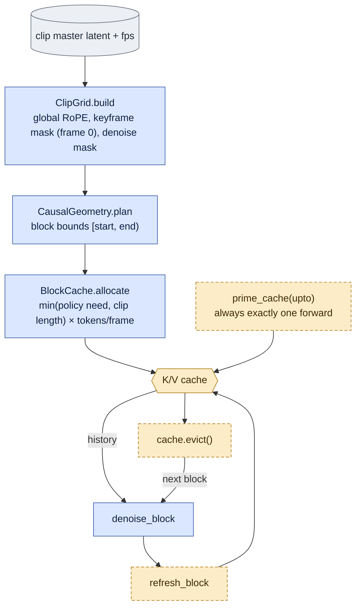

# `causal_core.py` — the one rollout implementation

> The shared contract this file implements lives in
> [core_algorithm.md](core_algorithm.md); the arms that call it in
> [experiments.md](experiments.md); the places it does not meet the contract in
> [known_gaps.md](known_gaps.md) — notably
> [G2](known_gaps.md#g2--generic-teacher-forced-rollout-refreshes-from-the-guide-not-the-target)
> (`rollout(teacher_forcing=True)` used to refresh from the guide rather than the target;
> fixed 2026-09-21 -- it now takes an explicit `teacher_tokens` target and refuses to run
> teacher-forced without one).

## Objective

The whole causal scheme, in one file: block-causal attention, a clean-latent K/V cache, and
master latents. It replaces the sliding-window-with-a-frozen-carryover construction that
the package no longer supports.

Three changes that are **one** change:

1. **Attention is block-causal.** A token attends to its own block and every earlier one,
   never a later one. Within a block it stays bidirectional — the block is denoised in one
   shot, so there is nothing to order inside it.
2. **Finished blocks live in a K/V cache.** Under (1) a finished block's keys and values no
   longer depend on later tokens at a fixed global conditioning state. The current refresh
   computes them at global sigma zero; prompt AdaLN at a later denoise sigma can invalidate
   equality with an explicit full-prefix forward. See G7 in `known_gaps.md`.
3. **Everything is a slice of the clip's one continuous encode.**

**(1) is a precondition for (2), but is not sufficient by itself.** With bidirectional
attention a context token's K/V depend on the noisy tokens beside it, so they differ in every
window and nothing is cacheable. Turning the mask off and keeping the cache would not be a
speed/quality trade — it would silently compute a different function.

`denoise_with_clean_history` is the explicit causal inference reference. It assembles the
retained clean history and current block at every denoising level, sets history-token timesteps
to zero, applies the current global sigma to prompt conditioning, and emits only current-block
predictions. `rollout(history_mode="recompute")` uses it without allocating or writing K/V.
It requires contiguous blocks from clip start. At eviction, recomputing the truncated prefix
also changes older states that originally attended to now-evicted context; compare block 1
before eviction to isolate prompt-sigma effects.
`rollout(history_mode="joint")` forwards the same clean retained history and noisy current
block without the causal mask. It is a separate inference-only joint-window quality reference:
history may respond to the current block, so its outputs are not cacheable. No future block
is included, and neither training nor deployment uses this mode.

## Data flow

```mermaid
flowchart TD
  IN[("clip master latent + fps")]
  GRID["ClipGrid.build<br/>global RoPE, keyframe mask (frame 0), denoise mask"]
  PLAN["CausalGeometry.plan<br/>block bounds [start, end)"]
  ALLOC["BlockCache.allocate<br/>min(policy need, clip length) × tokens/frame"]
  PRIME["prime_cache(upto)<br/>always exactly one forward"]
  DEN["denoise_block"]
  REF["refresh_block"]
  EV["cache.evict()"]
  CACHE{{"K/V cache"}}

  IN --> GRID --> PLAN --> ALLOC --> CACHE
  PRIME --> CACHE
  CACHE -->|"history"| DEN
  DEN --> REF --> CACHE --> EV -->|"next block"| DEN

  classDef proc fill:#dbe7ff,stroke:#3b5ea8,color:#10203f;
  classDef disk fill:#eceff3,stroke:#6b7280,color:#1f2937;
  classDef state fill:#fdecc8,stroke:#b07d18,color:#3d2a05;
  classDef nograd fill:#fdecc8,stroke:#b07d18,color:#3d2a05,stroke-dasharray:5 3;
  class GRID,PLAN,ALLOC,DEN proc;
  class IN disk;
  class CACHE state;
  class PRIME,REF,EV nograd;
```

`denoise_block` reads the cache and writes nothing; `refresh_block` is the only writer;
`cache.evict()` keeps the pinned sink plus the last `context` frames.

## Organization logic

**Why one module rather than a training one and a deployment one.** `train.py`,
`onestep_core.py` and `visualize_d0.py` all call these same three functions in the same
order. Train/deploy parity is then a property of the code's shape, not a thing to re-verify.

**Why `denoise` writes nothing.** It is the only pass that stores activations, so gradient
checkpointing must stay valid on it — a cache write would be replayed by recomputation.

**Why `refresh` is a second forward and is not optional.** The keys a later block wants
belong to the *denoised* content, and the denoising forward only ever saw the noisy version.
It runs under `no_grad`, stores no activations, and its cost is counted in every compute
number this project quotes.

**Why `backward` runs between them** (in `train.py`): peak activation memory is one block,
not `K`.

**`rollout`'s `teacher_forcing` flag mirrors `train_chain`'s ablation of the same name.**
Refresh is fed the explicit `teacher_tokens` target (`z_y`) instead of the
block's own denoised output. Off by default — the self-forced regime a real deployment has to
use, since there is no ground truth at inference. `visualize_d0.py` exposes it as
`--teacher-forcing` so a checkpoint trained with `train.py --teacher-forcing` can be probed
under the same regime it was trained on, rather than the self-forced one its cache never saw
during training.

## The knobs

| | |
|---|---|
| `BLOCK_LATENT_FRAMES = 2` | 16 pixel frames per complete causal block at the default VAE scale |
| `CONTEXT_LATENT_FRAMES = 8` | clean frames retained besides the sink — a **retained history of 9 latent frames**; set by what fits on 4×49 GB, not by what would help |
| `MAX_CONTEXT_LATENT_FRAMES = 16` | the supported ceiling, in *context* frames — OOMs in `backward` at rank 32 on 4×49 GB |
| `SINK_LATENT_FRAMES = 1` | latent frame 0, pinned, never evicted |

**Cache depth is a memory knob first** — ~0.8 GB per retained latent frame per rank (48
layers × 1024 tokens × 4096 dims × k and v × 2 bytes).

**Deep context = accumulation.** Past roughly the chain's own reach, eviction never fires and
the cache simply holds the pinned sink plus every frame the rollout has finalized. At `K = 3`
and a 2-frame block that is 6 finalized frames plus whatever priming put there — inside the
default 8, so a training chain rarely evicts. Eviction is what bounds a *long* rollout, not
what a short one spends its time doing.

**Capacity is capped by the clip** (`cache_latent_frames_for`): reserving 16 frames of K/V
for an 18-frame clip a 3-block chain touches half of would be gigabytes of untouched memory.
A caller that allocates **once** for many clips must therefore pass
`BlockCache.allocate(capacity_latent_frames=…)` with the LONGEST clip it will see — sizing
from whichever clip came first makes the buffer depend on the shuffle, and a longer clip then
overflows. `BlockCache.fits(latent_frames)` is the question to ask before the forward.

## Per-block denoising schedule (added 2026-09-21)

`rollout(schedule=…)` denoises the current block over several levels instead of one.
`None` — the default — means `[sigma, 0.0]` and is **bit-identical** to the previous one-step
behaviour; `[.725, .421875, 0]` is the two-step causal teacher arm the September 21 study's E1
gate compares against it.

| | |
|---|---|
| `euler_to(sample, denoised, t, s)` | the one stepper: `y_hat + (s/t)(x_t − y_hat)`, deterministic, no injected noise |
| `validate_schedule(levels, model_sigmas)` | strictly decreasing, ends at exactly `0.0`, every nonzero level on the checkpoint's own grid |

Three things this is **not**:

- **Not a second rollout.** The history, cache, mask, positions, `c0` handling and refresh are
  the existing ones; only the current block's state advances between levels. A teacher that
  could see later blocks would be a *joint* teacher, a different construction, and must be
  labelled as one.
- **Not free, and not counted as one step.** Each extra level is one more **denoising** forward
  per block. The refresh forward is unchanged, so a two-step schedule is 3 forwards per block
  against the one-step arm's 2. "One step" in this package has always meant one denoising call
  per emitted block and has never counted the refresh; report the two numbers separately.
- **Not stochastic.** `euler_to` injects no noise, deliberately. A sampler that did would make
  the teacher's endpoint depend on random choices the student cannot reproduce from its own
  inputs — which is exactly the coupling an endpoint-distillation target has to preserve.

`c0` is re-pinned on the intermediate state, not only on the block's input and output. The
intermediate state comes from the stepper rather than the noiser, so without that the second
denoising call would receive a partially re-noised copy of the product's one guaranteed real
input — and nothing downstream would show it, because the output is overwritten with `c0` on
the way out. `tests/test_causal_core.py::test_schedule_never_renoises_the_supplied_first_frame`
spies on every forward's first latent frame for that reason.

## Invariants

- **The pinned frame-0 sink never leaves the cache once written.** Retention alone is not
  conditioning. `rollout` requires the supplied `c0`, replaces block 0's leading input with
  it, sets those token timesteps to zero, preserves them in the output, and refreshes the
  pinned sink with the same clean content. `keyframes_mask` remains only a geometry mark.
- **Only latent frame 0 is marked a keyframe.** The per-window tools marked every window's
  own first frame, which is false for every window past a clip's first.
- **RoPE positions are global.** Per-window tools restarted the time axis at 0, so every
  window looked like a clip start. Global positions are also what let a cached key keep the
  position it was written with.
- **A mask is accepted only with an empty cache.** With history present, keys are
  `[history | block]` and a `(B, T, T)` mask does not describe them.
- A short tail block is **dropped**, not shortened: a differently-sized block is a different
  condition, not a smaller one.
- **`prime_cache` performs exactly one forward, always** — including for a clip-start chain,
  where it has nothing to write and forwards over a single frame with no cache attached. The
  forward count must not depend on the data: under FSDP `FULL_SHARD` a forward is a round of
  all-gathers, so a rank that skips one desynchronises the collective stream and the job
  **hangs** rather than failing. This was a live bug until 2026-09-16; see the Gotchas below.

## Gotchas

- **D0 teacher forcing can produce an identity transition after block 0.** With two latent
  frames per block, block 0 spans latent `[0, 3)` (17 pixel frames at temporal scale 8).
  It sees clean `c0` plus noised generation tokens; block 1 additionally sees clean GT history. The
  decoded video concatenates predictions, not the GT tensors used to refresh the cache.
  Thus visual continuity of the generated frames across blocks is not enforced, even though
  `c0` itself is preserved. The VAE can spread a latent transition around the boundary.

- **A data-dependent forward is a data-parallel deadlock.** `prime_cache` returned early for
  clip-start chains until 2026-09-16. On a 4-GPU run the ranks that drew such a chain issued
  one all-gather fewer than the rest, and the job deadlocked at the first backward — the short
  rank in an `ALLREDUCE`, the others in a `_REDUCE_SCATTER_BASE` of the same `SeqNum`. What it
  looks like from outside: 100 % GPU utilisation, per-rank memory frozen at *identical* values,
  no output, and eight minutes later a watchdog blaming `CudaEventDestroy`. On `t2`, 11 of 40
  train chains were clip-start, so P(4 ranks agree) = 0.28 — it hung on step 1, and single-GPU
  runs were fine throughout, because one rank cannot desynchronise with itself.
  `test_prime_cache_forwards_exactly_once_whether_or_not_it_has_anything_to_prime` pins it, and
  `train.py:assert_rank_lockstep` turns the next instance into an error instead of a hang.

- **The temporal RoPE axis is in seconds** against `positional_embedding_max_pos[0] = 20`, so
  a rollout past 20 s leaves the trained range. `ClipGrid.build` raises rather than
  extrapolating; a streaming deployment past 20 s needs position re-basing first.
- **Cache priming is the one teacher-forced seam left.** A chain starting mid-clip fills the
  cache from ground truth; in a true rollout those keys were computed when they were
  generated, against whatever history existed then. `seed_is_clip_start` marks chains that
  need no priming. The escalation is to train whole clips (~3× more forwards per step).
- **A capacity capped by the wrong clip is a data-parallel hazard, not just an error.**
  `LayerKVCache.write` raises on overflow, and a raise inside one rank's forward leaves that
  rank one round of all-gathers short of the others — the same shape as the `prime_cache`
  deadlock above. `train.py` sizes the run's one allocation from the subset's longest clip
  (`ChainStore.max_latent_frames`, read from `windows.py`'s own `n_latent_frames`) and
  re-checks `cache.fits(...)` per chain, before any forward of the step. Reachable in practice
  only at deep `--context-latent-frames`, where the policy need (`sink + context + 1 + block`)
  exceeds the corpus's short 18-latent-frame tier but not its 28-frame one.

- `retained_prefix_spans` groups retained frames by their **real** block index, because
  frames denoised together attended to each other bidirectionally. A naive "sink is one
  block, the rest is another" split would forbid exactly that.
- **`base_model(module)` unwraps the ONE way, for both wrapper families this package
  produces** — the training-time FSDP/PEFT wrap (`.module`/`.base_model`/`.model`) and the
  deploy-time `X0Model(velocity_model=...)` wrap (`.velocity_model`). Since S1(7) of the
  2026-09-17 cleanup plan: `train.py` had the first as `_base_model`, and
  `onestep_core.rollout`, `visualize_d0` and `bench_forward` each hand-rolled the second as an
  inline loop. It raises `TypeError` if no `transformer_blocks` is found within 8 levels,
  rather than returning an unresolved object the way the retired velocity-model-only loop did.

## Tests

`tests/test_causal_core.py` uses a real 2-layer `LTXModel` on CPU. The original cache parity
test covers a model without prompt AdaLN. The recomputed-history test enables the 2.5
capability and checks the pre-eviction discrepancy at sigma 0.725 and 1, plus the separate
post-eviction effect. These synthetic weights do not estimate the 22B checkpoint's error.

## Dev-model helpers (2026-09-29)

- `truncated_schedule(sigma_start, steps)` — the stock N-step curve entered at `sigma_start`: start there, then every stock level below it; lower start noise → fewer steps. The dev default.
- `thinned_truncated_schedule(sigma_start, stock_steps, denoising_steps)` selects evenly spaced indices from that same tail, including the exact start σ and terminal zero. It refuses counts above the tail's sigma-specific maximum. The maximum reproduces the complete tail; one call uses `[σ, 0]`. This changes the number of calls without constructing a different stock curve.
- `rescaled_schedule(sigma_start, steps)` — the stock `LTX2Scheduler().execute(steps=N)` curve (4096-token anchor, exactly what the pipelines run; the real-latent token count over-shifts and broke dev sampling) scaled to start at `sigma_start`, so step count is independent of start σ; `steps == 1` returns `(σ, 0)` because the terminal stretch is undefined for one step. Validated by `validate_schedule` without a grid (the dev model has none).
- `guided_denoised_from_x0_model(model, guider, negative_context)` — a `denoise_fn` for `rollout` that adds CFG / STG / rescale using the pipelines' `MultiModalGuider.calculate`. Passes are sequential and see the same modality; only the text context or the STG perturbation differs. With `cfg=1, stg=0` it is one conditional forward. It does not add a second rollout path: `rollout` is unchanged and receives it like any other `denoise_fn`.

Tests: `tests/test_prompt_and_whole_clip.py`.
