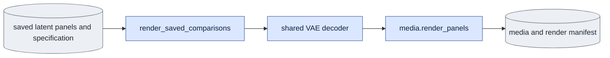
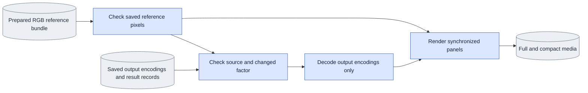

# `comparisons.py` — saved comparison rendering

## Objective

Validate saved encodings and prepared RGB references, decode through the shared
VAE owner, and publish synchronized comparison media. Open no transformer or
text encoder. Queue render dispatch calls this module.

## Data flow

## Organization logic

Resolve each saved path relative to the specification. Capture:/guide: paths
read checked continuous masters through corpus.dataset; saved outputs read
finite nonempty B,C,F,H,W tensors. Require exact requested coverage and fps,
recheck input bytes after reading, and retain file/shape identities.

Prepared references require recorded, decoded and guide RGB panels before
outputs. Verify the reference manifest, producer software, VAE, exact frame
mapping and decode seed/settings. Every output result must bind the same
source, membership, capture/guide bytes, objective, geometry and clean first
image. Use ordinary evaluate.validate_comparison for multiple output records.

Before decoding, reject an empty specification, malformed names, duplicate
output names, used destinations, missing inputs, invalid fps/coverage and
unreadable layouts. Bind the specification, actual decoder bytes and current
software identity. Recheck all bound files. Open the shared decoder only after
these checks. Optional legacy view QA calls reusable metrics; it creates no
second measurement implementation.

Render each matched case in full and 480-pixel viewing layouts with the shared
media renderer. Keep roles, pixels, synchronized frames and fps identical.
Publish video/poster identities and render manifest. Completion rereads current
specification, inputs, decoder/software identity, raw media hashes, full and
compact records and equal panel-pixel hashes without model execution.

Worked check: missing.pt in a panel fails before a decoder opens or an output
folder appears. A compact render with altered panel pixels fails completion
when its full counterpart has unchanged pixels.

## Invariants

Only saved results feed rendering. Input content, geometry, roles and timebase
must match. Keep original records and attribution unchanged. Both layouts use
the same pixels and shared renderer; no arbitrary code executes from a spec.

## Gotchas

A saved producer receipt can retain historical integrity while being noncurrent.
Current rendering binds current source owners. Latent metrics and presentation
pixels have different scopes.

## Tests

Retain saved comparison/reference corruption, CPU decoder, narrow rendering,
queue command and completion fixtures. New CLI help uses --render-saved-comparisons.

### Prepared RGB references in saved comparisons

A comparison may set `reference_bundle` to a checked `references.json` produced
by `media --prepare-training-references`. A panel then selects `reference_role`
(`recorded`, `decoded`, or `guide`) instead of `latent`. These are saved pixels:
recorded RGB in the capture crop, the VAE reconstruction of the recording, and
the recorded RGB motion guide. They do not pass through the decoder again.
This form is for D1. All three roles are required, in that order, before the generated output panels.
Use short presentation titles without changing their recorded roles.

Each generated panel in this form must name its saved `result` JSON and `latent`.
Preflight checks the result's output path/hash/shape, source, frame rate, encoded
coverage, capture-master hash, guide-render hash, membership identity, objective and D1 choice
against the reference producer. It checks the old result's software integrity,
not current completion: historical model output remains attributed to its own
producer. The new references and rendering use current decoding software.
For two or more generated outputs, `changed_factor` names the one supported
comparison difference and invokes `validate_comparison` before a decoder opens.
It also hashes each output's first encoded frame against its recorded `c0`.
The optional historical `view` metrics are unavailable in this form; they assume
all panels were decoded float RGB. Use a separate checked RGB metric owner when
needed, rather than mixing saved uint8 recording pixels with float output pixels.

References must cover exactly the requested RGB frame mapping `0..(span-1)*8`
at the requested rate, with the same VAE identity, decode seed and settings as
the new output decoding. Their pixel dimensions must equal the output encoding
dimensions multiplied by the selected VAE spatial factors. Reject missing
pixels, changed reference files, a different crop/source producer, malformed
values or a second changed factor before opening a session or creating output.
Bind the reference manifest, all pixel files and each result JSON in the input
inventory. Recheck those bytes before publication and in queued completion.
Full and compact media share the exact same saved reference pixels and newly
decoded output pixels. Ordinary latent-only specifications retain their schema
and behavior.

Worked E3 check: prepare 17 encoded frames for one source, giving 129 RGB frames
at 30 fps. Select recorded, decoded and guide references, followed by cached and
recomputed output results. Set `changed_factor="history_mode"` and fix schedule,
source, c0, noise and text. Both results must bind the same continuous capture
master and guide render as the references. A seven-frame reference bundle covers
only 49 RGB frames and must fail before decoding. This reference check does not
establish perceptual quality or layerwise K/V agreement.

### Request a readable comparison

Pass the question, changed factor, exact variant values, panel roles, and source time mapping to media.
[media's layout and text rules](media.md#visualization-layout) define the display.
Do not construct titles from run directory names or put all configuration fields into the video.

A training preview job also records its completed checkpoint step and fixed preview-input hashes.
Use the same checks as ordinary evaluation.
[media.md](media.md#training-previews) defines those previews.

Bidirectional evaluation has no capture past-frame input.
Causal evaluation labels capture-history and generated-history runs separately.
Product-like evaluation uses generated history.

Keep person/view, noise, text, frame dimensions, selected frame range, and playback rate fixed unless explicitly varied.
Show the correct capture reference and label original RGB versus VAE-decoded video.
Evaluation can use people excluded from training.

### Saved comparison narrow presentation

Before opening a decoder, use the shared metadata-only geometry owner to validate
both the requested full presentation and a compact presentation at width 480.
Reuse decoded RGB panels for both. Preserve original scientific specification,
input hashes, seed, exact labels, values, metrics and source coverage.
Publish `<name>_compact.mp4` and `<name>_compact_poster.png` with a separate
rendering record under `<name>_compact/`. A new schema-three manifest binds both
presentations; completion requires both. Validate compact layout, scaled font,
canvas dimensions, synchronized source times, exact roles/labels and equal panel
pixel hashes between formats, as well as media bytes and safe paths. Historical
schema-two media remain evidence, never overwritten or relabeled as narrow
acceptance. Report readers must expose the saved compact format.

The saved-only stage-2 report reader exposes a full and a compact video entry for
schema-three results. Require compact media, hashes, equal panel identities and
frame mappings, and recorded readable geometry before any report write. Legacy
results stay attributed as legacy; an absent compact asset never starts a decoder.

After ordinary data preflight and before native handles, text encoding or output writes, recheck every requested adapter. Repeat immediately before each adapter model context: call public `checkpoints.recheck_adapter` with its preflight contract and file SHA-256. Pass the bound digest to the model loader; changed bytes fail before weight loading.

`render_saved_comparisons` is the package owner for saved comparison rendering.
[G10](known_gaps.md#g10--saved-comparisons-have-unreadable-titles-at-narrow-widths)
is verified: saved output includes measured compact media for 480-pixel reading
as well as the requested full presentation. Both reuse the same decoded pixels.
Completion requires both formats; report readers never generate missing output.
Every nonempty panel must carry a lowercase 64-character SHA-256 pixel digest.
Check its type and syntax before comparing full and compact records. Two absent
digests do not prove equal decoded pixels. For example, removing the digest from
both copies of the capture panel must fail completion, even when media hashes
and labels still match. Historical artifacts remain unchanged.

It reads a JSON specification of saved latent paths, opens a decoder-only
session, decodes every panel with one seed, calls the shared media layout and
publishes a rendering manifest. Saved `capture:` and `guide:` references read
the checked continuous master and use exactly the requested `span` (default 17).
All panels must have the same encoded geometry; do not silently shorten them.
Bundle fps must match playback fps. Validate files, tensor contents and names
before opening a session or creating output. Record each input file hash.
`parse_saved_comparison_args` serves both direct CLI and queue preparation.
Schema-three manifests bind the full spec hash, decode seed, model/variant, current VAE
path/hash and native decode settings, plus comparisons/media source hashes.
Recheck spec/input bytes and VAE/software identity before publishing the manifest.
A change leaves unaccepted partial outputs instead of a completion manifest.
Raw saved panels must contain the
declared encoded frame count; a shorter tensor cannot silently redefine coverage.
`verify_saved_comparison_completion` reads those same identities without opening
a model session. Require exact requested comparison fields and input inventories,
the decoded frame count, synchronized source frames/fps, requested titles and
layout, safe named media paths, and matching media hashes. The queue consumes
this verifier. Historical manifests remain report evidence but cannot prove a
new queued completion. File names or zero child exit alone are insufficient.
The `comparison` layout preserves panel order with at most three columns and
aspect-preserving padding. Keep the historical poster at frame 96 by default.
Specs with `view` produce the historical `results` fields consumed by reports:
frames, named video/poster, and panel PSNR/subject PSNR/LPIPS against panel zero.
Metrics exclude RGB frame zero. LPIPS is loaded once and uses the shared checked
metric owner. Preserve captions in the manifest; do not relabel old artifacts.
Report code may read that manifest; it does not
open a model session or recover missing outputs. An empty specification fails
before model loading.

The saved `source_code_sha256` field keeps its historical `evaluate` key for
format compatibility. Its value hashes the current comparison producer
(`comparisons.py`); the software manifest names that owner explicitly. Never
restamp a historical record.
