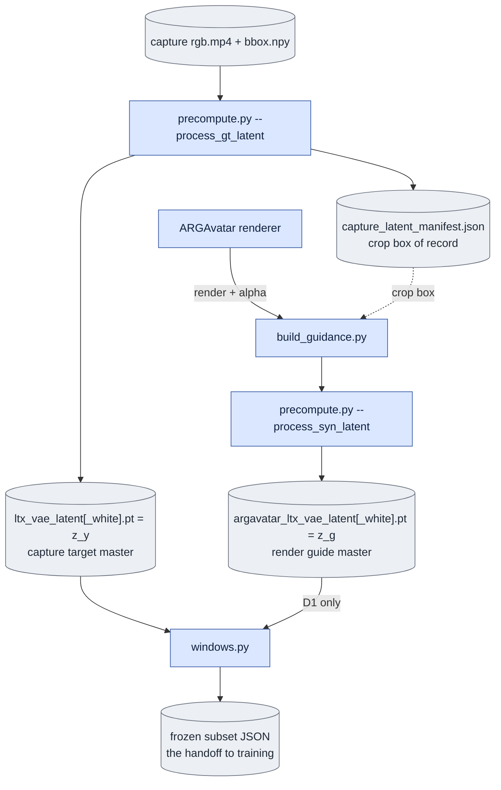
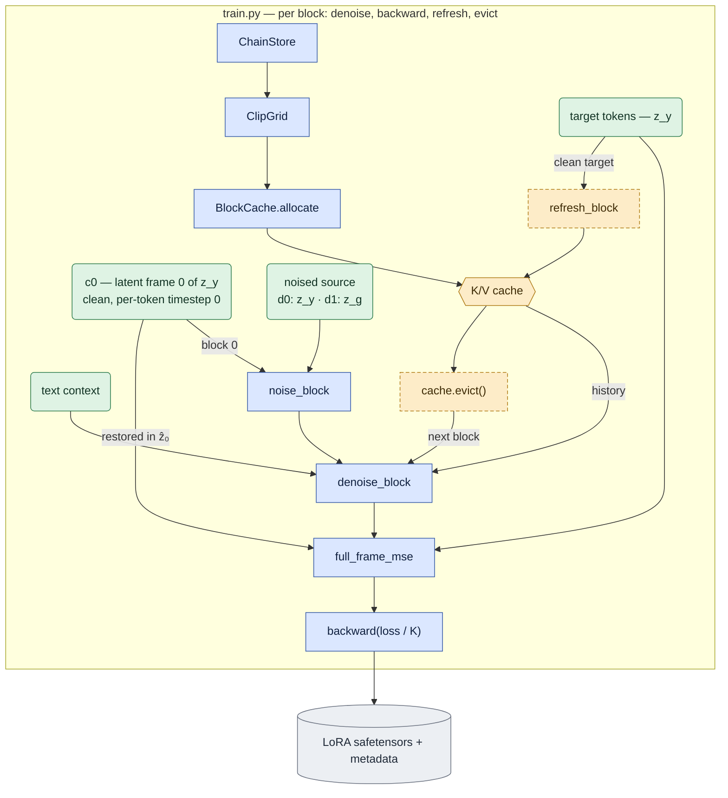
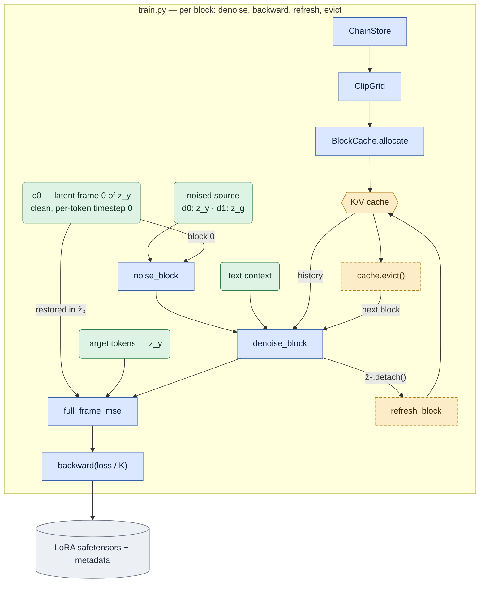
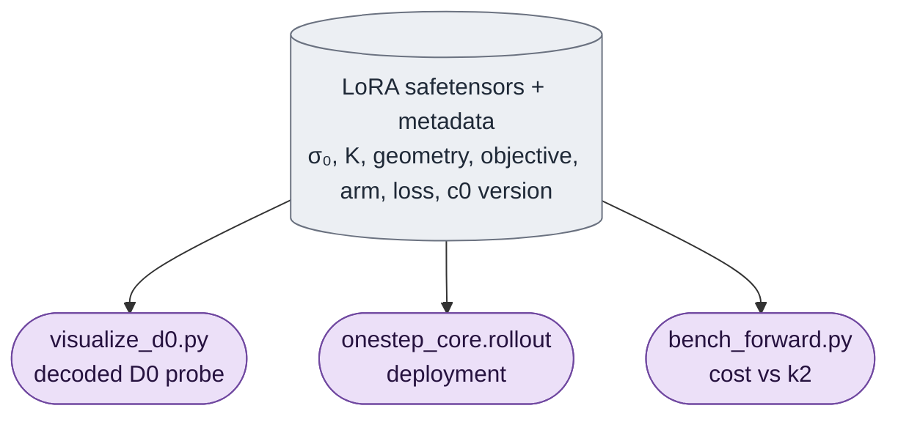

# The core algorithm — conditioning, noising, cache, loss

The cross-module contract the per-file docs hang off. Read this before changing anything that
touches conditioning, noising, the K/V cache, the loss, or a probe/deployment entry point.

Three labels are used throughout and never mixed:

| Label | Meaning |
|---|---|
| **Required** | the approved product contract this package is being built to. Binding, whether or not the code does it yet. |
| **Current** | what the code in this tree actually does today. |
| **Proposed** | a design that is neither approved nor implemented. Never a default, never a recipe. |

Where Required and Current disagree, the disagreement is a defect and lives in
[`known_gaps.md`](known_gaps.md) with its evidence.

---

## 1. Symbols

| Symbol | What it is | Where it comes from |
|---|---|---|
| `z_y` | **capture target** master latent, `[C, F, H, W]`, one continuous VAE encode of the cropped capture video for one objective | `precompute.py --process_gt_latent` → `ltx_vae_latent[_white].pt` |
| `z_g` | **render guide** master latent, same shape/grid as `z_y`, one continuous encode of the composited ARGAvatar render | `build_guidance.py` → `precompute.py --process_syn_latent` → `argavatar_ltx_vae_latent[_white].pt` |
| `c0` | the **supplied-image condition**: the objective-consistent clean latent of the product's given real first frame — latent frame 0 of `z_y` in training, an encode of the supplied image at deployment | implemented as `clean_c0_v1` |
| `ẑ₀` | the model's **prediction** for a block, `x₀`-parameterised (`to_denoised` of the emitted velocity) | `causal_core.denoise_block` |
| `x_σ` | the **noisy block input**, `(1 − σ)·source + σ·ε` per generation token | `causal_core.noise_block` |
| *refresh input* | the **clean tokens written into the cache** after a block is denoised: `ẑ₀.detach()` (self forcing) or the clean target (teacher forcing) | `causal_core.refresh_block` |
| `σ` | the per-batch noise level, fixed at `--sigma0` (default `0.725`) or rotated by `--sigma-levels` | `train.training_sigmas`, `onestep_core.one_step_sigma` |
| *token timestep* | the per-token timestep `denoise_mask · σ` handed to AdaLN | `causal_core.block_modality` |
| *block index* | position in `CausalGeometry.plan(...)`, `0 … len(plan)-1` | `causal_core.CausalGeometry.plan` |
| *latent frame index* | global index into the clip's master latent, `0 … F-1` | the master latent itself |

**Do not write `z0` for two different things.** `c0` is the supplied first frame; `ẑ₀` is a
denoised prediction. The old prose used `z0` for both, which is exactly how a conditioning
contract gets read as a loss detail.

### Representations

* **Latent master** — `[C, F, H, W]`, `C = 128`, 32× spatial and 8× temporal compression. Latent
  frame 0 encodes **one** pixel frame; every later latent frame encodes 8. `F` latent frames
  cover `(F − 1)·8 + 1` pixel frames (`causal_core.pixel_frames_for`).
* **Patchified tokens** — `ClipGrid.patchify` turns `[1, C, F, H, W]` into `[1, T, C]` with
  `T = F · tokens_per_latent_frame`. At the corpus's 1024² crop that is `32×32 = 1024` tokens per
  latent frame. Token ranges and latent-frame ranges convert through `ClipGrid.token_span`.
* **Global RoPE positions** — `ClipGrid.build` builds the tools **once over the whole clip**, so
  every block's positions are the clip's own and cached keys keep the positions they were written
  with. The temporal axis is in *seconds* against `positional_embedding_max_pos[0] = 20`;
  `ClipGrid.build` raises past `MAX_ROPE_SECONDS` rather than extrapolating.
* **The special first latent frame** — `keyframes_mask` is non-zero only on latent frame 0. It is
  a *geometry* mark (the causal VAE's single-pixel keyframe), **not** an instruction to hold an
  input image clean. `denoise_mask` is all ones, so frame 0's token timestep is `σ` like every
  other token's.

---

## 2. The block layout

`CausalGeometry.plan(F)` with the default `block_latent_frames = 2`:

| Block | Latent span | Pixel frames covered |
|---|---|---|
| 0 | `[0, 3)` | 17 (`frame 0` + 2 × 8) |
| 1 | `[3, 5)` | 16 |
| 2 | `[5, 7)` | 16 |
| … | `[1+2k, 3+2k)` | 16 |

Block 0 absorbs the keyframe and is therefore **one latent frame longer** than every later block.
A short tail block is dropped, not padded. **"Block size 2" does not mean block 0 holds two
frames** — it holds three.

Eviction keeps the pinned sink (latent frame 0, `SINK_LATENT_FRAMES = 1`) plus the last
`--context-latent-frames` finalized latent frames. The cache depth is configurable and the
default is a **retained history of 16 latent frames**: `sink_latent_frames = 1` plus
`CONTEXT_LATENT_FRAMES = 15`, so the cache holds `c0` plus clean frames 1–15 and evicts nothing
until a rollout has finalized past frame 15. Block 2 therefore sees `c0` + clean frames 1–4.
The flag counts *context* frames; the 16 is the whole retained history — ~0.8 GB per frame per
rank at the 22B geometry, so ~13 GB of K/V.

---

## 3. The conditioning contract

Implemented as `clean_c0_v1` (checkpoint metadata key
`onestep_avatar_first_frame_conditioning`); [G1](known_gaps.md#g1--the-supplied-first-frame-is-not-a-model-condition)
is verified.

1. **Every generated block, including block 0, has `c0` available as clean initial
   conditioning.** This is independent of D0/D1 and of teacher/self forcing.
2. `c0` is **objective-consistent**: training takes latent frame 0 of the same objective's
   `z_y`; deployment encodes the supplied real image under the same crop, normalization, VAE and
   objective convention. For `white`, that is the white-objective first frame — never an
   unmatted `bg` latent and never a guide frame.
3. In block 0, `c0` enters as **clean input tokens with per-token timestep zero**. The block's
   generated tokens are noised by the selected arm's rule. Frame 0's content is preserved in the
   block output and in whatever is written to the cache.
4. **Every later block retains access to that same `c0`** through the pinned cache history —
   including when `--context-latent-frames 0` or when eviction has discarded everything else.
   Teacher forcing may *add* clean completed targets as history; self forcing adds detached
   predictions. **Neither replaces `c0`.**
5. **A chain starting mid-clip uses the same `c0` semantics.** Priming a mid-clip chain with
   additional ground-truth history is a separate train/deploy difference and must be disclosed
   wherever it applies, not folded into the initial-condition contract.
6. **None of these satisfy the contract on their own**: a zero timestep with noised content; an
   output-only clamp after denoising; the `keyframes_mask` marker; pinning a *generated* frame 0
   in the cache.
7. Any future implementation must retain global RoPE positions, block causality, no
   future-target leakage, and no duplicate frame-0 cache entries. A new cache representation is
   a **Proposed** design until approved — this document does not prescribe one.

How it is realised: `train.train_chain` takes `c0` from latent frame 0 of the objective-consistent
`z_y` master; `causal_core.with_clean_prefix` replaces block 0's leading tokens after noising and
`block_modality(clean_prefix_tokens=…)` zeroes their per-token timestep; the same helper restores
`c0` in `ẑ₀`, so both the loss input and the refresh carry it. `causal_core.rollout` *requires*
`first_frame_condition` and `onestep_core.rollout` *requires* `first_frame_latent`, so deployment
cannot silently fall back to the guide's frame 0.

---

## 4. The per-block algorithm

```text
denoise:  queries = block i's noisy tokens, keys = [cache | block i]   read-only, grad-carrying
loss:     full-frame latent MSE against z_y over block i's tokens
backward: immediately, so peak activation memory is ONE block
refresh:  queries = block i's CLEAN tokens at timestep 0, no_grad      the only cache writer
evict:    keep the pinned frame-0 sink and the last `context` latent frames (default 15)
```

Pseudocode, as `train.train_chain` and `causal_core.rollout` both run it:

```python
grid  = ClipGrid.build(F, H_px, W_px, fps, geometry)   # once per clip: global positions
plan  = geometry.plan(F)                               # [(0,3), (3,5), (5,7), ...]
guide = grid.patchify(z_y if arm == "d0" else z_g)     # the SOURCE that gets noised
target= grid.patchify(z_y)                             # the loss target, always z_y

prime_cache(target, upto=plan[first_block][0])         # ALWAYS called; see §6
for i in selected_blocks:
    lo, hi = grid.token_span(*plan[i])
    x_sigma = (1 - sigma) * guide[:, lo:hi] + sigma * eps(seed + i)   # noise_block
    z0_hat  = denoise_block(x_sigma, cache)                           # reads cache, writes none
    mse     = ((z0_hat - target[:, lo:hi]) ** 2).mean()               # every token, every channel
    backward(mse / K)
    clean   = target[:, lo:hi] if teacher_forcing else z0_hat.detach()
    refresh_block(clean, cache)                                       # no_grad, writes K/V
    cache.evict()
optimizer.step()
```

Points that are easy to get wrong:

* **`denoise` is read-only** because it is the only pass that stores activations; a cache write
  there would be replayed by gradient checkpointing.
* **`refresh` is a second forward and is not optional.** The K/V a later block wants belong to the
  *denoised* content, which the denoising pass never saw. Its cost is counted in every compute
  number this package reports.
* **`detach`/`no_grad` boundaries**: `refresh` runs under `no_grad`; the self-forced refresh input
  is `ẑ₀.detach()`, so no gradient crosses a block boundary. That is what keeps peak memory at one
  block regardless of `K`.
* **The loss is unweighted full-frame latent MSE**, block-averaged by `backward(loss / K)`. No
  silhouette, alpha, or disagreement weighting; `train.py` reads no mask artifact.
* **No VAE decode inside training.** Decoding happens only in `visualize_d0.py`.
* A correctly preserved `c0` contributes **zero** regression error for
  its tokens. That is a consequence of conditioning, not a silhouette loss mask.

### Noising applies to generation tokens only

`(1 − σ)·source + σ·ε` is the rule for a block's **generation** tokens. The `c0` tokens are a
clean override at timestep zero and are not part of that expression.

---

## 5. Worked example — blocks 0, 1, 2

`block_latent_frames = 2`, `context_latent_frames = 15` (the default retained history of 16),
chain starting at the clip start. Spans `[0,3)`, `[3,5)`, `[5,7)`. Nothing is evicted this early
— the "retained" rows below are the whole history, and at a shallower depth (e.g.
`--context-latent-frames 2`) block 2 would instead keep only `c0` + 3, 4.

### D0 teacher forcing

| | Block 0 | Block 1 | Block 2 |
|---|---|---|---|
| Input source | `c0` clean at frame 0 **+** noised `z_y[1:3]` | noised `z_y[3:5]` | noised `z_y[5:7]` |
| Clean initial condition | `c0`, in-block | `c0`, via the pinned cache | `c0`, via the pinned cache |
| Noisy/generated frames | 1, 2 | 3, 4 | 5, 6 |
| Cache before denoise | empty; `c0` is an in-block clean condition | `c0` + clean GT 1–2 | `c0` + clean GT 1–4 |
| Per-token timesteps | `0` on frame 0, `σ` on 1–2 | `σ` | `σ` |
| Refresh source | `c0` preserved + `z_y[1:3]` | `z_y[3:5]` | `z_y[5:7]` |
| Retained after evict | `c0` (sink) + 1, 2 | `c0` (sink) + 1–4 | `c0` (sink) + 1–6 |
| Output content | `c0` preserved at frame 0, `ẑ₀[1:3]` | `ẑ₀[3:5]` | `ẑ₀[5:7]` |

### D0/D1 self forcing

Identical to the row above except:

* the noised source is `z_g` for D1 (`z_y` for D0), while the target stays `z_y`;
* the refresh input is `ẑ₀.detach()` — the block's own **timestep-zero generated content**, not
  ground truth — so the cache after block 1 holds `c0` plus *predicted* frames 1–4;
* `c0` is still clean, still pinned, still never replaced.

### Summary of the two cases

| Case | Block 0 | Block 1 |
|---|---|---|
| D0 teacher forcing | sees clean `c0` immediately; only generation tokens are noised | keeps `c0` and the completed GT history (up to 15 frames) |
| D0/D1 self forcing | sees the same clean `c0` immediately | keeps `c0`; other history comes from predictions |

### "Clean" in the cache means timestep-zero, not ground truth

A self-forced refresh writes the model's **generated** content at timestep zero. "Clean" is a
statement about the noise level of the tokens, not about their provenance.

This has a visible consequence under teacher forcing: the decoded video concatenates `ẑ₀` per
block, while the cache was refreshed from `z_y`. If block 0's prediction drifts from the capture,
the video's generated frames disagree with the history that conditioned block 1 — and the VAE
spreads that transition around the block boundary. That is teacher forcing working as specified,
not a decoding bug. `c0` itself is preserved on both sides, so frame 0 never participates in it.

---

## 6. Train / probe / deploy

| | Training (`train.train_chain`) | Probe (`visualize_d0.py`) | Deployment (`onestep_core.rollout`) |
|---|---|---|---|
| Input available | `z_y` always; `z_g` for D1 | `z_y` and `z_g` from the subset | guide master + a required `first_frame_latent` |
| Supplied first frame | capture `z_y` latent frame 0, clean at timestep 0 | capture `z_y` latent frame 0 | explicit `first_frame_latent`, clean at timestep 0 |
| Priming | `prime_cache` from clean `z_y`, **always called** | none — the rollout starts at block 0 | none — always clip start |
| Source selection | `--guide-mode d0` → `z_y`; `d1` → `z_g` | D0 arm only; a D1 probe is owed (G3) | D1 only; `guide_conditionings` refuses `d0` |
| Forcing policy | `--teacher-forcing` refreshes from `z_y`; else `ẑ₀.detach()` | `--teacher-forcing` flag, refreshes from `guide_tokens` (G2) | self forcing only |
| Output selection | none — loss only, nothing decoded | the whole clip's rolled-out tokens, decoded once per σ (`--span chain` limits it to the chain's `K` blocks) | the whole covered span, unpatchified |
| Forward count | `1 + 2K` (one priming + denoise + refresh per block) | `2·len(plan)` per σ, ×3 σ levels | `2·len(plan)` |
| Checkpoint-condition checks | metadata **written** at save | not validated on load (G3) | σ₀ on-grid check only (G3) |

**Shared primitives do not by themselves prove parity.** `train_chain` and `causal_core.rollout`
are different callers of the same four functions, and they currently differ in what teacher
forcing refreshes from: training uses `z_y` (the target), the generic rollout uses `guide_tokens`
(the noised source). Those coincide for D0 only — see
[G2](known_gaps.md#g2--generic-teacher-forced-rollout-refreshes-from-the-guide-not-the-target).

**FSDP lockstep is a requirement on any change.** Every
rank must issue the same number of transformer forwards per step; `prime_cache`'s empty-prefix
branch forwards one discarded latent frame with no cache attached for exactly this reason, and
`assert_rank_lockstep` counts on that call being unconditional. A conditioning forward that only
some chains need must still be issued by all of them.

---

## 7. End-to-end data flow

Both figures use one vocabulary, so a node's shape and colour say what kind of thing it is
before you read its label:

| Shape / colour | Kind |
|---|---|
| **rectangle**, blue | a module or step that runs — code |
| **cylinder**, grey | an artifact on disk, with exactly one producer |
| **rounded**, green | an in-memory tensor or derived input |
| **hexagon**, amber | the K/V cache — the one piece of mutable state |
| **dashed border** | runs under `no_grad` / writes no gradient |
| **stadium**, purple | a terminal consumer |

### 7a. Preparation — corpus to frozen subset

Offline, once per corpus. Every artifact below has exactly one producer; readers raise rather
than recompute. Objective (`bg` / `white`) selects which filenames are read, never a second
code path. `build_guidance.py` runs in the **`argavatar`** env and composites at
`GUIDE_COMPOSITING_VERSION` 2; everything else runs in **`ltx`**. `windows.py` emits chains of
`K` blocks with an actor-disjoint split and a sha256 content pin.



### 7b. Training loop — teacher forcing

`--teacher-forcing`. Inputs come from 7a: the frozen subset picks the chains, `ChainStore`
reads the `z_y` master (and `z_g` for D1). The cache is refreshed from the **ground-truth
target** for the completed block, so a block's history is what the capture actually did, never what the model predicted.
`c0` is unaffected: it is the clean condition in either regime.



### 7c. Training loop — self forcing

The default, and the deployment regime. Same inputs as 7b. The cache is refreshed from the
block's own **timestep-zero prediction**,
`ẑ₀.detach()`, so no gradient crosses a block boundary and the model conditions on its own
output — the deployment regime. Everything else is identical to 7b, including `c0`.



Only the one edge into `refresh_block` differs between the two. That edge is the whole
train/deploy story, which is why it gets a figure rather than a label:
[G2](known_gaps.md#g2--generic-teacher-forced-rollout-refreshes-from-the-guide-not-the-target)
is exactly this edge being wired to the *guide* instead of the target in
`causal_core.rollout`, where D1 makes the two differ.

### 7d. What a run produces



None of the three reads the metadata back
([G3](known_gaps.md#g3--checkpoint-and-artifact-conditions-are-recorded-but-not-enforced)), and
`visualize_d0.py` is D0-only ([G4](known_gaps.md#g4--no-d1-probe)).

1. **Corpus → masters.** `precompute.py --process_gt_latent` owns the crop box and `z_y`;
   `build_guidance.py` owns the render and its alpha; `precompute.py --process_syn_latent` owns
   `z_g` and the cropped capture mask. `windows.py` owns the frozen subset. Each artifact has
   exactly one producer, and readers raise rather than recompute. Objective (`bg` / `white`)
   selects which filenames are read, never a second code path.
2. **Masters → block inputs.** Capture master frame 0 supplies `c0`;
   the arm selects the noised source (`z_y` for D0, `z_g` for D1); the text context is the single
   constant refine prompt, built with `scripts.prune.data.prompt_cache.get_or_build` by training
   and deployment alike.
3. **Block inputs → gradient.** Grid positions + initial condition + cache history + the current
   noisy block → `denoise_block` → `ẑ₀` → full-frame latent MSE against `z_y` → backward →
   no-grad `refresh_block` → `evict`.
4. **Prediction → pixels and records.** Only the probe and deployment decode. The run's
   `config.json` and the checkpoint metadata record σ₀/σ levels, `K`, block and cache geometry,
   objective, guide mode, teacher forcing, LoRA rank/alpha/target, subset hash and
   `loss=full_frame_x0_mse`.

**What loaders actually validate**: `dataset.load_master` checks schema 2 and the `master` key;
training additionally preflights shapes, FPS, frame counts and D1 guide presence for every source
before `Accelerator()`. `onestep_core.rollout` validates that σ₀ is on the model's grid and that
the schedule is one step. **Unenforced**: adapter metadata on load (probe and deployment both),
LoRA `alpha/rank` scaling at fusion, bundle encode-contract/objective/crop provenance at read
time, and full subset identity (the stamped hash covers `subset['sources']` only). See
[G3](known_gaps.md#g3--checkpoint-and-artifact-conditions-are-recorded-but-not-enforced).

---

## Related

* [`experiments.md`](experiments.md) — D0/D1, bg/white, teacher/self, and what each configures.
* [`known_gaps.md`](known_gaps.md) — the contract violations, with acceptance criteria.
* [`causal_core.md`](causal_core.md) · [`train.md`](train.md) · [`onestep_core.md`](onestep_core.md)
  — the per-module detail behind each step above.
* [`../configs/README.md`](../configs/README.md) — the runnable recipes.
