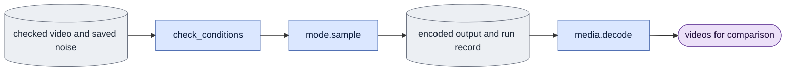

# `evaluate.py` — compare generated videos

Status: **Implemented ordinary evaluation; full native acceptance remains incomplete.** Explicit modes, strict preflight,
saved-noise sampling, guidance, raw saves, queued verification and automatic
rendering from pinned references exist. `media` prepares reference RGB and
`prepare_inputs` assembles complete fixed records. Read
[current acceptance](known_gaps.md#current-acceptance-and-next-step) for scope.
Old visualizers remain temporary callers until their required behavior moves.

Causal preflight includes explicit `history_mode` and `kv_source` in the
requested adapter conditions. The shared checker compares them with the recorded
cache refresh calculation before any model/text session. The ordinary matching
request is cache/refresh. Changed supported choices require the existing
`--research-override`, whose differences are saved with the output. Base-only
diagnostics record these same choices without an adapter-calibration override.
Saved comparison checks allow the condition field to vary only when that same
history or K/V field is the declared changed factor.

Ordinary CLI evaluation defaults to `--adapter-application peft_unmerged_fp32`.
It uses `model.adapters.inference_transformer`, sharing training configuration
and saved tensor loading. The returned model emits native x0 through the stock
wrapper; all guidance passes keep that same function. Explicit
`--adapter-application fused_bf16` changes the adapter computation and requires
the existing research override. Bind the selected method in preflight conditions
and the output record. Base-only execution still uses the native Session path.
Historical fusion diagnostics keep their explicit method and original tolerance.
Historical sigma-sweep measurements currently remain in this mixed owner.
The package sweep owner uses them; its old expr analyzer/launchers are retired.
The current handoff moves fixed-study orchestration and score inventory to
`experiments/` during the structural refactor, with CPU/caller/profile checks
before new native experiments on the final layout. General transition
measurements keep one shared owner. Original scientific results retain their
producer identities; structural checks do not close missing native scope.

Ordinary execution requests `global_sigma_dtype` from `model.common`'s float32
contract. Adapter preflight rejects unknown historical precision before weights
load; research may explicitly acknowledge a known differing calibration, while
product refuses it. Saved conditions preserve the requested precision.

## Objective

Ordinary evaluation snapshots `software.capture("evaluation", mode)` before
preflight, checks it again before native sessions, and stores that manifest in
every result. Recheck all recorded owners/runtime versions before publication.
Queued scientific completion compares the same current profile. Saved historical
records remain readable through integrity-only software validation, but cannot
prove completion under a changed producer. Decoder publication binding is a
separate profile and remains required for saved/preview rendering.

`--fusion-parity --run <RUN> --view <VIEW> --output <JSON> --gpu-id <GPU>`
owns the historical D1 block-zero fusion diagnostic. The optional `--step`
defaults to 1. Use LTX-2.5 dev, white masters, sigma 0.421875 and noise seed 42.
Check config (including alpha equal to rank for fused loading), adapter/master paths, paired geometry/fps and a fresh output before
opening a session. Run three fused x0 cases (bare, step zero, trained step),
then two unmerged velocity cases (step zero and trained step) on the same inputs.
Each case allocates an empty cache and executes exactly one denoise, with clean
capture c0 and guide noise. No decoder is opened. Release fused models before
loading PEFT. Compare adapter effects separately from raw output differences.
Preserve historical result fields and the historical effect tolerance 0.2;
this tolerance is not the tighter G8 acceptance criterion. Zero denominators
produce null ratios with an explicit undefined status, never NaN or a false pass.
Atomically publish results with input hashes only after all five cases complete.
The expr executor is removed after controlled orchestration tests and a real
small-transformer check against the original grid/noise path; real-weight
acceptance remains separate. Empty or nonfinite output tensors fail before
ratio calculation and publication.

Compare the base model and named adapters with one fixed input set.
Select bidirectional or causal mode explicitly.
Save encoded outputs and actual run records before optional video rendering.
D0/D1 selects capture or guide input, not the execution mode.
Evaluation, model probes, reusable metrics, and preview execution stay in this LTX-2 package.
Report scripts in `expr/` consume saved results. They do not launch evaluation or model work.

## Data flow

`mode.sample` is the selected mode's video generation function.

Queued evaluation jobs must select their source membership explicitly with
`--frame-plan <path>` and `--split {train,held_out,validation,test}`. The
frame plan's membership hash and mode are checked before any source is opened;
the split filters the saved source inventory, so a validation job cannot
silently evaluate training frames. Package-owned queue records include both
arguments and the converted subset/frame-plan files. Validate nonempty source
selection and membership IDs before indexing split records; unknown IDs and
empty splits raise a pointed error before base hashing or any model session.
Historical `eval_ckpt.sh`
and `eval_queue.py` records are input evidence only and are not execution
owners.

## Organization logic

### Causal physical output coverage

**Implemented and CPU checked; fresh native preview execution passes.** A native
causal fixed preview failed before transformer loading. Its original E4 adapter records
`mode_settings.span_latent_frames=null` and `shape.frame_counts=[6,7]`.
The preview's `--span-latent-frames 7` changed the requested mode setting to 7.
The strict checker correctly rejected that changed training-selection setting.
E2 and product already distinguish the physical seven-frame input from the
recorded null setting. Ordinary evaluation must expose that same distinction.

Use causal-only `--output-latent-frames <N>` for the physical prefix to generate.
Keep `--span-latent-frames` as the recorded training-selection setting. Never
copy the new option into `CausalSettings`, alter an adapter, or add a research
override. The ordered decisions are:

1. Parse a positive integer. Refuse this option in bidirectional mode. If both
   length options are explicit, require equal values before any data/model work.
2. Select physical frames from the new option when present. Otherwise keep
   current behavior: use the recorded span when given, or the complete master.
3. Check that this prefix fits every selected capture and guide master. For an
   explicit physical count, require complete causal blocks with that exact last
   frame. Refuse a request such as 8 that would produce only 7. Omitted options
   retain the current incomplete-tail trimming behavior.
4. Build requested conditions with the unchanged `CausalSettings` and the actual
   physical frame count. Call the existing strict `check_adapter` for every
   adapter. Channels, image grid, sigma, noise, background, history, precision
   and application method retain their existing gates.
5. Derive saved-noise token shape from that physical prefix. Generation, fixed
   preview preparation and saved completion all use `prepare_evaluation`; they
   must derive the same inputs and count. Bind the new explicit option through
   the existing command/job/fixed-input record, not a new provenance owner.

Worked check: an 18-frame continuous master and the original E4 null-span
adapter receive `--output-latent-frames 7`. The request has
`shape.frames=7`, `mode_settings.span_latent_frames=null`, saved-noise shape
`[1,7*H*W,C]`, and strict acceptance without overrides. With B2/K3/D8, the
sampler reads `[0,3)`, `[3,5)`, `[5,7)` and produces 49 RGB frames. A separate
pilot adapter trained with span 7 requires its own `--span-latent-frames 7`;
adding equal output 7 is permitted. Null-span and span-seven requests cannot
replace each other's recorded settings. Output 6, changed image dimensions,
changed history, missing guide or wrong noise fails before model loading.

The public `prepare_inputs.preview_arguments` producer preserves the parsed
causal training span and emits the actual physical count using the new option.
It removes both length spellings, including equals forms, before appending each
canonical option once. Bidirectional preparation keeps its explicit selected
span. This covers the existing `prepare_inputs -> enqueue_preview -> evaluate`
path; changing only the evaluator would still publish a span-seven request for
the original null-span adapter.

Current failed preview evidence remains intact. Fresh prepared records and
causal preview output use the new option; media inspection remains a separate
gate. Keep
the original E4 job, launch, visits and adapter evidence unchanged. E2 and other
evaluation-profile receipts must retain old attribution and be rechecked against
their current producer; do not restamp them. Focused tests use actual checked D1
masters and real adapter contracts/matrices. A small-transformer roundtrip also
checks physical output count, null mode setting, c0, calls and saved completion.

### Queued scientific completion

Required/current implementation in this continuation: queue completion derives
the expected evaluation again with `prepare_evaluation(..., require_fresh_output=False)`.
This path reads saved data and weights for identity checks. It opens no transformer,
text encoder, decoder, GPU session or prompt-cache producer. Normal generation
still requires a fresh output directory.

Derive the exact source order and base/adapter order from the CLI and fixed video
list. Require one result at every expected case/variant path, with no duplicates,
omissions or extras. Future-noise diagnostics require both original and changed
results. Compare mode settings, source, frame rate, effective frame coverage,
schedule, seed, background/arm/model conditions, membership and source hashes,
adapter bytes/contract/application/overrides, prompt and guidance settings.
Check the evaluator source digest. A mode-only historical result is insufficient.

Generation saves the actual positive text tensor once at `text.pt` and, for CFG,
the actual negative tensor at `negative_text.pt`. Completion requires finite bf16
text and matches its tensor digest against every result. It does not regenerate
missing text. Compare saved per-case noise with the output record, and with the
explicit noise input when supplied. For generated noise, verify the saved noise
digest and declared seed; this CPU check does not independently reproduce CUDA
random draws. Verify capture, guide and clean `c0` tensor digests from current
masters. Require the exact generated tensor shape and unchanged first frame.

Example: a causal result from seed 42 cannot complete a seed-43 job. A result at
`case_0000/variant_000/original/result.json` cannot stand in for the changed-noise
result. A different adapter at the same path changes its content digest and fails.
Missing output remains pending; contradictory evidence raises an error. Existing
records and media are not rewritten to add these fields.

For a future-noise job, require the saved diagnostic's boundary and two embedded
result records to match the request and published branch records. Recompute its
earlier/later deltas and bit-equality from the saved tensors. Completion receipts
pin every result, generated tensor, positive/negative text tensor, per-case noise
tensor and required diagnostic file. Re-serialization after completion changes
the receipt even if tensor values are unchanged.

Tests use small checked masters and controlled backbone files. They vary one
scientific setting or saved artifact at a time. Legacy queue lifecycle unit tests
explicitly substitute this scientific verifier only; their claims, journaling,
tensor hashes and receipt checks retain production logic. Separate scientific
tests exercise the verifier itself. Neither class proves native model quality.
Include a valid paired-guide D1 case and reject guide/sidecar changes after
generation. The paired guide retains the capture crop and encoding record;
the clean first frame still comes from capture.

Saved comparisons open `media.open_decoder_session` after input validation.
This uses the shared device preflight and a null text context. It does not
prepare prompt embeddings or open a transformer. The general session factory
is retained for model diagnostics that need text, not saved-only rendering.

### Historical saved-encoding metrics

`saved_latent_metrics(output, capture, guide, long=False)` preserves the study's
generated-frame metrics separately from training's full-frame loss. Inputs are
finite equal C,F,H,W tensors, with complete two-frame blocks and H/W at least
two. Short mode uses exactly 17 encoded frames; long mode uses the actual odd
frame count. Convert to fp32, exclude c0 from capture/guide MSE and spatial
detail, and retain c0 only for exact-equality reporting. Blocks are [1,3),
[3,5), and so on. Motion averages absolute changes between generated frames.
Detail is mean absolute vertical difference plus mean absolute horizontal
difference. A seam is the squared transition into frames 3,5,...; compare its
mean with transitions inside blocks. A zero denominator fails rather than
publishing an undefined score. These metrics measure change/structure, not
whether identity or action is correct. Long mode reports per-block capture and
guide MSE/detail ratio. For output equal capture, nondegenerate data gives zero
MSE, exact c0 and motion/detail ratios one.

`evaluate --saved-metrics <probe-directory> ... [--long-metrics]` reads existing
historical manifests/encodings only. Check each output encoding's recorded file
SHA before loading; use the public master loader for capture/guide. Deduplicate
view/seed as the original reader did. Preserve row names and summary format for
report consumers, then publish `metrics.json` or `metrics_long.json` atomically.
This route loads no text encoder, transformer or VAE and starts no job. It is
the owner of reusable historical calculations; report code reads the saved
measurements. Missing/corrupt evidence fails instead of reconstruction.

`execute_evaluation(args, sample_runner=None)` uses ordinary `sample_case` by
default. The package benchmark can supply a callable with the same inputs and
output pair to measure that exact path. Preflight/session/guidance and raw saves
remain evaluation-owned. Future-noise probes reject a supplied runner because
their two-output contract differs. No executable study code is loaded.

### Saved future-noise probe CLI

Ordinary evaluation accepts `--changed-noise-file <tokens.pt>` with
`--future-noise-start <encoded-frame>`. Both require `--noise-file` and one
selected video. Before any model session, require finite native-bf16 tensors
of the complete selected token shape. Earlier tokens must be identical and
later tokens must differ. In causal mode the boundary must end a complete
nonfinal block. For block length two and 17 encoded frames, boundary nine
keeps blocks zero through three fixed and changes blocks four through seven.
Use the same checked model/input/text/schedule settings for both calls to
`probe_future_noise`. Save both encodings and ordinary result records under
each adapter variant, then publish `future_noise.json` with their identities,
earlier equality/max delta and later max delta. Save the changed noise beside
the original. No report executor or private visualizer is involved. This CLI
uses supplied noise bytes; it does not infer historical block seed rules.
`save_future_noise_probe` publishes both result records before the summary and
leaves the in-memory diagnostic unchanged. Each retains its own noise hash;
shared source/adapter/frame-rate provenance is copied to both results.

Accept video/view selection, mode, D0/D1, named base/adapter variants, exact schedule, seeds, and output settings.
Keep base-only, raw-only, multi-checkpoint, paired-input, text, and guidance support.
Reuse existing model sessions and decoders.
Transfer required execution from current `expr/` study runners into these package helpers.
Read study choices as configuration data, not imported executable study code.
Save reusable metric values with their definition, inputs, and computation settings.
Report-specific summaries and plots can use those saved values under `expr/`.

### Define the comparison before execution

The proposed comparison record states one question, one changed factor, and ordered variants.
Each variant supplies its exact changed value and full executed settings.
It also states the fixed person/view, capture/guide identities, first image, text,
saved noise, selected encoded frames, geometry, playback rate, and adapter application method.
Fix these facts unless one is the declared changed factor.
Compare selected frame data, not only mode-specific frame-plan hashes.
Two modes have different plan records even when they select the same input frames.

Use one saved noise array for the whole comparison range.
Block runs take slices from this array; they do not draw a separate comparison noise stream.
For a D0/D1 comparison, only the source being mixed with noise changes.
For a checkpoint comparison, only the adapter changes.
For a history comparison, only recorded/generated past frames change within one fixed schedule.
Mode-specific settings derived from the changed factor are recorded explicitly.
An unrelated second change fails the controlled-comparison check.

### Execute and preserve evidence

For each case:

1. Check video list, capture/guide, frame dimensions/rate, first-image input, and requested frame coverage.
2. Read or save one noise array for the complete compared frame range.
   Hash it and use the same frame slices in every compared run.
3. Check base weights, schedule, and adapter settings before model loading.
   Record any explicit research override.
4. Call the selected mode's `sample` function.
5. Save encoded output and records atomically.
   Record input/noise/text hashes, exact steps, frame coverage, mode, history, weights, adapter method, overrides, and call counts.
6. Optionally call `media.py` to render synchronized comparison videos.

Complete all cheap input/adapter checks before opening a transformer session.
Reuse a loaded session only when weights and actual LoRA application match.
A saved result can be reused only when its input, noise, text, weight, schedule,
mode/history, coverage, and output hashes match the request.
An existing output filename alone is insufficient.
Save the executed record beside the encoding before marking a case complete.
Raw-only execution stops there and never calls the decoder.
An invalid case records its failure; it must not become a shorter successful input list.

### Measure the declared outputs

Use [metrics](metrics.md) for reusable encoded, RGB, subject and LPIPS measurements.

### Future-noise causality diagnostic

`--causality --checkpoint <ADAPTER> --view <VIEW> --sigma <SIGMA>
--gpu-id <GPU> --output <FRESH_JSON>` owns the historical eight-block D1
comparison. Require checked white capture/guide masters with matching shape/fps
and at least 17 encoded frames. Check adapter conditions against LTX-2.5 dev,
white D1, generated history, direct `[sigma, 0]` and B2/D8/sink1 before opening
weights. Keep the full master when drawing noise: seed 42 and seed 99 each
draw one global array, so extra recorded frames do not change the earlier
random-number mapping. Replace only noise after block three's end (encoded
frame nine) with seed 99. Each rollout gets a new empty cache and uses the
public causal sampler for exactly the first eight complete blocks, refreshed
generated history and clean capture c0. No visualizer or training engine owns
execution. Return the original earlier-bit-equality and later-max-difference
fields, plus actual call counts and noise/input hashes. A later difference of
zero is evidence of an insensitive control, not a successful causal test.
Never overwrite an existing result; publish atomically after checking that the
input files stayed unchanged. A real small-transformer comparison against the
original visualizer path must match both outputs exactly before deleting its
expr executor. Nonfinite generated outputs fail before reporting. Native
real-weight acceptance remains separate.

`probe_future_noise` takes the ordinary checked sampling inputs and two saved
noise tensors. Require finite values, full source shape, identical shape/dtype
and device, and identical bytes before the
declared first changed encoded frame. The tensors must differ somewhere after
that boundary. Reject an empty or out-of-range earlier region before either
comparison calls a model.
For causal sampling, require a boundary between completed blocks with at least
one later complete block; a change inside a block or discarded tail is not this
diagnostic. Run the same
mode sampler twice with fixed weights, capture, guide, c0, text and schedule.
Return both outputs/records, earlier-output exact equality and maximum absolute
delta, plus the two noise hashes and boundary. Do not interpret a small delta
as perceptual similarity. For causal cached generation, changing later noise
must leave completed earlier blocks bit-identical. Whole-segment attention is
not subject to that causal expectation. This helper owns the reusable model
check; historical launch/report migration remains separate work.

The default encoded metric is `mean((prediction-capture)^2)` in fp32 over the full recorded range.
Use the capture master as the target for both D0 and D1.
The unchanged first frame has zero error and remains in the denominator.
Also record per-block means when a causal comparison needs them.
Keep the full-range mean and mean-of-block-means distinct: unequal block lengths make them differ.

Optional RGB metrics use aligned floating decoded frames before MP4 or PNG quantization.
Name the target as original capture RGB or decoded capture; do not combine those scores.

### Historical sigma-sweep boundary measurements

`sigma_sweep_boundary_metrics` owns the reusable measurements previously in
the expr sigma-sweep analyzer. Inputs are aligned, finite floating RGB arrays
`[129,H,W,3]` in `[0,1]` and one boolean union-foreground mask `[129,H,W]`.
The caller supplies the mask; do not replace it with a new segmentation rule.
Historical mask selection is the union of nonwhite pixels (channel minimum
below 0.9) in capture, guide and all compared videos. These are decoded-pixel
measurements, not training loss or perceptual-quality rankings.

For each transition, average absolute channel error per pixel, select the OR
of its two frame masks, then divide its sum by the selected pixel count
(clamped to one for an empty mask). Encoded blocks contain two frames;
`masked_rgb_transition_steps` owns that shared transition measurement for
aligned NumPy RGB and boolean masks, with at least two frames. It checks
geometry, range and finite values and promotes sub-float32 pixels before sums.
boundaries are RGB frames 17,33,49,65,81,97,113, so transition indices are
one less. A boundary's local reference is the four transitions on each side,
excluding all boundary transitions. Interior motion uses indices 16–127,
excluding the seven boundaries. Historical post-eviction boundaries are
81,97,113; preserve this attribution rather than inferring a different cache.

Report per-boundary step/local ratio and the capture's corresponding ratio,
means before/after eviction, interior change, motion-over-capture from
transitions 16 onward, masked errors against capture/guide excluding RGB c0,
last-frame drift against c0, and four-decimal per-frame/transition arrays.
Positive-denominator results match the historical NumPy calculation. A zero
denominator yields null and an explicit undefined status; aggregates with an
undefined member stay null. Do not publish Infinity/NaN as a valid score.
An overflowing nonzero-denominator ratio fails rather than publishing Infinity.

Worked check: capture changes by 0.002 per frame; prediction changes by 0.001
plus a 0.01 jump at each boundary. With a full mask, each boundary ratio is
11, each capture ratio is 1, interior change is 0.001, motion-over-capture is
0.8125, and final drift is 0.198. Constant videos have undefined motion ratios.
The expr analyzer may assemble report-specific figures and read saved scores;
its retired decoder/session source remains non-executable provenance. Stage D
must still move this study-specific measurement inventory out of the ordinary owner.
For pixel MSE on `[0,1]` RGB, PSNR is `-10*log10(MSE)`.
An exact match has infinite PSNR; save an explicit exact-match status rather than invalid JSON infinity.
An optional foreground score requires the recorded capture mask and a declared threshold/pooling rule.
Never use an inferred generated mask as if it were that reference.
LPIPS, when enabled, uses its recorded model/version and expected normalization.
Save per-frame values and sample count before any report-specific averaging.
These metrics measure particular differences, not correct identity or action.
Do not compute capture-reference metrics when capture is absent.

## Invariants

Saved result `c0_sha256` identifies patchified first-image tokens, as produced
by `sample_case`. When checking an unpatchified saved encoding, reconstruct its
first frame with the native patchifier before comparing that hash. A hash of
`B,C,1,H,W` is a different coordinate representation and cannot verify this field.

- Do not import `train.py` or private visualization functions.
- Records describe executed inputs and levels, not directory-name assumptions.
- Input hashes prove that comparisons reuse the same data.
- Encoded-space metrics support video inspection; they do not establish correct identity or motion.
- Raw-only evaluation does not run a decoder.
- Decoding saved output does not rerun the transformer.
- Historical run records keep their original producer names.
- No evaluation implementation or launcher remains in `expr/` report code.

## Gotchas

Guidance can add multiple model passes per step. Record actual cost.
Different frame lengths require labeled shared display coverage.
Keep fused/unmerged LoRA application fixed when comparing old and new code.
G8 remains an independent numerical issue.

## Tests

`test_saved_comparison_references.py` checks the real saved-reference reader,
input matching, renderer and queued completion with small RGB/encoding fixtures.
Only the two generated encodings are decoded; all three reference pixel hashes
stay exact. Coverage/source/master/guide/membership/c0/decoder or second-factor
changes fail before a VAE session or output directory. A result change during
decode prevents manifest publication. Completion refuses changed reference,
pixel or result bytes without opening a decoder. These controls do not provide
native perceptual or model-memory evidence.

`test_causality_diagnostic.py` compares both generated outputs bit-for-bit with
the original rollout, for 17-frame and longer masters, using a real small
transformer. It checks 8 denoises plus 8 refreshes per rollout, equality through
frame eight and a nonzero later change. Orchestration tests check saved fields,
input hashes, adapter checks before sessions, and refusal of short masters or
existing results. Decode only the compared coverage, even when the sampler
returns tokens for a longer master.

`test_fusion_diagnostic.py` checks all five loading/sample cases and saved metric
values, zero-effect undefined ratios, existing-output preservation, and a
bit-identical block against the original grid/noise construction on a real
small transformer. This is controlled CPU evidence, not real-weight acceptance.

[V2, V7, and V8](verification.md) check same-input controls, adapter settings, and data conversion.
After implementation, use loader sentinels and saved deterministic inputs for both modes.
Run one stock-pipeline/native comparison.
For previews, verify fixed input hashes across checkpoint steps.
Worked check: checkpoints 100 and 200 share capture, guide, first image, text, noise, and frame hashes.
They differ only in adapter identity and its step.
Both outputs are measured against the same capture and labeled with their respective steps.
A changed seed that produces different noise bytes fails that comparison before model loading.
For errors `[0,4,4]`, the full-frame mean is `8/3`; an exact RGB match records exact-match status.
Inspect normal and narrow video layouts.
Check report rebuilds read saved outputs and cannot start evaluation jobs.

Native small-model guidance tests use `X0Model` with the actual native guider.
In both modes, CFG scales 1 and 3 must match explicit conditional/unconditional
calls bit-for-bit and preserve the clean first frame. Count every underlying
forward, including causal refresh: direct one-step bidirectional counts are
1/2; three-block causal counts are 6/12. These CPU tests verify the shared
guidance path; they do not replace real-weight stock-pipeline acceptance.

### CLI resolution

The native CPU guidance checks also cover STG alone and combined CFG/STG with
rescaling. Explicit native conditional/negative/perturbed calls and the shared
helper must produce identical outputs in both modes. Actual calls include the
extra perturbed pass; clean c0 remains unchanged. Parser tests reject missing,
duplicate or negative STG indices and invalid rescale values. Base layer-limit
tests use a weight-loader sentinel to prove rejection precedes weight access.

Positive `--stg` requires explicit unique nonnegative `--stg-blocks`.
Preflight checks indices against the selected base layer count. `--rescale`
accepts a native rescale fraction in `[0,1]`. Use the existing shared guidance
helper and native guider calculation; record STG scale/blocks and rescale with
CFG. Fixed previews pin guidance settings and, when CFG uses it, negative text.
Execution accepts those unchanged pinned conditions and rejects a different
request before model sessions. Real-weight acceptance remains separate.

`--cfg` selects the native classifier-free guidance scale (default 1).
Non-unit scales use a separately encoded `--negative-prompt`, or the native
default negative prompt. Call the existing common guided X0 helper and native
guider calculation; do not add a second formula. Save scale and negative text
tensor identity. The underlying forward hook counts both conditional and
unconditional passes. Reject nonfinite/negative scales at argument parsing.
Fixed-preview records pin negative text whenever CFG uses it; execution loads
and checks that saved tensor without rebuilding it. Controlled comparisons keep guidance facts fixed unless
`guidance` is explicitly the sole changed factor.

The CLI requires mode, a version-two fixed video list, output, and an exact
schedule. A source ID chooses one video; omission evaluates all selected sources.
`--checkpoint` can repeat. With no checkpoint, execute the base alone.
`--include-base` also executes the base for a checkpoint comparison.
A declared encoded-frame limit starts at zero. Causal execution drops only its
incomplete final block and records the actual range.
Check all selected capture/guide bytes and all adapter conditions before opening
any model session or creating the output directory. Refuse a used output path.
An existing regular file is also a used output, not a directory to iterate.
For distilled weights, check every nonzero requested schedule level against the
selected base's supported grid before hashing/opening weights. Dev evaluation
can use continuous levels. A research adapter override does not bypass this
base-schedule check.
Compare each selected capture/guide producer's `vae_fingerprint` with the
selected base's actual VAE file fingerprint before hashing transformer weights.
Shape agreement cannot substitute for VAE identity. Missing/mismatched records
fail without output writes; research overrides do not bypass input provenance.
A dry run prints checked requests with no session, cache or output writes.
Each source gets one saved noise array and first-image input. Every checkpoint
uses those same bytes. Open transformer sessions sequentially, release them,
then optionally decode saved outputs. `--raw-only` is the default until checked
RGB producer replay is connected; this CLI does not invent reference RGB.

### Same-input record check

Causal CLI diagnostics accept `--history-mode cache|recompute|joint` and
`--kv-source refresh|denoise`. Omission selects cache/refresh. Bidirectional
commands reject both options, even when their values name the defaults.
Recomputed/joint history requires refresh; teacher history cannot use denoise
K/V. Reject these combinations during argument checks before data or weights.
These are evaluation diagnostics, not additional training modes. Saved records
include both settings. Controlled comparisons retain them as fixed facts;
declare `history_mode` or `kv_source` as the sole changed factor when comparing
one of those diagnostics. The `history` factor changes only capture/generated
history, so it cannot silently change cache/recalculation behavior as well.

`validate_comparison` compares executed input identities, coverage, text, noise,
base conditions, and mode settings. Its declared factor permits only its named
field group to differ. Runtime duration, metrics and output hashes can differ.
For adapter comparisons, all input and model conditions stay fixed. For D0/D1,
only the noising-source selection changes. For history comparisons, only the
teacher-history setting changes; schedule and noise stay fixed. A mode change
also permits the mode's derived attention/block settings, but no new inputs.
Records must include both fixed identities and conditions; missing evidence is
an error. This check does not turn latent scores into perceptual conclusions.

### Ordinary owner split

Reusable measurements live in [metrics](metrics.md). Fixed preview validation,
generation and rendering live in [previews](previews.md). Saved comparisons live
in [comparisons](comparisons.md). This owner keeps ordinary preflight, matched
sampling, publication and scientific completion.
`execute_evaluation(..., preview_tensor_validator=...)` requires the typed
validator for a fixed preview before native handles or writes and calls it after
assembling actual execution tensors. It imports no previews owner. Tensor hashes
use the stdlib-only-at-import hashing owner.
