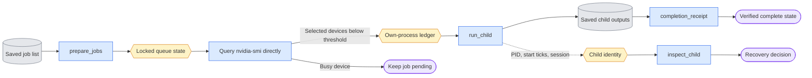
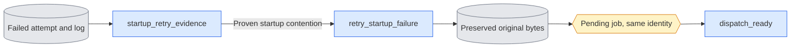

# `execution/queue.py` — run saved package jobs

Current saved-decoder completion requires each decoded row and comparison to
pass the shared software manifest checker. Missing or stale software cannot
produce a current receipt. The checker preserves historical artifacts and does
not restamp them; a decoder rerun uses a fresh destination.

Status: **Partially implemented.** GPU inventory parsing, selection and shared
own-process tracking, initial job-list schema checks, package argument parsing, canonical job
identities, command construction, initial checkpoint/raw-result/decoder checks and
state identity/transaction primitives and decoder reuse-identity checks exist.
Raw evaluation now verifies scientific settings, exact source/variant inventory,
checked masters/adapters, saved text/noise, clean c0, diagnostic calculations and
all published artifact bytes. Real small-transformer CPU checks cover both modes
and D0/D1 inputs. Training now binds the full typed settings, checked frame plan,
data/base/parent identities, queue/source digests and config/plan bytes. Controlled
checks exercise both modes, parent lineage and actual small-model update markers.
Native integration and live handoff remain incomplete. Guarded unapproved-launch recovery exists;
old unguarded launch windows still refuse takeover. Execution
supports one dispatch (`--execute --once`) or continuous dispatch
(`--execute --loop`). Both require the explicit shared own-process ledger.
Persistent child journaling gates execution on saved registration and records running attempts and verified
terminal states. Refused jobs preserve existing state.
Explicit dead-owner recovery transactions verify recorded child handles and
saved artifacts; the CLI exposes them through `--recover` and does not invoke
recovery automatically.
Choose `--dry-run` for read-only review. Execution requires `--execute` and exactly
one of `--once` or `--loop`,
and `--process-ledger <SHARED_PROCESS_LEDGER.json>`. All current queue processes
use the same file. Old per-GPU claim files are preserved as historical data and
are not read by new dispatch.

## Objective

Current dispatch follows the user's process-ledger policy. Query `nvidia-smi`
directly and record only package-owned PID/start/command/GPU identities in one
shared JSON ledger. New jobs do not read per-GPU reservation files or unrelated
process environments. The original reservation implementation and saved records
remain historical until the gated cleanup. `--process-ledger PATH` selects this
single shared record; the old `--claims-dir` spelling is a deprecated path alias
whose directory now contains `processes.json`, not new GPU reservation files.
The launch owner enables child-subreaper tracking before dispatch. Exact targeted
descendant observations include orphan ranks in new sessions without SSH scans.

Budgeted training dispatch uses the shared `execution/supervision.py` observer. Before
launch it freezes the per-rank load/update/export notification contract beside
the launch records. The existing budget's per-phase wall limit also supplies
explicitly named startup and between-phase guards; these are distinct observed
intervals. The observer retains finite wait/signal/inventory evidence and never
closes process records itself. Only complete own-worker absence permits closing
the active ledger record; preserve its history.
A failed or ambiguous stop stays failed/running as applicable, preserves evidence
and cannot publish a receipt. Ordinary jobs without a budget retain their current
dispatch scope with the new shared ledger. Sampled total-device occupancy is named separately; no allocated
limit is silently reused as a device-memory stop threshold.

When typed training requests `--save-update-state`, normal completion also binds
the saved training text, named Adam moments and JSON records for every update.
Receipts include these files. This extends evidence for the existing training
job; it adds no job kind, registry, device policy or automatic experiment launch.

Execute saved training, evaluation and decoder jobs inside the package.
Keep study choices as JSON data. Report rebuilds read saved artifacts separately.
Do not execute Python or shell implementations from `expr/`.

The `sigma_sweep` job kind invokes the package's matched ten-role decoder and
metric producer. Its public parser resolves `--spec` and `--output`; queue
preparation pins spec bytes and requires completion at output/manifest.json.
The queue rejects read-only `--verify` as an execution override. One evaluation
GPU is claimed under the ordinary shared policy. Recheck spec identity before
launch and completion. Missing final manifests remain pending; present ones
must pass sigma_sweep.verify_completion, including all media and metric controls.
Receipts bind the manifest after this complete owner verification. Dependency
receipts still govern readiness, with no report or missing-input repair calls.

**Historical reservation scanner, not used by new dispatch:** the retained
`GPUClaims` recovery code follows the observation rules in this paragraph.
Current attempts use [own-process tracking](process_registry.md), targeted
descendant identities and [bounded supervision](supervision.md).
Historical process enumeration tolerates ENOENT and ESRCH when a handle vanishes during
inspection. If reading an eligible process environment is denied, reobserve
its stat: skip only a now-absent handle or the same start-tick handle in a
terminal state. An exiting process can briefly retain a live stat while denying
environment access. Retry observation at most ten times, ten milliseconds apart;
a readable environment continues ordinary token/identity checks. Live handles
still unreadable after that bound and reused identities fail closed.
Neither access denial nor a vanished session leader establishes worker death;
the existing two-pass session/token scans remain required.

The active historical evaluation set is
`expr/onestep_avatar/dev_training_20261001/configs/package_eval_jobs.json`.
Its 417 jobs use explicit causal mode, converted membership/frame-plan files,
split selection and package output paths. The 52 progress jobs in
`package_progress_jobs.json` select the original two fixed sources across
splits, seed 42 and the exact one/four-call schedules. Their explicit research
override records historical off-condition diagnostics. The data-only package
converter is `convert_progress_jobs.py`; the original rows remain evidence in
`historical_visualization_jobs.json`. Queue dry runs prove command preparation;
scientific completion and native execution require separate evidence.

## Data flow

Read a versioned job list → validate package arguments and dependencies → check
completed evidence → query GPU memory and register our attempt → start one package
child → verify its artifacts and owned-worker absence → publish terminal state
and close our process record.

The completed-state path requires verified output bytes. Explicit recovery
classifies process handles and checks saved completion artifacts; automatic
recovery remains proposed.

## Organization logic

### Original training launch binding

`prepare_job` is the single-job normalization owner. `prepare_jobs` calls it
after list-level dependency checks. Replay calls the same owner with the saved
job's directory. Resolve path arguments, parse owner defaults, pin Accelerate
bytes and optional resource-budget bytes, and calculate the same canonical job
SHA-256. Store the budget digest as `resource_budget_sha256`; reject a supplied
digest that differs from the actual file. An absent budget cannot carry a budget
digest. Command construction rechecks the budget before creating child logs or
launch records. Ordinary training may omit a budget. A supplied prepared digest
must match the reconstructed digest. Do not accept a digest copied from a result.
List-level duplicate output and dependency-order checks remain in `prepare_jobs`.

Before dispatch, `training_launch_record` captures the exact prepared job,
command, physical devices, and original Accelerate bytes in base64. Write that
record beside the child log, outside the scientific output directory. Pass its
path through `ONESTEP_AVATAR_QUEUE_LAUNCH`. Training copies this same record into
its checked config and completion evidence. `verify_training_launch` reconstructs
the job and command and compares original bytes with the current file. It rejects
changed arguments, processes, port, command, claimed hash or YAML before models.
Training and replay recheck the binding before publishing completion.

Worked check: a four-process prepared job records bf16 YAML. Changing its YAML to
`mixed_precision: no` changes the canonical digest. Reusing the original claimed
YAML digest fails normalization. Changing only whitespace in a budget JSON file
also changes the canonical digest and rejects an already prepared launch. Removing
the YAML claim still fails comparison with
the original launch. A two-process substitution fails the queue's four-process
rule. An unchanged raw or already prepared job reconstructs the same identity.

These checks establish requested launch facts. The engine separately records
actual world, autocast/FSDP dtype policies and rank agreement after setup.
Missing historical launch or applied-runtime facts cannot pass current replay.

`read_training_marker(checkpoint, step)` owns the checkpoint readiness check for
queue completion, training provenance and serial replay. Read the companion
`.complete.json` record and require integer schema two, integer expected step,
with a nonnegative value,
`state="complete"`, the exact checkpoint path and the current checkpoint byte
hash. Boolean values do not substitute for integer versions or steps. A malformed
or stale record fails before scientific replay inputs or models. Queue completion
still treats an absent checkpoint or marker as pending before calling this reader.
Replay requires valid step-zero and step-one readiness records in addition to
their scientific adapter contracts; provenance alone does not imply readiness.

Evaluation completion first checks record/tensor existence, output hashes and
finite shapes. It then calls the evaluation owner's scientific verifier. The
owner reconstructs expected sources, variants and settings from the requested
CLI, rechecks input/adapter identities and verifies saved noise/text evidence.
Require the exact complete result inventory; one matching-mode result cannot
complete a different schedule, seed, source or adapter job. Saved historical
records without the required provenance remain evidence for their original run,
not a completion receipt for new work. These checks load no model sessions.

### Launch registration work in progress

The [launch gate](queue_launch.md) is integrated with persistent dispatch.
It registers a waiting child and requires a durable matching journal and grant
before exec. Inspection checks the approved command transition on the same
PID/start ticks. Guarded recovery can mark an interrupted unapproved launch
failed after proving its original owner is gone, approval is absent and saved
bindings match. Token inspection alone cannot prove death between fork and exec.
Old unguarded entries remain conservative; recovery never grants or retries work.
Protocol names now come from `execution/queue_protocol.py`, which imports no model library;
training.startup keeps its imported constant names for existing consumers.

### Interface and settings

The CLI is `python -m scripts.onestep_avatar.execution.queue --jobs <JSON> --state <JSON>`.
`--loop` rereads and validates the append-only job list and state before each
dispatch, verifies completed dependency receipts, selects evaluation/decode
before training, and queries GPU memory directly each time. Run one child at a
time in this process; separate queues share the own-process ledger. A successful
child must publish verified artifacts before its dependent job becomes eligible.
After a child completes, immediately review the next job-list revision. When no
idle GPU is available, wait `--poll-seconds` (default 30, finite and greater
than zero, at most 60) without an active process record. Check dependencies again after
waiting. Appended jobs retain the original saved job identities; edits to an
existing job fail before another launch. Exit zero only when every job is
verified complete. A completed state with missing evidence fails; a state label
alone cannot end the loop successfully. Stop on failures except the proven,
bounded startup contention path described below. Refuse a
running journal rather than adopting or relaunching its child: use the explicit
recovery owner first. Empty lists exit zero without checking GPU inventory or
creating state. Interruption while waiting changes no claim or state; child
interruption retains its existing live-child claim rules.

`--once` executes at most one ready job; `--dry-run` validates and lists work
without claiming devices, making directories or starting children.
The dry-run route prints
normalized job identities, saved states and planned command/environment changes.
Planned GPU IDs illustrate the fixed policy; they are not availability claims.
Dry-run validates arguments and identity, not scientific input bytes.
Execution checks ready jobs in evaluation-first order and chooses the first job
with available devices. An unavailable evaluation card does not prevent an
eligible training job. Return 2 when ready work has no available idle GPU.
Logs use unique attempt names outside the output directory. Execution does not
adopt unknown running children. Typed training can use only the startup retry
protocol below; other failures stop.
The list has `schema_version: 1` and ordered `jobs`. Each job has a unique `id`,
`kind` (`train`, `evaluate`, `decode`, `render`, or `sigma_sweep`), an `arguments` array of strings,
`output`, `dependencies` (earlier job IDs), and `completion` evidence.
Train jobs also specify `accelerate_config`, `processes` and `port`.
The `render` kind owns saved-comparison VAE work through the package evaluation
CLI. It requires `--render-saved-comparisons`, explicit output and optional seed;
it does not require a model-generation mode. Pin the spec's resolved path and
file SHA in canonical job identity. Reject changed specs before child launch.
Its completion manifest must be the output's `render_manifest.json`.
Verify its exact spec/decoder/software identity, comparison order and fields,
every current input hash/shape, source coverage, fps, panel titles/layout, and
named video/poster hashes and containment. Missing files are incomplete;
conflicting evidence fails. A historical unbound manifest is not adopted.
The manifest is the completion receipt; verification rechecks its media and
source bytes. Rendering shares evaluation/decoder priority and the existing
single-device own-process registration rules. Pending render jobs wait for every saved panel
file before reserving a device; dependencies remain explicit. It never runs report code.
Training preparation requires an existing Accelerate file and records its full
SHA-256 in the normalized job. Include this content hash in canonical identity.
Command construction rechecks the hash before launch; replacing a YAML file
in place cannot preserve the saved launch identity. This pins content, not YAML
semantics or successful distributed execution.
Decoder preparation requires its saved `--jobs` JSON and includes the resolved
path and full content hash in normalized job identity. Recheck this file before
command construction and completion verification. A changed list invalidates
the old job, even when new outputs match the changed list. This pins the list;
encoded sources still require their declared content checks.
Paths are resolved relative to the job-list directory once, before execution.
The command arguments contain explicit absolute data/output paths; the executor
never guesses a study subset, mode, sigma, view, seed or adapter from a run name.
`prepare_jobs` uses each package owner's parser without input/model access.
It resolves path arguments against the list directory and rejects GPU/dry-run/
help/overwrite/preview/measurement-route overrides. Hash canonical normalized
job data together with resolved parser settings, including omitted defaults.
Thus adding a seed changes identity, while preparing the same list twice does
not. Distinct textual output paths that resolve to the same directory fail.
Train/evaluate arguments require explicit mode. Reject duplicate output paths,
unknown dependencies, dependency cycles, forbidden executor options, a mismatch
between recorded and parsed output, or arbitrary executable/module names.
Only `train`, `evaluate` and `decode_saved` package entry points are selectable.
A list revision may append jobs; changing an existing job's canonical hash fails.

The train command uses the current environment's Accelerate executable with
one recorded configuration, process count, port and the package module.
Training uses GPUs 0–3 together and four processes. Evaluation/decoding use one
GPU, preferring 5 then 4 and using 3–0 only in training gaps. Never use 6 or 7.
`job_command` constructs only argument arrays for the fixed owners. Use the
current Python with `-m accelerate.commands.launch` for training. Set
`CUDA_VISIBLE_DEVICES` to claimed physical IDs. Single-GPU children receive
`--gpu-id 0`, their local device after masking; state retains the physical ID.
Training also sets the historical expandable-segments allocator option.
Return environment changes separately; do not record the entire environment.
Preserve the historical study's forward-prefetch configuration when converting
its jobs; do not substitute the new generic FSDP template into old runs.
Do not run report commands as queue jobs. Stage-two report completion is no
longer a training/evaluation completion condition.

### State and completion

`verify_completion` initially supports training checkpoints and raw evaluation
records. Missing files return false; malformed or changed evidence raises an
error. Resolve evidence paths under the recorded output directory and reject
escape paths. Training checks marker schema/state/path/hash/final step plus
the version-two contract and actual adapter matrices.
Training also requires the contract mode to match the explicit command and the
declared final step to match parsed training settings. It then calls the engine's
scientific verifier to bind all typed settings, data/base/parent identities,
frame plan and queue/source digests. Markers and receipts bind the saved config
and frame plan bytes as well as the checkpoint. Evaluation checks complete
state/mode, encoding file hash, recorded tensor shape and finite B,C,F,H,W
content, then the scientific settings and saved-input checks described above.
Evaluation receipts include text/noise tensors, raw outputs and future-noise
diagnostics as well as result records. Decoder completion checks a declared manifest under the output path,
the exact requested job/comparison IDs, matching source/input records and all
video/sample hashes. Missing artifacts remain pending; changed inventories or
bytes fail. Decoder identity also requires the selected model's actual VAE
hash, current native decoder settings and source-code hash, seed and effective
encoded tensor shape. Recompute its decode key and RGB frame count from the
saved encoding. Require exactly the requested in-range poster frames. These
checks load saved tensors and hash VAE files; they open no model or decoder.
Native training and scientific/media coverage remain integration checks.
Decoder completion also probes the actual saved video for exact frame count,
playback rate and positive dimensions after checking all artifact hashes.
Individual decoder sample PNGs are now loaded and checked for RGB format and
dimensions equal to the actual saved video. The selected model's probed scale
factors determine expected RGB dimensions and frames: `(F-1)*time+1`,
`H*height`, `W*width`. Encoded channels must match its probed latent capability.
Actual video size must match these values; matching video/poster size alone is
insufficient. Comparison-poster layout checks remain separate requirements.
These initial checks establish artifact format/content. Binding results to the
full persisted job identity and expected source/adapter inventory remains an
execution integration requirement; do not use them alone to skip arbitrary
pre-existing outputs.
`completion_receipt` verifies all current evidence before capturing the job hash
and hashes of every declared checkpoint/marker/result/decoder manifest.
`verify_receipt` requires the same job identity and unchanged evidence records,
then reruns artifact verification. Missing bytes fail; changed records cannot
be silently accepted by replacing their self-declared output hashes. Receipts
must be published only after the owned child completes; lifecycle enforcement
and complete scientific input matching remain execution requirements.

The state file records each job hash, state, attempts, owner PID, child PID,
start/end timestamps, chosen physical GPUs, exit code, log path and error.
States are pending → running → complete or failed. A completed job is skipped
only after its declared evidence verifies. A missing marker or result is not a
successful job, even when the child returned zero. Training evidence is a
checkpoint plus its complete marker, file hash and requested final step;
evaluation evidence is complete raw result records plus their encoding hashes;
decoder evidence is rendering records plus all output hashes. Do not use a fixed
sleep as proof that a checkpoint save finished. Dependencies require verified
complete states. Missing dependencies leave a job pending, not failed.

`ready_jobs` checks saved job identities and every completed receipt before
selecting work. A completed row without a receipt is invalid. Missing receipt
artifacts leave that job unverified and block its dependents; changed evidence
raises an error. Only pending jobs whose dependencies are verified complete
are ready. Return evaluation/decoder jobs before training, preserving saved
order within each group. This helper changes no state and starts no process.
Persistent `run_child` publication uses this gate inside its locked transaction.

Serialize state changes with a file lock and atomic JSON replacement.
`read_queue_state` verifies schema, state names and exact persisted job hashes,
including object-shaped rows and a list of object-shaped attempts. A persisted
null row is corruption, not an absent appended job. Owner/child PIDs, when
present, must be positive integers or null. Reject malformed rows before any
ownership or lifecycle operation; preserve original journal bytes.
Only permit appending new IDs after the original ordered list. The reader reads
without writing. `queue_state` locks the state file, rejects another live owner
or a surviving recorded child, then atomically publishes successful updates.
An exception preserves the previous state bytes. Automatic child recovery is
not invoked by the CLI. A foreign dead owner with running jobs requires an
explicit `queue_state(..., recover=True)` transaction. Inspect every recorded
child before changing any row. Surviving or unidentified/reused handles refuse
the whole transaction. Missing or matching terminal handles permit recovery:
verified completion publishes a receipt; absent artifacts mark the attempt
failed with an interruption reason. Corrupt evidence refuses recovery and
preserves the prior state bytes. Failed outputs stay in place; recovery does
not retry, move files, release claims or start processes.

`--recover --jobs <JSON> --state <JSON>` is an explicit CLI route, mutually
exclusive with `--execute` and `--dry-run`. It requires an existing saved
journal. Read and validate job identities first, then recover all running
entries in one locked transaction. Check child handles even when this process
is the journal's current owner: explicit recovery cannot mark its own live
child failed or complete. Unguarded missing PIDs, unreadable/reused identities,
surviving children or a live foreign owner refuse the transaction. Matching
terminal or missing registered child handles permit artifact verification.
A proven unapproved guarded launch becomes failed without artifact adoption. A valid receipt marks
the entry complete; absent completion marks it failed. Print job IDs/states
and whether a recovery transaction ran. A journal with no running entries
gets a read-only summary. This route never queries GPU memory or modifies
reservation files and never restarts failed work. Startup retries are a separate
path. Old unguarded unknown launch windows still refuse recovery.
An owner must hold that lock while deciding/claiming a ready job. A live recorded owner
cannot be replaced. After owner death, inspect its exact child PID and recorded
command before recovery. A surviving child remains owned; do not launch another
copy. If both are terminal/missing, verify completed artifacts first; otherwise
record interruption and require a fresh attempt directory. Preserve original
failed outputs under an attributed superseded location, never overwrite them.
Do not infer process death from an observation timeout or a claim file alone.

Process identity uses Linux `/proc/<pid>/stat` start ticks and exact NUL-separated
command arguments. Parse the stat fields after the last closing parenthesis,
because the process name can contain spaces or parentheses. Read stat before
and after command arguments; a changed start tick rejects the observation.
A zombie or dead process is terminal, even if signal zero still succeeds.
Missing process files mean the handle disappeared. Permission or other I/O
errors remain errors; they never prove death. Journal the child identity after
launch before approval. Recovery requires matching start ticks and bound arguments,
not a matching PID alone. A reused PID cannot authorize adopting or killing
the unrelated process. Old unguarded missing-PID launch recovery still refuses takeover.
`inspect_child` first compares the saved PID and start ticks to the current
handle. Live handles must also match the saved command. For a matching terminal
handle, accept either the saved command or an empty command: Linux clears
`/proc/<pid>/cmdline` after exit, before the parent reaps the zombie. A changed
nonempty command still refuses recovery. Missing saved commands and identities,
empty live commands and changed start ticks cannot establish termination.
Check surviving session/token workers before returning terminal. A zombie
launcher with a live worker stays live for ownership purposes.

Worked check: save PID 42, start ticks 100 and command `python worker.py` while
live. After exit, observe PID 42, ticks 100, terminal true and command `[]`.
With no owned workers the result is terminal; with a live token-bound worker
it is live. Ticks 101 refuse recovery in both cases.
 A live PID with no saved identity or different
start ticks/arguments requires explicit recovery and raises an error.

### GPU ownership and child execution

`run_child` executes one prepared job with an active own-process record. Refuse
nonempty outputs and foreign records before starting. Create an exclusive log,
start only the fixed command array, record its PID, and refresh its owned tree
while polling. A zero exit must pass artifact verification before a receipt is
returned. Failures preserve the output and log. Close the process record only
after the child is reaped and owned descendants are absent. An interrupted owner
retains the record for live or uncertain workers.
With `state_path` and the complete prepared `jobs` list, the helper publishes
running command/attempt ownership before launch, then records the child PID.
On success it publishes the verified receipt and complete state; ordinary
failures become failed after the child and all owned workers exit. Interruptions with a live child
retain running state and PID for recovery. Call this helper outside an existing
state transaction. Require the child job to match its prepared list entry before
publishing an attempt. Only the attempt published by this call can be marked
failed; refusing an existing running job must preserve its saved state. Logs
must stay outside the child output directory so log creation does not make a
fresh output nonempty. Process-start crash-window recovery and scientific binding
remain required for native loop acceptance and historical live handoff.

Read `nvidia-smi` successfully before choosing a device. Malformed/failed output
means no device can be selected, not an empty GPU. Require memory below 1024 MiB.
Current dispatch uses `process_registry` for targeted own-process tracking and
direct GPU availability. It never calls the legacy scanner below.

#### Current dispatch ownership

Current `dispatch_ready` constructs `ProcessRegistry`, chooses devices from
direct inventory and acquires one token-bound ledger row. It queries occupancy
again before creating a child. A busy device leaves the job pending; an invalid
query refuses without a launch. Only this attempt's record can be released.
Independent checks may use GPUs 0–3 concurrently, but a four-rank training job
requires the whole prescribed pool. External programs can still start after a
query; the ledger coordinates only this pipeline's own starts.

The retained `GPUClaims` helper and original reservation files are historical
compatibility code/data, awaiting gated retirement. New dispatch neither reads
nor creates those files and never uses their TTL as permission to adopt a GPU.
Current worker observations use exact owned handles and descendant containment.

Pass an argument array to `subprocess.Popen`; use no shell interpolation.
Use the package marker's `LTX_ROOT` as the child working directory with the current
conda environment. Record the complete
command, environment changes and log identity. Poll in short intervals so
claims can be refreshed and state can be recorded. Default execution starts
no campaign beyond the supplied list. On termination, record the live child
and release nothing it still uses; do not kill unrelated processes.

Retry only a startup contention failure before any logged weight update, at
most three times, preserving every attempt and error. Failure after an update,
or an input/adapter/checkpoint-validation failure, stops that job with its
reason. Do not repeatedly retry a broken specification. Evaluation jobs for
already completed checkpoints take precedence over the next training launch,
matching the historical queue's gap policy.

### Startup contention retries

Each launched child gets a new `ONESTEP_AVATAR_QUEUE_TOKEN` and its prepared
`ONESTEP_AVATAR_QUEUE_JOB_SHA256`. Training emits plain JSON lines with prefix
`AVATAR_QUEUE_EVENT `. The engine reports `updates_begin` before any sample or
optimizer update. A CUDA `OutOfMemoryError` before that boundary reports
`startup_contended` with reason `cuda_oom`. A typed `OSError` with
`errno.EADDRINUSE` before that boundary can report reason `port_in_use`. Other
exceptions report nonretryable `startup_failed`. Traceback text, including
network-library messages, cannot authorize a retry. Each event binds
the attempt token, job hash and global rank. Text traceback matching is insufficient.

The child starts in its own Linux session. Record its session and exact
PID/start/command identity with the attempt. Current rows also bind the shared
process-ledger path. The launch owner acts as a Linux subreaper and observes
only registered children and targeted descendants, including orphan ranks in
new sessions. A leader's exit cannot prove workers ended.

`owned_workers_live` selects the targeted ledger observation for current rows.
Incomplete or live-worker observations retain the active record and block
completion/retry. Historical rows without a ledger keep their conservative
original session/token reader; that reader is not a new-dispatch procedure.
Observation errors or timeouts cannot authorize takeover. Pass token/job
identity to each child, and preserve all original identities on interruption.

Before retry, require a reaped nonzero child, a complete absent owned-worker observation,
at least one valid matching contention event, no update-boundary event from any
rank, and no nonempty `metrics_rank*.jsonl`. Unknown or malformed event evidence
refuses retry. Typed training only can use this automatic path. Decoder/evaluation,
validation failures, missing-completion failures and owner interruptions stop.

Allow three retries after the initial failed launch (four attempts maximum).
Preserve each terminal attempt's error, return code, environment, log and log SHA.
Under the queue-state lock, create an exclusive archive below the output parent's
`superseded_startup_contention/`. Move any partial output into its `output/`, copy
the child log, and write a README and hashed preservation record. Check source
bytes before and after the move. Publish the archive identity and reset the job
to pending only after preservation succeeds. A failed publication restores the
original output location; never replace a newly occupied output path. All previous
attempts remain in the journal. Retry requires fresh own-process registration and both GPU checks;
it can wait without holding devices. The loop still prioritizes ready evaluations.
`--once` performs one launch and may leave an eligible retry pending. It does not
execute the retry itself. Exit 2 means an eligible retry is pending, not successful
completion.

Worked outcome: rank 2 runs out of CUDA memory while loading weights. No rank
has emitted `updates_begin`, and no numeric update was written. After all child
session processes terminate, preserve attempt one and leave its unchanged job
pending. If rank 0 already crossed the update boundary, keep the job failed even
when rank 2 reports startup contention. The fourth failed launch cannot retry.

Worked outcome: an idle GPU is eligible only when no active own-process row
conflicts with it. An old reservation file has no authority for a new attempt.
If any GPU in a required four-rank set is busy at the second query, close only
the fresh unlaunched record and leave training pending; start no child.
If a training child exits zero with a missing final checkpoint marker, the job
fails and dependent evaluation remains pending.

## Invariants

Study configuration and original scientific records retain their identities.
Completed checkpoints are immutable. Report code cannot start jobs. The shared
own-process ledger and queue state have explicit owners. Stage D must remove
remaining compatibility executors from expr. The current handoff orders
structural refactoring and CPU/caller/profile checks before new native
experiments on the final layout. Update lazy, explicitly selected experiment
dispatch and completion together; ordinary jobs remain independent. Original
launch/result identities remain unchanged, and native lifecycle acceptance is
not inferred from a path move.
The live historical handoff occurs only after command/data conversion and
child ownership have been verified; this design is not evidence of that handoff.

## Gotchas

The old queue's `metrics.json` and `.stage2_report_complete` flags combine model
work with reporting. Separate them during migration. Existing mode-less jobs
and version-one adapters need conversion before this executor can run them.
Saved-result report rebuilds must fail on missing inputs, not enqueue recovery.
A GPU-count override does not authorize changing a recorded FSDP configuration.

## Tests

Current dispatch controls exercise direct inventory, exact owned-process
registration, the second occupancy query, guarded bootstrap/grant ordering and
persistent journals. Busy/malformed/failed inventory starts no child or attempt.
Check all-or-nothing four-device selection and ownership-safe release. These
CPU controls cannot prove isolation from external programs.

Scientific completion tests use actual serialized settings, tensors and
markers. They reject changed schedules, input/source/adapter/runtime/budget
identities, incomplete rank phase journals, redirected artifacts and missing
completion evidence. Saved-render controls cover exact spec/VAE/software/media
bindings, geometry, labels, timing and readable full/compact output.

Startup tests check token/job/rank-bound events, pre-update-only authority,
complete ended-worker evidence, three-retry limit, exclusive preservation of
each attempt and rollback on failed archive publication. Validation failure,
any update boundary, surviving worker or unknown evidence forbids retry.
Real owned Linux children prove that leader exit cannot authorize another job.

Loop controls check append-only jobs, dependencies, immutable prior identities,
waiting without an active record and refusal of failed/unrecovered work.
Recovery controls distinguish valid saved completion, incomplete output,
unknown launch windows, changed/reused/live handles and missing journals.
Controlled historical `GPUClaims` fixtures test only the retained compatibility
helper. Their reservation files and environment scans do not describe current
dispatch or establish current native acceptance. Native receipts retain their
explicit launch, scientific and supervision scopes.

Real Linux zombie regression cases leave the child unreaped while inspecting
its empty command line. They verify explicit failed-attempt recovery, changed
handle/command refusal and claim retention while a worker in another session
survives. Tests reap only their own child and terminate their own saved worker.

### Registered persistent child dispatch

Persistent `run_child` now launches the model-free guard for each prepared job.
Publish the immutable request in `launches/<token>/`, write a running attempt
with request hash and protocol, then create the guard. Wait at most 45 seconds
for its bootstrap while refreshing the owned process-ledger record. Require the bootstrap
PID to equal Popen's PID, exact guard command, stable live start ticks and
matching token/job/request hashes. Save that identity in both the row and latest
attempt before publishing approval. Keep the bootstrap identity after exec;
inspection checks the granted command transition through immutable launch files
and the running journal. No such exception exists for old direct-launch rows.

Queue JSON publication flushes and fsyncs the temporary bytes before atomic
replacement and fsyncs the containing directory before returning. Exclusive
request/bootstrap/grant publication likewise fsyncs bytes and directory entries.
Approval follows completed journal publication, never a merely yielded mutable
state. Failed registration does not publish approval. A live guard retains its
process record and running attempt; timeout is not startup contention. Guarded unapproved recovery handles the otherwise unresolved launch window.
Old unguarded unknown handles still refuse takeover.

Transient `run_child` calls without a state path still execute directly and do
not provide persisted recovery authority. CLI dispatch always supplies a journal.
Controlled fake-Popen receipt/retry tests use an explicit test-only fixture that
bypasses registration; those tests cannot establish launch correctness. Separate
actual CPU-process tests exercise the unchanged production guard and dispatcher.

### Recover an unapproved guarded launch

Implemented: a missing-PID or missing-identity row with the registered-child protocol
may be classified `unapproved` only after the launch owner is gone, request and
latest-attempt bindings match, no grant exists, any saved bootstrap has a known
terminated matching guard, and no owned worker survives. Missing bootstrap alone
cannot prove death during fork-to-exec; absence of approval and a terminated
original owner prove that this guard cannot start model work. Explicit recovery
marks it failed and records why, without verifying or adopting output. Preserve
all artifacts and attempts; do not retry or release claims from recovery.
Old unknown launches and inconsistent granted launches still refuse takeover.

Twenty focused guarded-recovery checks include actual owner exits before fork,
before bootstrap, after bootstrap and after an interrupted registration. They
verify preserved output and original attempt records, no grant/model execution,
explicit-only failure publication, a paused live guard and a surviving worker in
another session. Changed bindings, dangling control symlinks, live/reused owners
and denied observations leave journals unchanged. These are CPU-control checks;
they do not establish native model/FSDP or legacy queue handoff acceptance.

## Numerical launch binding

Current typed training uses a version-two launch record that adds the exact
`numerical_environment` from the import-light shared numerical owner. Pass these
values to the guarded child with the existing physical-device environment.
Reconstruct version-one historical records using their original field set and
version-two records using the current field set. Both readers remain strict;
missing historical numerical facts are never replaced with current defaults.
Current typed execution and serial native acceptance require version two.
These fields bind numerical kernel settings, not new scientific inputs or limits.
CPU controls verify the exact environment and strict readers for both schemas.
Both original four-rank numerical comparisons pass. Complete workflow and
final-source acceptance remain separate; see the active handoff.
