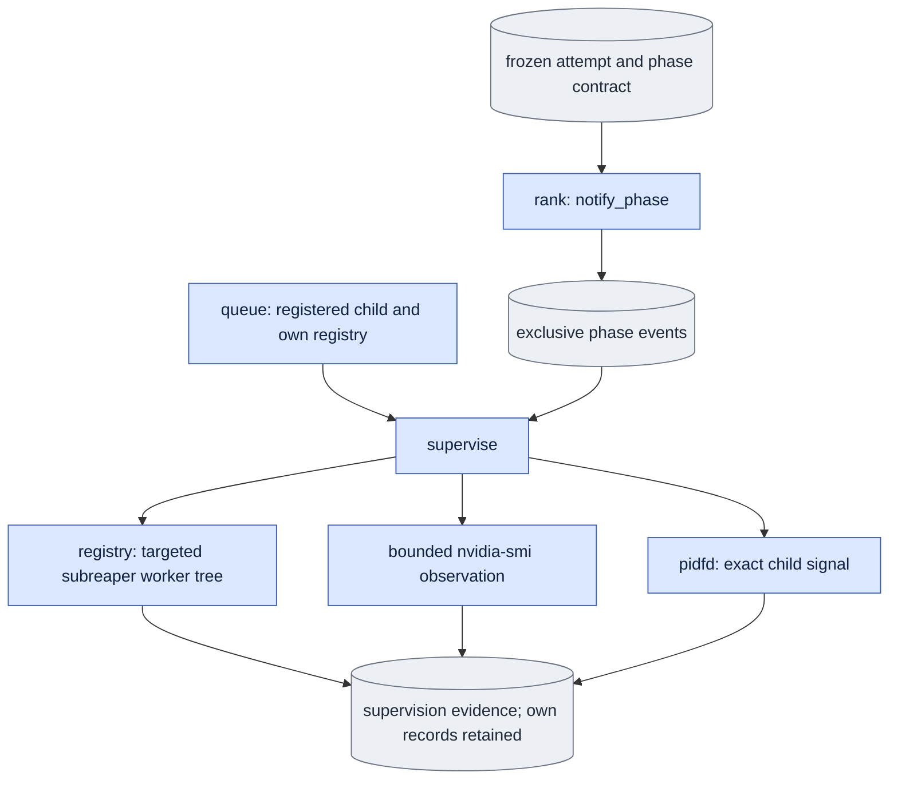

# `execution/supervision.py` — bounded observation of registered package children

## Objective

Observe an existing registered package child under explicit external deadlines.
Use the queue's process identity and the [own process registry](process_registry.md).
Do not launch a model, choose a study, recover an old attempt, close an own record,
or use a process
group as a substitute for exact signal ownership.

## Data flow

The caller supplies its `Popen`, registered PID/start ticks/command, original
worker record, owned process registry, GPU IDs and evidence destination. A separate immutable
notification contract binds the attempt token, job hash, rank count, ordered
phase names and budget hash. `prepare_notifications` writes this contract before
launch. Its returned environment names bind the exact contract bytes.
Each actual rank calls `notify_phase` immediately before phase work and after
its measurement. The helper writes exclusive, complete JSON events outside the
scientific output directory. It imports no model library.

The supervisor starts each phase timer when it receives that rank's begin event.
The completed Torch allocator measurements still come from `training/resources`.
Sampled total-device occupancy is explicitly a different quantity.

## Organization logic

When the exact registered child becomes terminal between `Popen.poll()` and its
targeted observation, reap only that original Popen child within the existing
shutdown bound, then apply the usual exit-code, phase and descendant checks.
Linux may clear its command line briefly before reaping. A pidfd terminal event
can resolve that race. It can also precede the terminal event: bracket the exact
PID/start ticks again, require an empty command line, and wait only for the
original Popen child within the same shutdown bound. A changed PID/start identity
never authorizes takeover.
Do not classify the normal terminal/reaping interval as lost ownership.

Validate all limits as finite positive values. Require exact registry/token/job and
notification-contract agreement. Before signals, observe the existing queue's
stable PID/start ticks and approved command transition, open a Linux pidfd, and
observe again. Signal through that descriptor only. If a pidfd is unavailable
or identity observation is denied, preserve the failure and do not guess a PID.
Use Python's pidfd wrappers where available. The old `ltx` Python/libc lacks
them, so the module calls the same Linux syscalls through `ctypes` on x86_64 and
aarch64. Unsupported architectures and kernel refusal fail closed. This fallback
does not use `os.kill` or weaken the registered identity check.

While the leader runs, refresh the caller's own process records, read ordered phase
events, and check deadlines. A rank's first begin must arrive within the explicit
startup bound. After every end, its next begin must arrive within the same
explicit notification-gap bound. Every active rank has its own phase deadline.
An optional overall deadline is separate; no command deadline is inferred by
multiplying the phase count. Contract mutation, unknown/duplicate events,
rank/phase/order mismatch or a changed rank producer handle fails supervision.

If an explicitly named `sampled_total_device_limit_bytes` is supplied, run
`nvidia-smi` with a finite timeout and record its per-device occupancy in bytes.
Do not compare it with `memory_limit_allocated_bytes`. Inventory timeout or
malformed/missing selected-device rows fails rather than reporting a free GPU.

On failure, collect the registry's exact own descendants and previously recorded
handles. Open a pidfd for each live handle after PID/start/command checks. Send
SIGTERM to all exact owned handles, including ranks in new sessions. Poll for a
finite aggregate grace interval. Refresh the targeted tree during this interval,
so newly adopted descendants also receive the same signal. Then send SIGKILL to
surviving exact handles and poll for one more finite interval. Newly discovered
owned descendants receive SIGKILL during that interval too. Never call an
unbounded `wait`, `killpg`, or signal a handle with unproved ownership. After
shutdown, observe only the original live subreaper
owner's targeted child tree through the registry. This covers workers in new
sessions and children of any owner/worker thread. A live worker, denied targeted
read, inventory deadline or uncertain leader identity means `workers_absent=false`.
The result preserves own process records; only the queue caller can close them
after complete empty containment. No unrelated environment scan occurs.

For a plain media command, the caller can omit `notifications_path` only with
an explicit overall deadline. Then phase/startup/gap limits and notification
hash are null in evidence; this route makes no per-phase resource claim.

Worked check: with startup=0.2 s, grace=0.1 s, poll=0.01 s, and a child that
ignores SIGTERM and emits no begin event, record startup deadline failure,
SIGTERM, then SIGKILL, and return after finite polling and inventory bounds.
Its separately started worker receives its own exact pidfd signal. If any worker
survives or cannot be identified, retain the process records as live/unknown.
Leader exit alone never changes that result into acceptance.

`queue_launch.read_completed_notifications` reads one frozen contract and its full rank/phase event
inventory without launching or observing a child. Bind the supplied original
contract hash, token and job hash. Require exactly one begin and end for every
declared phase on every rank, in the same ordering and producer identity rules
as live supervision. The launch recovery owner bounds the file count,
regular-file sizes and elapsed read time, then uses the unchanged `_contract` and
`_consume` rules on a private snapshot. These are internal compatibility
interfaces for this bounded recovery; ordinary execution does not call them
through a second supervisor. Return rank identities and content hashes only when the inventory is
complete and unchanged on a second read. This is saved workload evidence for
explicit dead-owner bookkeeping recovery; it cannot establish externally observed
timing, child exit code, continuous supervision or current worker absence.

Worked saved check: a contract with two ranks and phases `load` and `export:0`
requires eight event files. All eight must bind that contract and the same
distinct producer per rank. A missing final end or changed producer refuses the
saved check. Eight accepted events return their hashes and two exact identities,
without writing events or a new supervision result.

## Invariants

- No registry closure or queue journal mutation occurs here.
- Signal ownership requires the original PID/start ticks and approved command.
- A pidfd prevents a replacement PID from receiving a signal.
- Notification events bind the exact frozen token/job/rank/phase/budget contract.
- Completed phase measurements and external deadlines have distinct meanings.
- Unreadable handles and failed inventories never prove worker absence.
- Every device inventory, registry lock/tree observation and shutdown wait has a finite timeout.
- Evidence is published on success and failure before the caller interprets it.
- Saved notification completeness is separate from successful live supervision.

## Gotchas

The notification contract is not proof of native numerical correctness. The
supervisor's phase timer starts at receipt, so its poll interval is part of the
external detection latency. Local monotonic measurement remains the authority
for completed phase cost. Startup includes Accelerator setup before local load
measurement. A silent gap after a phase is bounded explicitly too.
Elastic ranks can leave the launcher's session. The registry's targeted tree and
rank records keep their exact handles in scope. Shutdown sends signals through
each handle's pidfd. Unknown survivors keep their records for later supported
owned recovery.
The original live subreaper owner is required for complete absence evidence.

## Tests

CPU controls exercise complete ordered notifications, changed contract and
attempt bindings, duplicate/mismatched events, missing startup and phase ends,
finite inventory timeouts, denied/missing/reused process handles, unavailable
pidfds, a real child that ignores SIGTERM, and a surviving new-session worker.
These checks establish bounded supervision and own-record retention. They establish
neither CUDA resource bounds nor native model/update agreement.
Saved notification controls cover complete and missing rank inventories, wrong
bindings, changed producer or event bytes, duplicate/extra files, bounded regular
reads and explicit absence of timing/supervision acceptance claims.
