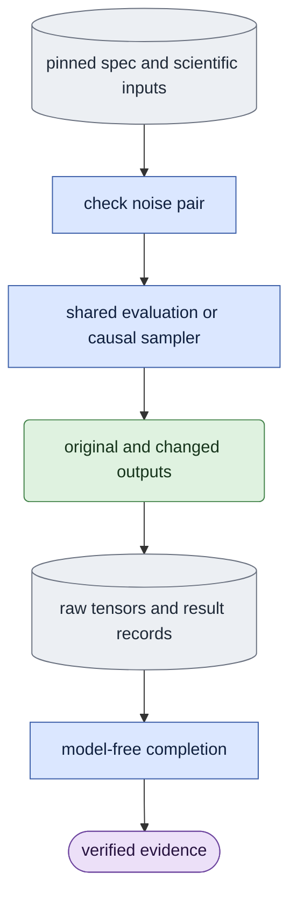

# `experiments/causality.py` — saved-noise interventions and eight-block control

## Objective

Own where to change noise and how to compare the two outputs. Ordinary
evaluation owns checked preparation, native sessions, adapter loading and
publication primitives; `model/causal.py` owns sampling and caches. This owner
adds no sampler, decoder or launcher. Supported model work uses the queue's
`experiment` kind with selector `causality`. Historical direct parser forms
remain at this experiment owner; ordinary evaluation accepts no study flags.

## Data flow

A version-one `future_noise` spec contains exactly `schema_version`,
`protocol` and string-list `arguments`. Arguments hold scientific settings;
output/device/dry-run/spec/help overrides are refused. Scientific paths are
absolute. An `eight_block` spec instead contains exactly `schema_version`,
`protocol`, `checkpoint`, `view` and `sigma`. Both use queue arguments
`--spec` and `--output`; the queue supplies the device. The spec SHA and an
evaluation software profile with `EXTRA_SOURCES` bind the producer.

Future-noise inputs use the evaluator's checked mode, source, adapters,
conditioning, exact schedule, text and original saved noise. The intervention
adds changed saved noise and its first changed encoded frame. Noise is
`[1,F*H*W,C]` in shared patchifier order; published encodings are
`[1,C,F,H,W]`. No historical noise is reconstructed.

Eight-block inputs are full white capture/guide masters `[C,F,H,W]` with
equal geometry/fps and `F >= 17`, LTX-2.5 dev, a checked D1 adapter,
generated history, B2/D8/sink1 geometry and direct `[sigma,0]`. Full masters
determine global seed-42/seed-99 noise arrays; execution covers only the first
eight complete blocks. Each rollout starts with an empty cache and uses clean
capture c0, refreshed generated history and fixed text.

## Organization logic

### Future-noise protocol

1. `parse_future_args` consumes the two intervention options and passes the
   rest to the public evaluation parser. Either both options are present or
   neither is; intervention requires saved original noise and a positive boundary.
2. `prepare_evaluation` calls shared preflight before a session. Changed
   noise is finite native bf16, matches the complete selected token shape,
   preserves all earlier bytes and differs later. Causal boundaries separate
   completed blocks and leave a later complete block.
3. `probe_future_noise` repeats pair checks at the sampling boundary, then
   calls public `evaluate.sample_case` twice with identical settings. It
   returns both outputs/records, earlier exact equality and fp32 maximum
   absolute differences before/after the boundary.
4. `execute_evaluation` supplies explicit `sample_runner`,
   `result_publisher` and `extra_sources` hooks to the one shared
   evaluator. The runner retains both outputs while returning the first
   ordinary pair. Publication saves changed noise, calls public `save_case`
   for `original/` and `changed/`, then writes `future_noise.json`.
   Each branch keeps its own noise digest and shared provenance.
5. Saved verification supplies `branch_provider`, `records_validator`
   and `extra_sources` to public `evaluate.verify_evaluation_conditions`.
   Ordinary checks cover every expected case/variant/result. The branch hook
   checks saved changed noise; the validator recomputes all five pair fields
   from saved outputs. Neither hook opens weights or repairs results.

Evidence includes text, optional negative text, every raw encoding/result,
original and changed noise, and pair diagnostics. Case/variant coverage comes
from checked shared preparation rather than the manifest's claimed inventory.

### Eight-block protocol

The shared planner covers `[0,3)`, `[3,5)`, ..., `[15,17)`.
Block three ends at encoded frame nine: mixed noise takes seed 42 before
token `9*H*W` and seed 99 afterward. Drawing full arrays preserves the
original mapping for masters longer than 17 frames. Each finite output records
eight denoise calls, eight refresh calls and sixteen total model calls.

Observers copy actual native inputs/outputs without replacing a model call.
Queue execution publishes `result.json`, `raw_outputs.pt` and
`raw_inputs.pt`. Raw inputs contain exactly `capture`, `guide`,
`text`, `original_noise` and `mixed_noise`: CPU copies of full native
tensors used by the forward. Completion does not redraw noise on CPU, whose
generator mapping can differ from CUDA.

`_verify_eight_block_inputs` reloads full masters and uses the native
patchifier and content hashes to check exact saved bf16 capture/guide bytes.
Require finite nonempty
tensors, matching shapes, `[1,text_tokens,context_channels]` text,
unchanged earlier noise bytes and changed later noise. Capture/guide/text
digests and both record noise digests must match these actual saved tensors.
`_verify_eight_block_outputs` then requires two finite fp32 `[1,C,17,H,W]`
outputs, clean c0, exact fixed settings/control fields, true earlier equality,
positive later difference, four input-file hashes and full call counts.

### Completion and worked checks

`verify_completion` first runs selected saved scientific checks, then
compares the whole manifest with reconstructed schema/kind/protocol/spec
SHA/software/artifacts and checks current software. `evidence_paths` returns
the manifest plus every artifact to the generic queue receipt. Missing files,
changed inputs, extra manifest fields or rehashed false summary fields fail.

For a 17-frame B2 input with four tokens per frame, boundary nine fixes the
first 36 noise tokens. Valid cached outputs are exactly equal on `[0,9)`
and differ on `[9,17)`. A zero later delta is an insensitive control and
fails completion. An earlier signed-zero noise change keeps numerical equality
but changes the hash, so it fails before sampling. Rehashing a false
earlier-equality summary still fails against raw outputs; removing
`raw_inputs.pt` cannot complete the queue result.

## Invariants

Saved eight-block master tokens must match the canonical master tensor hashes,
including signed-zero bytes. Saved rollout outputs must retain the producer's
float32 dtype. Rehashed artifacts still face these schema and conditioning gates.

- Preserve scientific settings, historical tolerances and original attribution;
  never restamp old producer manifests.
- Ordinary evaluation imports no experiment. Explicit hooks carry behavior and
  source identity in one direction.
- Adapter conditions/fresh destinations precede weights; file identity is
  rechecked before atomic publication.
- Public causal sampling owns cache/noise/model operations; this experiment
  owns intervention inventory and comparison.

## Gotchas

Earlier-output invariance belongs to causal sampling; whole-segment attention
can depend on later noise. Latent differences do not measure perceptual
similarity. Saved completion proves tensor consistency/control sensitivity;
full-weight E3, learning and long-video acceptance remain separate.

## Tests

`tests/experiments/test_future_noise.py` checks native small-transformer
invariance, invalid pairs before sampling, saved-input preflight, branch
provenance/inventory, recomputed pair fields and signed-zero byte identity.
`test_causality_diagnostic.py` compares original grid/noise trajectories and
call counts on a real small transformer, including longer masters, plus
preflight refusal and publication. `test_extracted_queue_protocols.py`
checks normalized/pinned specs, model-free receipts, missing/rehashed outputs,
raw input/text/noise digests and dtype/shape/intervention controls, including
master signed-zero byte mismatches and wrong output precision.
