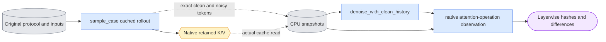

# `experiments/continuation_check.py` — bounded native history observations

Status: Tiny native CPU attention/cache checks pass. Full-weight before/after-eviction E3 acceptance remains pending.

The implemented source owner is `experiments/continuation_check.py`.
Original native evidence keeps its original producer hashes and scope.
Fresh affected native checks follow the complete code gate. Read
[current acceptance](../known_gaps.md#current-acceptance-and-next-step).

## Objective

Measure the selected causal cache against a current-sigma reference using the
same cached trajectory's clean history. Keep ordinary model owners unchanged.
Observe native self-attention keys after normalization and RoPE, and native
values. Do not implement another forward, cache, noise or eviction algorithm.

## Data flow



All diagnostic forwards run without gradients. The saved arrays contain
`[1,tokens,channels]` clean/noisy values, context and global positions. Native
layer keys/values have shape `[1,retained_tokens,inner_channels]`.

Read the original E3 protocol and original saved result. Reuse its exact source,
base, first image, text, noise, one-step schedule and B=2/D=8 geometry. Check
current masters and saved text against the original tensor/file identities
before weights. Use the existing checked `execute_evaluation` input path and
`sample_case` runner. Capture a current software profile with this diagnostic
and resource owner included. Never restamp the historical producer manifest.

Two native commands use fresh output directories:

```text
python -m scripts.onestep_avatar.experiments.continuation_check --phase capture \
  --protocol <original-E3-protocol.json> --sigma 1.0 --history generated \
  --output <fresh-capture> --gpu-id 0
python -m scripts.onestep_avatar.experiments.continuation_check --phase reference \
  --snapshot <fresh-capture>/continuation.json --output <fresh-reference> --gpu-id 0
```

The caller uses `ltx`, direct `nvidia-smi`, the shared own-process ledger and the
package supervisor. Native commands do not choose devices or recover old claims.
Run CPU `--dry-run` with `CUDA_VISIBLE_DEVICES=''`; it performs preparation only.
No native run is authorized by a dry run.

The `control` phase consumes one ID from the existing data-only 12-control plan:

```text
python -m scripts.onestep_avatar.experiments.continuation_check --phase control \
  --protocol <original-E3-protocol.json> --control-plan <12-control-plan.json> \
  --control-id sigma_1.0_cached_future_before_eviction \
  --output <fresh-control> --gpu-id 0
```

It wraps `execute_evaluation` directly in resource measurement, without a custom
runner. The public owner supplies both future-noise trajectories. Bind the exact
control plan, changed-noise bytes and tensor values, original saved text, current
inputs and software. Validate saved public results and require true earlier-output
invariance. Keep ordinary calls separate from the zero diagnostic extra calls.
No 12-control job has been run by this implementation.

Append `--supervise --process-ledger <workspace>/expr/onestep_avatar/processes.json`
to any native command. The shared registry queries `nvidia-smi` and accepts only
an idle allowed device, then queries again during registration. This uses the
existing own-process ledger and shared bounded supervisor, without another device
reservation file. A frozen launch record binds source/runtime and input hashes
between the parent and child. The child measures its allocator; the supervisor
independently enforces the original 1800-second overall deadline and samples the
48800-MiB device limit. It does not claim per-phase notification supervision.
Only a passed supervisor and a complete scientific result accept the attempt.
Failed supervision records and own handles stay saved. Native execution is not
started when all allowed devices are occupied.

## Organization logic

Use the package marker's `LTX_ROOT` for a supervised child's working directory.
A source move must not change the interpreter's package search root.

Capture delegates the entire cached rollout to `sample_case`. Its denoiser
wrapper passes each modality unchanged to the original denoiser once. It records
the clean tokens that the shared rollout supplies to refresh. At denoise blocks
`[3,5)` and `[11,13)`, it saves exact CPU inputs and reads each actual native
`LayerKVCache`. Save one layer at a time; never retain all cached layers on CPU.
The cache already contains keys after native normalization/RoPE and its storage
cast. Save the actual cached prediction after the original denoise returns.

Reference first delegates a full ordinary recomputed trajectory to `sample_case`.
That path allocates no `BlockCache`. It then calls the existing
`causal.denoise_with_clean_history` once for each saved target block, with the
capture command's exact clean history, current noisy tokens, context and global
positions. These two diagnostic calls use the original denoiser. They neither
refresh a cache nor change the ordinary recomputed output.

Temporarily wrap each native video block's `attn1.attention_function` and
`masked_attention_function`. Call the original operation with its original
arguments and return its original output. During the two diagnostic calls,
compare the history prefix of the actual kernel K/V inputs with the corresponding
saved cached layer. This observes real post-normalization/RoPE K and projected V.
Process bounded CPU chunks; record full-value hashes, exact-equality flags, RMS,
maximum absolute difference and relative L2. A zero reference norm yields null
relative L2. Require exactly one observation per layer per target. Restore both
callables on success and failure.

Worked case: before eviction, the retained frames are `[0,1,2]`. After eviction,
they are `[0,3,4,5,6,7,8,9,10]`. Use `retained_prefix_spans` to derive this order.
Do not compare the independently generated histories of the two ordinary arms
as if they isolated K/V calculation. The saved clean tokens are the same for both
sides of each diagnostic comparison. Separate generated and capture history.
Before eviction, retained past-frame inputs and context match; refresh uses
global sigma zero and reference uses the active sigma. After eviction, reference
also removes older frames from the context available to retained history. Those
deltas cannot be attributed to global sigma alone, even with identical clean
tokens. Report the before/after cases separately.

Record ordinary and diagnostic model calls separately and count actual native
forwards. Capture has 16 ordinary calls and no extra forward. Reference has eight
ordinary calls and two diagnostic calls for these fixed schedules.

## Invariants

Require D1/dev/LTX-2.5, 17 encoded frames, 30 fps, B=2/D=8, direct `[sigma,0]`,
base-only weights, CFG=1 and STG=0. Sigma is either 1.0 or 0.909375. Capture
history changes only the teacher-forcing flag. Current cached/recomputed output
records remain ordinary results; isolated reference block outputs are separate.
Verify c0 preservation, noise, context, clean history, positions, every snapshot
file, complete layer coverage, current source/runtime and fixed input bytes.
Incomplete observations cannot publish a complete diagnostic manifest.

Keep the original E3 budget meanings: 1800 seconds per case and 48800 MiB sampled
total-device occupancy. The original protocol has no allocated-byte threshold.
Measure synchronized local Torch allocated/reserved peaks with the shared Phase
owner; do not substitute E4's allocation limit. The external supervisor enforces
the original deadline and sampled device guard. Save failed resource/evidence
records before returning an error. Child exit zero alone does not accept a run.

## Gotchas

At 48 layers, 4096 inner channels, 1024 tokens/frame and bf16, cached snapshots
for three plus nine history frames contain about 9 GiB. The actual capacity
comes from `cache_latent_frames_for`; its extra live-block/keyframe headroom must
not be omitted. Estimate disk need before weights. A single saved after-eviction
layer contains 144 MiB of K/V. Reference holds one such CPU layer and bounded
comparison chunks. It allocates no second GPU cache. The native dense causal mask
for eleven frames is about 484 MiB; that is shared reference behavior, not a new
diagnostic approximation. Do not lower geometry, drop layers or relax limits to
fit. A failure preserves partial evidence in the fresh attempt directory.

Snapshot serialization and CPU transfers change observed cost. The 12 existing
future/capture controls supply ordinary latency/resources; this diagnostic's
cost includes observation overhead. Their eight future-noise jobs each execute
original and changed noise. Their originals at boundaries 3/11 provide fresh
repeat controls. Four other jobs compare capture history separately. They do not
replace K/V observations or the later three-person/two-seed extension. The two
fixed membership records contain actor 7 only. Prepare a successor held-out
membership after the one-view control gates pass.

## Tests

Use the real tiny LTX model and native attention/cache on CPU. Check exact output
equality with an unobserved cached run, real cached K/V snapshots, before/after
retained frame IDs, native reference K/V observations, complete layer inventory,
separate call counts and callable restoration on failure. Reject changed snapshot
bytes and input hashes before a reference forward. Check bounded chunk metrics
against direct float64 calculations, including a zero denominator. Do not infer
full-weight acceptance or perceptual quality from CPU controls.
The eight tiny native future-noise controls also exercise the public sampler at
both noise levels, both history calculations and both exact boundaries.
CPU-only preparation also checked
the actual original one-view capture and a future-noise job, with all source,
base checkpoint, master, c0, text and noise hashes retained. Full native 17-frame
commands remain a separate acceptance requirement; short seven-frame controls
from another owner cannot replace these observations.

## Experiment package provenance

The public `EXTRA_SOURCES` tuple retains every pre-move extra owner and
binds the empty `experiments/__init__.py` marker along with the checker.
These files are explicit experiment extras; ordinary profiles do not
include the experiment marker. Existing results retain their original
source attribution, and affected native checks run again after the code gate.
