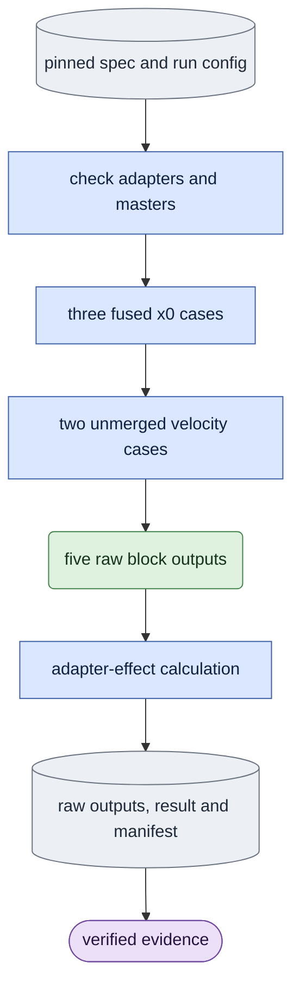

# `experiments/fusion_parity.py` — historical five-case adapter comparison

## Objective

Preserve the D1 block-zero fused-x0 versus unmerged-PEFT-velocity comparison.
Own the five scientific cases and effect calculation while calling shared
adapter, grid and causal diagnostic primitives. No decoder or launcher belongs
here. Queue model work selects `fusion_parity` through its literal experiment
table. Ordinary evaluation has no fusion-study parser.

## Data flow

Version-one specs contain exactly `schema_version`, `protocol:
fusion_parity`, absolute `run`, absolute `view` and positive integer
`step`. Queue arguments select `--spec` and fresh `--output`; the queue
supplies the device. Historical direct parsing stays at this experiment owner.
Current recipes live in `configs/README.md`.

Inputs are run `config.json`, LTX-2.5 dev, step-zero/trained adapters and
paired white capture/guide masters. Fixed settings are seed 42, sigma
0.421875, D1, block zero, an empty cache and clean capture c0. Masters are
`[C,F,H,W]` with `F >= 3`; each saved fp32 output is
`[1,3*H*W,C]` in native patchifier order.

## Organization logic

### Preflight and five cases

Before weights, require a fresh output, valid LoRA target/rank, positive finite
alpha equal to rank, all six scientific files, paired geometry/fps and block-zero
coverage. Alpha equals rank so the historical fused loader applies the same
scale as the unmerged adapter. Hash all input files before execution.

Run `bare`, `step0` and `fused1` through the shared fused x0 session
loader, releasing each model before opening the next. Release fused models
before loading the frozen base/public PEFT configuration, then apply saved
step-zero/trained weights for `peft0` and `peft1`.
`fusion_probe_block` builds the shared grid, allocates a fresh native cache,
noises guide block zero at fixed sigma/seed, restores clean c0 and calls public
`causal.fusion_parity_block`. Each case performs one diagnostic denoise and
returns fp32 CPU tokens. No VAE opens.

Recheck input hashes before atomic publication. Optional `raw_outputs.pt`
holds all five tensors; `result.json` preserves historical metric/settings
fields and input-file hashes. Queue execution binds both files, spec SHA and
current evaluation software with `EXTRA_SOURCES` in `manifest.json`, then
runs saved completion.

### Adapter-effect arithmetic

Require exactly five named cases with finite nonempty equal shapes. Define
`effect_peft = peft1 - peft0` and `effect_fused = fused1 - bare`.
Effect gap is `norm(effect_fused-effect_peft) / norm(effect_peft)`.
Keep this separate from raw trained-output differences and each effect
relative to its own no-adapter output. Also record fused step-zero equality
to bare bitwise.

The historical effect tolerance stays 0.2. Zero denominators yield JSON null.
A zero PEFT effect gives `effect_ratio_status: undefined_zero_peft_effect`
and a false tolerance flag, never NaN or a false pass. This historical
tolerance differs from the tighter adapter-effect acceptance gate.

### Completion and worked checks

`verify_completion` reads saved tensors with `weights_only=True`, reloads
paired masters and patchifies capture's first three frames to bf16 then fp32.
Every output must have that exact shape, fp32 dtype, finite values and exactly
matching capture first-frame tokens. Recompute every metric, compare fixed
view/step/sigma/block/seed fields, check all six scientific file hashes,
reconstruct the whole manifest and check current software. No weights, decoder
or repair runs. `evidence_paths` returns manifest/raw outputs/result to the
queue receipt. A failed tolerance can be a completed scientific observation;
completion does not make it an accepted parity result.

Let `bare = step0 = peft0` for nonzero references and give each generated
token fused effect 0.18 and PEFT effect 0.20. The effect gap is
`abs(0.18-0.20)/0.20 = 0.1`; the historical tolerance flag and step-zero
equality are true. If both PEFT cases are equal, the effect gap is undefined
and its tolerance flag false. Rehashing a reported gap changed to zero fails
against raw outputs. Changing all five cases' c0 together also fails against
the actual capture master even when pairwise metrics still agree.

## Invariants

- Keep all five roles, original noise/grid mapping, fixed sigma, adapter scale,
  historical metric names and tolerance.
- Each case has a new cache; fused residency ends before unmerged residency.
- Shared owners retain adapter loading, targets, layout and model operations.
- Fresh artifacts bind current producer bytes; historical attribution does
  not acquire current defaults/software.

## Gotchas

A small raw-output gap can hide a large adapter-effect gap when the effect
itself is small. Undefined denominators require explicit status. Completion
checks tensor/control consistency; real-weight native parity, visual quality,
learning and final architecture acceptance remain separate.

## Tests

`tests/experiments/test_fusion_diagnostic.py` checks original grid/noise
on a real small transformer, exact five-case orchestration, metric values,
zero-effect handling and fresh-output refusal.
`test_extracted_queue_protocols.py` checks pinned/normalized specs,
model-free completion, missing outputs, changed inputs, rehashed false metrics
and joint raw-output shape/c0/precision tampering.
