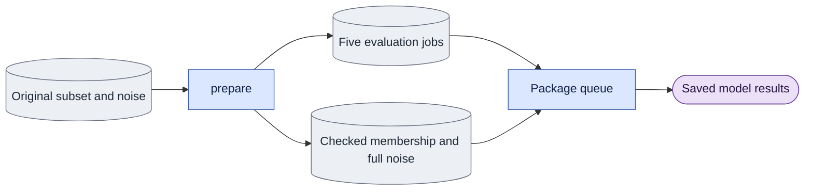

# `experiments/future_noise_study.py` — prepare the historical future-noise comparison

Status: preparation and read-only integrity verification implemented; checked
real input conversion, numerical replacement parity and executor retirement
remain incomplete.

## Objective

Replace the historical expr model launcher with data for the public package
evaluator. Preparation reads saved inputs and writes derived files; it opens
no model, text encoder, decoder or GPU session. Native parity is pending.

Current real preparation stops before publication: the old `t2r2.json` subset
pins a guide-render file that has changed. Even though this experiment is D0,
conversion must preserve the original subset's content pins. Do not remove the
pin to make the migration pass. The expr launcher remains current source awaiting
caller disposition. The current handoff orders structural refactoring and
CPU/caller checks before fresh native experiments on final owners. Move required
controls or retire obsolete execution while preserving source/result attribution;
an unavailable historical reproduction is recorded rather than silently repaired.
The changed pin still blocks that input conversion, not the directory move.

## Data flow

Read the original subset, study manifest, saved A/B noise and prefix block
noise. Check identities and intervention boundaries. Convert membership with
the existing subset owner. Publish full-frame noise, membership, five package
jobs and a migration record in a fresh directory. The package queue executes
the jobs separately; reports read their saved outputs.

## Organization logic

The historical noise has eight generated frames. The first block also has one
noise slot for c0. Preserve that slot from saved block zero, even though model
input construction replaces it with clean c0. Concatenate that slot with A,
B, B2 and B3, giving nine full encoded frames. Require bf16 finite tensors,
exact recorded short payload digests, and unchanged generated frames 1–2.
Reconstruct A from block zero without c0 plus the next three blocks and require
bit equality to saved A. The boundary is encoded frame 3, never generated
frame 3 interpreted as encoded frame 2.

Preserve model 2.5/distilled, D0/bg, seed 42, source, nine frames and the exact
saved schedule. Three bidirectional jobs compare A to B/B2/B3. A fourth
bidirectional job repeats A. One causal job compares A to B with block length
2, history depth 8 and four blocks. No adapter is supplied. The result map
retains J-A, J-A-repeat, J-B/B2/B3, C-A and C-B as names for the new records.
Current preflight still checks base/VAE/master identities at execution time.
An old manifest cannot prove those identities for a new execution.

Publication writes all seven derived files first. Hash their serialized bytes
and recheck all four original inputs after those writes. Publish the version-two
conversion record atomically and last, with the exact artifact inventory and
current preparation source hash. A failure leaves an incomplete directory with
no accepted conversion record. Never reuse that directory as a fresh run.
`verify_preparation` is a read-only integrity check. It requires the expected
schema/kind/status, unchanged producer, exact four-noise plus membership/plan/job
inventory, and matching input/artifact file hashes. It checks package job schema
and reconstructs the expected job arguments and role map from the saved input
manifest. It opens no models and makes no numerical or native-parity claim.
It also reconstructs the full noise tensors and membership/frame plan from
the unchanged original inputs. Updated artifact hashes cannot authorize a
different noise realization, source inventory or original frame plan.
Use `--verify-preparation <directory>` for this read-only CLI check. It rejects
conversion arguments and does not repair a missing or invalid preparation.

## Invariants

- Do not replace saved noise with a fresh random draw.
- Do not modify original masters, manifest, raw results or noise archives.
- Require a fresh output directory and unchanged input bytes before publishing.
- Failed preparation never launches model work or writes a completion claim.
- The job list is the package queue schema, with explicit modes and output paths.
- Saved historical results retain their attribution; this conversion is data
  preparation, not evidence of native numerical parity.

## Gotchas

The prefix artifacts moved into the diagnostic study's artifact tree. Supply
their actual paths. Do not import the archived prefix script to assemble noise.
The historical manifest uses a 16-character payload digest; keep its check
and record full SHA-256 file identities for new evidence. A self-consistent
replacement manifest cannot establish historical provenance on its own.

## Tests

Use saved block-shaped tensors to prove exact global slicing, unchanged early
noise and the encoded boundary. Verify source/mode/schedule/seed job arguments,
repeat control and all seven mapped result paths. Reject changed payloads,
unknown/missing keys, invalid shapes, changed earlier noise, absent intervention
and existing output. Check the real historical noise archive separately from
native generation. Generic evaluator small-transformer tests cover both modes;
full-weight parity remains a separate acceptance requirement.
Also change an original input during derived-file writes: final publication
must fail, leave partial files and omit conversion.json. Rewriting a derived
file after publication, changing its recorded inventory or changing the producer
must fail read-only verification. Semantically changed jobs must fail even if
their serialized artifact hash was also updated.
