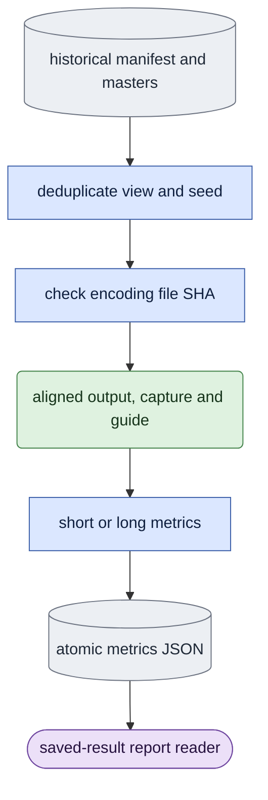

# `experiments/saved_probe_metrics.py` — model-free historical measurements

## Objective

Preserve historical short/long saved-probe calculations and report row names.
The fixed frame/block inventory belongs to this study, separately from general
metrics and training's full-frame loss. Read evidence, measure it and publish
JSON; never generate missing outputs or open transformer, text encoder or VAE.
This model-free command runs directly in `ltx` and needs no queue job.

## Data flow

`main` owns `--saved-metrics <directories...>` and optional
`--long-metrics`; ordinary evaluation accepts neither. Each directory's
original `manifest.json` names masters and saved encodings. Output is
`metrics.json` or `metrics_long.json`; raw encodings/media stay unchanged.

## Organization logic

### Evidence and rows

Visit manifest videos in original order. Read each seed from video artifacts,
falling back to the manifest seed. Process only the first occurrence of each
`(view,seed)` pair. Load capture/guide with the public master reader. For
every encoding, check recorded file SHA before `weights_only=True` loading.
Require one `[1,C,F,H,W]` tensor, align masters to its first F frames and
call the one metric function. Missing/changed/invalid evidence fails without
invoking a producer.

Each row keeps the historical three-level view label and seed. Short rows add
sigma, arm, latent file SHA and recorded epsilon SHA. Both summaries retain
probe/checkpoint/rows; short mode additionally retains off-condition,
model-variant and the first video's schedule. Atomically write JSON with
`allow_nan=False` after all rows succeed. Successful recomputation may
replace existing metrics; failure leaves the earlier JSON intact.

### Exact calculations

Require finite equal `[C,F,H,W]` tensors, odd `F >= 3` and spatial
dimensions at least two, then convert to fp32. Short mode requires F=17;
long mode uses actual odd F. Generated blocks are `[1,3)`, `[3,5)`,
..., `[F-2,F)`.

Both modes report `c0_exact` and per-block output-versus-capture MSE.
Long mode adds frame count, per-block guide-versus-capture MSE and
output/capture spatial-detail ratios; it deliberately omits short aggregate
scores.

Short capture and guide MSE average squared differences against capture over
`[1,F)`. c0 contributes only to exact-equality reporting, unlike training's
full-frame loss. Detail is mean absolute vertical difference plus mean absolute
horizontal difference on `[1,F)`. Motion averages absolute changes between
successive generated frames: 1→2 through 15→16, excluding c0→1. Motion
and detail ratios divide by capture measurements.

Seams first calculate squared transitions averaged over channel/space.
Across-block transitions enter frames 3,5,...,15; within-block transitions
enter frames 2,4,...,16. `seam_ratio` divides the across mean by the within
mean. `capture_seam_ratio` repeats this for capture. Neither includes
c0→1. Every zero denominator raises before publication.

### Worked checks

Use `[C,F,H,W]=[1,17,2,2]`, capture values
`capture[0,f,h,w]=f+h+w`, output equal capture and guide equal capture plus
two. Generated capture MSEs are zero, guide MSE four, c0 exact, temporal
differences one and directional spatial differences one. Motion/detail,
guide-detail and both seam ratios are one. Changing only output c0 changes
`c0_exact` while leaving generated-frame MSE/motion/detail/seam unchanged.

With the same pattern and five frames in long mode, there are two blocks.
Output MSE is `[0,0]`, guide MSE `[4,4]`, detail ratio `[1,1]`,
and `latent_frames` five. Spatially constant capture has zero detail and
cannot publish a ratio. Duplicate view/seed videos yield only the first
video's encoding rows.

## Invariants

- Keep generated-frame exclusions, blocks, fp32 arithmetic and historical
  names; do not substitute training loss.
- Check output file SHA before loading; the shared corpus owns master reading.
- Complete successful measurement precedes atomic publication; failures cannot
  replace an earlier complete file with partial results.
- Report code reads measurements; this owner starts no job.

## Gotchas

Motion measures how much content changes, not whether the action is right.
Detail/seams do not prove identity or quality. This historical reader pins
output file bytes and forwards epsilon SHA as metadata; that field alone does
not revalidate the original noise file or prove matched inputs for a new
comparison. Scientific interpretation still requires matched source/video
evidence.

## Tests

`tests/experiments/test_saved_metrics.py` checks short/long identical-capture
results, distinct-guide scores, file-SHA refusal, CLI ownership, preservation
of previous metrics on failure and zero-denominator refusal. Ordinary
CLI/boundary checks reject retired study flags before writes. These establish
saved calculations, not native generation or quality acceptance.
