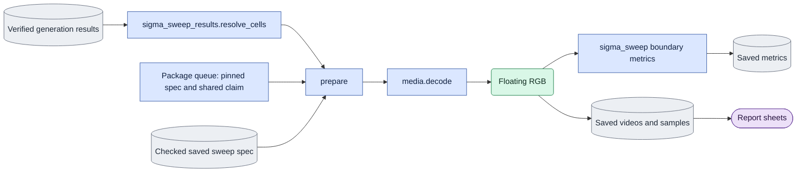

# `experiments/sigma_sweep.py` — decode saved sigma-sweep results

## Objective

Move saved sigma-sweep decoding and scoring out of expr. Open one decoder-only
session after checking every input. Do not regenerate a rollout or prompt.
Report-specific sheets are assembled separately from saved samples.

`parse_args` is the shared argument owner for the CLI and package queue.
Parsing alone performs no decoding or GPU discovery. Direct execution requires
an explicit GPU; queued execution supplies device zero in its claimed physical
device environment. The queue pins spec bytes and shares this module's complete
saved-output verifier. Read-only verification cannot be queued as execution.

## Data flow

A version-one JSON spec names capture/guide master paths and hashes, eight
generated tensor paths and hashes, tag, model, decode seed, fps, and the VAE
path/hash. Check the exact four-sigma by two-arm inventory. Decode ten matched
17-frame tensors, yielding 129 RGB frames each. Save ten videos, selected PNG
frames, metrics.json and a final manifest. A report reads those artifacts.

A version-two input spec instead embeds each requested evaluation job as
`evaluation_job` in its cell. `sigma_sweep_results.resolve_cells` requires the
exact causal/distilled, cached-refresh, unguided 17-frame setup and matching
source, prompt, seed and saved noise across all eight jobs. Job arguments must
name the spec's pinned masters. It verifies ordinary package scientific
completion before resolving generated.pt and its hash; missing results fail,
never regenerate. Bind result/text/noise, membership and original noise-file
bytes before verification, recheck them after verification and include them in
the decoder's final input binding. The normalized spec in the output manifest
retains embedded jobs and adds resolved tensor identities without rewriting
the source spec. The helper's source identity is also bound. Schema-one saved
historical specs keep their existing behavior.

## Organization logic

The public `parse_args(argv)` returns ordinary parsed values plus a `completion`
mapping derived from its resolved output: `{"manifest": "<output>/manifest.json"}`.
This is data for the generic queue, not a launcher. The descriptor is checked
before writes and included in the canonical job identity. `verify_completion`
rechecks every saved artifact without opening a native handle.
The decoding software profile stays ordinary; this experiment explicitly adds
its own module, the empty experiment marker and `sigma_sweep_results.py` through
`extra_sources`. Historical manifests retain their original source attribution.

Capture the shared decoding software manifest before input preparation. Check
it before opening the VAE, before writing media and before final publication;
save it in the final manifest. Current completion checks the same source/runtime
identity. Historical artifacts remain readable with their original provenance
when current completion rejects them; do not rewrite them to today's identity.

The fixed historical cells are sigma 0.421875 (one_step, one call), 0.725
(official, two calls), 0.909375 (official, three calls), and 1 (official, eight
calls), each with D0/D1. Keep this order. Masters may be longer than 17 frames;
generated tensors must contain exactly 17. Require matching finite bf16
B,C,F,H,W shapes after master selection and matching recorded fps. Before
opening a decoder, require fresh output, checked input hashes and current
registered VAE path/hash. The VAE is decoded through media.decode with a new
seed-42 generator for each input. No text context or transformer is created.

Convert decoded FCHW to floating FHWC, using the historical 255 divisor for
byte-range pixels. Require exactly 129 aligned RGB frames. Form one mask from
the union of min-channel below 0.9 in capture, guide and all eight outputs.
Call this study owner's boundary measurements and `metrics.masked_rgb_transition_steps` on the uncompressed
floats. Preserve tag, boundary/eviction metadata, c0 equality against sigma-one
D0, and sigma-one D0/D1 equality and maximum delta.

Save each video at 30 fps and PNG samples at 0,16,17,48,49,63,64,65,66,96,97,128.
Sample PNGs follow media.frame's rounded quantization; the historical sheet
used truncation. Do not claim identical historical presentation pixels. Scores
are calculated before either form of quantization. Record sample indices,
media hashes, pixel digests, decode settings, input/spec hashes and source hashes.
Recheck inputs, VAE and sources before atomically publishing the final manifest.
A partial directory is not complete and is never silently reused.

Before final publication, probe each actual MP4 for 129 frames at 30 fps and
the declared decoded image size. Check all twelve PNG sample sizes per role.
Schema two records the exact spec path and output geometry. `verify_completion`
reconstructs expected spec/input/VAE/source identities without opening a model.
It requires the exact ten-role inventory, deterministic contained paths,
video and PNG hashes, sample order, actual frame counts/timebase/size, pixel
digest syntax and metrics-file hash. Check cell identities/call labels and
recalculate latent c0/sigma-one controls from the saved input tensors. Scores
remain uncompressed-pixel producer measurements; do not recompute them from
MP4 or rounded PNGs. Verification proves saved-artifact binding and structure,
not independently rerun native VAE numerics.

The report reader calls this read-only verifier before loading samples and
creating sheets. Missing or changed media outside its chosen poster frames
must also fail. `--verify` uses the same CLI spec/output arguments and rejects
`--gpu-id`; no GPU discovery or session is performed in that mode.

## Invariants

All inputs decode in one session with the same settings and seed. Fail before
session/output creation on missing, changed, short, nonfinite or mismatched
inputs. Preserve old outputs and use a fresh destination. A report rebuild
cannot start decoding or repair missing samples. This is saved decoding only;
generation, adapter quality and native parity require separate evidence.

## Gotchas

Original capture/guide paths are read from saved producer manifests, not actor
names or guessed corpus roots. A new spec must match their recorded hashes.
The saved old masters can be decoded for historical evidence without relabeling
them as current training inputs. A VAE mismatch refuses the requested comparison.

## Tests

The complete-movie mutation control calls the public completion verifier.
First verify the unchanged positive control. Change saved movie bytes while
all poster PNG bytes remain identical, require rejection without a decoder or
new artifact, then restore the original movie and require success. The older
`sheets.py` report stays byte-identical and frozen; it is no longer imported
as an executable test dependency after the source move.

Use a controlled decoder and real small media writes to verify ten inputs,
seed/reset, raw scores, all cell identities, c0 controls and output hashes.
Missing/changed cells, master geometry/fps, VAE, nonfinite tensors and used output
must fail before model work. Mutating an input during decoding must prevent final
manifest publication. Compare the scoring path with the historical analyzer on
matched decoded floats. Native VAE execution remains separate acceptance.

Version-two checks use eight real small CPU causal evaluations across all
levels/arms. Verify sigma-one equality, resolve ten tensors without sessions or
writes, and exercise controlled decoder media and queue receipts. Changed
seed, arm, paired masters, noise, result metadata, saved text and late evidence
must fail. Decoder readiness requires all eight unchanged generation receipts.

### Historical boundary metric ownership

`sigma_sweep_boundary_metrics` lives here because its fixed 129-frame inventory, seven boundary locations, four-neighbor references and post-eviction attribution belong to this study. The general aligned-mask transition operation stays in `metrics.py`. The exact historical arithmetic, zero-denominator statuses, four-decimal arrays and worked numeric controls remain unchanged. Ordinary evaluation imports no sweep owner.
