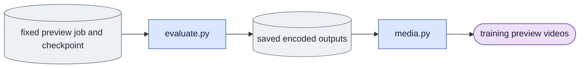
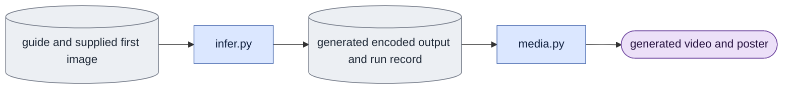
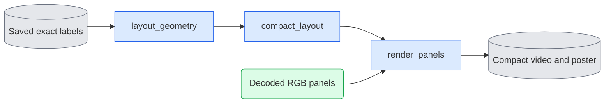

# `media.py` — visualize training and generation results

The checked reference CLI captures the decoding software profile before input
preflight, checks it before opening the VAE and before publishing references,
and saves it with the producer record. A supplied software manifest on any
render/reference save is checked before media writing and final record publication.
Low-level RGB assembly does not invent a decoder identity. Historical reference
loading preserves saved provenance; it does not require today's decoder software.

Saved historical comparisons use the `comparison` layout. Preserve supplied panel
order, use at most three columns, and pad the last row with explicitly unused cells.
Panel roles must be unique and cannot use the reserved `unused` role. The same
frame mapping, title readability, aspect-preserving padding and saved-record replay
checks apply as for the fixed training and inference layouts.

Status: **Partially implemented.** Decoder normalization, decode identity, checked RGB panel layouts, video/poster saves, and rendering records with RGB content hashes exist. `render_from_record` reproduces saved titles, mappings, layout, and poster selection, and rejects changed pixels. Pinned-reference preview rendering is integrated; full native preview acceptance remains pending.

`native_decoder_settings()` returns the settings of the shared native decode
path: bfloat16, no tiling, a fresh generator for each decode, and the current
Torch version. Reference assembly records this identity. Preview rendering
requires the reference settings to equal this current identity before opening
a decoder. For example, references prepared under another Torch version fail
instead of labeling new decoded pixels with that older runtime.
`visualize_d0` and `decode_saved` now use the public decoder. Historical presentation helpers remain until evaluation callers move.

`open_decoder_session(model, gpu_id, script)` owns saved-only session setup.
Call the shared CUDA/model preflight, which checks device headroom and sets the
requested current device. Construct `Session` with `context=None`. Do not call
the general `open_session`: that factory prepares text embeddings, which saved
decoding does not consume. Saved comparisons and `decode_saved` use this helper.
It opens no transformer or text encoder; the caller opens `session.decoder()`
only after its saved-input checks. Session setup itself does not decode pixels.
A controlled test forbids prompt-cache access and the general session factory,
and checks the resolved model, device, script and null context.

## Objective

The package CLI prepares fixed reference pixels:
`python -m scripts.onestep_avatar.media --prepare-training-references --subset
<V2_LIST> --source <SOURCE_ID> --encoded-frames <N> --guide-mode <d0|d1>
--output <NEW_DIRECTORY> --gpu-id <GPU>`. Optional `--corpus-root` relocates
the checked corpus. `--model` defaults to 2.5; `--seed` defaults to 42.
Read checked membership and the selected master before opening a decoder-only
session. Reject unknown sources, invalid frame counts and used output paths.
D1 requires the checked guide. D0 may omit it; if the source records a guide,
check that guide rather than ignoring damaged data. Use the saved crop and
objective without new preprocessing choices. Verify the selected VAE and input
identities before publishing `references.json`. Recheck the membership, VAE,
capture bundle, RGB, bbox and white-objective matte bytes through publication;
also bind all guide inputs when a guide is recorded. This command prepares references
only, not a complete preview-input record, noise, text or model predictions.

`prepare_training_references` owns the three fixed preview reference panels.
First verify the current saved capture encoding hash and VAE fingerprint.
Prepare recorded capture and guide RGB through the checked producer readers.
The keyword `require_guide` defaults to true. If false and the source has no
guide hash, do not read guide files. Return a guide cell with no pixels and
the label `Guide not used`. A supplied guide is still checked; a broken guide
is never treated as absent. Save/load preserves this absence explicitly with
null pixel/file hashes and no guide tensor file. Only the guide role may be
absent, and only with this exact reason and a null producer guide hash.
Slice the saved capture encoding from zero to the declared encoded-frame count
and decode it with the supplied native decoder and fixed seed. Return roles in
order: recorded capture RGB, VAE-decoded capture, guide RGB. All map to the
same consecutive original RGB frame numbers. Save their pixel identities,
source hashes and complete decoder reuse identity in the returned reference
record. Do not load a transformer, create a new crop or replace unavailable
references with synthetic pixels. Generation and final panel rendering remain
owned by evaluation and the shared renderer.

Preview rendering plans all five panel labels before opening the decoder.
Try `training` first, then use `compact_layout` if those exact labels do not
fit. Reject labels that fit neither layout before decoding or creating an
output directory. For example, `VAE-decoded capture` selects
`compact_training` at the default 320-pixel panel size and 480-pixel reading
width. Short labels can retain the normal layout. The selected layout is
saved in the rendering record. Neither path shortens labels.

`save_training_references` publishes the three prepared pixel tensors followed
by a version-two reference manifest. Refuse a used destination. Bind each role,
title, source-frame mapping, serialized file hash and pixel identity to the
producer reference record. `load_training_references` verifies those hashes
before returning panels; it performs no source decode, VAE or transformer work.
A missing/corrupted panel fails rather than rebuilding it. This bundle is a
saved input for rendering; it does not by itself complete a preview job.

`recorded_capture_rgb` prepares a preview reference with the public
`precompute.crop_source` producer calculation. Check the saved raw RGB hash,
capture objective/crop, and producer RGB/matte fingerprint before decoding.
Require matching source ID and FPS, and enough recorded pixel coverage for the
requested encoded range. Invalid timebase/coverage fails before source decoding.
Use the recorded crop directly; do not recalculate a box. Seventeen encoded
frames require 129 consecutive original RGB frames at scale eight. The white
objective uses the producer's full-resolution continuous matte before resizing.
Return uint8 FCHW pixels. Missing/changed source or matte fails without a model
session; never fabricate a recording from a guide or VAE-decoded capture.

`recorded_guide_rgb` reads the already prepared guide without another crop or
resize. Verify render/sidecar hashes and the encoding's render fingerprint,
objective, crop and frame coverage before video decoding.
Require the encoding source ID/FPS to match the fixed video list. The sidecar
must state the selected objective, current compositing version, matching edge,
and sufficient original frame count. A pinned but incompatible sidecar fails
before opening the video; hashes alone do not prove producer compatibility.
Check stored video
FPS and every frame's edge against its producer record. Decode consecutively
from frame zero, convert BGR to RGB, and return uint8 FCHW. Missing frames fail;
do not stretch, repeat or silently shorten the guide to fit a panel.

Native decoding activates the session's CUDA device for the entire decode call,
then restores the prior device. Explicit tensor placement alone is insufficient
for Triton kernels that use the current-device context. CPU decoding uses a
no-op context. Keep the same VAE, latent values and fresh seeded generator.
Device-context regression tests verify latent transfer and native decoding run
inside the selected context, then restore the prior device on success and
decoder failure. A bounded real LTX-2.5 capture decode on GPU 4 verified
17 encoded frames to 129 RGB frames at 1024x1024; its saved MP4 metadata agrees.
This is decoder acceptance for one saved input, not generation-quality evidence.

Decode saved encoded frames and make readable visual outputs.
Support training previews, evaluation comparisons, and product generation.
Use existing `scripts.prune.evaluate.decode.decode_latent`.
Do not add another VAE decoder or transformer generation loop.

Training timing and job selection belong to [training/engine](training/engine.md#visualization-during-training).
This file owns frame labels, panel layout, posters, videos, and rendering records.
It stays in LTX-2. Reusable VAE decoding, metrics, and video functions do not live in `expr/`.
Report-specific document assembly under `expr/` reads the saved outputs.

## Data flow

### Training previews

Use the same preview videos and inputs at each completed checkpoint.
Run evaluation outside the distributed training loop.

The preview job records checkpoint step/hash, mode, input video IDs/hashes, first-image data,
text identity, saved noise/seed, exact denoising levels, frame coverage, and output directory.
Record whether the job is pending, complete, or failed.
Reject incomplete checkpoints or changed input hashes.

Use the [training layout](#training-preview-layout) below.
Show the recorded video, decoded recording, motion guide, base-model output, and trained-model output.
The panel titles identify their roles. The trained-model title identifies its training step.
Keep frame alignment and display height equal.
State fixed mode, frame rate, and schedule in the report caption and saved record.
Loss curves are produced by `plot_training.py` from engine logs, not inferred from preview videos.

### Inference output

Product generation has guide input and a supplied image, but no capture target.
Both modes use this output path.

`infer.py` checks mode/adapter conditions and calls the selected mode's `sample` function.
Save the generated encoding and actual run record before rendering.
Close or release the transformer session before opening a separate decoder session when memory requires it.

Create the generated MP4 and a poster image.
Keep a generated video without presentation labels.
An optional review MP4 uses the [inference layout](#inference-review-layout) below.
It shows the supplied image, guide video, and generated video.
Label the supplied image as a still image.
When the inference CLI uses prepared encoded inputs, review panels explicitly
say VAE-decoded image and VAE-decoded guide. These are input reconstructions,
not original RGB or capture targets. The supplied image stays still throughout
the common moving-frame range. Generated-only output stays separate.
Do not compute capture-based quality scores without a capture reference.

## Organization logic

### Saved-video coverage

Saved-video verification uses `ffprobe -count_frames` on the actual MP4. Require
one selected video stream, positive dimensions, exactly the requested decoded
frame count and exact rational average playback rate. A failed probe, malformed
metadata or mismatched coverage fails; manifest counts alone are insufficient.
This check opens no VAE or transformer and does not judge pixel content.
Saved decoder sample verification fully loads each PNG, requires RGB PNG
format and requires dimensions identical to the probed video. A corrupt image
or changed size fails even if its self-declared content hash was updated.
This checks image coverage, not equality with lossy MP4 pixels.

### Visualization layout

One comparison video answers one question for one person/view and one matched frame range.
Keep the same role order across cases.
Do not put unrelated experiments into one large video grid.
Show the baseline and changed output next to each other.
Keep a matched recorded-video reference when judging capture fidelity, identity, or motion.

Use equal image display heights and equal title-band heights.
Scale each image with its aspect ratio preserved. Pad it to fit the panel.
Never stretch an image or crop away evidence to fill a cell.
Use a neutral background, clear gaps between panels, and high-contrast text.
Panel roles must be clear without color.
Draw text in bands outside the image area, so it cannot hide a face or motion.

#### Training preview layout

The default is two rows and three columns. This table is the actual screen order:

| Screen row | Left panel | Middle panel | Right panel |
|---|---|---|---|
| Top | Recorded video | Decoded recording | Motion guide |
| Bottom | Base model | Trained model, with its step | Unused |

**Recorded video** is capture RGB after the recorded crop, resize, and background preparation, before VAE encoding.
For `white`, use the capture target's recorded matte/compositing rule.
Replay checked producer settings through shared helpers; do not choose a new crop or background.
**Decoded recording** is the capture master decoded through the same VAE settings as model outputs.
It shows changes caused by encoding and decoding.
**Motion guide** is the guide RGB in the same crop and frame range.
It shows the original render before VAE encoding and noise mixing; it is not the noisy model input.
**Base model** uses the declared base weights without the trained adapter.
**Trained model** uses the selected completed checkpoint.

For a D1 preview, keep the same guide, first image, noise, text, mode, and schedule in both output panels.
Only the adapter changes between the base and trained output.
Across preview checkpoints, only the trained adapter step/hash changes.
Make one video per checkpoint; do not switch checkpoints while its video plays.

For a checkpoint-to-checkpoint question, put the two trained outputs in the bottom-left and bottom-middle cells.
Their titles show their exact training steps. Do not label either as the base model.
References stay in the top row.

An optional missing reference stays in its assigned cell and says `Not available`.
For capture-only D0, an absent guide cell says `Guide not used`.
A required missing input is an error, not an empty comparison panel.
The unused cell contains no video and says `Unused`.

#### Experiment comparison layout

Use the same reference row as a training preview.
The bottom-left panel is the baseline output; the bottom-middle panel is the changed output.
The bottom-right cell is unused.
Name each output's model role and the changed variable's value.
The displayed variable must agree with the executed run records.

Change one factor per comparison.
For example, compare two noise levels with weights, first image, text, noise bytes, and history fixed.
Compare recorded versus generated past frames separately within each exact denoising schedule.
Do not also change schedule or noise and describe it as only a history comparison.
Put other factors in separate videos.

Use a shared reference row only when the capture preprocessing and reference match every output.
If the declared factor changes the reference, for example original versus white background,
use this two-row/two-column layout with each output below its own reference:

| Screen row | Left panel | Right panel |
|---|---|---|
| Top | Recorded video for baseline | Recorded video for changed condition |
| Bottom | Baseline output | Changed output |

Titles show the same changed value in each output and its matching reference.
Keep original source time aligned. Save the corresponding input/target hashes for each column.
Do not imply that one processed reference is the correct target for both conditions.

If lengths differ, show only their common recorded frame range in the comparison.
Keep complete source videos as separate outputs.
State the shared range in the caption. Do not slow, repeat, or freeze a short output to fill a longer one.

#### Inference review layout

The standard review video is one row with three columns:

| Left panel | Middle panel | Right panel |
|---|---|---|
| First image (still) | Motion guide | Generated video |

Keep the supplied image visible for the complete video and label it `First image (still)`.
Show the recorded RGB preparation used to encode the first-image input, with its crop/background stated in the caption.
The guide and generated panels play together at the recorded frame rate.
The image is an identity reference. The guide is a motion input.
Neither is a capture target.
The generated-only MP4 keeps its original image area without review bands.
Its poster uses an explicitly recorded output frame.

#### Readable display size

Choose image height and font size for the intended viewing width.
Measure each title's rendered width. Use at most two title lines: role, then changed value.
Use short role names; never truncate an important numeric value or label.
At a 480-pixel viewing width, the rendered font size must remain at least 16 pixels after scaling.
Inspect normal playback and a still frame at that width.

If the three-column layout cannot meet that rule, also produce a compact review video:

| Screen row | Left panel | Right panel |
|---|---|---|
| Top | Recorded video | Decoded recording |
| Middle | Motion guide | Unused |
| Bottom | Baseline output | Changed output |

This keeps the compared outputs adjacent.
For compact inference, put the still image and unused cell on the top row;
put the guide and generated video on the bottom row.
Both sizes use the same frames, titles, and comparison settings.
Do not reduce image quality or remove an essential reference to make text fit.

### Text inside the video

Use only text that helps the viewer understand this comparison.
The video needs a short question, panel roles, and the variable that changes.
Full run details belong in the saved record and report caption.

| Text position | Content | Example |
|---|---|---|
| One video-wide title band | One plain question, at most 15 words | `Does more training improve the output?` |
| First line above each panel | Input or output role | `Recorded video`, `Motion guide`, `Trained model` |
| Second panel-title line | Changed factor and its exact value, where relevant | `Step 100`, `Step 200` |
| Optional one shared line | A fixed fact required to interpret this question | `One direct denoising step` |
| Optional shared time label | Recorded time/frame, only for a timing or block-boundary question | `Recorded frame 32` |

For a normal preview, `Base model` and `Trained model / Step 100` identify the comparison.
Do not add noise, cache size, or GPU settings merely because the record contains them.
For a noise comparison, show `Noise 0.421875` and `Noise 0.725` on the output panels.
For a history comparison, use `Recorded past frames` and `Generated past frames`.
Define these as the past frames supplied to the causal model.
Use neither `GT` nor `oracle` without an explanation.

If the schedule changes, show its family and actual denoise-step count.
Show a direct schedule such as `[0.421875, 0]` when it fits.
Keep the complete exact schedule in the caption and record for longer schedules.
Do not round distinct noise levels to the same display label.
A recorded research override that affects interpretation also needs a short, specific label.
For example, use `Outside trained noise range` when that is the actual difference.

Keep seeds, hashes, paths, experiment IDs, checkpoint filenames, tensor shapes, and timing logs outside the video.
Show one of those values only when it is the factor this experiment tests.
Do not put metric scores or claims such as `better` over the video.
Put quantitative results in separate report figures with their definitions and limits.
Fixed settings appear once in the caption, rather than on every panel.

For inference review, the title can be `Guide and generated video`.
The panel roles are sufficient when no experiment variable changes.

### Rendering procedure and records

Check output shape, frame rate, input hashes, VAE identity, and decoder settings.
Use a fixed decode seed for compared outputs.
Normalize decoded frame/channel layout once.

Cache a decode only by encoded content hash, VAE identity, dimensions, method, seed, and actual decoder settings.
Hold randomized decoder settings fixed across compared cases.
An adapter name or update number alone is not a valid reuse key.

Labels use saved encoded-frame, block, and RGB-frame mappings.
Preserve source videos.
Scale and pad panels without stretching or hiding frames.
Synchronize shared source-frame coverage and playback rate.
Write output hashes, decoder identity/settings, panel roles, and frame coverage to the result record.

Render in this order:

1. Read the comparison question, changed factor, ordered variants, and saved run records.
2. Verify matching fixed inputs and map all panels to the same recorded frame times.
   A random-start encoding needs an explicit decoded-to-original frame mapping.
   Do not assume that resetting model positions to zero also resets original video time.
   Reject an absent/unsupported mapping instead of claiming synchronized capture evidence.
3. Decode required saved encodings. Read capture/guide RGB through their recorded crop, background preparation, and time mapping.
4. Select the layout and assign each panel its role, row, and column.
5. Build minimal titles from executed values. Check title width and scaled text size.
6. Scale and pad image panels. Add title bands outside the image areas.
7. For each shared frame time, assemble the same panel order and write the comparison MP4.
8. Save a poster from a recorded frame and save the rendering record atomically.

The rendering record contains the question, changed factor, exact variant values,
essential shared text, actual panel titles, role/row/column mapping, layout version,
display size, font size, source frame/time mappings, missing-panel reasons, and output hashes.
It also records the crop/padding rule, selected poster frame, and complete common settings.
Use this record to reproduce the layout. Do not infer it from filenames.
Report generators read it when they build captions.

Save synchronized videos, posters, and rendering records for report readers.
Report generators under `expr/` create Markdown sections, captions, and report-specific plots.
They can assemble saved panels for a particular question.
They do not load a VAE, run model evaluation, or recreate missing outputs.
Put shared settings in captions and mark missing panels explicitly.

## Invariants

- Check encoded output and VAE records before rendering.
- Rendering saved outputs never calls a transformer sampler.
- Training preview jobs cannot change training weights or input selection.
- Each comparison has the same timebase and declared frame coverage.
- Panel padding preserves image aspect ratio.
- Labels distinguish original RGB, decoded capture, guide, and generated output.
- The baseline and changed output remain adjacent, with persistent role/value labels.
- Video text states the comparison question and important variable, not the full run configuration.
- Presentation text does not cover image content.
- All panels use the same source time; a still-image panel is explicitly labeled.
- Inference does not invent a capture reference.
- Report assembly reads saved media; decoding and reusable rendering stay in this package.

## Gotchas

Equal panel sizes do not prove matching crops.
Use crop, mask, and file-hash records to check alignment.
Training previews show examples; they do not prove general video quality.
An inference video can be judged against the supplied image and guide, but not an absent target.

## Tests

The handoff repair has CPU integration coverage using the actual
`prepare_training_references` titles and the real renderer/MP4 writer. It checks
compact selection, D0 with no guide, D1 refusing absent references, no-fit
failure before decoder creation, and failed jobs preserving saved adapters.
The reference CLI checks unknown sources, invalid ranges, changed capture/VAE,
broken optional guides, changed membership/matte during decode, and saved
absence replay without reconstruction.

Native reference acceptance on 2026-10-07 used the checked pilot source
`Part_2/0007_01/views/view01_cam57`, white objective, seven encoded frames,
LTX-2.5 VAE and seed 42. It prepared 49 RGB frames and rendered the real titles
in `compact_training`. Full and 480-pixel posters were inspected; actual MP4
coverage is 49 frames at 30 fps, 664 × 1242. Evidence is under workspace
`expr/onestep_avatar/handoff_implementation_20261007/`. This verifies reference
preparation and presentation for one source. It does not verify transformer
generation, a native end-to-end preview job, LoRA effects or distributed work.

Worked design check: preview steps 100 and 200 use the same video, first-image, text, and noise hashes.
Only the adapter step/hash changes.
For 17 encoded output frames, the VAE frame rule gives `(17-1)*8+1 = 129` RGB frames.
Both comparison rows must show those same 129 frame times.
A changed noise hash makes the comparison invalid; a changed adapter requires a new decoded-output hash.

Worked inference check: use a supplied image and a guide with 17 encoded frames.
The recorded output has 17 encoded frames.
The expected decoded output is 129 RGB frames.
The supplied image remains a labeled still. No capture-target panel or capture-MSE result is created.
These are design expectations, not results from implemented visualization code.

Worked layout check: compare completed checkpoints 100 and 200 for one D1 video.
The title is `Does more training improve the output?`.
The top row reads `Recorded video`, `Decoded recording`, `Motion guide`.
The bottom row reads `Trained model / Step 100`, `Trained model / Step 200`, `Unused`.
The slash here separates two title lines; it is not printed as a variable name.
The five videos show the same recorded frame at each playback time.
Only checkpoint step/hash changes. Sigma, seed, file hashes, and paths stay outside the image bands.
At 480 pixels wide, all visible titles must still pass the 16-pixel text rule;
otherwise use the compact layout and inspect it.

Worked experiment check: change noise from `.421875` to `.725` with all other inputs fixed.
Both output titles say `Trained model`; their second lines show the exact respective noise values.
The caption gives the shared direct-step setting. The record stores each exact schedule and input hash.
A changed noise array, rather than only the mixing level, fails this matched-input comparison.

After implementation, test changed-input rejection and decode reuse keys with small media fixtures.
Use loader sentinels to prove that rendering does not load a transformer.
Test training job state and checkpoint-step labels.
Test inference with no capture reference.
Check output frame count, rate, hashes, and deterministic decode settings.
Inspect panel alignment, labels, padding, and narrow displays.
Check exact role/row/column maps for training, checkpoint, experiment, and inference layouts.
Check shared-reference and separate-reference decisions against actual preprocessing/input identities.
Check missing-guide and missing-reference labels without shifting cells.
Verify a still image stays fixed while synchronized video panels advance.
Measure title bounds and scaled font size. Reject clipped or unreadable essential labels.
Verify the video contains only the declared question, roles, changed values, and essential shared text.
Verify rebuilding from a rendering record preserves titles, frame mapping, layout, and poster selection.
Check report rebuilds use saved media with VAE and transformer loaders disabled.

MP4 canvases pad the outer edge to even width and height for the native H.264
writer. This never resizes or crops panel evidence. The current native writer
accepts integer playback rates; reject a fractional rate before writing rather
than silently truncate it. Pixel-only layouts still record the exact requested
rate. Fractional-rate MP4 support remains an explicit limitation.

### Saved-render caller acceptance

The normal saved presentation retains its requested viewing width (1280 by
default). The producer also emits a measured compact reading format at width
480, using the same RGB data and exact labels. Its required record and media
checks close [G10](known_gaps.md#g10--saved-comparisons-have-unreadable-titles-at-narrow-widths).
The initial unreadable wide-only artifact remains historical evidence.

### Checked compact saved comparisons

`layout_geometry` owns metadata-only role placement,
font measurement and canvas arithmetic. It uses no pixels or decoder. The RGB
renderer uses that same plan, so early layout validation and final rendering
cannot disagree. Keep the existing `comparison` layout at up to three columns.
Add `compact_comparison` at up to two columns and `stacked_comparison` at one.
Each preserves supplied panel order and pads only unused cells. Exact labels,
values and source frames must not change. Never truncate labels to obtain a fit.

`compact_layout` measures candidates at a viewing width of 480. For generic
comparisons, try three, two, then one column; select the first that measures all
text within its title bands at a scaled font of at least 16 pixels. Named training
and inference layouts use their declared compact counterparts. Fail before model
loading if no supported layout fits. Compact video uses the very same decoded
panel tensors as the full video; do not decode again or change the random seed.

Worked four-panel check: 400-pixel square panels, 1232-pixel three-column canvas
and long original corpus labels fail the 480-pixel title measurement. Two columns
produce an 824-pixel canvas with 28-pixel text (16.31 pixels at width 480).
The role order is capture, frozen, one-clip, corpus in row-major order. Normal
presentation remains three columns; compact presentation is a matched second
reading format, with its own hashes and rendering record.

The metadata plan is checked before model loading. Both reading formats consume
the same RGB tensors. This diagram was rendered and visually inspected.
