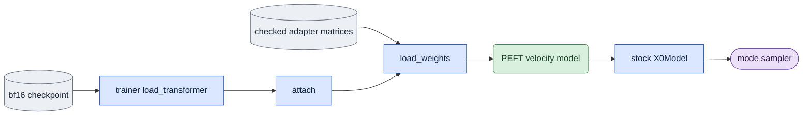

# `model/adapters.py` — share the trained adapter function

## Objective

Own PEFT construction and exported tensor loading for training, evaluation and
product inference. Ordinary application is `peft_unmerged_fp32`: frozen bf16
base weights plus unmerged fp32 LoRA matrices, zero dropout. It is the function
training optimizes. Keep bf16 fusion as an explicit research condition.

## Data flow

The training loader produces a velocity model. `attach` adds PEFT with the
recorded rank, alpha and target list. `load_weights` reads the exported ComfyUI
matrices into that same function. Evaluation wraps the loaded velocity function
in the stock `X0Model`; generation and guidance therefore consume x0, exactly
as their existing native-x0 predictors expect. No second velocity conversion
is applied. Base-only execution retains the native Session path.

## Organization logic

Freeze base parameters before PEFT construction. Optionally set training's
initialization seed, preserving its existing RNG rule. Use the shared target
registry, alpha equal to rank, zero dropout and PEFT's standard initialization.
Verify adapter weights are fp32 and remain unmerged.

Read exported tensors once. Require the exact key inventory and matrix shapes
of the constructed PEFT adapter, finite values, and the exported key prefix.
Rewrite that prefix once. Load into fp32 adapter parameters; reject missing or
unexpected adapter matrices rather than retaining random initialization.

Ordinary inference loads the bf16 velocity backbone with the trainer's loader
on the explicit session device, constructs the recorded adapter, reads the
checked matrices, freezes all weights, disables checkpointing, sets evaluation
mode, and yields stock `X0Model(PEFT velocity model)` outside FSDP. The fused
diagnostic calls `Session.transformer(loras=...)` explicitly. Base-only calls
`Session.transformer()` without adapters. There is no resource fallback.
Callers drop their yielded model reference after the context before loading the
next transformer or decoder. Context cleanup alone cannot delete caller-owned
references to a full resident checkpoint.

The unmerged path stores the bf16 base plus fp32 A/B matrices. It does not
allocate a full fp32 base or merge buffer. Its adapter memory is four bytes per
matrix element; report measured total allocation/time in E2. A memory failure
propagates and is recorded as failure, never a switch to fusion.

## Invariants

- Training and ordinary inference share PEFT configuration and tensor loading.
- Base stays bf16; adapter matrices stay fp32; no matrix is merged.
- Product uses only the ordinary method. Evaluation fusion needs the existing
  research override, checked before model loading.
- Both inference methods return x0 models; training keeps the velocity model.
- With B zero, the correction is zero and matched base outputs must agree.

## Gotchas

Exported matrices are currently bf16 on disk. Loading them into fp32 restores
the saved function, not the unrounded pre-export training weights. E2 compares
training reference after loading the same saved matrices. Wrapping a velocity
model in x0 once is essential: treating velocity as x0 produces plausible but
incorrect outputs. Do not change global sigma or per-token c0 timesteps here.

## Tests

Use a real small LTX model and PEFT to check dtype/freeze/dropout, exact inventory,
zero-adapter equality, and loaded nonzero-adapter equality against the training
reference. Check loader device selection, explicit fused routing, failure without
fallback and caller x0 semantics. Full native E2 effect and memory checks remain
separate acceptance requirements.
