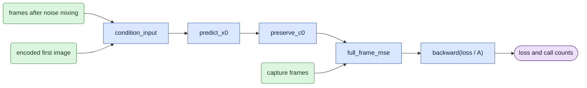
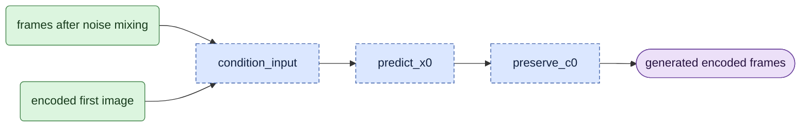

# `model/bidirectional.py` — process a video segment together

Status: **Training and generation functions, typed engine, and explicit-mode training/evaluation CLI integration implemented. Product inference and final real-weight checks remain pending.**
Current reference: `training.engine.train_chain` with one block starting at frame zero, and
`visualize_d1 --whole-clip`.

## Objective

Train or generate all frames in one video segment together.
A **video segment** is a consecutive set of encoded frames from one video.
It can contain the complete encoded video or a shorter part.
Each token can attend to every token in that segment.

The VAE encoding method stays unchanged.
This mode has no stored past frames, cache setup, or cache update.

## Data flow

Read the [terms and symbols](../core_algorithm.md#1-symbols) first.
D0 adds noise to capture frames. D1 adds noise to guide frames.
Both modes train against capture frames.
`c0` is the first-image input, with no added noise.

Prediction and target have shape `[1,T,C]`.
For `L` encoded frames, `T=L*H*W`.
`H,W` are the encoded image dimensions.

Training:



`A` in the loss equation is the number of accumulated training samples per GPU process.
The first-image input stays unchanged in the output.

Video generation:



Both diagrams show one direct step, `[sigma,0]`.
Generation can use more steps for an explicitly recorded comparison.
The shared schedule code sets those steps.

## Organization logic

`plan_samples` selects the encoded frame range.
`train_sample` trains on that range.
`sample` generates its output.
The training engine owns random seeds, model setup, and weight updates.

The mode receives a `ClipGrid`, capture/guide tokens `[1,T,C]`, text context,
and a clean first-image token array `[1,H*W,C]`. The caller slices the masters
using the returned `[start,end)` range before building the independent grid.
`train_sample` receives a backward function and `accumulation=A`.
It uses a velocity model. `sample` receives a clean-frame prediction function.
This keeps velocity conversion explicit and prevents a second conversion.
Both functions return numeric call counts. Generation returns prediction tokens.
For multi-step generation, use the checked descending schedule and the existing
Euler equation. Keep the first-image tokens fixed after every step.

```text
Take encoded frames [s, s+L) from capture and, for D1, guide.
Set positions for this independent segment to start at zero.
Use capture data for D0 or guide data for D1.
For training, use the first selected capture frame as c0.
Mix the input frames with the specified noise.
Replace their first frame with c0 before the model call.
Predict clean frames with full attention.
Keep c0 unchanged in the prediction.
Training: calculate the full-frame loss and backpropagate loss / A.
Generation: convert prediction tokens back to encoded video.
```

For a fixed-length segment with a random start, keep the current seeded uniform start selection.
Starting at the video beginning uses `s=0`.
Processing the complete video uses its actual encoded frame count.

### Exact frame selection

Let the master have `F` encoded frames.
Use requested length `L`, or `L=F` when length is omitted. Require `1 <= L <= F`.
For `clip_start`, return `[0,L)`.
For `random`, seed a local Python generator with
`onestep_avatar.window:{seed}:{step}:{rank}:{slot}` and draw `s=rng.randrange(F-L+1)`.
Return `[s,s+L)`. Preserve that original range in records even though model positions start at zero.
Neither rule creates a causal block plan.

Worked selection check: `F=19`, `L=17` permits starts 0, 1, or 2.
The start-at-beginning result is `[0,17)`; start 2 selects `[2,19)`.
The latter takes encoded frame 2 as its clean first-image input and records the G9 difference.

Check frame counts and memory needs before model loading.
GPU processes must make the same number of model and backward calls.

For generation, use a supplied-image encoding as `c0`.
Keep the initial noise fixed during all denoising steps.
Keep `c0` unchanged after every step.

## Invariants

- Every token can attend to every token in the selected video segment.
- One direct training sample has one model call and one backward call.
- This mode does not allocate, read, or update a history cache.
- Metadata records `mode=bidirectional` and `attention=full_bidirectional`.
- Causal settings are absent from this mode's configuration.
- D0/D1 changes the input data, not the model execution path.

## Gotchas

For `s>0`, the first selected encoded frame represents eight RGB frames.
A supplied-image encoding represents one RGB frame.
This is the accepted G9 difference. Record it.

`history_mode=joint` tests attention between past frames and a current block.
It is a separate diagnostic, not this mode.
An old one-block adapter needs its original run records before mode conversion.

## Tests

[V1–V3](../verification.md) check the input and loss equations before implementation.
After implementation, compare old and new outputs, losses, and gradients on identical inputs.
Check that no cache helper is called.
Check positions, random starts, and agreement between direct training and generation.
Compare one real-weight case with the stock pipeline.
These tests are planned; no speed or output-quality result is claimed.
