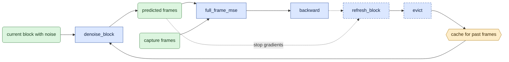
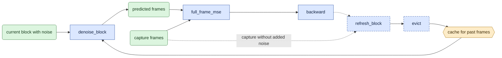
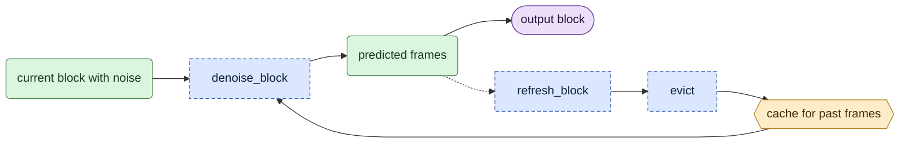

# `model/causal.py` — process video blocks in order

Status: **Block/cache and training extraction implemented; engine mode integration pending.**
This module owns block/cache functions, frame plans, immediate training backward,
and rollout. The engine's temporary old-interface adapter only prepares tokens
and delegates to `train_sample`. It has no denoise/backward/cache loop.

## Objective

Select consecutive blocks and process them in time order.
A **block** is the set of encoded frames processed by one denoising call.
The current block can attend to itself and stored past-frame data.
It cannot attend to a future block.

Training and generation share block-input and cache functions.
Training computes gradients after each block.
Generation does not compute gradients.

## Data flow

Read the [terms and symbols](../core_algorithm.md#1-symbols) first.
Inputs include capture or guide tokens, capture target tokens, the first-image input `c0`,
text data, frame positions, block indices, noise, and cache settings.
Token arrays have shape `[1,T,C]`.

The cache stores attention keys and values for past frames.
These **K/V data** are computed from frames with no added noise.
No gradient passes from the cache into an earlier block.

Training with generated past frames:



Training with capture past frames:



`refresh_block` computes K/V data from frames with no added noise.
`evict` removes old cache entries.
The backward-to-refresh arrow specifies order, not a data input.
Training does not refresh the cache after its last block.

Generation always uses generated past frames:



## Organization logic

Public functions and types are `CausalGeometry`, `BlockCache`, `plan_samples`,
`train_sample`, `sample`, and `fusion_parity_block`.
Separate diagnostic functions compare other ways to process past frames.

`fusion_parity_block` is the shared one-block executor for PEFT-versus-fused adapter checks.
It selects the training velocity or deployment x0 denoiser, applies the same cache-backed
`denoise_block` call, and restores the clean prefix. Diagnostic scripts provide the model,
grid, cache, noise and context; they do not duplicate model execution semantics.

`train_sample` receives the token grid, capture tokens, optional guide tokens,
geometry, consecutive block indices, text context, the backward function, and
accumulation count. It never imports an engine or CLI. The mode allocates a cache
when the caller has not supplied one. It returns loss, per-block records, and
separate prime/denoise/backward/refresh counts. Disabled anchor code is absent.
`plan_samples` groups complete blocks with the original stride rule.
The returned `cache` is mutable state for reuse between samples.
`capacity_latent_frames` sizes its allocation against the longest planned video,
so the first short video does not limit later samples. Priming resets it each time.

For block length `B`, block zero contains frame range `[0,1+B)`.
Later blocks each contain `B` encoded frames. Discard an incomplete final block.
Keep frame zero and the last `D` past frames in the cache.
Reserve room to write the current block before removing old entries:
`min(F,1+D+1+B)` encoded frames.

### Exact block and retained-frame selection

The complete-block count is `N=floor((F-1)/B)`.
Block zero is `[0,1+B)`; block `i>0` is `[1+i*B,1+(i+1)*B)`.
Choose K consecutive block indices within `[0,N)` for a training sample.
For normal training-plan enumeration, use the existing start indices
`range(0,N-K+1,stride)`, with positive stride and default `stride=K`.
A final sequence shorter than K is not padded into a training sample.
Record stride and any source that yields no sample in the frame plan before training.
An old reproduction plan preserves its exact starts/indices instead of regenerating them with a new default.
The used video ends at encoded frame `1+N*B`; later incomplete frames are not generated by this plan.
Record both block indices and original frame ranges.

After refreshing a block ending at frame `e`, keep ordered unique frame indices
`[0]` plus `[max(1,e-D),e)`.
Keep their original positions. At `D=0`, this reduces to frame zero.
For a later-block training start, prime from capture frame zero and the same last-D rule
applied to frames before that start. This is the existing approximate capture-history preparation.
Group retained priming frames by their original block IDs.
Frames from the same original block can attend to each other; later blocks can read earlier ones.
Do not assign the first-image frame an invented block ID that changes this mask.

Worked selection check: `F=8`, `B=2`, `D=1` gives three blocks `[0,3)`, `[3,5)`, `[5,7)`.
Frame 7 is an incomplete tail and is excluded.
After refreshing the first two blocks, retained frame indices are `[0,2]`, then `[0,4]`.
Bidirectional processing of all eight frames covers more data; sharing a video list alone does not match these outputs.

Training follows this order:

```text
Check K consecutive blocks and cache capacity.
Call prime_cache once to prepare past-frame data at sigma zero.
    At video start, discard this call's output and leave the cache empty.
For each block:
    Add noise to its capture or guide frames.
    Insert c0 only if the block contains frame zero.
    Predict clean frames; read the cache without changing it.
    Keep c0 unchanged in the prediction.
    Backpropagate MSE / (K * accumulated_samples) immediately.
    Unless this is the final block:
        Use generated frames without gradients, or use the capture target.
        Refresh the cache at whole-model sigma zero.
        Keep c0 and the last D frames; remove other entries.
```

Every GPU process makes one priming call, even when training starts at video frame zero.
The count is `1 + K + (K-1) = 2K` explicit model calls.
It excludes internal calls made by gradient checkpointing.

When training starts at a later block, prime from capture past frames in both history policies.
This does not recreate earlier generated frames.

Generation starts at block zero with an empty cache.
Run the declared denoising steps, save the output, then refresh and remove old cache entries.
Keep the current final-block refresh during extraction.
Direct generation therefore has `2K` calls and no priming call.
Removing that last refresh later requires a separate check.

## Invariants

- Each block sees itself and stored past data, never a future block.
- Denoising with gradients does not change the cache.
- Priming and refresh use `no_grad`.
- The first-image input stays in the cache, even when `D=0`.
- Removing entries does not change their remaining original frame positions.
- GPU processes agree on block and backward-call counts before model calls.
- Capture-history training requires the explicit capture target.

## Gotchas

Sigma-zero cache refresh can differ from recalculation at the active noise level.
Prompt AdaLN is the cause recorded in G7.
Do not claim that both computations are always equal.

Keep joint-history and recalculation paths as labeled diagnostics.
They are not additional training modes.
Recalculation requires contiguous blocks from video start. It assembles clean
retained history at token noise level zero and the active whole-model sigma.
With no history, use `attention_mask=None`; an all-visible dense mask wastes
quadratic memory. With history, keep the block-causal mask.
Joint-history diagnostics use the same retained frames without that mask.
History can then respond to the current block, so its K/V data are not cacheable.
Whole-video diagnostic modalities use float32 sigma and timesteps with bf16
weights and latents. Keep the existing block dtype convention during extraction.
G8 concerns LoRA application; G9 concerns first-image data.
These are separate from cache correctness.

Current random-start independent segments support one block only.
Do not add multi-block support without a separate design.
Product generation has no capture target or capture past frames.

## Tests

Fusion extraction tests run both x0 and velocity denoisers on a small real LTX
transformer. The public helper must match the original one-block output bit for
bit, execute exactly one model forward, restore c0 and return no-grad output.
This checks extraction fidelity; it does not measure real-weight fusion error.

[V4–V6](../verification.md) check frame ranges, cache removal, priming, and GPU-process call counts.
Current functions include `CausalGeometry.plan`, `BlockCache.evict`, `prime_cache`,
`refresh_block`, and `train_chain`.

After implementation, compare old and new outputs, losses, and gradients on the same inputs.
Check cache writes when gradient checkpointing repeats a model call.
Run a small distributed update.
Do not make cache/recalculation equality a universal test requirement.

### Public generation call

`sample` accepts one full-range saved noise tensor. It slices that tensor by the
requested blocks and calls the existing rollout once. It allocates a cache only
for cached history. Recalculation and joint-history diagnostics use no cache.
Return generated tokens and counts for denoising, refresh, and all actual calls.
Generation starts at block zero. It does not use training's discarded prime.
The final refresh remains part of generation, including the last block.
