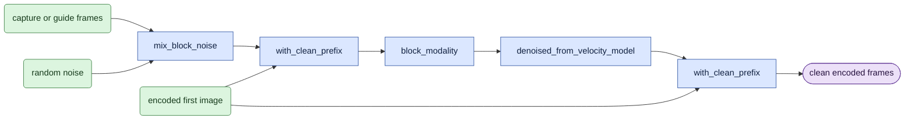

# `model/common.py` — prepare the model inputs

Status: **Shared-helper extraction in progress.** Source size: over 100 lines.
Keep the existing public helper names during extraction. `ClipGrid`,
`noise_block`, `epsilon_block`, `mix_block_noise`, `with_clean_prefix`,
`block_modality`, and the model prediction helpers move from `causal_core`.
`full_frame_mse` and its record identifier move from `train`.

## Objective

Prepare the same input format for both modes.
Choose capture frames for D0 or guide frames for D1.
Add noise, insert the first-image input, and convert the model output to clean encoded frames.
This file does not select blocks, allocate a cache, or update model weights.

## Data flow

Read the [terms and symbols](../core_algorithm.md#1-symbols) first.
An encoded frame is a VAE output frame, not an RGB video frame.
The first-image input, `c0`, is encoded image data with no added noise.

Inputs are capture or guide data, text data, frame rate, frame positions, noise, and noise level.
The video array has shape `[1,C,F,H,W]`.
Here, `C=128`, `F` is the encoded frame count, and `H,W` are encoded image dimensions.
The model reads `T=F*H*W` tokens, with shape `[1,T,C]`.

The selected mode supplies the frame range and attention settings.
Only the causal mode supplies cache settings.
The figure uses the training velocity predictor.
An inference session already returning clean-frame predictions uses `denoised_from_x0_model` at that operation.

## Organization logic

The responsibilities and their implementation names are:

- `ClipGrid.build`: calculate token shapes and frame positions.
- `source_for`: select capture data for D0 or guide data for D1.
- `mix_block_noise`: mix those frames with the specified random noise.
- `with_clean_prefix`: insert `c0` in the input and preserve it in the output.
- `block_modality`: assemble video tokens, positions, noise levels, and attention settings.
- `denoised_from_velocity_model`: convert velocity to clean encoded frames.
- `denoised_from_x0_model`: accept an existing clean-frame prediction.
- `full_frame_mse`: calculate the mean squared error in fp32.

Keep the current random seeds and the current 20-second position limit.
`ScaleGeometry` describes only VAE scale factors. `CacheView` describes already
allocated cache data for modality assembly. These are structural type contracts.
They do not allocate a cache or import a causal implementation.
Both modes can build a grid with the same scale factors. Cache ownership stays causal.
An independent video segment starts its positions at zero.
Blocks from one causal video keep their original positions.

The noise equation is `x_sigma=(1-sigma)*source+sigma*epsilon`.
Here, `source` means the selected capture or guide data; `epsilon` means random noise.
Before the model call, replace the first-frame tokens with `c0` and set their token noise level to zero.
Keep the whole-model noise level, `sigma`, at its active value.
Later causal blocks read first-frame data from the cache.

`keyframes_mask` describes the VAE layout.
It does not insert the first-image input.

### Core array calculations

With patch size one, token `t=(f*H+h)*W+w` stores the `C` channels at encoded position `(f,h,w)`.
One frame occupies exactly `H*W` consecutive tokens.
Use the existing patchifier and inverse; do not choose a different flattening order in a mode.

`source_for` returns capture for D0, or a required shape-matching guide for D1.
Mix source and saved noise in fp32, then cast back to the source dtype.
For a block containing frame zero, `with_clean_prefix` replaces exactly the first `H*W` tokens with `c0`.
It preserves later tokens and does not overwrite the saved source/target arrays.
For later blocks, do not insert a new first image; first-image information is already in their cache.

Build positions/keyframe marks from the mode's token slices.
Use active global sigma and per-token `sigma*denoise_mask`, with clean first-image token levels set to zero.
For a velocity prediction `v`, use `x0 = input - token_sigma*v` through the existing fp32 conversion helper.
For an existing x0 prediction, perform no second conversion.
Restore the exact first-image tokens in the prediction before computing loss or updating history.
`full_frame_mse` is `sum((prediction-target)^2)/(T*C)` in fp32.
It has no foreground mask, no anchor term, and no special denominator for non-first frames.

Worked shape check: `F=3`, `H=W=2`, `C=128` gives 12 tokens.
The first-image input occupies tokens `[0,4)`; encoded frame two occupies `[8,12)`.
Keeping the first four prediction tokens unchanged does not remove them from the loss denominator of `12*128`.
[V1–V3](../verification.md) give numeric noise/first-image/loss checks.

## Invariants

- D0 does not require guide data. D1 fails if guide data is missing.
- The first-frame model input and output equal `c0`.
- Token conversion does not change encoded data or run the VAE again.
- Convert velocity output to clean-frame output once. Do not convert an existing clean-frame prediction again.
- The loss includes the first frame in its frame count. That frame has zero error.
- Masks and alpha values do not weight the training loss.

## Gotchas

Use the existing pruning code to read native saved inputs and decode video.
Do not add another implementation here.

A segment that starts after encoded frame zero has the G9 first-image difference.
Record its start frame. Changing position labels does not remove that difference.

## Tests

[V1–V3](../verification.md) check noise mixing, the first-image input, and loss scaling.
After implementation, test token conversion, frame-rate-dependent positions, and output conversion.
Inspect the actual input to the model. Test missing guides and invalid shapes.

Current tests are in `tests/test_train.py` and `tests/test_causal_core.py`.
They have not run against this proposed module.
