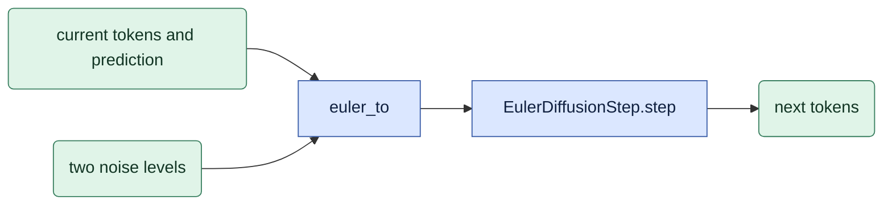

# `model/sampling.py` — choose denoising steps

Status: **Implemented; native stock comparison remains open.**
Own `one_step_schedule`, `truncated_schedule`, `thinned_truncated_schedule`,
`rescaled_schedule`, `euler_to`, and `validate_schedule`.
Keep existing public names and the exact direct-step endpoint. Reject nonfinite levels and values
outside `[0,1]` before execution.

## Objective

Check noise levels supported by the base model.
Create the exact list of denoising steps and apply each step.
Keep these functions independent of attention mode.
[training/checkpoints](../training/checkpoints.md) checks the adapter's training conditions.

## Data flow

Inputs are the dev/distilled base choice, initial noise level, and requested schedule.
Output is a finite list of decreasing noise levels ending at zero.
Each step reads the current encoded frames and model prediction.
It does not draw new noise.

## Organization logic

Read the [symbols](../core_algorithm.md#1-symbols) first.
One direct step is `[sigma,0]`.
Distilled levels must belong to the base model's fixed list.
A dev direct step can start at any `sigma` in `(0,1]`.
The stock dev schedule uses `LTX2Scheduler().execute(steps=N)` without a latent argument.

Keep the current comparison settings:

- Truncated tail: start at the requested level and keep the lower stock levels.
- Thinned tail: select the requested number of calls from that tail; keep its end levels.
- Rescaled schedule: rescale the complete stock schedule, which changes the denoising path.

### Build the exact schedule

Let the stock list be `q=[q0,...,qN]`, obtained with the scheduler call above.
Use `[1,0]` for the one-interval stock special case.
Let the requested start be `s` in `(0,1]`.

- **Direct:** return `[s,0]`. For a distilled base, validate `s` against its actual grid.
- **Truncated:** return `[s]`, followed by every internal stock level strictly below `s-1e-9`, then `[0]`.
  The resulting interval count can be less than the requested stock count.
- **Thinned truncated:** first build that complete tail.
  If it has `M` intervals and the request is `n`, require `1 <= n <= M`.
  Select indices `round(i*M/n)` for `i=0,...,n`, using Python's rounding rule.
  Keep both endpoints; do not create a new stock curve.
- **Rescaled:** return `[s]`, then each internal `s*qi`, then `[0]`.
  Set the first value to `s` explicitly so it matches the initial noise mixing value exactly.

Validate at least two finite values in `[0,1]`, strict decrease, and an exact final zero.
When a distilled grid is supplied, check every positive level within the existing `<1e-9` tolerance.
Separately check that the first value matches the actual initial mixing level.

Save exact executed levels. Do not round them in the run record.
Check the base first, then check the adapter's recorded training levels.
A base-supported level can still differ from adapter training.

For a next level above zero, call the native `EulerDiffusionStep.step` with
the two levels in a float32 tensor on the sample device. The native step forms
velocity in float32, rounds velocity to the sample dtype, then forms the update
in float32 and casts back. An algebraically equivalent bf16 interpolation does
not produce the same bytes. Do not implement a second copy of this arithmetic.
At the final zero level, return the prediction directly. This is the exact
one-step training/generation contract. The stock step instead rounds velocity
and reconstructs its endpoint; its bf16 endpoint can differ from the prediction.
E1 must report and measure this deliberate final-step difference rather than
claim bit-identical stock execution.
Restore the first-image input, `c0`, after every step.
The mode calls the predictor once per interval, updates the current state with this equation,
and restores `c0` before the next interval. It does not mix the source with new noise again.

## Invariants

This diagram shows a positive next level. At zero, `euler_to` returns the
prediction directly. The mode owner then restores `c0` in either case.

- The first schedule level equals the level used to add noise.
- The last level is zero. Positive levels decrease strictly.
- All levels are finite. Training does not start at zero.
- One direct step requires one denoising interval.
- Initial noise stays fixed across steps and compared runs.
- A distilled level list does not restrict a dev adapter.

## Gotchas

More steps can use conditions that differ from direct one-step adapter training.
Record this difference, even when the base supports every level.
CFG/STG can add model passes inside each step. Include them in reported call counts.
Old multi-step outputs used bf16 interpolation at positive next levels. Preserve
their source identity. A new run must not reuse or restamp those outputs.

## Tests

Worked construction check with an illustrative stock list `[1,.75,.5,.25,0]` and start `.5`:
the truncated list is `[.5,.25,0]`; thinning it to one interval gives `[.5,0]`;
the rescaled list is `[.5,.375,.25,.125,0]`.
These lists show the arithmetic. They are not claimed to be the real checkpoint's stock schedule.

For `sigma=.5`, next level `.25`, input `4`, and prediction `2`, the next value is `3`.
The final zero step returns `2`.
Restore the first-image value instead of applying that equation to it.

CPU checks require byte equality with the native step at positive next levels
for float32 and bf16, including more than one interval. They also require an
exact direct endpoint and prove that the native bf16 endpoint can differ.
Compare exact stock schedules and one matched stock-pipeline output natively.
Reject nonfinite levels, increasing levels, and an initial-level mismatch.
