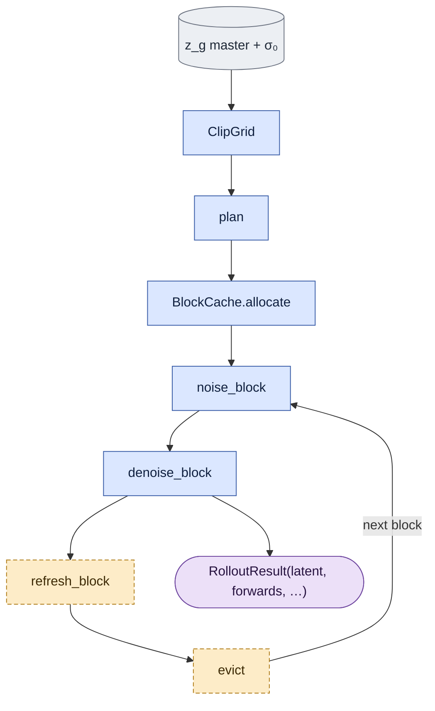

# `onestep_core.py` — the deployment rollout

> Contract and parity table: [core_algorithm.md §6](core_algorithm.md#6-train--probe--deploy).
> Open defects: [G3](known_gaps.md#g3--checkpoint-and-artifact-conditions-are-recorded-but-not-enforced),
> [G5](known_gaps.md#g5--training-and-deployment-disagree-about-valid-sigma).

## Objective

The deployed counterpart of `train.py`'s loop: one denoise plus one clean cache refresh per
block, over the clip's **master** latent, at σ₀.

Built **on** `causal_core`, never a copy of it. What differs from training is only the
forcing policy: deployment uses generated history and noises the guide master,
while teacher-forced training refreshes from the capture target.

## Data flow

## Organization logic

It is literally the same three calls in the same order the training loop makes. That is the
point: a train/deploy mismatch would have to be an edit to `causal_core`, not a divergence
between two implementations that were supposed to agree.

Deployment calls `causal_core` directly; it has no sliding-window renderer dependency.

## Invariants

- **`RolloutResult.forwards` counts BOTH passes per block** — the denoise and the refresh. A
  compute number includes cache maintenance, which cannot be omitted from deployed cost.
- **`guide_conditionings` refuses `d0`.** D0 noises the capture latent, and there is no `z_y`
  at inference; a deployable path must not be able to express it.
- **The caller supplies a real first-frame latent.** It remains clean at timestep
  zero in block 0 and is retained as the pinned cache sink. The guide's frame 0
  cannot substitute for that capture condition.
- A causal rollout writes one latent covering the whole chain, so there is **no per-window
  overlap to stitch** and no seam to get wrong.

## Invariants (continued)

- **`rollout` refuses an off-grid or multi-step σ₀.** `one_step_sigma` runs first, against
  `model_sigmas` (default: the distilled checkpoint's fixed 9-point grid,
  `ltx_pipelines.utils.constants.DISTILLED_SIGMA_VALUES`) — before `ClipGrid.build` or any
  forward. A caller with a non-default grid (e.g. a different distilled checkpoint) passes its
  own `model_sigmas`.

## Tests

Covered through `tests/test_causal_core.py` (the shared rollout) and
`tests/test_train.py::test_guide_conditionings_accepts_only_the_deployable_arm`.
`tests/test_train.py::test_rollout_refuses_an_off_grid_sigma0` covers the σ₀ guard.
