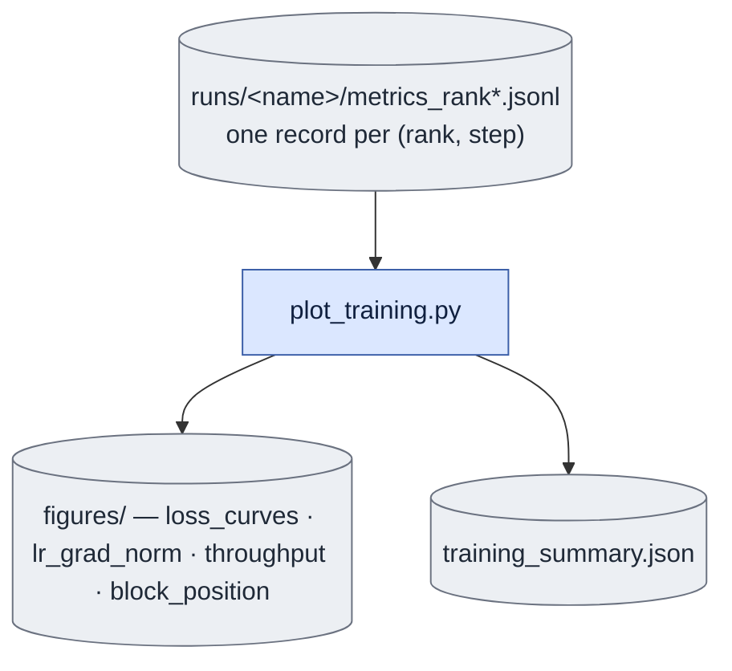

# `plot_training.py` — training curves from the per-rank logs

## Objective

Turn `train.py`'s `metrics_rank<r>.jsonl` into the figures a training review actually needs,
plus a `training_summary.json` with the numbers a write-up would quote.

A chain costs ~28 s and the quality signal is latent, so **the figures are the only thing
standing between a bug and a wasted GPU-week**.

## Data flow

Each record carries loss/mse/anchor, lr, grad_norm, elapsed_s and source.

`train.py` does no aggregation and no plotting of its own; multi-run overlay is how arms get
compared.

## Organization logic

**Why the mean-across-ranks loss is "the" loss curve.** Ranks are sharded over *different*
chains (a deterministic per-rank stride, not a `DataLoader`), and FSDP backward accumulates
gradients from every rank before the one optimizer step — so a step's mean loss across ranks
is the effective batch loss that update actually saw, the same role averaging plays over a
mini-batch's per-example losses.

This is training **diagnostics**, deliberately not the held-out evaluation table.

## Reading `block_position`

**Renamed from `window_position` on 2026-09-17** (S3 of that date's cleanup plan): the AR
chain's unit has been a causal **block**, not a sliding **window**, since the 2026-09-14
rewrite (SS4.4) -- the `plot_window_position`/`figures/window_position.png`/
`train/window_{i}_mse` names it replaced had been describing the wrong unit for three days.
A script or W&B chart referencing `figures/window_position.png` or the `train/window_{i}_mse`
metric family predates this date; nothing written after it produces those names again.
`wandb`'s per-run history is unaffected retroactively (a metric name is stamped per record,
not renamed after the fact), so a run's chart legend that spans the split simply shows two
metric names for the same quantity.

Chain position 0 is GT-seeded; later positions carry the model's own output. In the one
multi-actor run so far, position 0 sat consistently **below** 1 and 2 — a real, stable gap —
while 1 and 2 tracked each other. Read against SS1.6's two extremes: the gap **does not
close** (so `K > 1` is not buying nothing — position 0 alone would understate the deployed
task), and it **does not widen** (so error is not compounding worse as training proceeds).

## Known gaps

- **4 of 7 planned figures.** `mask_split` and `sharpness` need extra logging in `train.py`;
  `probe_strip` is superseded by `visualize_d0.py`.
- **No reference floor lines are drawn.** The old do-nothing/untrained constants (1.23/1.29)
  are wrong for the current data. Until per-dataset lines land, a loss curve here is a
  *shape*, not an "is training working" gate.
