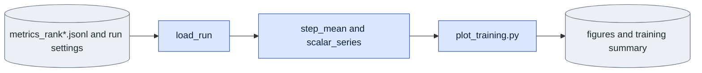

# `plot_training.py` — make readable training curves

Status: **Two-mode complete-update aggregation implemented. Focused aggregation tests pass; synthetic PNG/PDF figures and raw summaries were rebuilt and inspected.**
Current code includes `step_mean`, `scalar_series`, `_smooth`, and four plot functions.
Original logs stay unchanged. Existing top-level causal `per_block` logs remain readable.

## Objective

Turn per-GPU-process training logs into curves and `training_summary.json`.
Show what each optimizer update saw, how gradients behaved, and how long training took.
These are training diagnostics. Video quality needs the separate [media previews](media.md#training-preview-layout).

## Data flow

```mermaid
flowchart LR
  L[("metrics_rank*.jsonl and run settings")] --> R["load_run"]
  R --> A["step_mean and scalar_series"]
  A --> P["plot_training.py"] --> F[("figures and training summary")]
  classDef proc fill:#dbe7ff,stroke:#3b5ea8,color:#10203f;
  classDef disk fill:#eceff3,stroke:#6b7280,color:#1f2937;
  class R,A,P proc;
  class L,F disk;
```

Engine logs identify update, process, sample, sigma, unscaled loss, gradient norm before clipping,
learning rate, and elapsed time. Causal logs also identify block positions.
The plot reader never loads model weights or produces evaluation videos.

## Organization logic

### Read and aggregate logs

1. Read each process log in update order with the saved run settings.
2. Group records by completed optimizer update, not block number or JSONL line number.
3. Check which expected processes supplied that update and whether keys are duplicated.
4. For a complete update with equal accumulation counts, average unscaled process losses.
   Each process loss is its mean of sample losses; each causal sample is its mean of block means.
5. Read learning rate and synchronized gradient norm once and record maximum cross-process disagreement.
   Do not average away a disagreement in values that should match.
6. Take the maximum cumulative elapsed time across processes at each update.
   Subtract consecutive values for update wall time.
7. Write raw aggregated values and display settings with the summary/figure data.

`step_mean` requires complete process coverage and equal accumulation counts.
Plots keep incomplete updates out of the complete-batch mean and summary.
Show their available process traces and mark missing coverage; do not fill loss with zero.
Record covered process count and expected count.

`elapsed_s` is cumulative run wall time. Its differences can include saves or other intervening work.
They are not model-only generation timings. [bench](bench.md) owns those measurements.

### What the figures show

| Output | Layout and axes | Reading rule |
|---|---|---|
| `loss_curves.png` | one row per active loss field; x = completed updates; y = unscaled full-frame MSE/loss | thin raw mean and bold smoothed mean; optional faint process traces |
| `lr_grad_norm.png` | separate learning-rate and gradient-norm panels with shared update axis | show both values without combining their units; report process disagreement |
| `throughput.png` | update seconds on the left, cumulative minutes on the right | use slowest-process elapsed time and actual update gaps |
| `block_position.png` | causal only; one labeled line per position in the sampled block sequence | aggregate that position's MSE across samples/processes at each update |

For bidirectional mode, do not invent block-position curves. Mark that output not applicable in the index.
Block position is relative to the sampled sequence, not necessarily original video block zero.
History comes from the recorded forcing policy. A position label alone does not prove generated history.

Titles name the measured quantity. Axes state units.
Use consistent run colors and line styles, with readable legends outside dense data.
A multi-run label names the changed factor and exact value.
Put shared mode/data/level settings and smoothing width in the caption once.
Do not imply comparable loss scales when data, background, sigma exposure, or loss definitions differ.
Preserve raw curves so smoothing cannot hide isolated failures.

### Smoothing and summaries

Current `_smooth` clamps window `w` to series length and uses an equal-weight trailing window.
It repeats the first full-window mean in the initial `w-1` display positions.
Those leading values are display padding, not observations available at those earlier updates.
Record this convention. Summary values always use raw complete-update means.

Keep current summary meanings: final scalar values, minimum raw mean loss and its update,
mean raw loss over the last `max(1,floor(number_of_updates/10))` updates,
elapsed minutes, and distinct input videos.
Record process coverage, sigma counts, smoothing settings, and the actual loss definition.
Do not use a smoothed minimum as evidence of the best checkpoint.

### Old records

Current logs/readers can contain zero anchor fields and `per_window` records.
New training removes disabled anchor logging.
Convert required old position records to versioned block records with original ranges/meaning
before deleting the legacy reader. Keep original logs and conversion hashes.
Do not relabel an old window as a causal block without its frame mapping.

## Invariants

- Plotting reads saved logs and creates no model session.
- Process/sample/block averaging matches the training loss definition.
- Missing values are not zero observations.
- Learning-rate/gradient disagreement remains visible.
- Raw values, not smoothed curves, determine summary statistics.
- Different modes have explicit labels and only applicable plots.

## Gotchas

A lower training loss alone does not prove better identity or motion.
Random sigma draws give equal exposure only in expectation; show actual counts when comparing runs.
Learning rate and gradient norm have different units and need separate axes.
No historical constant is a reference floor for a new video list or task.
Use current saved controls if a report needs a reference line.

## Tests

Worked aggregation check: process losses 2 and 6 at one complete update give batch mean 4.
Matching learning rates remain one scalar; different gradient norms produce a disagreement value.
Cumulative times 10 and 12 seconds give update wall time 12 seconds.
Next complete-update times 18 and 21 give an additional 9 seconds.
Removing one process record makes that update incomplete, not a two-process mean with an invented zero.

Worked mode check: bidirectional logs produce loss, learning-rate/gradient, and timing figures.
They produce no causal-position figure. Causal logs label sequence positions from saved records.

After implementation, verify raw aggregation, incomplete coverage, legacy conversion, and summary formulas.
Inspect axes, legends, and smoothing disclosure at normal and narrow display widths.
Rebuild the same figures/summary from unchanged logs without training, transformer, or VAE execution.

### Implemented complete-update reader

Use `config.world_size` as the expected process count. For old logs without it,
use the number of discovered process files and mark that count as inferred.
Reject duplicate `(rank, step)` records and a file containing another rank.
Version-two updates must have equal nonzero sample counts across all processes.
Keep incomplete process traces, but exclude them from mean loss, timing,
position curves, and raw summary statistics. Save coverage and raw series.
New per-position data lives in each record's `samples[].per_block`; enumerate
that list to obtain sequence position, not the original block number.
The gradient norm returned by clipping is the norm before clipping; label it so.
The inventory found no `per_window` JSONL records and no nonzero anchor values
in 64 avatar process logs. This passes the reader-removal prerequisite; no old
position record needs conversion. The `per_window` and anchor plotting branches
are removed. Evidence lives in the workspace restructure evidence directory.

The figure set includes PNG and PDF files. Raw batch means, coverage, position
values and timing are saved in `training_summary.json`. Incomplete updates have
a dotted marker on the loss figure. Their available process traces remain visible.
