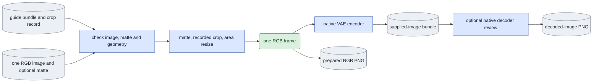
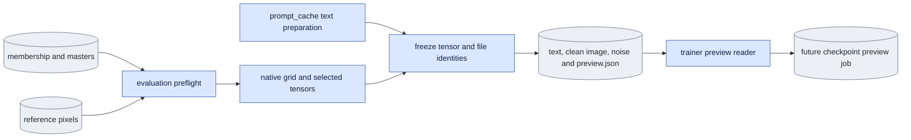

# `prepare_inputs.py` — checked product and preview input preparation

## Objective

Produce a supplied-image bundle from one actual RGB image, not a sliced video
master. Assemble fixed training-preview inputs from checked masters and prepared
reference pixels. Keep preparation outside training and product generation.

## Data flow

## Organization logic

### Fixed previews

Run `prepare_inputs preview --references <REFERENCES_JSON> --output <FRESH_DIR>
--gpu-id <GPU> --evaluation-arguments --mode <MODE> --subset <MEMBERSHIP>
--source <SOURCE> --variant <VARIANT> --guide-mode <D0_OR_D1> --schedule <LEVELS>`.
The trailing arguments use the ordinary evaluation parser. Require one explicit
source and reject execution-owned output/GPU/checkpoint/dry-run and future-noise
options. A base comparison is optional through `--include-base`. Reuse ordinary
data/schedule/geometry preflight; preparation opens no transformer.

Load and verify the supplied reference bundle before text work. Bind its source,
objective, capture/guide content, FPS, VAE and exact selected RGB frame coverage.
Freeze membership, optional frame plan, source bundle bytes and reference
manifest. Canonicalize path arguments to absolute paths and write the effective
selected encoded-frame count explicitly. For causal previews, preserve the
parsed training span exactly: omit `--span-latent-frames` when it is null and
retain its explicit value otherwise. Pin physical coverage using
`--output-latent-frames`, taking the explicit requested count or the actual
complete-block count from evaluation preflight. Bidirectional previews retain
their existing explicit selected span. Remove all original path, noise and both
length spellings, including `--flag=value`, before appending the canonical
arguments once. The original E4 null-span contract therefore stays null when
physical seven-frame noise is prepared; an explicit span-seven pilot keeps its
own training settings. Reparse canonical arguments before text/GPU work: an
explicit span 8 that ordinary evaluation trims to 7 cannot be prepared as
span 8/output 7, because explicit paired lengths must agree. Ordinary evaluation
without the new option keeps its historical trimming behavior. Do not rewrite
historical prepared records: this changes the preparation software identity and
requires fresh records and acceptance. Generate native-bf16 noise on the selected
GPU with the ordinary sampler's seed, or reuse a checked supplied noise
tensor; save the actual token tensor. Patchify through the same native grid as
evaluation, and pin capture, guide when used, clean first capture frame, positive
text and noise tensor hashes. The preview first frame is the training capture
encoding, not a product supplied-image bundle.

Get positive text through the shared prompt-cache owner. For CFG other than one,
prepare and pin negative text too. STG/rescale without CFG does not invent a
negative context. Save text/image/noise tensors, then the version-two
`onestep_avatar.preview_inputs` record with evaluation arguments, reference
identity and preparation software. Validate it through the trainer's actual
`read_preview_inputs` before final publication. Pass that record as
`train.py --preview-inputs <DIR/preview.json>`; future completed checkpoints
enqueue generation/rendering outside FSDP. Preparation does not enqueue or
generate a preview itself. Preserve historical reference/input provenance.

Check input files and software before text models, after preparation and before
publishing the complete record. Non-tensor preparation inputs are frozen in
`producer_inputs`; the shared preview reference checker checks those bytes for
both training preflight and preview jobs. Current evaluation loads fixed
negative context rather than rebuilding it, and verifies its actual tensor hash.

### Supplied images

Run `python -m scripts.onestep_avatar.prepare_inputs supplied-image --image
<RGB_IMAGE> --guide <GUIDE_BUNDLE> --output <FRESH_DIR> --gpu-id <GPU>` from
LTX-2 in `ltx`. White guides require `--mask <GRAYSCALE_IMAGE>`; bg guides
reject a mask. `--review` saves a native VAE-decoded still as well.

Read the guide with the checked master reader. Require the current registered
VAE fingerprint, finite square in-canvas crop, positive scale-aligned edge,
matching guide channels/spatial shape and encoding contract. Read exactly one
RGB image; reject animation and implicit alpha conversion. A white image needs
a grayscale matte with the same original canvas shape. No per-image inferred
box, centering, stretching, EXIF rotation, or thresholding is performed.

Use the guide's box in the original image canvas. For white, blend continuously
as `round(rgb*alpha + 255*(1-alpha))`, with alpha equal to mask/255. Crop and
resize through the shared fitted-crop helper and OpenCV INTER_AREA, matching
capture preprocessing. For bg, crop RGB directly. Prepared pixels are uint8
HWC; normalize to `[-1,1]` and pass native bf16 `[1,3,1,edge,edge]` to exactly
one `tiled_encode(pixels, None)` call. Require finite `[1,C,1,H,W]` output with
the guide's channels/spatial dimensions. Save a version-two master record with
`input_role=supplied_image`, `pixel_frames=1`, matching objective, fps, crop,
edge, VAE fingerprint and encode contract. Add actual image/mask/guide/VAE
content hashes, prepared-pixel identity and the shared preparation software
manifest. Preserve the guide; never change or relabel its first latent frame.

Hash all input bytes before reading and recheck after preflight, encode and
optional decode. Check the saved software manifest before model loading and
publication. Refuse an existing destination. Save prepared PNG and bundle,
optional decoded PNG, then publish the complete preparation record last. Record
elapsed time and CUDA allocated/reserved peaks separately from quality claims.

## Invariants

- One RGB image and one encode call produce the image latent.
- No transformer is opened. Supplied-image preparation opens no text encoder;
  preview preparation may build text through the shared prompt-cache owner.
- Crop/background/VAE metadata describe actual operations on actual pixels.
- A white objective requires an explicit matte; bg never uses one.
- Failed input/software checks cannot publish a completed preparation record.
- Current producer software does not restamp historical bundles.

## Gotchas

An image must be expressed in the guide crop's original canvas coordinates.
Matching shape cannot prove matching identity or pose. For a matched pilot,
export the source frame and matte as lossless images, record their source
provenance, and compare the prepared PNG to the capture preprocessing replay.
Single-image VAE encoding may differ from the first frame of a continuous
video encode; that difference is evidence to measure, not metadata to alter.

## Tests

Check exact crop/continuous-matte/area-resize pixels, one-frame native encoder
arguments, bundle compatibility with the product reader, and input immutability.
Reject missing/extra masks, animation, bad crop, wrong VAE/guide dimensions,
changed input/software and bad encoder output before final publication.
Worked check: RGB 0 and matte 128 yield round(255*(1-128/255)) = 127
before resize. A seven-encoded-frame guide still produces exactly one image
latent. Native encode/decode and matched capture pixels require separate saved
GPU evidence; controlled tests do not establish native correctness.

Native acceptance on 2026-10-07 used white source
`Part_2/0007_01/views/view01_cam57`, frame zero. Prepared RGB was byte-identical
to capture preprocessing replay, and both real seven-frame product preflights
accepted the resulting `[128,1,32,32]` image bundle. Independent image encoding
differed from the continuous capture first frame (RMS 0.00439134, max 0.046875).
Encode/decode took 6.52 seconds with 3.75 GB peak allocated memory; the shared
GPU 3 claim was released. Full/narrow rendered review and exact source/input
hashes are under `expr/onestep_avatar/handoff_implementation_20261007/` in the
workspace. This is one-image preparation evidence, not generated-video or E2
adapter acceptance.

Preview controls must cover both modes, D0 without a guide, D1, fixed positive
and negative text, exact selected noise/image hashes, and trainer/job reader
acceptance. Reject wrong reference coverage before text work, multiple sources,
owned flags, changed membership/frame plan and changed software before the final
record. A prepared fixed record alone does not prove native preview generation.
Coverage tests use real eighteen-frame masters and the original E4
null-span/frame-counts `[6,7]` contract. Prepare physical seven-frame inputs,
roundtrip the emitted arguments through ordinary evaluation and the strict
adapter checker, and require the trainer reader to accept the unchanged null
span. Explicit span-seven pilot preparation remains strict under its own
contract. Check both split and equals flag spellings, no duplicates, historical
bidirectional selection, and rejection of transferred settings before weights.

Fresh public fixed preparation passes both modes through the trainer reader
and strict adapter preflight. Capture, guide, clean image, text and
`[1,7168,128]` noise tensors match the original fixed inputs; both use
`[0.725,0]` and checked 49-frame references. The original causal E4 selection
remains span-null with physical output seven; the separate pilot stays span-seven.
`current_fixed_preparation_readback_20261008.json` under the workspace handoff
evidence directory binds this scope. Preparation opens no transformer; preview
execution and media acceptance are tracked in
[current acceptance](known_gaps.md#current-acceptance-and-next-step).
