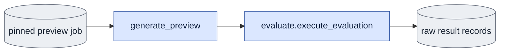

# `previews.py` — pinned training previews

## Objective

Own fixed preview records, locked state changes, raw generation and saved-output
rendering. Training enqueues a job; this module calls ordinary evaluation with
its one canonical tensor validator. It owns no trainer or sampler.

## Data flow

Rendering reads the fixed reference bundle and raw records. It opens the shared
VAE session, decodes only requested outputs, then calls the shared media owner.

## Organization logic

Recalculate the fixed-record hash, concatenated checkpoint/fixed identity,
every input-file hash and the checkpoint completion marker before execution.
Validate the checkpoint through the public metadata and tensor checker.
Reference RGB must bind the fixed capture encoding, source and guide render.

Lock job state writes. Permit pending→running/failed, failed→running and
running→complete/failed. A complete job has no outgoing transition. A different
live PID cannot replace the running owner. Failed states require a reason.
Complete states require byte-current raw results and video/poster records,
matching job/fixed identities and at least one pinned adapter result.

Each retry chooses the first unused attempt directory. Pass typed ordinary
arguments and `preview_fixed` to the evaluator. Pass the public
`verify_preview_tensors` as its explicit `preview_tensor_validator`. The
evaluator rejects a fixed preview without that callable before native handles,
weights or writes. After assembling the actual execution tensors, it calls
this validator at the same point as before the owner split. This module has
a one-way import of evaluate; evaluate imports no previews module.

The tensor checker hashes shape, dtype and actual tensor bytes through hashing.
Check every pinned tensor except the subset file. Missing or changed tensors
fail before the transformer. On success, verify and retain raw records. Render
only when pinned reference pixels exist; raw-only output stays running.

The rendered panels remain recorded capture, VAE-decoded capture, guide,
optional base and pinned adapter output. Keep exact source frames/fps and
shared equal-height media layout rules. Missing base output is explicit.

Worked check: a failed attempt_0000 remains unchanged. Retry writes
attempt_0001 with the same checkpoint and fixed inputs. A changed noise tensor
fails before transformer loading and records its reason; checkpoint bytes and
completion marker stay unchanged.

## Invariants

One validator owns fixed tensor checks. The evaluation software receipt includes
this validator owner. Never change a training or checkpoint file. Completion
requires raw and rendered evidence under the same running owner.

## Gotchas

Generation and rendering are separate evidence stages. A saved raw output alone
cannot certify complete preview media. Retain original retries and receipts.

## Tests

Preserve all state, mutation, retry, rendering and pin controls in test_previews.py.
Add missing-validator refusal before native handles or writes, and assert the
canonical validator reaches ordinary evaluation. New CLI help uses --preview-job.

### Preview verification and state changes

An optional fixed `reference_bundle` pins an absolute manifest path and its
full file hash. Load its checked pixel records during training/preview preflight.
Require its capture-encoding hash to equal the fixed capture file hash and its
source to equal the one explicit evaluation source. D1 additionally checks the
guide RGB identity against the pinned guide bundle's encoding fingerprint.
Reference pixels or a bundle from another source fail before generation.
Older raw-only preview records can omit this field; they cannot claim complete
reference/render integration from that omission.

`verify_preview_job` checks the job ID against checkpoint and fixed-record
hashes, the completion marker, all fixed file hashes, and actual version-two
adapter matrices/step. It performs no model or decoder operation.
`set_preview_state` permits pending/failed to running and running to complete
or failed. A live running owner cannot be replaced. Changes use a per-job file
lock and an atomic JSON write. Checkpoint bytes and marker stay read-only.
To mark complete, verify every saved result encoding and every rendered output
against their records. Missing raw or rendered evidence fails completion.
### Preview generation stage

When fixed inputs include a reference bundle, raw generation continues into
`render_preview_outputs` in the same owning process. Verify saved raw results,
reference hashes, source/FPS/coverage, current native decoder settings and the native VAE hash before loading
a decoder. Require exactly one pinned adapter result and at most one base
result. Decode those saved encodings with the reference decode seed; no
transformer is reopened. Show the checked three references above base/adapter
outputs in the training layout. If no base result was requested, label that
panel missing. A changed Torch version or decoder configuration fails before
opening the decoder; prepare new references for that runtime. Save actual
decoder identities and link raw-result records in rendering
settings. Mark complete only through the existing completion gates. Rendering
failure propagates to the generation stage's failed-job handler. Standalone
render-owner recovery and real native full-preview acceptance remain pending.

`generate_preview(job_path, gpu_id=...)` is the package-owned raw generation
stage. Invoke it with `previews --preview-job <job.json> --gpu-id <ID>`;
this route accepts no study-setting overrides. Verify the fixed files and completed adapter, claim the job under its
state lock, and build evaluation arguments from the saved settings. The
executor adds the pinned checkpoint and a new numbered attempt directory;
it never changes training settings or overwrites an earlier failed attempt.
Read the fixed text tensor directly instead of rebuilding text from a prompt.
Before opening each transformer, compare actual capture, guide, first-image,
text and saved-noise tensor hashes with the fixed record. A mismatch fails
before any transformer call.

After generation, verify saved raw records and their encoding hashes using the
same completion gates. Record these results on the running job. Raw generation
alone cannot mark the job complete: checked reference preparation and media
rendering must still supply the final rendering evidence. Any ordinary failure
records `failed` with its exception type/message, then propagates the error.
An initial pinned-file verification failure records a failed pending job before
claiming it. It does not change a job already owned by another process or a
terminal job. The tensor checker requires all pinned tensor roles; omission
does not bypass verification.
Checkpoint and completion-marker bytes remain read-only. A second process
cannot claim a running job owned by a live process. A failed job can retry in
the next attempt directory. Automatic rendering with pinned references exists;
standalone render recovery and full native preview acceptance remain pending.

A failed-state update validates the immutable job identity but does not require
unchanged input/output bytes: this lets the executor record an input-corruption
failure. Running and complete transitions still verify all pinned files.
`--noise-file` consumes one finite native-bf16 token tensor for one selected
video. Preflight checks its shape. Execution uses the retained CPU tensor rather
than rereading a file after opening weights or silently changing its dtype.

Fixed preview inputs may include negative text when CFG uses it. Load that saved
context and verify its tensor hash with all other fixed tensors before any
transformer call. Never rebuild fixed negative context from the prompt cache.
The shared reference checker also verifies non-tensor `producer_inputs` such as
membership and frame-plan bytes pinned by the preparation command.

Preview and saved-comparison decoder jobs capture the decoding software profile
before preflight, check it before the VAE session and media publication, and save
it in each rendering. Saved-comparison current completion compares the same
shared manifest, including native video-VAE and preprocessing dependencies.

Training preview rendering checks exact reference/output titles with
`media.layout_geometry` before opening a decoder. Use the normal training
layout when it fits, otherwise the existing compact planner. A no-fit result
fails before decode and leaves the completed checkpoint intact. Both layouts
keep the reference roles and adjacent output roles specified in `media.md`.
For D1, a reference bundle with no guide is invalid even when a malformed
guide bundle also omits its render fingerprint. Null values do not establish
matching guide identity. Reject this before a decoder or transformer is opened.

