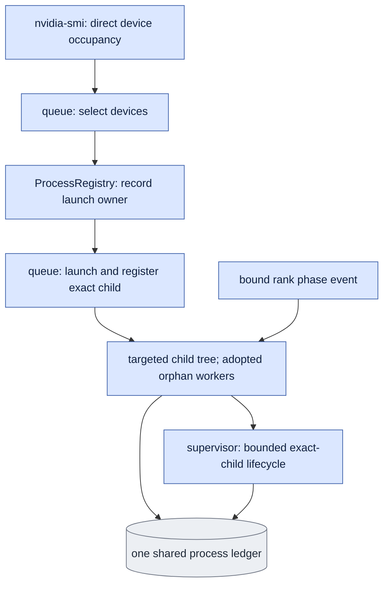

# `process_registry.py` — shared records of our own package processes

## Objective

Keep one shared JSON ledger of exact package-owned process identities and GPU
IDs. Query `nvidia-smi` directly for device occupancy. Do not read legacy GPU
reservation files or scan unrelated process environments.

## Data flow

The dedicated queue owner enables Linux child-subreaper behavior before launch.
A subreaper adopts orphan descendants, including workers in new sessions. It
records its exact PID/start ticks/command and pre-launch direct-child baseline.
The ledger contains one attempt token, requested GPU IDs, the owner, registered
child and observed descendant identities. Rank-bound phase notifications attach
rank roles to the same identities. Records preserve observed command transitions.

The ledger records ownership and coordinates this package's starts. It is not a
per-GPU reservation directory. Device inventory remains direct observed input.

## Organization logic

`ProcessRegistry` uses one JSON data file and a stable sibling flock file for
atomic updates. `choose` considers direct memory observations and active own
records. `acquire` locks the ledger, re-queries direct device occupancy, and
records a fresh owner before `Popen`. Concurrent package starts cannot both
register the same requested devices. No historical claim file is consulted.
Lock waits have a five-second deadline. The ledger must be a regular JSON file
within eight MiB. Read it through one nonblocking descriptor. Atomic updates
reject larger bytes before publication. An observation's explicit timeout covers
its lock wait, read and targeted-tree traversal.

`refresh(child_pid=...)` registers the exact launched handle, then reads only
the owner's `/proc/PID/task/PID/children` tree. It excludes exact pre-launch
baseline handles, never broad environment contents. Observe descendant handles
and children twice. If an intermediate parent exits, Linux reparents surviving
descendants to the live subreaper; the second pass observes them there.
New-session workers remain descendants and do not escape this ownership path.
Keep PID/start identity exact. Preserve every discovered process and command.

The current owner must still be the original live handle with subreaper enabled.
Enumerate every targeted process's task directory, so children forked by another
thread remain in scope. Recheck the original owner and its direct children after
traversal before declaring an empty tree.
Each targeted read has a finite elapsed deadline and a maximum tree size. An
unreadable handle, PID reuse, changed owner or lost containment returns incomplete
evidence. A saved row whose owner died cannot inherit proof from a new observer.
It remains unknown until an explicit supported recovery can establish absence.
No privileged read is requested or substituted.

`queue_launch.recover_owned_attempt` is the explicit bounded recovery for a lost owner whose
registered rank workload has completed. It does not reconstruct the lost child
tree or certify continuous supervision. The caller supplies the original token,
immutable launch request and process-ledger path. The request, bootstrap, grant
and unchanged interrupted journal bind the original token, job, owner, launcher
and notification hash. The launch recovery owner uses the existing supervision
event rules on a bounded private snapshot. It requires every declared rank and
phase. Each producer must be an exact
previously contained descendant; a reported but uncontained producer is refused.
The saved launch child and all registered descendants must also appear in a
complete original-owner observation. Check the exact owner, launch child and
every saved descendant twice, around one direct GPU inventory. All must be absent
or terminal, without PID reuse or denied reads. Each selected GPU must currently
use less than 1024 MiB. An incomplete rank inventory, live handle, changed bytes,
invalid inventory or elapsed deadline leaves the active row unchanged.

On success, change only that row's state to `closed` and add a separate `recovery`
record with the original-row hash, observer, notification/event hashes, both
current handle observations and direct GPU sample. Keep its original process and
observation fields unchanged. Set `continuous_supervision=false` and
`containment_complete=false`. The evidence proves ended registered workload and
current device availability; it does not prove absence of unknown descendants
after containment was lost. Saved scientific results and the interrupted queue
journal remain separate and unchanged. The queue's existing explicit recovery
can subsequently verify scientific completion against those original results.
The legacy closed-row reader currently labels every closed row as saved empty
containment. For recovered rows, the explicit recovery scope is authoritative;
that label does not add containment or supervision evidence. Repair that reader
after the original source-bound native replay, preserving the original source
bytes for that replay.

`observe_workers` returns whether any tracked descendant remains live, the
complete/incomplete scope, and exact identities. `release` marks this attempt
closed only when current live-owner containment proves no live descendants.
It never deletes historical records. A failed or unknown proof preserves the
active record. `registered_identities` returns the previously recorded exact
handles as additional conservative stop candidates. The supervisor signals the
leader and every identified own descendant through individual pidfds. Unknown
or surviving workers stay in the ledger for later exact owned recovery.

Worked check: a child starts a worker in a new session and exits. The owner is
still the original subreaper. The worker becomes the owner's direct child and
remains live in `observe_workers`; `release` refuses. After exact pidfd stop of
that worker, a complete empty tree permits closing the attempt. No SSH process
or other unrelated process environment is inspected.

Worked dead-owner check: the frozen notification contract declares four ranks.
All four producers match saved descendants, and every expected phase has begin
and end events. Both exact-handle passes find the owner, launcher and ranks absent;
GPU usage is `[276,4,4,4]` MiB. Bounded recovery closes that one operational row
with its supervision limit recorded. If rank three's final end event is missing,
or one exact saved rank is live, the row stays active. Neither outcome claims
successful original external supervision or changes a training result.

## Invariants

- No per-device reservation file or broad `/proc/*/environ` scan occurs.
- Availability requires a current direct `nvidia-smi` query.
- Recorded identities contain exact PID, start ticks and observed command.
- Only a live original subreaper owner can certify its complete descendant tree.
- Missing process identity is distinct from PID reuse or a denied read.
- A new observer cannot relabel lost containment as worker absence.
- Unknown or live handles refuse both closure routes; closing preserves their history.
- Dead-owner closure requires complete bound rank evidence and direct idle devices;
  its evidence never claims a complete current descendant tree or continuous supervision.

## Gotchas

Subreaper is a process property. The dedicated queue owner must enable it before
launch and run one attempt at a time. Children that already existed before the
attempt are excluded only by their exact baseline PID/start handles. New extra
children are conservatively tracked. Inventory subprocesses finish and are
reaped before the target-tree observation. Loss of the original owner loses the
complete live containment proof; the saved record states that limitation.
GPU memory is sampled device occupancy, not Torch allocated memory. Existing
resource-budget measurements remain the allocator authority.

## Tests

CPU tests cover atomic own-start coordination, direct inventory recheck, exact
child registration, PID reuse/denial, closed-record retention, owner loss,
subreaper adoption of a real new-session worker, and refusal to close a live or
incomplete attempt. GPU inventory is mocked; no native model run is certified.
Recovery tests also cover complete saved rank evidence, missing/mismatched ranks,
live/reused/denied handles, uncontained producers, non-idle/incomplete inventory,
deadline failure, original-row preservation and explicit closure scope.
