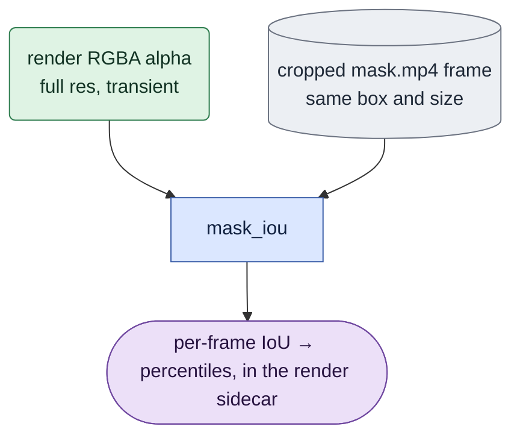

# `qa.py` — alignment metrics for the review gate

## Objective

One number: `mask_iou(render_alpha, capture_mask)` at the dataset's own 128 threshold. It is
the B1 alignment gate's decisive measurement — whether the render and the capture describe
the same subject in the same pixels — computed before any training is attempted.

## Data flow

Called once per frame inside `build_guidance.render_pair`'s single pass over the RGBA frames,
because that is the only moment the full-resolution alpha exists.

## Organization logic

Pure numpy, 25 lines, no dataset or GPU dependency — the same reason `geometry.py` is pure.
A metric that gates a corpus should be trivially testable and trivially auditable.

## Invariants

- **IoU is computed from the render's raw alpha against `mask.mp4`, never from composited
  pixels.** This is what keeps the number meaningful once the guide carries a background:
  the composite changes every pixel outside the subject, and an IoU computed after it would
  drift for reasons that have nothing to do with alignment. Confirmed in review — IoU stayed
  0.84–0.95 on exactly the clips with the largest ghost bands.
- The 128 threshold is the dataset's own convention for `mask.mp4`, not a tuned parameter.

## Reading the number

Corpus-wide: IoU p50 mostly 0.89–0.93. This is a QA/alignment diagnostic, not a training
gate: `train.py`'s loss is unconditional full-frame MSE with no mask or disagreement
weighting (2026-09-18 audit, binding decision), so there is no "masked loss mandatory" band
to route a pair into and a missing/low-IoU mask QA artifact is not by itself a reason to
exclude an otherwise valid full-frame D1 pair. A low IoU is still worth a second look for
render/pose misalignment — one clip (`0047_01`) sits low (p0 0.573, p50 0.675) — but the
action it motivates is investigation, not automatic rejection.

## Tests

`tests/test_qa.py`
