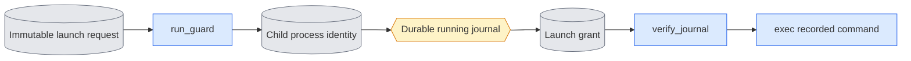

# `queue_launch.py` — register the child before model execution

Status: **Persistent dispatch uses the launch gate. Real CPU-process dispatch and guarded recovery checks pass; native acceptance remains pending.**
Transient internal calls without a journal are outside the persisted protocol.

## Objective

Close the interval between process creation and durable PID registration.
A queue child must not start model work until its identity is saved and approved.
Keep launch control in the package, separate from training and evaluation logic.

## Data flow

The queue produces the request, journal and grant. The guard produces only its
bootstrap identity. Each file has one producer and an exclusive publication path.
These records are launch evidence, not model results or completion receipts.

The explicit `--recover-owned` route consumes an existing approved launch
request and the shared process ledger. It does not enter `run_guard` or launch
anything. It adds a separately attributed operational closure record only after
checking bound complete rank notifications, ended exact registered handles and
current direct GPU inventory. Its source identity is recorded separately from
the unchanged original training producer.

## Organization logic

If owner inspection finds the original owner missing, terminal or replaced,
recheck whether the grant was published during that inspection. A valid durable
grant can precede owner exit even when the loop's earlier grant check saw none.
Continue to the full grant/request/journal validation if a grant now exists;
otherwise refuse as before. Do not treat owner exit as approval or manufacture a
grant. For example, absent grant → inspect owner → published grant → owner exit
must honor the saved approval; absent grant → owner exit with no grant must fail.
A deterministic race test pauses that decision and publishes approval before
the observed owner-death result. Existing real-process tests cover both paths.

`prepare_request` requires a fresh token directory, an exact token/job hash,
an owner process identity, a journal path, job ID and a nonempty command array.
Resolve paths and publish `request.json` exclusively. The queue selects the
command through its fixed package owners; the gate does not select models,
settings, GPUs or scientific inputs. Tests use CPU commands as controlled consumers.

The child CLI's ordinary route accepts `--request`, a finite positive wait timeout and poll
interval. It checks the inherited token/job environment against the request.
Before opening model libraries, publish `bootstrap.json` with its PID, start
ticks and actual command. While waiting for `grant.json`, verify the exact owner
PID/start ticks/command remains live and the request bytes remain unchanged.
Missing or reused owner handles stop the gate. The deadline is a failure, never
permission to execute. A stale or preexisting bootstrap/grant is refused.

A grant binds request SHA, token, job hash and bootstrap identity. Before grant
publication and again before execution, read the saved journal. Require the same
job hash, running state, PID/start ticks, token/job environment, exact command,
request path/hash and launch protocol. A grant published before the PID is saved
cannot authorize execution. Unknown, changed or missing evidence stops the child.
Once a valid grant exists, owner exit does not revoke it: the PID is already
registered, so ordinary queue recovery can observe the surviving child.
Only the recorded owner process can publish approval. Parse and hash one observed
request byte buffer. Recheck those bytes before approval and execution; do not
pair settings from one file version with the hash of another.

`os.execvpe` replaces the guard with the exact command using its inherited
environment. The PID and start ticks remain the same; the command changes once
from the guard command to the approved command. `verify_command_transition` explicitly
checks that transition against request, bootstrap, grant and running journal. The guard starts
no second process and does not kill workers. `publish_grant` does not release claims.

Worked check: a CPU child would write `executed.txt`. Before durable PID
registration and grant publication, the file must not exist. After a matching
journal and grant, the child writes it and exits. If the owner disappears first,
there is no grant and the child exits without writing the file.

### Ended owned-attempt recovery

`recover_owned_attempt` requires the original request, bootstrap and matching
grant. Read bounded regular files and validate the immutable request hash,
token/job, exact original owner, child and approved command against the saved
running journal and its latest attempt. Require the journal's original
notification hash and exact process-ledger path. Copy bounded notification bytes
to a private snapshot and apply the unchanged supervision `_contract`/`_consume`
rules. All expected ranks and phases must be complete. Recheck original event
and journal hashes before publication. No external phase timing is inferred.

Under the ledger's stable lock, require an active original subreaper attempt,
matching owner/launch child/GPU list and previously complete containment covering
every registered descendant. All rank producer handles must exactly match those
contained descendants. Check owner, launcher and every registered descendant
twice around a bounded direct `nvidia-smi` sample. Missing or exact terminal
handles qualify; live, denied or reused handles refuse. Require every selected
GPU below 1024 MiB, as for existing dispatch. Observation timeouts and invalid
inventory refuse without writing the ledger.

Use the existing registry lock/read/write implementation as an internal
compatibility interface for this one recovery transaction; do not implement a
second ledger format or writer. Keep `process_registry.py` and `supervision.py`
bytes unchanged during original source-bound native replay. This scoped route
does not alter their scientific producer manifests or relax source verification.

Successful recovery changes only the selected ledger row's state and adds a
`recovery` record. Preserve all original identities, commands and observations.
The new record binds original row/launch/journal/notification/event hashes,
recovery source, observer and both handle/GPU observations. It states
`continuous_supervision=false`, `containment_complete=false` and
`registered_workers_absent=true`. Unknown descendants after owner loss remain
outside that proof. Preserve interrupted supervision and scientific artifacts.
The existing queue's explicit `--recover` can then verify the original saved
completion; it does not manufacture successful external supervision.

Worked case: four bound ranks finish all four declared phases, all five saved
launcher/rank handles and the owner are absent on both passes, and GPU memory is
`[276,4,4,4]` MiB. Close only that row with the scope above. A missing rank end,
uncontained rank, live worker, reused PID or busy device leaves it active.

## Invariants

No model imports or scientific parameter changes occur here. Ordinary launch
does not discover GPUs; explicit ended-attempt recovery samples direct inventory.
Publication never replaces another record. Model execution requires a matching
persisted journal and grant. Request, bootstrap and grant have distinct producers.
Owner absence before approval never authorizes work. Guarded recovery requires
proof of absent approval and a terminated original owner; missing tokens or a
registration timeout alone cannot authorize takeover.

## Gotchas

The child can be between fork and Python startup when its owner dies. It cannot
execute the model because no grant exists, even if its environment token is not
yet visible in `/proc`. Waiting must stay finite. A startup timeout leaves launch
evidence for explicit recovery; it is not a training contention retry.
A guard that already execs has a different command line but the same process
identity. Old unguarded journal entries retain their conservative recovery rules.

## Tests

Use real CPU children and inspect bootstrap identity while they wait. Prove no
consumer output before approval, same PID/start ticks after exec, refusal of
missing/mismatched journal data and changed requests, owner disappearance,
exclusive record publication, and finite timeout. These checks establish the
launch-control protocol. Real dispatcher checks also prove journal-before-grant ordering, exact approved
command transition, changed-evidence refusal and claim retention on interrupted
registration. They do not prove model execution, native GPU behavior, FSDP
correctness or safe recovery of old unguarded entries.
Bounded ended-attempt controls check complete rank inventory, exact handle
absence/terminal state, live/reused/denied refusal, bound approval/journal bytes,
busy/incomplete devices and unchanged original-row evidence. The returned scope
explicitly excludes continuous supervision and complete post-owner containment.

### Dispatcher integration design

Implemented dispatcher order: publish a fresh request under the queue state's
`launches/<token>/` directory; save a running attempt with protocol, request
path/hash and intended command; spawn the model-free guard in a new session;
refresh owned claims with its PID; wait for a valid bootstrap. Require the
bootstrap's PID to equal the child returned by Popen and its actual command to
equal the guard command. Require a stable live handle, exact request hash,
token and job hash. Bound the wait and refresh reservations while waiting.
A timeout, nonzero guard exit or mismatch publishes no approval.

Save the bootstrap identity in the running row and latest attempt using the
queue's atomic transaction, then publish the grant. Keep that original identity
in the journal after exec so the guard's final journal verification cannot race
with a parent rewrite. Child inspection can accept the approved model command
only after checking the unchanged request, bootstrap, grant and journal binding;
PID/start ticks must remain identical. Old direct-launch rows have no such
exception. A grant never authorizes a different command or a different handle.

Persistent queued dispatch must use this protocol for all prepared job kinds.
The transient internal run_child interface without a journal cannot produce a
bound approval and remains explicitly outside persisted launch recovery.
Registration failure keeps a still-live guard and its owned claims until it
exits; never kill or adopt an unrelated process to make a timeout succeed.
Guarded unapproved recovery is implemented below. Old unguarded recovery stays conservative.

Before returning from exclusive publication, fsync the file and its containing
directory. The queue likewise syncs its JSON bytes and atomic replacement before
`publish_grant`. `wait_registration` refreshes reservations and checks the actual
Popen child against the bootstrap; malformed or changed registration refuses.
`guard_command` selects only this model-free CLI using the current interpreter.

### Guarded launch recovery design

For a running row with missing PID or stable identity, `inspect_unapproved_launch` checks
the protocol and unchanged request. Require the row and latest attempt to bind
the same job, command, owner PID, environment token, request path/hash and valid
attempt start ticks. Read the original journal and verify those fields there.
The original owner must be terminal or missing; a live or reused owner refuses.
No grant may exist. An existing grant with a missing recorded PID is inconsistent
approval evidence and cannot authorize takeover.

If a bootstrap exists, require its exact token/job/request identity and guard
command. Inspect its PID/start ticks. A live guard or changed handle refuses;
a terminal matching guard may have an empty Linux zombie command line. Scan
session/token workers before recovery. Observation errors remain errors.
Without a bootstrap, absence of a token alone does not prove no child exists:
a child can still be between fork and exec. The missing grant plus terminated
original owner proves that such a guard can never start model work. Report this
as `unapproved`, not as a known terminated child. No new approval can be issued
by a different owner identity.

Explicit recovery records an unapproved attempt as failed, with attributed
recovery evidence in its row and latest attempt. Do not run completion checks
or accept old output as a completion of work that was never authorized. Preserve
partial files, logs, request and attempts. Recovery neither launches a retry nor
removes claims. Normal reservation ownership still blocks surviving workers.
Old unguarded missing-PID rows retain the original refusal rule.

The same proof also covers an interrupted registration whose exception handler
saved a PID but not the stable identity. Require any recorded PID to match an
available bootstrap. An unknown current handle with no bootstrap refuses even
when terminal; do not adopt an unidentified or reused process. The latest
attempt may omit the PID before publication, but must not contain a different
PID or an already-registered identity. A dangling bootstrap or grant symlink is
unknown evidence and refuses recovery. A live original owner still refuses.

A real controlled interruption after bootstrap leaves a running row with a
PID and no identity. After owner/guard exit it must recover as unapproved,
without accepting saved output or discarding its log, claim or original attempt.

Before marking the latest attempt failed, capture its complete prior JSON record
in `launch_recovery.prior_attempt`. This preserves its original interruption
error, state, PID fields, command, log and environment. Recovery's new error
explains its own decision; it must not erase the original failure observation.
