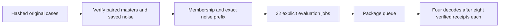

# `sigma_sweep_jobs.py` — preserve historical generation as package jobs

## Objective

Read study choices as data and prepare explicit causal evaluation jobs. Do not
launch models, choose GPUs or alter original probe evidence. Generation, saved
decoding and report assembly remain separate package/report stages.

## Data flow

A cases JSON names original official/one-step manifests and tags. Their saved
source, text, schedule, guidance and epsilon identities produce checked one-view
memberships, saved 17-frame noise prefixes and eight evaluation jobs per case.
The public package queue executes that job list later. Each case also produces
a version-two decoding spec embedding its eight evaluation jobs and one
sigma_sweep queue job depending on all eight IDs. This yields 32 evaluations
plus four dependent decodes. Specs pin original masters and the current VAE;
unknown future tensor hashes are resolved only from verified scientific results.

Noise is `[1, master_frames * height * width, channels]`, bf16. The
published prefix is `[1, 17 * height * width, channels]`; no model state
or GPU claim exists during preparation.

## Organization logic

Require original frozen 2.5/distilled white paired probes, generated cached
history, block two/context eight/sink one and no guidance changes. Require the
four exact levels with recorded one/two/three/eight-call schedules. Verify both
manifests name the same source, seed, prompt, capture/guide and epsilon hashes.
Older manifests omit guidance fields. Require an explicit cases-file declaration
in that situation, attributed to the inspected historical unguided source hash;
require its source path and verify that hash, and include it in the final
input recheck. Do not silently assume defaults from a missing field.
Use subset.from_saved_probe for canonical paired-source checks; preserve the
original master hashes. The replay group is historical bookkeeping, not a
new train/validation split. Current raw/crop metadata is labeled separately
from recorded historical encoded identities.

Check sampled historical transformer/VAE identities against the current files,
and the encode record's VAE fingerprint against the actual current VAE. These
checks do not invent missing historical full-file hashes. Read the original
full-video bf16 epsilon and slice only its first 17 encoded frames, including
the unused c0 noise slot. Never redraw noise. Require its serialized hash and
exact full-master shape. All eight jobs share that one saved noise prefix.

Each job explicitly names causal mode, source, D0/D1, distilled weights,
17 frames, block two, eight blocks, context eight, cache/refresh history,
original seed, literal prompt and exact schedule. Use fresh per-cell outputs.
No checkpoint or research override is introduced. Job completion names the
single ordinary evaluator result record. Validate package job schema before
publication and recheck original files both before and after derived writes.
The preparation record binds all thirteen derived files and the current producer,
subset and evaluator source hashes. A late change leaves partial data without
a preparation record or job list. Publish jobs.json atomically last.
Require the exact sigma inventory in each original manifest, not just one
matching row for each selected job. Access the evaluator's public parser directly.

## Invariants

Inputs and original outputs are immutable. Validate every case before creating
the fresh output directory. A failed source or noise check produces no job list
and opens no model. Saved historical GPU assignments are evidence only; the
package queue owns current GPU selection and excludes GPUs 6/7. Preparation
does not imply native generation. Actual queue execution automatically schedules
decoding after its evaluation dependencies verify; report rebuilding stays separate.

## Gotchas

The old shell launcher drew one full-video noise realization shared across arms
and sigma levels. Drawing a shorter fresh tensor can change the random mapping.
Preserve the stored prefix exactly. The two original manifests must agree on
their input inventories; do not promote one consistent row over conflicting
rows. The legacy launchers/analyzer are retired now that downstream generation,
matched decoding and report behavior use the package/report owners. Their exact
bytes/hashes are preserved as provenance text; native parity remains separate.

## Tests

Check exact eight-job coverage, arms, source, geometry, prompt, seed, schedules,
shared saved noise and result paths. Reject changed manifests, raw noise,
conflicting paired inputs, wrong forcing/guidance, wrong weights and existing
output. Real read-only preparation verifies the four historical cases; native
model and queue execution remain separate acceptance requirements.
