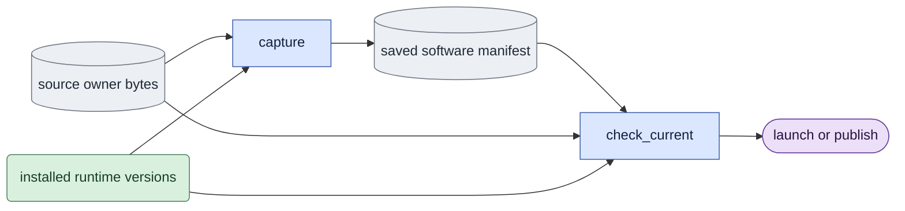

# `software.py` — bind the actual producer computation

## Objective

Produce and check one explicit source/runtime manifest for current training,
evaluation, inference, decoding and native input preparation. Hash actual worktree bytes, including dirty
files. A Git revision or entry-file hash does not identify the computation.

## Data flow

The producer snapshots its profile and selected mode before launch. The manifest
contains relative LTX-2 source paths, SHA-256 digests, installed runtime versions,
Python and Torch CUDA build versions, and a canonical content digest. Producers
store it in their records, recheck it before model work and before publication.
Current completion verifiers require the same current profile manifest.

## Organization logic

Import `LTX_ROOT` from the package marker for every source path. `COMMON`
includes that marker because its bytes define repository roots. A move into a
subpackage cannot change the source tree or child working directory.

An explicit experiment can add its own relative source owners through
`capture(..., extra_sources=(...))`. The sorted unique paths are saved only when
nonempty. They must remain inside the LTX-2 tree and name Python source files.
Current checks recalculate the same profile plus those saved owners. Ordinary
calls use no extras and do not bind experiment files. This extends the one
manifest calculation; it creates no second provenance format or registry.
The training profile includes the reusable optional Adam-state exporter,
applied-runtime recorder and synchronized process-resource measurement owner.
It also pins the canonical queue launch authority used by current training.
The optional actual-consumer trace and bounded supervisor are reusable support
owners. The same profile pins the current shared own-process ledger, whose direct
GPU inventory and targeted descendant tracking replace reservation files for
new launches. Old manifests retain their original owner lists and scope.

Use explicit owners for package data/config/checkpoints and capture preprocessing,
common/noise/sampling,
adapter loading and the selected mode. Add the entry/runtime owner for the chosen
profile. Model execution includes shared pruning core and prompt-cache owners,
trainer loading and the core transformer/attention/guidance/loader/model tools.
Record pipeline utilities that supply stock schedules and guidance.
Evaluation also pins the stock sampling diagnostic and the reviewed outer
pipeline calls. Native conditioning and batch splitting belong to the model
source inventory; their absence could otherwise change matched sampling without
invalidating a manifest.
Decoder profiles additionally pin media, saved decoder/sweep entry owners, native decode
and video-VAE source owners.
The preparation profile permits an absent model mode for the one-image producer
and pins its entry owner, the trainer's fixed-input reader and native encoder/
decoder source groups.
Declared directory groups expand deterministically to their current Python files;
a missing owner/group fails. Do not discover sources from imported modules or
silently ignore absent files. This records the specified dependency boundary,
not every library source file on the system. Installed distributions identify
third-party runtime versions, including optional attention backends.

Validate schema, profile/mode, safe relative source paths, digest syntax,
runtime records and the canonical manifest hash before using the record. Current
verification then recalculates the same profile and compares all fields. Adding,
removing or changing an owner and changing a runtime version fails. Read-only
historical validation checks saved integrity without requiring today's sources;
it never restamps old results as current. Preserve historical outputs when the
current verifier rejects them. No research override bypasses software checks.

## Invariants

- No model, decoder, GPU discovery, Git mutation or output repair occurs here.
- Relative paths identify the declared code owners; hashes bind worktree bytes.
- Launch and publication use the same saved manifest, not a new replacement.
- Historical readability and current completion are separate checks.
- Dtype/application/conditions and weight/input hashes remain separate evidence.

## Gotchas

Version strings cannot identify editable local model code; source hashes cover
that code. Optional absent distributions are recorded as null. Source changes
during a job leave unaccepted partial outputs. This manifest alone proves neither
numerical parity nor quality. Decoder wrappers can depend on transformer/loader
code through native Session factories, so their declared group retains those
owners rather than assuming only video-VAE source matters.

## Tests

Check mode-owner selection, dirty source changes, added/removed dependency files,
runtime-version changes, malformed/hash-tampered records, and historical reading
after a source change. Producer tests must show changed model helpers prevent
publication and completion while entry files remain unchanged. These are
software-identity checks; native E1–E5 still require their own evidence.

Worked check: capture an evaluation/causal manifest, then change only
`model/common.py` bytes while keeping `evaluate.py` unchanged. Historical
`validate` succeeds for the intact saved record; `check_current` raises before
launch, publication or a current receipt. Similarly, changing a video-VAE owner
during video writing leaves partial media but no accepted rendering record.

The deterministic numerical repair adds `training/numerics.py` to the
training source inventory. Historical producer profiles keep their original
bytes and remain integrity-readable; current typed training and replay capture
the new owner with the current queue, engine and runtime sources.
