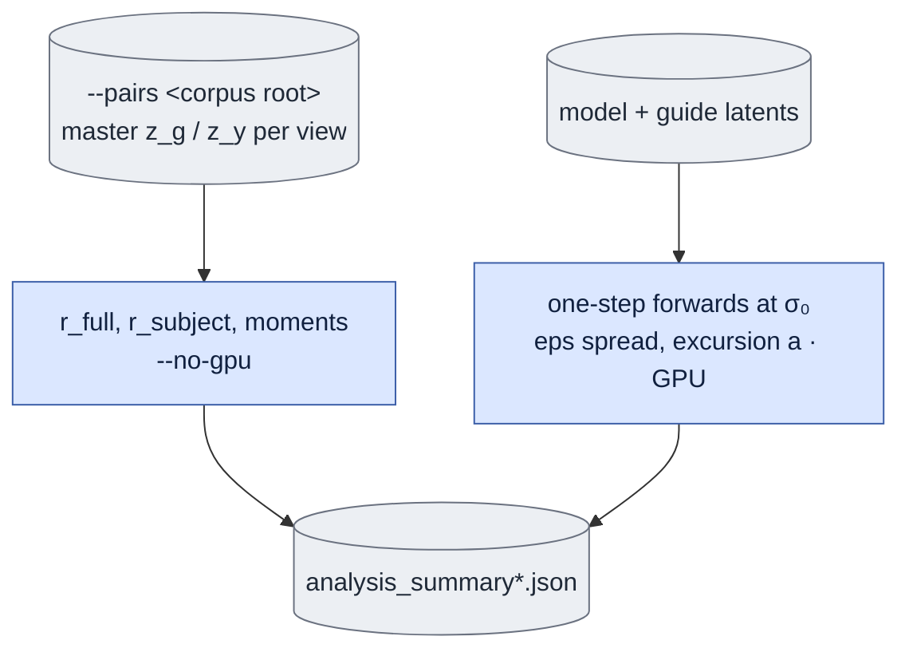

# `stats.py` — measurement, no training

## Objective

Four numbers, each of which decides something the design would otherwise be guessing at:

| | What | Decides |
|---|---|---|
| **(a)** | ε-sensitivity: spread of one-step outputs from one `z_g` over N seeds | whether ε is a sampling variable here at all |
| **(b)** | the excursion `a = ‖Φ(x_σ₀) − z_g‖/√d` | how far the base model moves its own input, in SS1.4's units |
| **(c)** | latent moments of `z_g` vs `z_y` | whether an affine correction is needed (answer: no) |
| **(d)** | the gap `r = ‖z_y − z_g‖/√d`, full **and** subject-interior | how much a plain blend has to do |

## Data flow

## Organization logic

Everything here is measurement and writes only JSON — no checkpoints, no training state. The
GPU half and the `--no-gpu` half are one module because they report into one summary and share
the latent-loading path.

`r` is measured over **whole clips** since the causal rewrite, rather than over overlapping
windows that double-counted every second latent frame.

## Reading the numbers

- `r_subject` ≈ 0.89–0.93 against a 0.6 "comfort" threshold: a plain blend asks the LoRA to
  move the output by ~90 % of its natural scale. Substantial, **not** a rejection — the base
  model's own excursion `a` = 0.247 is only a quarter of that, so whether a LoRA closes the
  gap is open.
- Moments: per-channel std ratio p50 1.002; the worst mean offset reaches the transformer as
  an 8 % perturbation on 1 channel of 128. No correction worth building.
- Mind the reference: under the linear interpolant `Var(x_σ) = (1−σ)² + σ² = 0.60` at σ₀ **by
  design**. Matching to unit variance would be the wrong correction.

## Gotchas

- Reports `r_full` *and* `r_subject`, and they move very differently: the pixel composite
  collapsed `r_full` 1.39 → 0.53 while `r_subject` moved only 0.89–0.93 → 0.80–0.91. Quoting
  the wrong one overstates what compositing bought.
- The per-channel moment stats are computed from a **single** window (`inits[0]`) while the
  global ones span every window. Widen that before relying on the tail.
