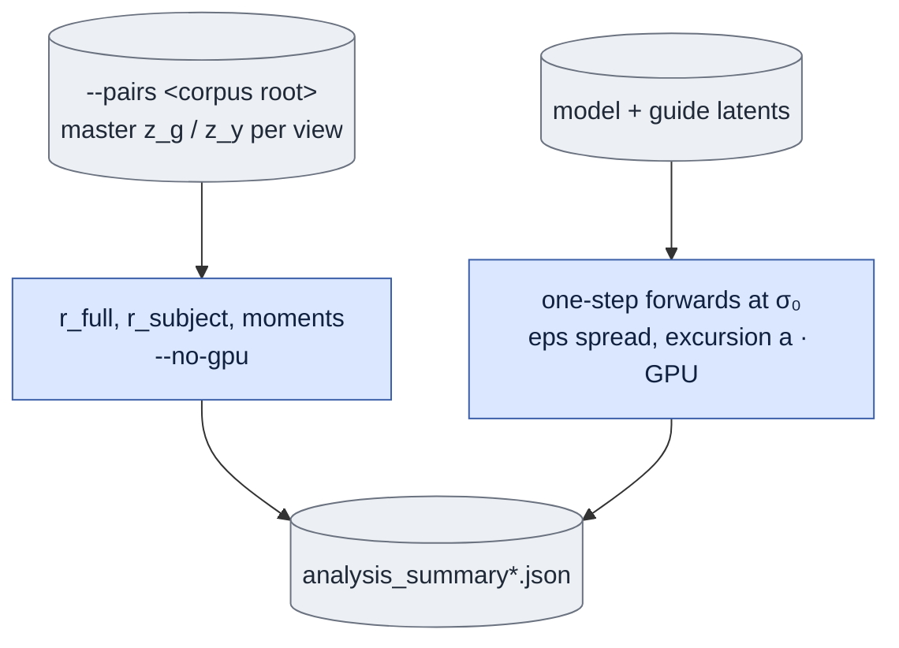

# `stats.py` — measurement, no training

## Objective

Four numbers, each of which decides something the design would otherwise be guessing at:

| | What | Decides |
|---|---|---|
| **(a)** | ε-sensitivity: spread of one-step outputs from one `z_g` over N seeds | whether ε is a sampling variable here at all |
| **(b)** | the excursion `a = ‖Φ(x_σ₀) − z_g‖/√d` | how far the base model moves its own input, in SS1.4's units |
| **(c)** | latent moments of `z_g` vs `z_y` | whether an affine correction is needed (answer: no) |
| **(d)** | the gap `r = ‖z_y − z_g‖/√d`, full **and** subject-interior | how much a plain blend has to do |

## Data flow

```mermaid
flowchart TD
  PAIRS[("--pairs &lt;corpus root&gt;<br/>master z_g / z_y per view")]
  MODEL[("model + guide latents")]
  RATIO["r_full, r_subject, moments<br/>--no-gpu"]
  FWD["one-step forwards at σ₀<br/>eps spread, excursion a · GPU"]
  OUTJ[("analysis_summary*.json")]

  PAIRS --> RATIO --> OUTJ
  MODEL --> FWD --> OUTJ

  classDef proc fill:#dbe7ff,stroke:#3b5ea8,color:#10203f;
  classDef disk fill:#eceff3,stroke:#6b7280,color:#1f2937;
  class RATIO,FWD proc;
  class PAIRS,MODEL,OUTJ disk;
```

## Organization logic

Everything here is measurement and writes only JSON — no checkpoints, no training state. The
GPU half and the `--no-gpu` half are one module because they report into one summary and share
the latent-loading path.

`r` is measured over **whole clips** since the causal rewrite, rather than over overlapping
windows that double-counted every second latent frame.

### Core measurement calculations

For arrays `a,b` with `d` values, `rms_gap` is `sqrt(sum((a-b)^2)/d)` in fp32.
For encoded coverage weights `w[F,H,W]`, expand weights across channels/batch and use
`sqrt(sum(w*(a-b)^2)/sum(w))`.
Current code returns NaN for zero total weight. Treat that as an invalid measurement, not zero error.
These weights are measurement inputs; they do not change the training loss.

`measure_pairs` reads the capture and guide for the same relative video/view and background.
Current code truncates both to the smaller encoded frame count; record that common coverage.
Calculate a full-frame gap for each view.
When both masks exist, use render coverage, capture coverage, their maximum (union),
or their minimum (intersection), according to the declared mask choice.
Save per-view values and the count of views with subject measurements.
Do not silently describe a missing subject score as a full-frame score.

Per-channel moments flatten each channel's frame/spatial values and calculate mean and sample standard deviation.
Current global summaries average per-view means/standard deviations with equal view weight.
Current per-channel moments use the first loaded pair, not every corpus frame.
`_summary` reports count, mean, p10/p50/p90, and maximum over the supplied per-view values.

For the guide-only map measurement, keep one guide encoding, prompt, first guide frame, and sigma fixed.
Use seeds `seed+k` for `k=0,...,N-1` and produce one output `o_k` for each seed.
Excursion is the mean `rms_gap(o_k,z_g)`.
Noise spread is the mean `rms_gap(o_i,o_j)` over all `i<j`; with one output it is zero by construction.
The recorded heuristic compares median spread/excursion with `.1`.
Current code assigns ratio zero for zero excursion. That special case or one output does not prove noise is irrelevant.

This unpaired diagnostic keeps the guide's first encoded frame unchanged.
It is not a product input with a real supplied first image, and has no capture target.
Label that distinction when reporting its values.
Use relative video paths for per-video output keys; corpus guide basenames are repeated.

## Reading the numbers

The numbers below are historical observations from earlier encoded inputs.
They are retained as context, not current corpus acceptance rules.
Check the original measurement records and regenerate matched coverage before reusing them.

- `r_subject` ≈ 0.89–0.93 against a 0.6 "comfort" threshold: a plain blend asks the LoRA to
  move the output by ~90 % of its natural scale. Substantial, **not** a rejection — the base
  model's own excursion `a` = 0.247 is only a quarter of that, so whether a LoRA closes the
  gap is open.
- Moments: per-channel std ratio p50 1.002; the worst mean offset reaches the transformer as
  an 8 % perturbation on 1 channel of 128. No correction worth building.
- Mind the reference: under the linear interpolant `Var(x_σ) = (1−σ)² + σ² = 0.60` at σ₀ **by
  design**. Matching to unit variance would be the wrong correction.

## Gotchas

- Reports `r_full` *and* `r_subject`, and they move very differently: the pixel composite
  collapsed `r_full` 1.39 → 0.53 while `r_subject` moved only 0.89–0.93 → 0.80–0.91. Quoting
  the wrong one overstates what compositing bought.
- Current per-channel moments use the first loaded pair. Global summaries aggregate view statistics.
  State those scopes before making a corpus-wide claim about unusual channels.

## Whole-clip map measurement

`measure_map` encodes the complete VAE-aligned guide prefix, keeps its first latent
frame clean, and executes one full-bidirectional `[sigma0, 0]` forward per saved
seed. Excursion and epsilon spread cover that complete clip. There is no 25-frame
window baseline; numbers must be regenerated under this coverage before comparing
with newly encoded capture/guide pairs.

## Invariants

- Gap units are RMS per encoded value, not an unnormalized vector norm.
- Full-frame and subject scores remain separate.
- Saved records identify background, coverage, mask choice, sigma, and seed count.
- A guide-only diagnostic is not described as product/capture fidelity.

## Tests

Worked gap check: differences `[0,2]` give RMS `sqrt(2)`.
Weights `[0,1]` give weighted RMS `2`.
For scalar non-first-frame outputs `0,2` around guide value `1`, excursion is `1` and spread is `2`.
These are arithmetic examples, not observed corpus results.
After implementation changes, check zero-weight/missing-mask records, coverage counts,
repeated filenames, and the exact scope of moment summaries before interpreting results.
