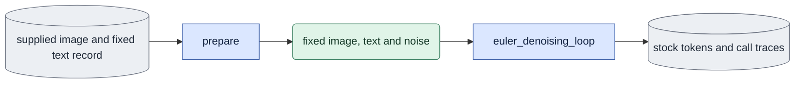
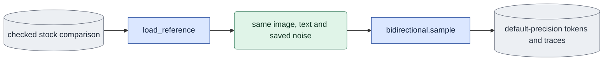

# `stock_parity.py` — compare the stock video sampling path

Status: Implemented and CPU checked. Native video-component controls and the
ordinary float32 correction have scoped acceptance; full E1 remains open.

## Objective

Run the actual stock video state builder, factory denoiser and Euler loop against
the bidirectional sampler. Use one resident native video-only transformer and
fixed inputs. Preserve a repeated stock control and intermediate calls so a
final difference can be traced instead of hidden by a loose tolerance.

## Data flow

The bidirectional branch reads the same in-memory image, text and noise and
writes its own tokens and traces. Each branch uses the same native x0 model.
The decoder reads saved encodings only after the transformer has been released.

The optional reference branch checks ordinary global-sigma precision against a
verified stock comparison and generates only the missing ordinary arm. Before
the G12 fix this exposed a bf16 difference; the corrected default must match.

## Organization logic

Before GPU work, reject an existing output directory, invalid steps or frame
counts, malformed image metadata and changed fixed text files. Read the actual
one-image master through the shared dataset reader. Require one RGB frame,
`input_role=supplied_image`, native channel count and the current VAE fingerprint.
Read the fixed preview record as historical input evidence: validate its saved
software integrity, its text file hash and actual tensor hash. Do not restamp
the original record. Recover the literal prompt from its evaluation arguments.
Resolve the real dev checkpoint and construct the exact schedule with
`LTX2Scheduler().execute(steps=N)` without a latent argument. At least two
intervals are required here; do not substitute the one-step special case.

Snapshot current source/runtime and input/weight hashes. Publish a predeclared
protocol before native model calls. The repeated stock control must be exactly
equal. Positive-interval inputs and predictions must be exactly equal when all
modality fields match. The terminal endpoint comparison is reported separately:
the package returns the prediction, whereas stock reconstructs with rounded
velocity. No guessed final-output tolerance makes a discrepancy pass.

Build the native grid for the requested encoded frames and image spatial shape.
Draw one bf16 token noise tensor with the native Gaussian noiser on an empty
state. Replay the same seed through `create_noised_state`, with
`VideoConditionByLatentIndex(image,strength=1,latent_idx=0)`. Assert that the
assembled state is exactly the saved noise with the image tokens restored.
This is pure-noise D0 sampling; there is no guide mixing.

Run stock, repeated stock, explicit-float32 and ordinary-default bidirectional
sampling in one resident model
session. Stock uses `FactoryGuidedDenoiser` with cfg one, STG zero, modality
scale one and no rescale, `BatchSplitAdapter(max_batch_size=1)`, the native
`EulerDiffusionStep` and `euler_denoising_loop`. The custom branch uses the
ordinary bidirectional sampler with float32 global sigma, matching stock.
Save each call's input, prediction, sigma, token timesteps, positions and image
marks. Record actual forward counts, elapsed time and peak CUDA memory. Trace
copying is included in elapsed time; these timings are diagnostic, not a
deployment benchmark. Release the model before decoding all four encodings
with identical fresh decoder seeds. Compare raw tensors and decoded float
pixels numerically. Save synchronized readable media through the shared renderer.
Use 448-square panels for this producer. Select the compact layout with the exact
titles before rendering. A one-column result is 464 pixels wide and has at least
16-pixel text at its natural width; it must not rely on browser upscaling.
Write the final record last, after rechecking input/software hashes.

### Check ordinary global-sigma precision

With `--reference-run`, load a saved checked stock comparison. Require exact
schedule, image/text tensor hashes, seed, geometry and fps. Verify every saved
raw file hash and the original exact raw/RGB repeated controls. Require the same
installed runtime and the same declared source inventory and hashes, except
this diagnostic entry file. The entry file can add a new comparison; it cannot
restamp the old reference. A changed model, sampling, loader, conditioning,
decoder or other computation owner refuses reuse. Pin the reference result and
raw files as inputs to the new run. Keep its original software record nested in
the reference identity, separate from the new producer identity.

Use the reference's actual saved noise; do not draw noise again. Call the public
bidirectional sampler without `sigma_dtype`, exactly as ordinary evaluation and
product do. This now retains float32 token timesteps and float32 global sigma. The historical
bf16 diagnostic remains saved under its original producer; never restamp it. Save
the actual sigma dtype/values and paired call differences against the reference's
float32-global-sigma bidirectional branch. Compare those two custom outputs,
which share the exact terminal prediction rule. A precision difference is an
experimental result, not a failed repeated control or a tolerance to fit away.
Decode only the saved reference custom encoding and the new default encoding
with the same VAE and fresh seed. Do not regenerate the already verified stock
arms. Give each panel its precision and label both as RGB decoding. Record that
the stock controls are reused historical evidence, not fresh calls in this run.

## Invariants

- One transformer load supplies all compared paths; no adapter or fused weights.
- The first image, prompt context, noise, grid, fps and schedule stay fixed.
- A repeated stock disagreement is a failed control, never a tolerance estimate.
- The actual stock loop runs; the module does not reconstruct stock arithmetic.
- Historical text preparation remains attributable to its original software.
- Intermediate exact equality is distinct from terminal endpoint agreement.

## Gotchas

The outer `TI2VidOneStagePipeline` always instantiates audio. This check uses its
public stock video sampling components with audio absent and the same video-only
loader as the renderer. It does not certify joint audio-video execution or the
outer pipeline's RGB/text preparation. The stock pipeline source is included in
the manifest to bind the reviewed calls. A seven-frame trained product pilot
is separate from this 17-frame base diagnostic. Ordinary product global-sigma
precision is measured by the reference branch; adapter effect requires its own
check. The matched stock branch explicitly uses float32 global sigma. Fresh native
ordinary/default and explicit-float32 outputs and all four calls are exact.
Stock repeat controls are exact; terminal rounding remains separately measured.
Saved tensors, source/runtime/input/output hashes and 129-frame media coverage
were checked. Both custom branches have the same decoded stock-relative RMS
0.000657139. Native/narrow frame review shows blur in all arms at frame 64.
These facts establish numerical precision within this scope; they do not establish
video quality or full E1. Current acceptance evidence is
`expr/onestep_avatar/handoff_implementation_20261007/native_stock_float32_default_acceptance.json`
in the workspace. Preserve the original result/software record through migration.

## Tests

CPU controls use the real stock builder/denoiser/loop and a deterministic x0
model. They require identical initial noise and c0, repeated output equality,
matched calls before the terminal step, and an explicitly measured terminal
difference. Reject tampered text, video-prefix image bundles, invalid schedule
requests and changed software before publication. Native acceptance uses 17
encoded frames, 129 decoded RGB frames and the same saved input hashes.
Reference checks reject changed kernels/runtime, missing or changed raw files,
failed controls and different image/text/schedule. CPU sigma-sensitive predictions
must make the corrected ordinary default byte-identical to the explicitly
float32 custom branch, including sigma-sensitive predictions. Full fresh runs
include both custom branches alongside stock and stock repeat.
