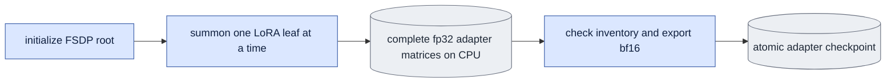
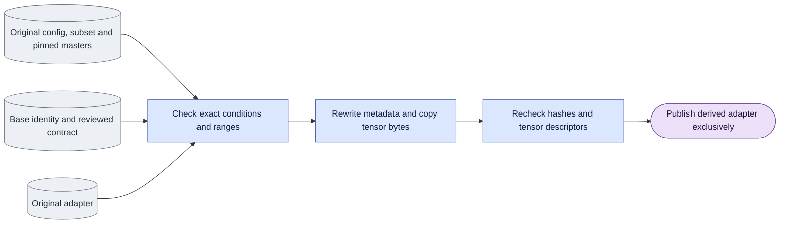

# `training/checkpoints.py` — save adapters and check their settings

Status: **Version-two saves, reads, tensor checks, parent initialization gates, evaluation preflight and checked fixed/random-window legacy conversion implemented. Bulk original-adapter conversion and ambiguous legacy evidence remain pending.**
Own `save_lora`, `load_stage_init`, `assert_exported_lora_is_noop`,
`read_adapter_metadata`, and the adapter condition checker.
The engine's original metadata producer remains transitional until mode/data integration.
The extracted checker currently reads original flat metadata for existing research callers.
The current handoff moves historical conversion orchestration to `experiments/`
and completes structural/CPU/caller checks before new native experiments on
final owners. Normal save/load, contract and tensor validation stay shared.
Preserve original conversion conditions and refuse unknown evidence; missing
native scope does not justify retaining unrelated orchestration in this owner.
Product generation requires the version-two record described below.
Remove unused `assert_one_step_conditions`; its permissive missing-record rule
is not part of the new checker. Schedule checks live in model/sampling.

## Objective

**Precision contract (G12).** New records declare `training.global_sigma_dtype`
from the shared ordinary runtime constant, and execution requests declare the
same condition. Historical records lacking it remain readable. Current execution
rejects unknown/malformed precision even with a research override. Explicit
`bfloat16` calibration may differ under a recorded research override; product
refuses the difference. Legacy conversion can declare precision only when both
original config and adapter metadata explicitly agree; no inference from weight
dtype or current defaults. Parent tensor initialization does not inherit an old
calibration: the new stage records its own actual training precision.

Parent-stage tensor initialization delegates to `model.adapters.load_weights`,
the same strict exported-matrix owner used by inference. Require its complete
PEFT matrix inventory, shapes and finite contents; base-model missing keys are
expected, missing adapter keys are not.
Requested `application_method` is required and must name `peft_unmerged_fp32`
or `fused_bf16`. Compare it with the recorded training application before
weight loading. A supported changed method needs the existing research override;
product always refuses the difference. Unsupported/missing methods are malformed
requests and cannot be overridden.

Use one adapter settings record and one checker.
Check requests before loading model weights.
Evaluation can record an explicit research override.
Product generation rejects incompatible requests.

## Data flow

Read training settings and data/frame-plan hashes to write the adapter record.
Read that record and requested generation settings to check compatibility.
Return either a compatible request or a named list of differences.
Keep the current ComfyUI tensor key format.

## Organization logic

Export only adapter matrices. First initialize the root hierarchy through the
public FSDP `check_is_root()` method. Require the outer transformer to be the
root. This establishes all nested wrapper roles without unsharding frozen
weights; summoning an uninitialized leaf first would incorrectly make it a root
and fail the first forward. Under FSDP, all ranks summon each separately
wrapped LoRA leaf, one at a time, and rank zero copies its full fp32 parameters
to CPU. Never request a full frozen-transformer state dictionary just to discard
it. One-rank NO_SHARD otherwise clones the resident frozen model on GPU and can
exceed the unchanged 48 GB allocated-memory limit. Verify collected names equal
the complete named LoRA inventory, then let PEFT perform its canonical adapter
selection and the existing writer perform its bf16 export conversion. Ordinary
non-FSDP export uses that same PEFT selection. The serialized tensors, metadata,
zero check and atomic publication remain one calculation here.

Worked check: the complete wrapped model has 768 named LoRA matrices. Every
rank visits the same 768 leaves; rank zero collects all 768 canonical names.
No frozen tensor enters the CPU payload. A missing leaf fails the inventory
check before publication. An initial adapter with all B matrices zero exports
the same canonical values as the ordinary PEFT path.

The engine's completion marker binds the saved config and its original
`queue_launch` record, plus the observed applied-runtime evidence. Adapter
metadata describes scientific conditions; it cannot prove which launcher or
FSDP policy was applied. Current queue completion/replay therefore checks both
the adapter contract and these original config/marker facts. Historical missing
launch facts remain readable but cannot pass current replay acceptance.
The shared `queue.read_training_marker` reader validates actual completion state,
integer schema/step, checkpoint path and checkpoint byte hash. Queue completion,
training provenance and replay use this one readiness check. Adapter contracts
remain this module's owner; a valid contract alone does not establish readiness.

Store JSON in safetensors string metadata under `onestep_avatar_contract`.
Use `schema_version=2`.
A contract here means the adapter's recorded training conditions.

The JSON has these exact objects: `model`, `task`, `shape`, `training`, `data`,
`adapter`, and `mode_settings`. Root fields are `schema_version`, `mode`, and
`attention`. Only causal records have a `causal` object.
`model` contains version, variant, base filename, and full base SHA-256.
`shape` contains channels, encoded height/width, and supported selected frame counts.
`training` stores exact levels and direct schedules, draw rule, noise rule, and seeds.
`data` stores list/plan hashes and sample coverage. For random-start training,
coverage contains window templates, not a claim that every update started at
zero. The required `segment_selection` record stores each master's frame count,
inclusive allowed start bounds, window length, the exact seed key and draw rule,
and the accepted G9 first-image difference. This record is also emitted for new
random-start training. Readers validate its consistency with the templates,
mode settings and noise seed. A saved frame plan must have the matching
`start_draw`; changing its seed/key with a newly calculated hash still fails.
Causal random-start records also require one block and window length B+1.
An omitted bidirectional window length selects each whole master, whose only
allowed start is zero; it still records the declared random draw descriptor.
`adapter` stores rank, alpha, target name/modules, step, parent, application method,
and exported `tensor_shapes`. Saving fills the tensor-shape inventory from the
actual exported tensors, before the atomic write.

`read_contract` rejects missing or malformed version-two records.
`contract_condition_problems` compares a complete requested model/task/mode/shape,
schedule, and mode settings. It does not compare people or membership hashes.
`check_contract` permits a research override only when the caller asks for one;
the product path cannot override differences.
`validate_adapter_tensors` checks exported keys, paired A/B shapes, and actual rank
without loading the transformer. A complete contract does not prove fused/unmerged
numerical equality; record the actual application method in result records.

| Record | Required facts |
|---|---|
| Model | version, dev/distilled choice, base weight file identity/hash |
| Task | D0/D1, background, `clean_c0_v1`, `full_frame_x0_mse` |
| Mode | bidirectional/causal, attention, encoded frame count and start rule |
| Training | exact sigma levels/draw rule, direct `[sigma,0]`, seeds, noise rule |
| Data | fixed video list hash, frame-plan hash, selected frame coverage |
| Adapter | rank, alpha, target layers, parent stage, update number, training application method |
| Causal only | block length, K, stored past-frame limit, first-frame retention, refresh/priming rule, history policy |

Check mode, base weights, task, sigma levels, schedule, and mode-specific frame settings.
Keep training records distinct from evaluation inputs.
Evaluation can use people excluded from training.
A random-start-trained adapter can be evaluated from frame zero if the difference is recorded.
G9 still applies.

An adapter trained with capture past frames uses that history for an evaluation under the same conditions.
Generated-history evaluation changes those conditions and must be labeled.
Product generation only has generated past frames.

For a causal execution request, `history_mode` and `kv_source` are required
fields outside `mode_settings`. The recorded refresh calculation
`cached_refresh_global_sigma0` maps to `history_mode="cache"` and
`kv_source="refresh"`. Compare both before weight loading. Recomputed or joint
history, or denoise-produced K/V, changes the trained computation and needs the
existing research override. Save each field, its trained/requested values and
the refresh-calculation reason with the result. Product requests explicitly
use cache/refresh and permit no override. These settings do not change the
training mode or the cache's global-sigma-zero refresh semantics.

Missing or unsupported history fields are malformed requests, not research
conditions. Refuse them even with an override. Denoise-produced K/V only supports
cached generated history. Bidirectional requests cannot contain history fields.
Base-only diagnostics have no adapter calibration to override; their result
conditions still record the explicit selected history and K/V settings.

Worked check: a matching causal request with cache/refresh has no differences.
Change only `history_mode` to `recompute`: ordinary and product checks fail;
research evaluation with an explicit override returns a `history_mode` difference
that cites `cached_refresh_global_sigma0`. Change only `kv_source` to `denoise`
with cached generated history: return a `kv_source` difference under the same
rule. Omit either field: fail independently of the override.

The checker names all differences.
Evaluation needs an explicit override to proceed with a difference.
Save that list with the output.
Product generation fails on the difference.
[model/sampling](../model/sampling.md) checks the base's supported noise levels separately.

### Read and decide before model loading

1. Read the safetensors header and parse the single structured JSON record.
   Check schema version, required fields, mode, finite levels, and mode-specific fields.
2. Inspect adapter tensor keys/shapes and alpha/rank support without opening the base model.
   A malformed record or unusable tensor layout fails; an override cannot make it loadable.
3. Resolve the requested base identity and exact schedule using shared helpers.
4. Compare recorded conditions with the requested conditions field by field.
   Return differences with field name, trained value, requested value, and reason.
5. Do not compare evaluation video membership with training membership for compatibility.
   Save both identities as provenance. Check evaluation files against their own pinned list.
6. For no differences, return a checked request.
   For evaluation differences, require the explicit research override and return its difference list.
   For product differences, fail. Do not quietly repair the requested mode or schedule.

Compare exact sigma/schedule values rather than rounded text or directory names.
Record random-start/frame-zero and recorded/generated-history changes explicitly.
Base support, adapter calibration, and actual tensor loadability are separate checks.

### Save a completed checkpoint

Gather adapter tensors, rewrite keys once, and save atomically.
All distributed processes participate in the required gather in the same order.
The main process validates tensor keys/shapes, builds metadata from checked settings,
and writes a temporary sibling safetensors file.
Close and validate that file before atomic replacement of the final checkpoint path.
Only then calculate/record its content hash and mark it ready for evaluation previews.
Readers require the same checkpoint path and content hash in a complete version-two
marker. Serial replay checks both the zero and one-update markers before using
the adapters as accepted distributed evidence.
On failure, remove the temporary file, preserve any previous completed checkpoint,
and do not create a preview job for the failed save.
A freshly initialized adapter's step-zero file must have exactly-zero `lora_B` tensors.
For a parent-initialized stage, step zero preserves the loaded adapter values and parent identity.
It is not a zero-adapter/no-op control.
Loading parent weights starts a new stage; exact optimizer/random-state resume is outside this design.

Old adapters require explicit conversion to a new derived file.
Keep the original file and hash.
An old `block_causal` label alone cannot identify a bidirectional adapter.
Check original frame ranges, start policy, and unused-cache evidence.
Reject missing or ambiguous records in the product API.
The conversion record names the original path/hash and the evidence used to classify it.
It changes metadata ownership; it does not change tensor values or claim cross-mode calibration.

## Organization logic

### Checked legacy metadata conversion

`convert_legacy_adapter` accepts an explicit version-two contract and the
original config/subset, converted membership/frame plan and base checkpoint.
It checks file hashes before writing. The original config and adapter store
`windows.subset_sha256`: a canonical digest of objective, sources, chains,
splits, span, clip-start policy and chain length. Compare that digest with the
saved values; it is not the JSON file byte hash. Pin the original JSON's byte
hash separately in the converted list/plan and evidence record. Geometry is
checked against original config/adapter fields because it is outside that
legacy digest. Require converted records to name the same original subset and
have valid content hashes.
Read each selected capture master (and guide for D1), verify its original
content hash, actual encoded shape and fps, and include these files in the
unchanged-evidence check. Do not repair or re-encode an original producer output.
Match task, loss, c0, LoRA settings, step, exact sigma levels, seeds and noise policy to original
records. Before hashing the large base, require the original config and adapter
to explicitly agree with the requested sigma draw rule. Missing stamps cannot
prove uniform sampling: historical mixed-level runs used a different rotation.
Even step zero does not establish the claimed training conditions. Refuse these
records until separate original implementation evidence is supported.
Check the original direct schedule, attention, history computation, parent and
window stamps too. A missing or contradictory stamp fails before publication.
Match the base's filename/version/variant and historical fingerprint,
then compute its full SHA-256 for the new record. A historical fingerprint
match is the available original identity evidence; conversion cannot invent
an original full-file SHA-256 that was never saved.

One-block bidirectional classification additionally requires all selected
original chains to contain only block zero, exact corresponding frame ranges,
and verified independent-window selection when random starts are used.
These facts prove there is no preceding
history to read or later training block to refresh. The matched prediction,
loss and gradient tests establish the one-block equivalence. A block-causal
label alone does not pass. Causal conversion keeps the original geometry,
forcing and block count. Random-window conversion requires the original config
window length to equal block length plus one, the adapter's exact
`random_start_v1:<length>` stamp, only clip-start block-zero chains, a matching
plan `start_draw`, and window templates plus `segment_selection` in the reviewed
contract. Verify its source lengths and allowed starts against the checked
masters. Record that c0 is the selected capture master frame and positions
restart at zero. For a 25-frame master and a 17-frame window, allowed starts are
0 through 8; coverage `[0,17]` is a template, not the executed-window history.
The legacy and new samplers must draw identical starts for the same seed,
step, rank and slot. Parent-initialized runs remain refused pending extra
evidence. Fixed-range plans cannot carry an unexplained random draw record.

Require a fresh derived output path. Validate the contract against every
original LoRA key/shape/rank. Preserve the safetensors data section byte-for-byte:
rewrite only the JSON header metadata, with the same tensor descriptors and
offsets, then stream-copy the original payload. Preserve original metadata and
all evidence hashes inside the new contract's `conversion` field. Recheck
source/evidence files after copying, validate the derived header, then publish
atomically. Failure removes the temporary file and leaves originals unchanged.
This is a metadata conversion, not training, optimizer resume or recalibration.

## Invariants

- Bidirectional records contain no causal history fields.
- Base identity uses a file hash, not a version name alone.
- Save exact levels without rounding.
- Apply LoRA alpha/rank scaling correctly or reject unsupported scaling.
- Results record the actual fused/unmerged application method.
- A training-data hash does not forbid evaluation on other people.

## Gotchas

G8 records a numerical difference between fused bf16 and unmerged training LoRA.
Metadata does not fix this difference.
Matching exported keys does not prove equal predictions.

## Tests

The adapter-only export control uses real tiny LTX/PEFT matrices with controlled
FSDP contexts. It requires root initialization before any leaf, checks complete
matrix ownership and exact PEFT payload equality, and refuses full state-dict
collection. Native one-rank export-zero followed by forward/backward and
export-one checks the actual Torch hierarchy separately.

`test_legacy_adapter_conversion.py` checks both modes and D0/D1 using real
safetensors files and checked master bundles. Derived payloads equal original
payloads byte-for-byte; originals and their metadata remain unchanged. Tests
reject differing exact sigma, subset hash, encoded geometry or chain mapping,
unsupported parent selection and existing outputs. Both modes and D0/D1 cover
random windows with masters longer than the template, exact allowed-start
bounds, unchanged payloads, and explicit G9 records. Tests reject changed draw
keys/seeds, clip-start relabeling, mismatched window lengths and master lengths.
New random-start saves require the same selection record. The public CLI is
exercised. Missing or different sigma draw rules, schedule, attention, history,
parent and window stamps fail; rejected metadata performs no base hash or
output-directory creation. Original clip-start seed flags must agree with the
reproduction plan and bidirectional classification.
An exclusive-publication race preserves a competing result and
removes the temporary file. Native real-adapter classification is separate.

[V7–V8](../verification.md) check incompatible requests and unchanged converted data.
After implementation, test record read/write, missing fields, mixed levels, and override records.
Test zero initialization, alpha scaling, and ambiguous old adapters.
Worked check: an adapter records bidirectional/dev/D1/white and direct sigma `.5`.
A causal request names the mode difference; a request at `.7` names the sigma difference.
Evaluation without an override and all product requests fail before loading weights.
An overridden evaluation saves every detected difference with the output.
Changing only the held-out person does not add a compatibility difference.
An interrupted temporary checkpoint save creates no ready checkpoint or preview job.
Check that rejected requests perform no model load.
Run real-weight LoRA application checks separately.
