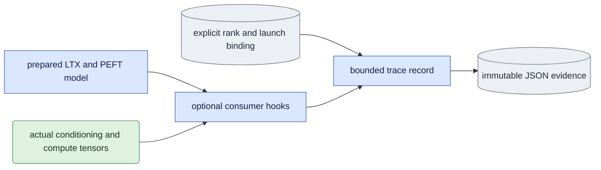

# Consumer trace — optional applied-input evidence

## Objective

Observe the tensors that the installed LTX and PEFT modules actually consume.
This optional diagnostic does not select a scientific setting, cast a tensor,
replace a forward, or change a gradient. Ordinary training installs no hooks.
It separates adapter storage observed outside a forward from adapter weights and
activation dtypes observed inside a forward. It supports R3 diagnosis; a CPU
trace does not certify native FSDP updates or numerical agreement.

## Data flow

The caller supplies the prepared model and an explicit identity binding. The
binding contains rank, world size, job digest, attempt token and launch digest.
Missing local-launch identities remain `null`; they are never inferred from a
result. The caller starts the trace and wraps each complete `train_sample`,
including backward, in `sample(mode, step, slot, index)`.

Hooks observe the underlying `LTXModel` after outer wrappers have forwarded their
inputs. They also observe AdaLN inputs, real transformer-block inputs and PEFT's
`lora_A` and `lora_B` linear modules. A record contains JSON summaries only.
The caller publishes an immutable record at a checkpoint; this module does not
write the scientific checkpoint or certify its readiness.

## Organization logic

At each adapter forward, record its actual weight byte hash within the same
tensor-element bound. Initial bf16 exports cannot prove fp32 A values agree;
these hashes distinguish a storage/initialization difference from a backward
kernel difference. Over-limit weights explicitly lack a full value hash.

1. Validate limits and identity fields. Find exactly one actual `LTXModel` and
   its actual `BasicAVTransformerBlock` descendants through wrappers. Before
   installing hooks, record every named adapter parameter's dtype, device and
   local shape. This is an outside-forward observation, not a gathered master
   tensor or an assertion about an optimizer's hidden storage.
2. Start a sample scope with its mode and visit identity. Ignore forwards outside
   the scope. On each LTX consumer entry, record sigma, per-token timesteps and
   positions. Record latent/context metadata and independent cache-write,
   cache-presence, cache-start and gradient-enabled facts.
3. Hash the complete contiguous byte representation of each conditioning tensor
   when its element count is within the declared bound. Keep at most 16 sample
   values, plus finite-count/minimum/maximum facts. Above the bound, record its
   shape/dtype and mark the observation incomplete; do not call a sampled hash
   an exact tensor hash. This bounds device-to-host copies. Activation records
   contain shapes/dtypes only, so per-LoRA hooks do not copy large activations.
4. Within a training sample, call zero in causal mode is the prime call. Later
   `kv_write=True` calls are refresh calls; other calls are denoise calls.
   Bidirectional calls are denoise calls. These labels describe the selected
   training topology. Independent flags and tensor values remain the evidence;
   labels alone cannot prove a correct call.
5. Count each real block entry within its LTX call. A later entry with gradient
   checkpointing enabled is labeled `checkpoint_recompute`. Record transformed
   timestep and RoPE metadata at that boundary. Record actual AdaLN scaled
   timestep hashes, and actual LoRA input, weight and output compute dtypes.
   Transformed block timestep, embedded-timestep and RoPE tensors also receive
   complete hashes when they fit the same tensor bound. Larger transformed
   tensors retain metadata with `hash_scope=not_copied_exceeds_limit`; that is
   an explicit missing value check, not an exact-value acceptance claim.
   Non-reentrant checkpointing can stop replay before a post-hook; its pre-hook
   still records the actual consumer entry. The trace does not force replay to
   finish, disable early stopping or change cache-write behavior.
6. Hooks retain no tensors. Hook observation errors are retained, capped at 32
   text records, and mark the trace incomplete. They do not replace a scientific
   operation's exception. Once the event limit is reached, later hook events are
   counted as dropped without measuring tensors. The same bound caps sample
   records. A sample exception is recorded
   and re-raised by the context manager. Closing removes every installed hook.
7. A snapshot is complete only outside an active sample, without dropped events,
   observation errors or failed samples. `validate` checks these facts and the
   exact optional expected binding. `write` atomically creates an exclusive file;
   an existing path fails instead of restamping evidence. A failed diagnostic can
   use `write(require_complete=False)` to preserve an incomplete record. It must
   not publish that record as checkpoint completion evidence.
   A caller can supply `failure_path` and manage the trace with a context manager.
   On an operation exception, the context writes incomplete observations only if
   that parent directory already exists. It always removes hooks. Publication
   failures are logged and preserve the original operation exception.
   The containing operation failure marks that diagnostic record incomplete even
   when all earlier sample scopes had already finished successfully.

Worked check: for a bidirectional sample at sigma `0.725`, with four clean first
image tokens, the actual LTX consumer records float32 sigma `[0.725]` and
   float32 timesteps `[0,0,0,0,0.725,...]`. With a BF16 base and fp32 unmerged LoRA,
the outside-forward adapter storage remains fp32. Under CPU BF16 autocast a
LoRA child can consume fp32 input/weights and return BF16 output. The trace
records all three separately. Applying the installed FSDP recursive BF16 cast
before that consumer changes its sigma/timestep/position dtypes and exact hashes;
the trace must expose that change. This control exercises the native cast helper,
not a distributed GPU FSDP run.

## Invariants

- Every event binds one sample, rank and original launch identity through the
  containing record. No saved output hash establishes launch identity.
- Hooks return `None`; they do not replace arguments, results or gradients.
- Exact conditioning hashes refer to observed tensor bytes, with dtype and shape
  recorded alongside them. No full latent, text, weight or activation is saved.
- Trace completeness is a data-quality gate, not native numerical acceptance.
- No ordinary setting enables tracing implicitly. Diagnostic overhead affects
  measured wall time and must be stated when interpreting a traced run.

## Gotchas

Forward compute dtype differs from persistent storage dtype under mixed precision.
Input dtype and parameter dtype alone do not establish matmul output dtype under
autocast; the post-hook observes the latter. Hooks see the real wrapped child
after FSDP forwarding, but an installed/compiled wrapper that bypasses hooks is
outside this diagnostic's verified scope. Contexts must span backward to retain
checkpoint replay. Sampling summaries are bounded, but the declared full-byte
conditioning hash bound can still add CUDA synchronization and memory overhead.
No live tensors or autograd graph references are retained by the trace.

## Tests

`tests/test_consumer_trace.py` uses the actual small LTX model and PEFT adapters
for both mode training functions. It verifies trace-on/off output and gradients,
float32 conditioning, prime/refresh roles, checkpoint replay, adapter storage
versus autocast output, hook removal, limits, refusal of incomplete or rebound
records and exclusive publication. An installed FSDP recursive-cast control
checks the post-wrapper consumer boundary on CPU. It claims no native world-size,
collective, memory-budget or numerical-update acceptance.
