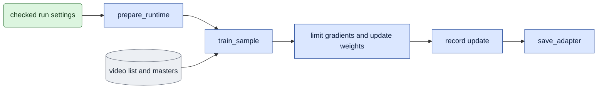

# `training/engine.py` — run shared training

Preview preflight requires a pinned negative-text tensor when its evaluation
arguments select CFG other than one. Shared reference checks also pin optional
non-tensor preparation inputs. The producer is `prepare_inputs.py preview`;
training consumes its checked record and does not prepare text/reference pixels
inside FSDP.

Status: **Typed two-mode runtime, version-two data/adapters, numeric logs, completed-checkpoint markers and scientific queued-completion checks implemented. CPU checks cover full settings, data/parent provenance, config/plan bytes and small-model update markers. Native numerical updates pass in both modes; complete workflows, caller migration and old-path deletion remain pending. Preview scheduling is implemented. Read [current acceptance](../known_gaps.md#current-acceptance-and-next-step).**
The training body moves from `train.py` into this owner. The CLI delegates to it.
Typed preflight compares every checked capture/guide encoding VAE fingerprint
with the selected base's VAE, using the producer's file identity rule. Missing
or mismatched identities fail before transformer hashing, model setup or output
archiving. D0 checks capture only; D1 checks both. Shape equality and parent
adapter compatibility do not replace this input-provenance check.
Initial extraction retains old sample/checkpoint interfaces for matched baseline
checks; these are transitional, not the completed two-mode design.

The extracted body still has `Chain`, `ChainStore`, `clip_grid_for`, and
`train_chain`. Required data/model facts keep shared owners; the transitional
interfaces and duplicate loop retire after caller/data and CPU checks. The
current handoff orders this structural refactor before new native experiments
on the final owners. Preserve original scientific results and issue fresh
affected acceptance afterward; directory changes do not establish native parity.
The original trainer module doc is removed because the CLI is under 100 physical lines.
Its conditioning/loss/cache explanations remain in the common and mode docs.
The checkpoint and startup rules remain here and in the config/checkpoint docs.

`prepare_run(RunSettings)` checks the version-two video list and frame plan,
actual selected input bytes, base-supported sigma levels, frame dimensions,
and the full base hash. It checks parent records and tensor shapes before model
loading. It returns the checked store, plan, base specification, and archive decision.
`run_settings` uses those records for explicit-mode CLI commands. Mode-less
commands temporarily use the old runtime until supported callers move or receive
a truthful retirement disposition.
The new runtime saves the checked frame plan and settings before the first update.
Every update writes a numeric JSONL record. `log_every` controls external logging, not numeric evidence.

`run_settings` wraps the typed runtime in `training.startup.StartupEvents`.
For queued attempts, emit a token/job/rank-bound contention event for a CUDA
`OutOfMemoryError` or typed port-in-use `OSError` before updates begin. Emit `updates_begin` before the
first training sample, including before its forward/backward calls. This early
boundary forbids retry even if a rank updates weights but fails before writing
numeric evidence. Other exceptions emit nonretryable `startup_failed` and
propagate. Network-library text alone is not a retry reason.
Nonqueued runs emit no queue protocol. Argument/input failures keep their normal
behavior; startup reporting changes no tensor, settings, sigma or sample selection.
The queue owns retry decisions and preservation; the engine never relaunches work.

## Objective

The typed runtime snapshots the training software profile before setup and checks
it before opening prompt/model sessions. Store it in `config.json` and each
completed-checkpoint marker; verify it before saving a checkpoint/marker and
before publishing initial config/plan bytes. The queued scientific verifier
requires matching current software in both config and marker. Old markers remain
historical evidence; missing manifests cannot certify a new current completion.

`model.adapters.attach` owns the shared PEFT configuration. Training passes its
existing initialization seed and retains velocity output and trainable fp32
adapters. Parent initialization uses `model.adapters.load_weights` through the
checkpoint owner; it rejects incomplete matrices. Ordinary inference uses the
same function frozen and wrapped once in native x0. The engine still owns FSDP
wrapping and gradient-checkpointing choices.

Use one implementation for LoRA setup, GPU-process coordination, weight updates, logs, and saves.
The selected mode assembles model inputs and calculates gradients.
The engine also records visualization jobs and completed checkpoint steps.
All training execution stays in this LTX-2 package, including any required launcher or queue.
`expr/` can hold study settings and run outputs. Its code only generates reports from saved results.
The engine must not import executable study code.

## Data flow



Repeat `train_sample` for each accumulated sample.
Limit gradient size, update weights, and log once per update.

## Organization logic

### Applied launch, precision and resources

Before opening model sessions, read the dispatch-bound canonical launch record,
compare its exact arguments and queue identity, and require actual Accelerator
world size/mixed precision to agree. Retain that record in config and checkpoint
markers. After wrapping, `training.runtime` captures actual per-rank policies and
adapter storage, requires rank agreement, and records the complete inventory.
Missing launch/runtime facts cannot certify a new native replay.

With `--resource-budget`, `training.resources` reads and pins the original budget
bytes before setup. Measure synchronized local CUDA allocated/reserved peaks
and monotonic elapsed time for load, each update, and each export. Persist per-rank
phase records and immutable per-checkpoint snapshots; bind snapshot hashes in
completion markers. Validate the cumulative phase inventory before each marker.
Recheck launch/software/budget before output creation or archiving, and before
publication. A failed phase retains its measurement and propagates;
it cannot write a passed marker. Ordinary CPU checks retain null CUDA quantities
and do not count as native resource evidence. Sampled total-device observations
and the external wall-time stop guard remain distinct required evidence.
The training update phase includes diagnostic Adam-state export; the serial
replay includes this export in its export phase. Their peak measurements enforce
the same allocated bound, but their phase times are not identical scopes.

Queued budgeted training also receives an immutable phase-notification contract
from the package supervisor. Local phase begin/end records bind the exact token,
job, rank, expected order and budget. External startup/transition limits remain
separate from completed CUDA measurements. The engine does not signal workers
or close process records; the supervising queue retains records when absence is
ambiguous.

With `--consumer-trace`, attach the shared observational trace after Accelerator
wrapping. Keep one sample context around its forward and backward calculations
so checkpoint recomputation retains the actual sample identity. Observe consumer
sigma/timesteps/positions and adapter storage versus forward compute separately.
Before each checkpoint marker, save an exclusive per-rank trace snapshot and
validate completeness; bind the actual bytes in the marker. Final completion
rechecks these files. Trace serialization belongs inside the measured export
phase. A lifecycle context always removes hooks, and saves incomplete trace
observations to a separate failed-rank file if training or export raises.
Default runs install no trace hooks. A trace records actual
consumer evidence and overhead; it is not a gradient-agreement result.

### Optional update evidence

`--save-update-state` publishes the named fp32 Adam moments after each optimizer
update, before clearing gradients. It does not change loss scaling, clipping or
optimizer behavior. `training.update_state` gathers only optimizer state; it
never gathers frozen model weights. Every rank participates in FSDP collection,
and only the main process writes `update_states/step_<step>.pt` and its bound JSON
record. Source/runtime identity is checked before collection and publication.
The same option saves the actual training text tensor once, pins it in config,
and records its byte digest on each rank's update. Serial replay reads this tensor;
it does not rebuild a prompt cache. Completion binds the text and all requested
update-state files and refuses a missing/changed artifact.
The record includes pre-clipping gradient norm, rank count, sample accumulation,
step and optimizer settings. This evidence is diagnostic, not a resume checkpoint.
No experiment module is imported by the trainer.

`tokens_for_sample` is the public checked-video-to-mode-input calculation used
by training and bounded numerical replay. It returns grid, capture/guide tokens
and the actual recorded start/end. Replay keeps the original rank/slot seed keys;
changing execution from distributed to serial does not redraw training inputs.

Worked first-update check: Adam beta1 is 0.9 and its state starts empty. For a
clipped averaged gradient `g`, the first saved `exp_avg` is `(1-0.9)*g`. Thus
`exp_avg/(1-0.9)` reconstructs the clipped gradient. `exp_avg_sq` also binds its
square accumulation. Neither a near-identical exported adapter nor a queue
completion marker alone proves correct distributed gradient averaging.

### Scientific queued completion

The typed runtime records the queue job digest and engine source digest in its
resolved configuration. A completed checkpoint marker records those same digests
and the exact hashes of `config.json` and `frame_plan.json`. A nonqueued run keeps
a null queue identity; historical files are preserved. These fields prove only
the recorded producer and inputs, not independent numerical correctness.

`prepare_run(..., require_fresh_output=False)` supports read-only completion
checks. It performs the same input, VAE, base, frame-plan and parent checks as
launch preflight. It does not archive output or open model/process-group sessions.
Normal training still requires fresh output or explicit overwrite.

`verify_training_conditions` parses the saved job's exact typed command, derives
the current membership/frame plan and expected adapter contract, and sets the
expected world size from the queued process count. Require the final checkpoint
at the runtime's exact name and step. Compare every resolved RunSettings field,
data/plan hashes, selected sample count, loss, fixed AdamW settings and samples
per update. Derive sample tiling from world size and accumulation. Derive the
trainable parameter count, module count and target counts from the checked
exported matrix shapes. Compare the whole expected adapter contract except actual tensor
shapes, which the checkpoint owner verifies against saved matrices. This checks
mode, sigma/noise/seed rules, arm, geometry, rank/alpha/targets and parent lineage.
Require matching queue/source identities and unchanged config/frame-plan bytes.
Receipts include those files with the checkpoint and completion marker.

Example: changing only learning rate leaves the adapter mode and matrix shapes
unchanged, but must fail the saved-config comparison. Replacing the parent at
the same path changes its digest and must fail. A checkpoint from an older
job cannot complete a new job just because both ended at update 200.
Tests use checked small masters and real safetensors records; synthetic queue
lifecycle tests explicitly substitute only the scientific verifier. Existing
small-model optimizer tests check the producer's new marker/config bindings.
Native FSDP updates and historical caller migration remain separate checks.

After initial checks, build Accelerator and text inputs.
Load the frozen bf16 base transformer directly on the local GPU.
Use the same LoRA initialization seed on every GPU process.
Keep current fp32 trainable adapters, FSDP wrapping, and gradient checkpointing.
Do not create a full CPU model copy for every process.
For typed training, disable FSDP mixed precision's root-input casting before
wrapping. The input is a `Modality` dataclass whose sigma, token timesteps and
positions already have their required precision. PyTorch recursively casts its
fields by default, changing the numerical function before the model sees them.
Keep bf16 parameter/reduction settings for frozen model blocks. Preserve PEFT's
exact wrapping choices, but give its separately wrapped trainable leaves no FSDP
mixed-precision override. Their fp32 weights and gradients must survive the
forward/backward interval, as in the serial and unmerged product function.
Autocast still owns linear compute precision. A native trace found bf16 adapter
forward weights despite fp32 storage outside forward; the first-update B gap
remained above 2% after global-conditioning repair. `CustomPolicy` changes only
the selected trainable leaves' mixed precision, not their wrapping membership.
Applied runtime and consumer traces must verify this on native weights.
No mixed-precision policy means there is no root cast to disable. The transitional
legacy namespace path retains its original policy for historical reproduction.
For sigma 0.725, the typed model must observe float32 0.7250000238418579 rather
than bf16 0.7265625. Tests exercise the shared builder's actual policy and the
installed root-casting function; native distributed acceptance remains required.

For each update:

```text
Select the seeded data group for this process.
Draw one sigma for the update; prepare each sample's noise and start seed.
Check matching model-call and backward plans across processes.
Clear gradients using the existing update order.
For each accumulated sample:
    Load encoded video data and select its frames.
    Call the selected mode's train_sample with Accelerator.backward.
Limit gradient size once.
Update weights, then clear gradients.
Record update count, per-process metrics, and main-process summary.
Save the adapter at the configured initial, periodic, and final steps.
```

Causal code backpropagates `MSE/(K*A)` after each block.
Bidirectional code backpropagates `MSE/A` once per segment.
Do not divide the loss again.

Keep warmup and the step-zero adapter check.
Logs record video/sample IDs, selected start frames, exact sigma, loss, gradient norm, and time.
Causal logs also record block positions.
The unsupported anchor data path is removed. Samples hold capture/guide masters
and fps only. The engine produces no anchor loss columns or adapter metadata.
Historical saved records retain their original fields; readers may ignore them.

### Update results and save order

The mode reports unscaled sample loss and block/call records for logging.
Its backward calls already include `1/A`, and `1/K` for causal training.
Log the mean of those unscaled sample losses; do not report the backward-divided values as task MSE.
One complete accumulation group causes one gradient-limit operation and one optimizer update.
The checkpoint's step names the number of completed updates, not the latest block or sample count.
Step zero is saved before the first optimizer update.
Periodic and final saves use completed-update boundaries in the same order on every GPU process.

## Visualization during training

The engine writes numeric logs. `plot_training.py` reads them and draws loss, gradient, and timing curves.
Plots label update numbers and noise levels.
They do not claim video quality.

Optional video previews use completed adapter checkpoints.
After an atomic save succeeds, the main process records a preview job.
That job fixes the video/person, first image, guide/capture data, text, noise, mode, and denoising levels.
Keep one fixed preview set across checkpoint steps.

Run `evaluate.py` separately to generate the saved preview outputs.
This package CLI owns preview execution. Report code under `expr/` does not launch it.
It checks the checkpoint conditions and records the training step.
Then `media.py` renders capture, base-model, and adapter videos with the same input records.
[media.md](../media.md#training-previews) specifies panels and output records.

Do not run transformer previews or VAE decoding inside the FSDP update loop.
A preview process uses its own model session and an available GPU.
All training processes keep the same save/collective order.
A preview failure marks that job failed; it does not invalidate a completed checkpoint.
An incomplete checkpoint must never be used.

### Preview job decisions

After a configured save point completes, bind its adapter hash/step to the fixed preview-input record.
The job identity includes checkpoint hash, fixed inputs, mode, exact schedule, and rendering settings.
Do not enqueue an identical pending or completed job again.
Enqueue no job when previews are disabled or the checkpoint save fails.

A job stays pending while waiting for its external package evaluator.
That evaluator claims the job, checks all saved identities, generates the outputs,
and writes completion records only after encoded outputs and required visuals exist.
Success marks it complete; an input/model/rendering failure marks it failed with its reason.
A retry of a failed job uses the same pinned checkpoint and inputs.
Changed inputs require a different job record and cannot silently replace a fixed preview.
No job result can update training inputs, gradients, weights, step counts, or optimizer state.

The evaluator passes the question, checkpoint step, panel roles, and frame mapping to media.
[media's layout and text rules](../media.md#visualization-layout) specify exactly what the viewer sees.

## Invariants

- Weights stay fixed during one accumulated sample group.
- The engine makes one optimizer update per group.
- Gradients do not pass through causal cache updates.
- Required reductions and saves have the same order on all GPU processes.
- The causal mode owns cache allocation.
- Output archiving occurs only after initial checks succeed.
- Training visualization reads saved logs/checkpoints and cannot change training inputs or weights.
- Training and preview execution have no dependency on `expr/` report code.

## Gotchas

The mode receives a backward function.
It must not return a combined graph containing all causal blocks.
That would change the immediate-backward memory behavior.

Gradient checkpointing can repeat internal model work.
Do not count those repeats as explicit sample calls.
CPU design checks do not establish real FSDP memory use.

## Tests

[V3 and V6](../verification.md) check loss scaling and model-call counts.
After implementation, compare gradients/updates on small deterministic models.
Check cache writes during repeated checkpointed calls.
Run one small distributed update for each mode.

For visualization, test completed-checkpoint selection and fixed preview-input hashes.
Test failed/pending/completed job records.
Check that a disabled preview setting performs no model or decoder work.
Worked update check: two accumulated causal samples each contain three blocks.
There are six immediate backwards and one optimizer update, not six updates.
The next checkpoint advances its completed-update step by one.
Worked preview check: checkpoint 100 is complete and its fixed job is pending.
A render failure changes only that job to failed; checkpoint 100 and training remain valid.
Retrying with a different noise hash is rejected as a fixed-preview retry.
Inspect the curves and synchronized preview panels.
Check launch commands and required queue execution live in LTX-2.
Rebuild a report from saved logs/media with training and preview executors disabled.

### Temporary CLI routing while old queues run

New commands with an explicit `--mode` use `parse_settings` and `run_settings`.
The already-running queue still starts mode-less commands through the old
engine entry path. This routing is temporary and preserves live job behavior.
It must be removed when queue migration finishes: final commands require mode.
No setting or adapter from an old command is silently classified as bidirectional.

### Fixed preview record interface

`--preview-inputs` reads a JSON record with schema version 2, kind
`onestep_avatar.preview_inputs`, mode, exact schedule, `input_files`, and
`evaluation_arguments`. Each input file has an absolute path and SHA-256.
The video-list file is required under `subset`; capture, guide when D1, first
image, text and noise identities are required. Evaluation arguments contain the
explicit mode, checked subset/source selection, schedule, seed and prompt.
Output and checkpoint arguments belong to the executor and are forbidden here.
Validate all pinned bytes before loading training weights. Keep the checked
record in settings; subsequent checkpoints do not reread or replace it.

After writing the completed-checkpoint marker, `enqueue_preview` combines the
checkpoint SHA and fixed-record SHA to form a job ID. The job stores both pinned
records and starts pending. Enqueueing the same job preserves its existing
pending, failed or completed state. An enqueue failure is logged and does not
invalidate the checkpoint or interrupt a distributed save barrier.

The package evaluator checks the marker, adapter step/hash, fixed files and job
identity before claiming work. It records running, complete or failed states.
A failed job may retry with the same pinned bytes. Completion requires hashed
encoded result records and rendering records; raw generation alone is not a
completed preview. A stale running process is reported, never automatically
restarted while its PID is alive.

Pinned tensor roles also store `tensor_sha256` for the actual selected model
inputs. Completed raw results must match capture, guide, c0, text and noise
identities. Rendering records identify the preview job, fixed-record hash and
raw-result records. A completion check rejects unrelated saved media.

## Deterministic numerical setup

The typed CLI configures the shared cuBLAS workspace before native imports.
Queued execution requires the exact workspace from a version-two launch record.
Apply the shared strict deterministic policy before reserved CUDA buffers,
Accelerator, prompt or model work. Record actual flags through runtime schema
two and require the supported policy across ranks. Recheck observed flags before
updates, exports and publication. The mode-less historical engine is unchanged.
The policy changes no data, seed, sigma, budget, optimizer or tolerance.
Focused CPU controls verify the current path. Original four-rank/serial
numerical comparison passes in both modes. The active handoff records complete
workflow and final-source requirements separately.
