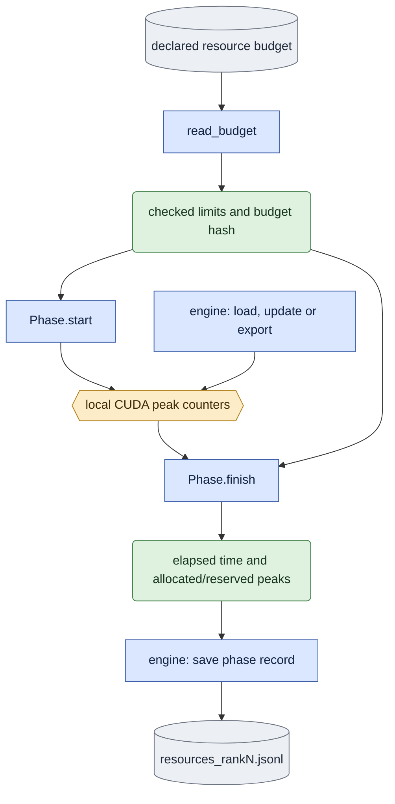

# `training/resources.py` — measure declared process resources

## Objective

Measure CUDA allocated and reserved peaks in the process that performs the work.
Bind the unchanged budget file to each phase. Sampled total-device memory is a
separate external observation; it cannot substitute for these measurements.
Ordinary runs may omit a budget. Current native update acceptance requires it.

## Data flow

Read the budget bytes once, parse the two positive limits and retain their path
and SHA-256. Before each phase, recheck those bytes, synchronize the local CUDA
device and reset Torch peak counters. After the phase, synchronize again and
read allocated/reserved peaks and monotonic elapsed time. Retain one record per
rank and phase, including a failed record when execution or a limit check fails.
The engine/checker owns publication of these records and its failure evidence.
An operation failure after a phase starts retains a failed record. Before fresh
output exists, the trainer emits that record in its original queue log; it does
not create a scientific output directory to report startup failure. Budget
validation or CPU refusal before a phase starts is a preflight error with no
allocator measurement. Neither route can publish a complete checkpoint.
At each checkpoint, copy each rank's complete journal into an immutable
`resource_snapshots/step_<step>/` record. Marker hashes identify these snapshots;
later updates do not invalidate earlier checkpoint evidence. Final verification
also requires the snapshot records to equal the final live journals.

This diagram shows one native CUDA phase. The engine orders `Phase.start`, the
work and `Phase.finish`. A failed finish still yields a failed measurement for
the engine to preserve; it cannot certify completion. CPU runs record null peaks.

## Organization logic

`read_budget` consumes the existing protocol's `wall_seconds_per_phase` and
`memory_limit_allocated_bytes`; it does not choose new limits or tolerances.
It retains optional tolerance data from the same parsed byte buffer. The
experiment owner checks that data against its already declared rule. A second
filename read must not pair tolerance from new bytes with an old budget hash.
`Phase.start` and `Phase.finish` bracket load, each update and each export.
An allocated peak or elapsed time greater than its bound fails the phase.
Reserved peaks remain measurements, not a limit with an invented threshold.
CPU runs explicitly record null CUDA peaks and cannot satisfy native acceptance.
The final validator requires every declared rank and phase exactly once, finite
nonnegative measurements, unchanged budget and passed phase states. A missing
record, changed budget, duplicate rank/phase or breached limit refuses completion.
The external exact-owned-process wall-time supervisor remains required: measuring
elapsed time at a completed boundary alone cannot interrupt a hung operation.
When a checked supervision contract is present, publish token/job/rank/budget-bound
phase begin before the initial synchronize and phase end after measurement.
Notification failure fails the measurement while preserving an original operation
error. Without this contract the hooks do nothing. The shared
`execution/supervision.py` observer uses these events to time an in-progress phase; its
separate startup and transition guards cover intervals outside a local phase.
Historical supervisor text remains preserved and is not a current executor.
The local `load` phase starts after Accelerator setup; a separate startup guard
must cover process-group initialization. No existing sampled total-device bound
is relabeled as an allocated-byte bound.

`training_phases` supplies the chronological notification inventory from the
actual save rule: load, optional step-zero export, then each update followed by
its requested initial/periodic/final export. The queue freezes this order and
checkpoint verification uses the same inventory through that checkpoint.

Worked check: with a 48,000,000,000-byte allocated bound, a peak of
48,000,000,001 fails, even if sampled total-device memory was lower. A reserved
peak above that number does not by itself fail the allocated-memory criterion.
A missing rank-three export record cannot certify a four-rank update.

## Invariants

- Use synchronized Torch counters on the actual local device, never nvidia-smi.
- Reset counters once per phase; include allocations still live at the reset.
- Preserve the budget's exact bytes and tolerances; never rewrite old evidence.
- Missing/non-CUDA/failed records cannot publish native acceptance.
- This owner launches no process and imports no experiment code.

## Gotchas

Torch counters exclude allocations outside its allocator. They measure the
declared allocated quantity, not total device occupancy. Synchronization adds
diagnostic overhead. Phase checks supplement external wall-time supervision.

## Tests

Use controlled CUDA counters to check reset/synchronization order, peaks, elapsed
time, exception preservation, exact limits and budget changes. Validate missing,
duplicate and malformed rank/phase inventories and explicit CPU refusal.
