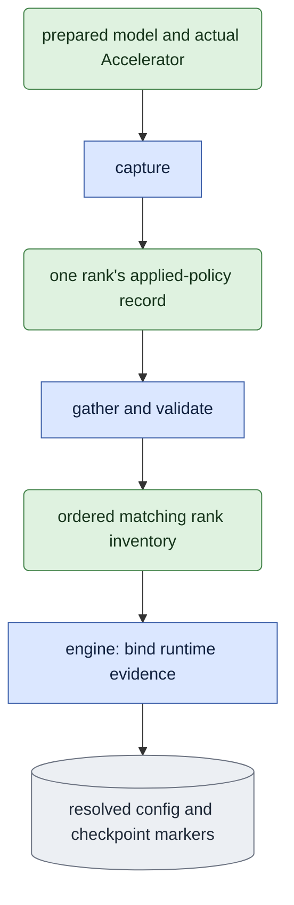

# `training/runtime.py` — record applied distributed precision

## Objective

Record effective Accelerator and FSDP settings after setup, separately from
requested YAML. Ordinary training and replay share the validation calculation.
Current native acceptance requires actual world size and agreement across ranks.

## Data flow

The engine captures the prepared model's FSDP policies and the adapter master
storage dtypes. Each rank contributes one JSON record through a fixed tensor
collective, avoiding GPU object gathering. Compare records except their rank,
then save the complete ordered inventory in resolved config and checkpoint
markers. The canonical launch owner checks requested process count and precision.

This diagram shows actual setup evidence after model preparation. The inventory
contains policies and storage dtypes, not gradient or model-output measurements.

## Organization logic

Before expensive sessions, `check_accelerator` compares the actual process count,
mixed precision and selected distributed type with the declared launch. Queued
training requires FSDP; serial replay requires ordinary execution. A mismatch fails before model/text
loading. This preflight does not replace the later wrapped-policy inventory.

Capture world size, mixed precision, distributed type, conditioning precision,
adapter storage dtypes and each distinct actual FSDP mixed-precision policy.
Use the wrapped modules' policies rather than assuming the plugin was applied.
Typed float32 conditioning requires disabled root-input casting. Preserve the
parameter, reduction and buffer dtypes as observed; no repair changes them here.
No FSDP module is represented by an empty policy inventory. This distinguishes
an ordinary serial process from the original distributed reference.

`validate` checks the complete rank inventory and requested world/precision.
Native replay requires FSDP, fp32 adapter masters and the preserved float32
conditioning policy. Missing historical facts fail current acceptance; they
remain readable historical evidence. A serial reference records its own ordinary
policy and compares the explicitly relevant requested precision separately.
Policy records establish setup, not numerical equivalence or actual consumer
field precision. Native acceptance also requires observations inside the model
consumer, including nested wrapping and checkpoint recomputation; setup records
alone cannot replace that evidence.

Worked check: four rank records with bf16 parameter/reduction policy and
`cast_root_forward_inputs=false` agree. Changing only rank two's reduction dtype
or actual mixed precision fails. Copying a requested YAML into the runtime field
cannot replace the observed wrapped-module inventory.

## Invariants

- Rank count and process indices agree exactly with the launch.
- Adapter master storage and FSDP compute policy are separate facts.
- No model call, optimizer update or experiment import occurs here.
- Metadata validates applied setup; native gradient controls remain required.

## Gotchas

FSDP policies may repeat on nested wrappers. Store their unique configurations.
Record a null dtype when a policy delegates precision to the original parameter.
An empty adapter inventory is not a verified fp32 adapter configuration.

## Tests

Exercise actual policy objects, disagreement across ranks, missing precision,
world/rank mismatch and old root-cast policies. CPU integration checks the normal
trainer's publication and marker binding; it does not prove native FSDP.

## Deterministic training policy

Status: Implemented; original four-rank/serial numerical comparisons pass in
both modes. Complete workflow acceptance remains separate; read
[current acceptance](../known_gaps.md#current-acceptance-and-next-step). Keep
original failed records and their applied-runtime schemas unchanged.

The small shared owner `training/numerics.py` declares one required
child environment: `CUBLAS_WORKSPACE_CONFIG=:4096:8`. It applies strict Torch
deterministic algorithms, `warn_only=False`, cuDNN deterministic mode, disabled
cuDNN benchmarking and disabled CUDA matmul TF32. These are the settings used by
the successful one-rank control. cuDNN's separate TF32 setting is not changed by
that control; observe it explicitly and require serial/native agreement rather
than silently changing it. This policy changes numerical kernel selection only.
It changes no training input, seed, sigma, budget, optimizer or tolerance.

The queue records the exact required environment in a version-two training
launch record and passes it to the guarded child. The typed engine compares
the inherited setting with that record before applying the policy. A direct
typed run without a queue configures the workspace before native imports.
Refuse late workspace configuration after CUDA initialization. Native backend
detection can initialize CUDA before training; flags can be applied after that
detection only when the required workspace was already inherited correctly.
Apply before reserved CUDA buffers, Accelerator, prompt/model sessions or
cuBLAS work. Leave the transitional mode-less engine unchanged.

Runtime capture produces schema version two and adds observed numerical
flags to every rank. Validate exact field types, full rank agreement and the
required current policy when the caller explicitly requests it. A historical
version-one record remains readable under its original validation scope; it
cannot satisfy an explicit current numerical-policy requirement. Never fill
missing historical flags from current defaults.

Public serial replay requires the original native record to declare the
supported policy. Its supervised launch carries the original required
workspace. Apply the shared policy before Accelerator/CUDA, capture the serial
runtime after preparation and compare every numerical flag with the original
native ranks. Save the serial observation in the replay protocol/result and
recheck the applied policy before update, export and publication. The new native
four-rank reference and its serial replay must use the same current source
profile; old failed native updates remain historical evidence.

CPU controls cover real Torch flag setters/readers, strict warning mode,
environment binding and late-application refusal; launch schemas one and two;
missing, malformed or differing rank observations; engine failure before model
loading for a wrong inherited workspace; and replay refusal of an undeclared or
different original policy. Numerical acceptance additionally requires the actual
four-rank updates and fixed serial comparisons; both modes' saved receipts pass.
These checks do not establish preview/product or learned video quality.
