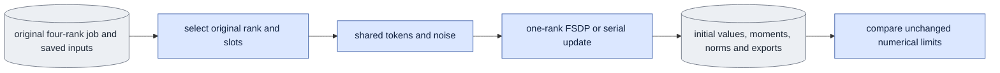

# `training_slice_check.py` — localize one native update

Status: Bounded R3 diagnostic; native acceptance pending. Move this experiment
owner to `experiments/` only after the Stage C gates. Ordinary training imports
none of this module.

## Objective

Compare one exact original visit in one-rank FSDP with serial execution before
testing accumulation and four-rank averaging. Keep the original data, model,
adapter initialization, sigma, noise keys and resource limits. This owner calls
the shared builder, token calculation, mode training function and Adam-state
collector; it owns no second model algorithm.

## Data flow

## Organization logic

Reconstruct the original job and launch binding. Read its actual four-rank
runtime and original budget; retain original source manifests unchanged. Refuse
changed computation owners. Explicitly record changes limited to observational
supervision, tracing or the separately declared adapter-only export repair,
whose old hashes remain in the original record. The repaired exporter must match
the original zero tensor inventory and values before the update.
Use the original saved text and visits. `--slots 1` selects the original first
slot; `--slots 2` selects that rank's original accumulation group. The diagnostic
averaging denominator is the selected slot count in both executions, and the
actual world is one. It is never relabeled as the original four-rank update.

Check the saved text file hash, complete tensor hash, shape, dtype and finite
values against the original config. Recreate the frame plan and full base
identity through shared preparation, then require exact agreement with the
original saved plan and config. Both original checkpoint contracts must equal
the fresh expected contract for their steps. Their completion markers must bind
the same original producer profile, launch, runtime, budget and config/plan bytes.
Compare reconstructed original visits with the actual rank metric records.
Pin both checkpoints, both markers, original launch/YAML, rank metrics, text,
resource/trace evidence, selected producer bundles and the base bytes. Recheck
all pins before publication. Keep the original records and source hashes intact;
the diagnostic records its separately permitted support repairs.

The FSDP arm uses the original Accelerate YAML with one process; serial uses the
same explicit bf16 setting. Verify actual world and distribution before loading.
Hash complete initial fp32 adapter values before wrapping, and bind trace values
at actual adapter consumers. Save an exact zero export, then run the original
shared forward/backward function with original rank/slot noise keys. Clip once,
passing the prepared model's complete parameter iterator through the same
Accelerator call as the engine so it selects native FSDP clipping. Step Adam
once and save fp32 moments and actual exports. Resource journals own
allocated and reserved peaks; no limit or tolerance is inferred from old results.

Every execution requires fresh output. Publish protocol before weights and
result after source/input rechecks. A separate saved comparison uses the original
fixed `compare_update`. Both arms must record the same kernel control and source
profile, in addition to identical scientific settings. Failed numerical evidence
stays failed. This diagnostic
does not prove preview/product, quality or four-rank acceptance.

For saved comparison, require the complete local artifact inventory and verify
every recorded byte hash before reading tensors. The checkpoint path must name
the local step-one export, and its dedicated hash must equal the inventory hash.
The embedded protocol and initial-value record must equal their local JSON
files. Resource records must equal the actual rank-zero journal and pass the
original limits. The trace evidence must bind the local trace file. Read adapter
tensors only through the verified local path. Refuse changed, missing or escaped
artifacts before the numerical comparison.

## Invariants

- Exact original visits, fp32 initialization, text, noise keys and budget bytes.
- Actual one-process FSDP versus actual one-process serial; no world substitution.
- One shared training calculation and named optimizer collector.
- No tolerance fitting, old-result restamping or ordinary-runtime dependency.

## Gotchas

A zero export records bf16 rounded matrices; it cannot prove working fp32 A
values agree. Save their full byte hashes separately before wrapping. A small
loss/norm gap can hide matrix or Adam-sign changes. Compare every named moment
and exported matrix. The full native result remains failed if any limit fails.

## Tests

Existing shared update, resource, runtime and trace controls validate the reused
owners. Native one-slot, repeated serial, two-slot and four-rank controls establish
the first actual divergence. CPU presence and source hashes are not that evidence.
Focused CPU controls use real saved tensors and adapter files. They reject
changed original text values, dtype, shape, frame plan or base identity; changed
producer/marker binding; redirected checkpoint paths; missing inventory entries;
and altered embedded protocol, initial values or resource records. A complete
matched saved pair reaches the unchanged numerical comparator.

`--deterministic` is a declared numerical-kernel control. Set deterministic Torch
algorithms and cuDNN mode, disable cuDNN benchmarking and TF32, and require the
child launch to bind `CUBLAS_WORKSPACE_CONFIG=:4096:8`. Record actual flags.
First compare an unchanged serial repeat, then repeat this deterministic control;
do not change tolerances to accommodate an unstable baseline.
