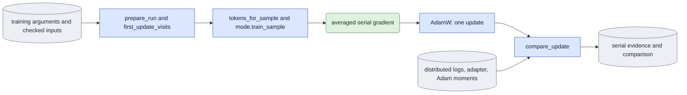

# `training_update_check.py` — replay one distributed update in serial

Status: Implemented bounded E4 owner; both original numerical comparisons pass.
Complete preview/product acceptance is separate; read
[current acceptance](known_gaps.md#current-acceptance-and-next-step). The current
handoff orders the structural move to `experiments/training_update_check.py`
and CPU/caller checks before fresh native experiments on the final owners.
Original native results retain their original producer hashes. The move does
not close numerical or workflow acceptance under changed source.

## Objective

Check the averaged gradient and first Adam update of each normal mode against a
serial calculation on the same visits. This is one diagnostic update, not a
second trainer. It calls shared preparation, native loading, token construction,
mode training functions, adapter export and named Adam-state collection.
Ordinary training imports no experiment owner.

The optional `--consumer-trace` diagnostic records the serial model consumers
through the same trace owner as training. Keep the original visit's distributed
rank/slot/index in its sample context even though the serial process is rank zero.
Bind the published trace file in the result and refuse incomplete requested
evidence. No trace flag changes the fixed scientific inputs or tolerance.

`--supervise --process-ledger PATH` launches this exact public serial command through
the shared package observer on one GPU selected by direct `nvidia-smi` queries.
One shared ledger records only our own PID/start-time identities and descendants.
The supervisor freezes
`load`, `update`, `export` notifications using the original checked budget. It
declares startup and transition guards separately, signals only the exact owned
workers with finite waits and retains records on ambiguous worker absence. The
inner replay continues to own all scientific preflight/comparison and actual
allocator measurements. No runnable `expr/` supervisor is supported.

## Data flow

## Organization logic

Before scientific input preparation, reconstruct the original job through
`queue.prepare_job`. Require its canonical digest to equal both the saved config
and completed checkpoint marker. Require explicit replay world, job processes,
saved actual world and every applied-runtime rank record to agree. Check the
original dispatch snapshot through `queue.verify_training_launch`; its YAML
bytes, hash, exact command, port and normalized arguments must still match.
Read launch precision only from those checked original bytes. The checker does
not replace original processes with its world argument or copy a result's hash.
Missing launch or actual-runtime facts make historical evidence unsuitable for
current acceptance. Preserve the original records; do not infer applied precision.
Use `queue.read_training_marker` for the actual step-one readiness gate before
scientific inputs. Preparation also reads the step-zero marker through that owner.
Require complete state, integer schema/step, exact path and actual adapter hash;
then perform the scientific tensor and run-provenance checks. A provenance match
cannot authorize a marker that is pending, relocated or bound to changed bytes.

Pin the job, original dispatch record, config, completion markers and all
scientific input bytes. Reconstruct and verify launch/runtime again immediately
before model loading and final result publication. Late changes retain failed
execution evidence and prevent a passed final result. Negative controls use this
gate and the shared queue normalizer, with model/output access forbidden.
Before creating the serial output, construct the actual serial Accelerator and
require one process, the checked launch precision and `DistributedType.NO`.
Recheck all pinned inputs and producer software after this setup. A world,
precision, distributed-type or late-input mismatch leaves no output directory
and opens no model.

Current native acceptance also requires the original frozen resource budget and
per-rank allocated/reserved measurements. Resolve an unindexed serial `cuda`
device to the actual current CUDA ordinal before measurement; do not weaken the
indexed-device evidence validator or rewrite old measurements. Its raw JSON `tolerance` must exactly
equal the fixed `TOLERANCE` record. Canonical byte binding alone does not authorize
missing or changed numerical bounds. Read this study field here; the shared
resource owner continues to validate only its general wall and memory limits.
Verify complete training phases
`load`, `export:0`, `update:1`, `export:1` before replay. The serial replay resets
Torch peaks for `load` (model/optimizer setup and zero export),
`update` (all backwards, clipping and Adam), and `export` (moments, final export
and reload, including requested trace serialization). Synchronize before each
reset and measurement. Persist each phase
to `resources_rank0.jsonl`, including errors and limit breaches, before raising.
Validate allocated peaks and elapsed times against the unchanged budget before
publishing a final result. Reserved peaks remain separate observations. External
total-device observations do not replace process-local allocated measurements.

Read a JSON job with the original `arguments`. Require steps one, saved zero
adapter, saved update state, no parent, checkpointing enabled and no previews.
Check the actual config/frame plan, all rank-one logs, zero/one adapter contracts
and matrix shapes, moment record and current source/runtime before loading.
The expected world size is explicit and must match saved config; the first native
check uses four ranks and accumulation two. Reconstruct the first epoch's tiling,
seeded permutation, contiguous rank slices and first accumulation group. Check
the logged sources, exact ranges, noise seeds and rank sigmas against these visits.
Replay keeps original rank and slot in all seed formulas.
Require and hash the original job's Accelerate configuration. Read its explicit
mixed precision setting and prepare the serial model and optimizer through
Accelerate with that setting, so forward autocast and output conversion match
the native launcher. The serial reference has no distributed reduction; compare
the native FSDP bf16 reductions using the already declared tolerances.

Use one serial native model initialized with the same shared adapter seed and
the actual exported step-zero A matrices. Verify fresh fp32 A rounded to bf16
matches that export, but keep the fresh fp32 matrices for replay; do not load
rounded A and thereby change training's function. B must be exactly zero.
Use the actual saved training text and require every rank's text digest to match.
Never rebuild a prompt cache for replay. For each fixed visit, call shared
token construction and the public mode's `train_sample`. Divide by `world*A`
through its existing accumulation parameter, once. For causal samples the mode
also divides by K; reuse/reset the cache through its normal API. Clip once with
the same maximum, run one AdamW update with the same warmup rate and collect
named fp32 moments. Reconstruct the clipped gradient as `exp_avg/(1-beta1)`.
Save the serial zero/one exports using the normal checkpoint writer.

Compare the complete named inventories and actual fp32 moments, gradient norms,
sample/block averaged loss and exported matrix values. Tolerances are fixed in
the preflight protocol, before numerical assessment: relative L2 at most 0.02
for clipped gradients, gradient norm, loss and exported B correction. RMS below
1e-8 uses absolute RMS at most 1e-8 and must be labeled near-zero. These bounds
permit bf16 reduction order differences; they do not permit missing parameters,
nonfinite values, a factor-of-two loss error or tuning tolerance after a failure.
Also require exact initial exported equality, nonzero trained B, and actual
distributed step-one reload into the shared PEFT function with exported tensor equality.

Publish protocol first and final comparison last. Bind original run/input files,
shared source/runtime and this producer with `software.capture(extra_sources=...)`.
Recheck them before loading and final publication. Existing output is refused.
Failed numerical gates publish diagnostic measurements with failed status, never
acceptance. Model/VAE quality and the following native preview/product jobs are
separate E4 checks. This owner opens no decoder and launches no distributed child.

Worked scaling check: four ranks each accumulate two samples. Serial replay calls
each mode with accumulation eight. The distributed path uses accumulation two
and averages across four ranks. Both sum each sample gradient with coefficient
1/8 (and additionally 1/K for causal block losses). Dividing serial backward by
four again would produce a failed norm/moment comparison.

## Invariants

- Exact original visits, input hashes, fp32 adapter initialization and seed keys.
- One shared mode function, shared adapter loader/exporter and provenance owner.
- All ranks have equal accumulation and causal K, including later-start visits.
- Compare moments and B correction; small final-output differences alone are insufficient.
- Failed or near-zero controls remain explicit, with no tolerance fitting.

## Gotchas

Adam's first B update is approximately a signed learning-rate step and can hide
gradient magnitude errors. Its saved first moment preserves that information.
Exported adapters are bf16; the optimizer/working adapters are fp32. Preserve
fresh fp32 A in the serial reference. A serial reference on one GPU can still
require large memory; use direct inventory and the shared own-process ledger
before running. Per-rank log norms refer to the distributed averaged gradient before
clipping, not the sum of unrelated rank-local norms.

## Tests

Analytic Adam gradients prove moment reconstruction, complete inventory and
near-zero handling. Changed sources/seeds/rank visits and missing artifacts fail
before model loading. Real small-LTX controls exercise both modes with accumulation
greater than one; a deliberately doubled backward must fail the gradient gate.
The native four-process run and serial replay remain separate acceptance evidence.

`test_training_launch_binding.py` uses the real single-job authority and replay
gate. It checks unchanged reconstruction and rejects changed YAML, process
count, requested/saved world, command/port/hash, snapshot bytes, missing original
launch and mismatched applied rank policies before scientific input access.
Synthetic saved resource records check missing measurements, changed budgets,
and allocated/wall limit breaches. They establish record validation, not native
measurements. Controlled measured phases verify failure evidence is saved before
refusal. Late input changes prevent final result publication.
Controlled Accelerator records reject changed actual process count, precision
or distributed type before model access or output creation.
Changed completion state, version, step, path or actual checkpoint hash also
fails this gate. Zero and one-update adapters use the same readiness calculation.
Fully byte-bound budget records with absent or changed tolerances still fail
before scientific inputs, models or serial output creation.

## Original-policy replay

Current native replay requires explicit version-two original launch/runtime
evidence. Read its actual numerical policy; missing historical settings cannot
default to current flags. Supervised children inherit the exact original cuBLAS
workspace. Configure direct CLI environment before native imports and apply the
shared policy before Accelerator/CUDA. Capture actual serial runtime after
preparation and require its complete numerical observation to match every
original native rank, including cuDNN's separate TF32 setting. Bind that serial
runtime in protocol/result and recheck before update, export and publication.
Original failed records remain unchanged. CPU controls verify the policy binding.
Original four-rank updates in both modes and their fixed serial comparisons
pass. Preserve their source-bound receipts; changed producers require affected
fresh checks. Full workflows and final-source acceptance remain separate.
