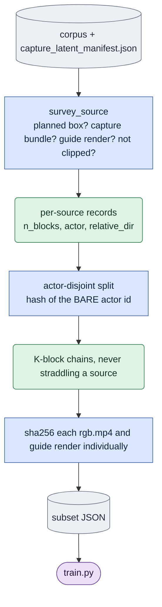

# `windows.py` — freeze the training subset

> **`K` is fixed here, not in `train.py`.** `--chain-length` sets how many causal blocks one
> training sample spans; `train.py` has no such flag and reads it from the subset's chains. The
> subset also records the objective it was frozen against. Freeze recipes:
> [`../configs/README.md`](../configs/README.md); definitions:
> [experiments.md](experiments.md).

## Objective

Turn "every view the capture pass has encoded" into "the exact blocks this run trains on",
and **pin it**. Its output JSON (`kind: one_step_argavatar_block_chains`) is the only thing
`LTX-2/…/train.py` reads from this tree.

## Data flow

## Organization logic

Four jobs that must not be left to the training loop:

1. **Chain blocks.** A training sample is `K` *consecutive* causal blocks of one source at
   the deployed stride, so the cached context the model reads forward is what deployment
   would give it. Block bounds come from `causal_core.CausalGeometry.plan` — **called**, not
   transcribed, since 2026-09-15. It used to be a copy pinned by a test, because this module
   ran in the corpus tree and `causal_core` (torch, `ltx_core`) in the model tree. The cost of
   calling it is that freezing a subset is now an `ltx`-env operation: importing `causal_core`
   pulls in torch, a few seconds against a pass that hashes hundreds of MB of video.
2. **The split**, by bare actor id, so a held-out actor cannot leak in by a path convention.
3. **The content pin**, so a subset keeps describing what is on disk.
4. **Exclusions** (`clipped_subject`), recorded rather than silently dropped.

The subset also records its **objective**, and `train.py` refuses a mismatch: a subset is
surveyed and hashed against one objective's artifacts, so training the other against it would
read bundles the freeze never saw.

## Invariants

- **Hash the source files individually, never a directory digest** — B2 writes renders into
  the same tree, so a directory hash would change for reasons unrelated to the pinned inputs.
- Never re-sync a subset mid-sweep. `--verify` re-hashes and reports; it does not repair.
- A pre-causal window-chain subset is **refused** by `train.py`, not reinterpreted: a window
  index and a block index are different numbers over the same clip.
- **The block plan is sized from the stored master, never from the source video.**
  `dataset.capture_master_latent_frames` reads the latent tensor the trainer will actually
  plan over. Sizing from `clip.n_frames()` was wrong for every consolidated source and froze
  chains whose last block did not exist — see the Gotchas.

## Gotchas

- **A consolidated master is shorter than its video, by up to one window.** `windows.py` sized
  its block plan with `latent_frames_for(clip.n_frames())` until 2026-09-16, but a master
  rebuilt from v1 per-window slices stops at the last WHOLE window: a 150-frame clip stores 137
  pixel frames (18 latent, not 19) and a 225-frame clip stores 217 (28, not 29), which
  `WINDOW_FRAMES = 25` at stride 16 reproduces exactly. Subsets therefore claimed one latent
  frame — one whole block — that the latents did not contain, and `train.py` (which plans from
  the loaded tensor) refused them with *"the subset was frozen under a different geometry"*.
  Re-freezing `t2` after the fix dropped it from 157 blocks to 144, one per source.
  Natively-encoded v2 masters do cover the whole clip, which is why this stayed invisible until
  the corpus was consolidated. **Note the tail frames are genuinely absent from the latents** —
  re-freezing makes the subset honest, it does not recover them; only re-running
  `precompute --process_gt_latent --overwrite` would.

  **Subsets frozen before 2026-09-16 are still on disk and are still stale.** They are
  *internally* consistent (both the count and the plan came from the video), so nothing about
  the file looks wrong — `train.py:assert_subset_matches_geometry` is what catches them now,
  by comparing each recorded `n_latent_frames` against the stored master, at startup. Verified
  2026-09-17: the pre-fix `t2` freeze was stale on all 13 sources (19/29 recorded vs 18/28
  real); `t2r2.json` is the re-frozen one and is clean. **Retired in place, not deleted** — see
  `expr/onestep_avatar/windows/retired/README.md` for that file and the pre-causal `prelim2`
  freeze (window-chain `kind`, refused outright by `ChainStore` rather than merely stale).

- **`--min-holdout-actors` defaults to 12** — the right floor for a full-scale run and wrong
  for a small tier by construction, since the split takes
  `max(round(n × fraction), min(min_holdout, n − 1))`. At 8 actors the default holds out
  **7**, leaving 1 for training, silently defeating the tier's purpose. Pass it explicitly
  (e.g. `--min-holdout-actors 2`) for any small freeze. This was hit for real.
- Hashing is the expensive part (a 4096×3000 h264 source is hundreds of MB); it runs over the
  *selected* subset only, after actor selection has shrunk it.

## Tests

`tests/test_windows.py` — the split, the chaining, the content pin, and a **golden** test on
exact block bounds for every clip length the corpus has. Golden rather than a comparison
against `causal_core`, which would now be tautological: a frozen subset indexes blocks that
`train.py` slices out of a master latent, so shifting the plan would silently re-point every
chain in every subset already on disk.
