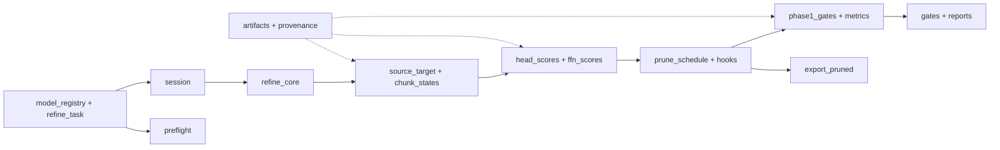

# `scripts/prune` design docs

These pages describe the current implementation of the LTX refiner pruning harness. Read
[`../CLAUDE.md`](../CLAUDE.md) for binding invariants and [`../README.md`](../README.md) for
the run order. Each production Python module and the sweep launcher has one page here;
`__init__.py` files are docstring-only package markers, and tests are indexed by the module
they exercise.

## The cross-module contract

`refine_core.py` owns the deployed sliding-window rollout. `checks/method_parity.py` compares
its output with `vae_refine_sliding_window.py` at the latent level; rerun it after any change
that can alter a tensor. `artifacts.py` owns output paths, `session.py` owns dtype and model
lifetime, and `ltx_adapter.py` owns upstream private API access. Format-1 calibration records
are refused because they were made with different geometry and fps.

## Files

| Area | Module docs |
|---|---|
| Core | [artifacts](artifacts.md), [geometry](geometry.md), [ltx_adapter](ltx_adapter.md), [model_registry](model_registry.md), [preflight](preflight.md), [provenance](provenance.md), [refine_core](refine_core.md), [refine_task](refine_task.md), [session](session.md) |
| Data | [chunk_states](chunk_states.md), [corpus](corpus.md), [prompt_cache](prompt_cache.md), [records](records.md), [source_target](source_target.md) |
| Scoring | [export_pruned](export_pruned.md), [ffn_scores](ffn_scores.md), [head_scores](head_scores.md), [hooks](hooks.md), [losses](losses.md), [lstsq](lstsq.md), [prune_schedule](prune_schedule.md) |
| Evaluation | [bench_refiner](bench_refiner.md), [cross_kv_cache](cross_kv_cache.md), [decode](decode.md), [gates](gates.md), [head_ablation_eval](head_ablation_eval.md), [metrics](metrics.md), [phase1_gates](phase1_gates.md), [sampler_ab](sampler_ab.md), [timing](timing.md) |
| Checks | [method_parity](method_parity.md), [export_parity](export_parity.md), [parity_check](parity_check.md), [video_only_check](video_only_check.md) |
| Reports and launcher | [plot_head_scores](plot_head_scores.md), [summarize_phase0](summarize_phase0.md), [run_head_sweep](run_head_sweep.md) |

## Reading the pages

Each page names its owner, input/output flow, invariants, and a relevant check. Code is the
source of current behavior. Defects found in the review are listed in
[`known_gaps.md`](known_gaps.md), with proposed work in the workspace plan. Update a page
when its module's objective, flow, invariant, or interface changes.
